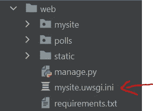

# 如何对接一个生产就绪的 Django 应用程序(Django + Nginx + uWSGI)

> 原文：<https://blog.devgenius.io/how-to-dockerize-a-production-ready-django-application-django-nginx-uwsgi-a908d3e4d8f8?source=collection_archive---------0----------------------->

想象一下，将一个系统从 Python 的一个主要版本升级到另一个版本。有哪些挑战？我认为最大的挑战之一是减少维护期间的停机时间。如果出现问题，尽快恢复。我和不同的团队一起规划过许多项目的系统升级，经历过许多由配置和维护这些“移动部件”引起的问题和挫折。我尝试了不同的方法来使这个过程变得简单一点。我的最新方法是围绕 Docker 技术构建整个流程。在我之前的[帖子](https://medium.com/analytics-vidhya/how-to-deploy-django-application-on-aws-ubuntu-ec2-with-nginx-and-uwsgi-a-practical-guide-1c114cb5f6b6)中，我们通过运行 Django + Nginx + uWSGI 的架构，搭建了一个直播网站。在本教程中，我们将对整个技术堆栈进行分类。

下图展示了它的样子。


# 属国

*   Docker 和 Docker 引擎(要安装它们，请参见[这里的](https://docs.docker.com/get-docker/))
*   Docker compose(要安装它，请看这里的)

# 第 1/5 步。组织代码库

在前一篇文章中，我们的代码库如下所示。


让我们重新组织一下。创建一个 **web** 文件夹。将整个代码库移入其中。我们不需要**。gitignore** 文件。它应该看起来像下面的。


# 第 2/5 步。Dockerize 代码库和 uWSGI

在 **web** 文件夹中创建一个 **Dockerfile** 文件。其内容如下。

```
FROM python:3.7-alpine
RUN mkdir /code
WORKDIR /code
COPY . /code# uwsgi setup
RUN apk add python3-dev build-base linux-headers pcre-dev
RUN pip install uwsgi
RUN pip install -r requirements.txtCMD ["uwsgi", "--ini", "/code/mysite.uwsgi.ini"]
```

注意到 **CMD** 使用 uWSGI 通过 uWSGI 配置文件启动 Django 应用程序，现在让我们创建它。在 **web** 文件夹中创建一个 **mysite.uwsgi.ini** 文件。内容如下所示。

```
[uwsgi]socket = /tmp/uwsgi/mysite.sock
module = mysite.wsgi
master = true
processes = 2
chmod-socket = 666
vacuum = true
```

我们已经准备好开发一个 Docker 容器，包含 codebase 和 uWSGI。此时，文件结构应该如下所示。



# 第 3/5 步。Dockerize Nginx

在根文件夹中创建一个 **nginx** 文件夹。然后创建一个 **nginx.conf** 文件。我们需要这个文件的主要原因是定制容器中的 Nginx 设置。内容如下所示。

```
user  root;
worker_processes  auto;error_log  /var/log/nginx/error.log notice;
pid        /var/run/nginx.pid;events {
    worker_connections  1024;
}http {
    include       /etc/nginx/mime.types;
    default_type  application/octet-stream;log_format  main  '$remote_addr - $remote_user [$time_local] "$request" '
                      '$status $body_bytes_sent "$http_referer" '
                      '"$http_user_agent" "$http_x_forwarded_for"';access_log  /var/log/nginx/access.log  main;sendfile        on;
    #tcp_nopush     on;keepalive_timeout  65;#gzip  on;#include /etc/nginx/conf.d/*.conf;
    include /etc/nginx/sites-enabled/*;
}
```

在 **nginx** 文件夹中创建一个 **mysite.nginx.conf** 文件。内容如下所示。

```
upstream uwsgi {
    server unix:/tmp/uwsgi/mysite.sock;
}server {
    listen      80;
    server_name 127.0.0.1;
    charset     utf-8;location /static {
        alias /var/www/mysite/assets;
    }location / {
        uwsgi_pass  uwsgi;
        include     /etc/nginx/uwsgi_params;
    }
}
```

在 **nginx** 文件夹中创建一个 **Dockerfile** 。内容如下所示。

```
FROM nginx:latestCOPY nginx.conf /etc/nginx/nginx.conf
COPY mysite.nginx.conf /etc/nginx/sites-available/mysite.nginx.conf
RUN mkdir /etc/nginx/sites-enabled
RUN ln -s /etc/nginx/sites-available/mysite.nginx.conf /etc/nginx/sites-enabled/CMD ["nginx", "-g", "daemon off;"]
```

至此，Nginx 的 Docker 容器全部设置完毕。文件结构应该如下所示。


# 第 4/5 步。开发 Docker 合成文件

在根文件夹中创建一个 **docker-compose.yml** 。内容如下所示。

```
version: "3.9"
services:nginx:
    build: ./nginx/
    restart: always
    volumes:
      - uwsgi_data:/tmp/uwsgi/
      - web_static:/var/www/mysite/assets/:ro
    ports:
      - "8888:80"
    depends_on: 
      - djangodjango:
    build: ./web/
    restart: always
    command: >
      sh -c "python manage.py collectstatic --noinput 
      && uwsgi --ini mysite.uwsgi.ini"
    volumes:
      - uwsgi_data:/tmp/uwsgi/
      - web_static:/code/static/
      - web_static:/var/www/mysite/assets/volumes:
  uwsgi_data:
  web_static:
```

至此，我们都准备好了。文件结构应该如下所示。


# 第五步。点燃码头集装箱

打开终端/PowerShell。转到该项目的根文件夹。然后键入以下命令。

```
docker compose build
```

我们应该会看到很多如下的印刷品。


该过程完成后，键入以下命令以确保 Docker 映像已经成功构建。

```
docker images
```

我们应该看到两个 Docker 图像，如下所示。


要启动容器，请键入以下命令。

```
docker compose up
```

我们应该会看到很多如下的印刷品。


打开浏览器。键入[http://127 . 0 . 0 . 1:8888/polls/](http://127.0.0.1:8888/polls/)。您应该会看到下面的页面。恭喜你！


# 结论

在本教程中，我们走过了从原始代码库到基于容器的架构的完整旅程。你可能会注意到只需要几秒钟就可以启动 Docker 容器。准备好不同版本的 docker-compose.yml 和 docker 映像后，我们可以自信地启动系统升级或“眨眼之间”将其恢复到以前的版本。希望本文能为您提供一些解决系统部署和升级问题的思路。你怎么想呢?留下评论让我知道你的想法。感谢阅读。

我想对 [Carlos Sandoval](https://www.linkedin.com/in/sbmako/) 向我介绍 Docker technology 表示感谢。

我已经把这个项目上传到了我的 Github 上。如果你有兴趣深入其中，请查看这里的。

如果您对构建这个 Django 应用程序感兴趣，请在这里查看完整教程。