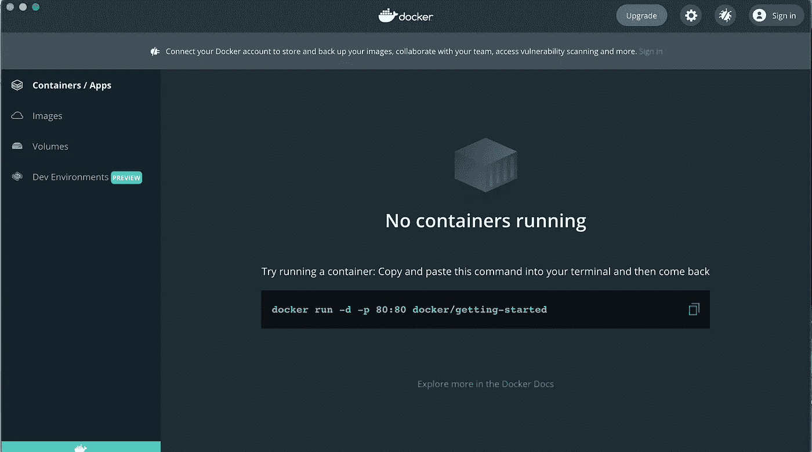
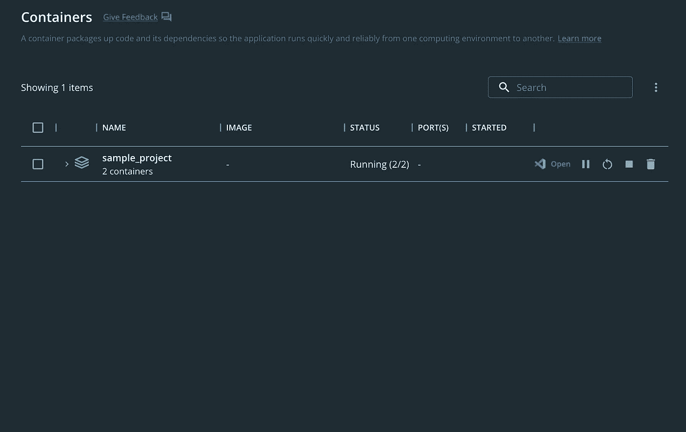

# 如何对一个简单的 Django 应用程序进行 Dockerize—Mac Edition

> 原文：<https://blog.devgenius.io/how-to-dockerize-a-simple-django-application-mac-edition-5008fd9c3875?source=collection_archive---------4----------------------->

在深入 docker 化之前，让我们了解一下 docker 是什么以及为什么需要它。

**Docker 是什么？**

Docker 是一个开源平台，它可以帮助您将应用程序打包成称为容器的包，其中包含软件运行所需的一切，包括库、系统工具、代码和运行时。

**使用 Docker 的优势:**

使用 docker 最重要的优点是，它是没有麻烦的。通常，当您想要在实例中部署应用程序时，您总是必须安装需求、依赖库，并且需要手动设置一切，这对于开发人员或 DevOps 工程师来说太麻烦了。感谢 Docker 将您的应用程序与其代码和依赖项捆绑在一起，让事情变得更简单。你只需要安装 docker，它可以让你在任何环境下用很少的命令部署你的应用程序。其他优势包括:

*   灵活的资源共享——在一个主机中，所有 docker 容器都使用相同的内核，这意味着容器在它们之间共享 CPU 和内存资源。与传统虚拟机不同，容器不需要单独的操作系统和硬件资源
*   可伸缩性——您的应用程序和相关的微服务可以是独立的容器，放在单个服务器/实例中。
*   快速部署和高度可移植性——因为您的应用程序被打包成一个包，所以可以轻松地部署在任何环境中(独立于底层操作系统)。
*   优化成本——几个容器可以在一台主机上运行，这可以降低总体基础设施成本。

# **将 Django 应用程序归档的步骤:**

> 注意:这个博客的范围是在 mac 上安装 docker 并 dockerize 你的 Django 应用程序。但是，docker 的安装和设置会根据您的操作系统或实例而变化。

## 安装 Docker

1.  导航到[*https://docs.docker.com/desktop/install/mac-install/*](https://docs.docker.com/desktop/install/mac-install/)。根据您的系统配置下载 docker 应用程序。
2.  安装应用程序并启动 Docker。在启动屏幕上使用您的 Docker 凭据登录。



3.docker 安装后，从您的终端执行以下命令，并检查 Docker 是否安装正确。

```
docker --version#This command displays system wide information regarding the Docker installation.
docker info
```

**设置 Django 应用**

Django 是一个开源的高级 Python 框架，主要用于 web 应用程序开发。

1.  创建一个虚拟环境并安装 Django(确保您的系统中安装了 python)

```
python3 -m venv myvenv
source myvenv/bin/activate
pip install django
```

2.创建 Django 项目，应用并运行它

```
#creating django project
django-admin startproject <project_name> cd <project_name>#creating django app
python manage.py startapp <appname>#run the django server locally
python manage.py runserver
```

您可以在 http://127.0.0.1:8000/ 看到您的 Django 应用程序在本地运行

> 注意:测试完应用程序后，退出 Django 服务器

在您的项目中创建一个 **requirements.txt** ，并添加以下包

```
Django==4.1
psycopg2
```

3.项目中的 Docker 设置

在项目中创建 Dockerfile 和 docker-compose.yml 文件，并将内容添加到下面提到的文件中:

> 参考:[https://docs.docker.com/samples/django/](https://docs.docker.com/samples/django/)

Dockerfile - A `Dockerfile`是一个文本文档，包含用户可以在命令行上调用的所有命令来组合一个图像。这个`Dockerfile`开始于

*   来自 python 3 的基本图像。
*   然后我们创建一个名为 code 的目录。
*   复制 requirements.txt 内部代码并安装需求
*   将应用程序代码(Django 代码)复制到工作目录中

**Dockerfile**

```
#syntax=docker/dockerfile:1
FROM python:3
ENV PYTHONDONTWRITEBYTECODE=1
ENV PYTHONUNBUFFERED=1
WORKDIR /code
COPY requirements.txt /code/
RUN pip install -r requirements.txt
COPY . /code/
```

docker-compose . YAML-`docker-compose.yml`文件描述了制作你的应用程序的服务。在这个例子中，我们有两个服务，一个 DB 服务是基本的 Postgres 服务，一个 web 服务是 Django 应用程序。合成文件还描述了这些服务使用哪些 Docker 映像，它们如何链接在一起，以及它们可能需要装入容器中的任何卷。最后，`docker-compose.yml`文件描述了这些服务公开哪些端口。

**docker-compose.yaml**

```
version: "3.9"

services:
  db:
    image: postgres
    volumes:
      - ./data/db:/var/lib/postgresql/data
    environment:
      - POSTGRES_DB=postgres
      - POSTGRES_USER=postgres
      - POSTGRES_PASSWORD=postgres
  web:
    build: .
    command: python manage.py runserver 0.0.0.0:8000
    volumes:
      - .:/code
    ports:
      - "8000:8000"
    environment:
      - POSTGRES_NAME=postgres
      - POSTGRES_USER=postgres
      - POSTGRES_PASSWORD=postgres
    depends_on:
      - db
```

添加上述文件后，您的文件夹结构如下所示

```
sample_project/
│
├── sample_app/
│   │
│   ├── migrations/
│   │   └── __init__.py
│   │
│   ├── __init__.py
│   ├── admin.py
│   ├── apps.py
│   ├── models.py
│   ├── tests.py
│   └── views.py
│
├── sample_project/
│   ├── __init__.py
│   ├── asgi.py
│   ├── settings.py
│   ├── urls.py
│   └── wsgi.py
│
└── manage.py
|__ docker-compose.yml
|__ Dockerfile
|__ requirements.txt
```

在您的设置中，py 将数据库=替换为以下内容:

```
# settings.py

import os

[...]

DATABASES = {
    'default': {
        'ENGINE': 'django.db.backends.postgresql',
        'NAME': os.environ.get('POSTGRES_NAME'),
        'USER': os.environ.get('POSTGRES_USER'),
        'PASSWORD': os.environ.get('POSTGRES_PASSWORD'),
        'HOST': 'db',
        'PORT': 5432,
    }
}
```

4.Docker 构建和 Docker Up:

在您的终端中执行以下命令:

*   这个命令在 docker-compose 中构建图像。yml 文件。
*   docker-compose up - Docker 命令在 mac 上启动并运行整个应用程序。

```
docker-compose build --no-cache
docker-compose up
```

5.验证应用程序:

docker 启动后，您可以在 docker 桌面应用程序中查看 docker 容器。当您单击容器时，实际上会看到一个 DB 容器和一个 web 容器。



当您使用 [http://127.0.0.1:8000/](http://127.0.0.1:8000/) 再次点击浏览器时，您将实际看到从 docker 运行的应用程序，并在您的终端中看到 docker 日志

**参考:**

[](https://docs.docker.com/samples/django/) [## 快速入门:作曲和 Django

### 预计阅读时间:9 分钟本快速入门指南演示了如何使用 Docker Compose 来设置和运行一个

docs.docker.com](https://docs.docker.com/samples/django/)