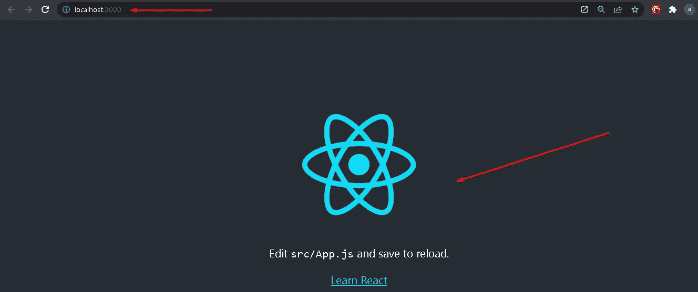
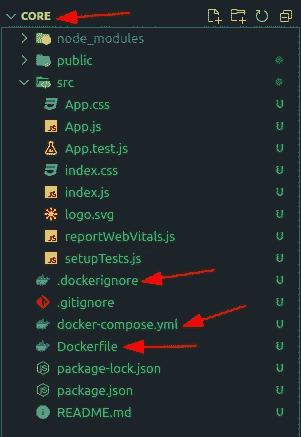
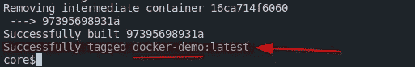
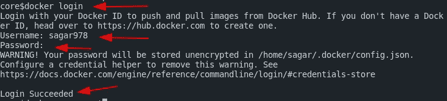
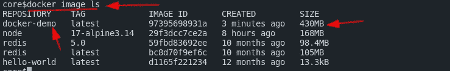
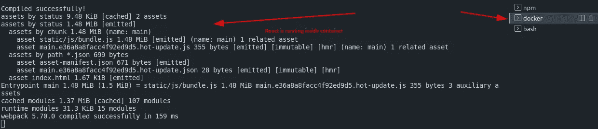
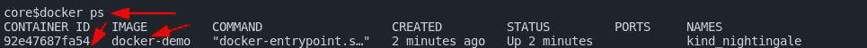
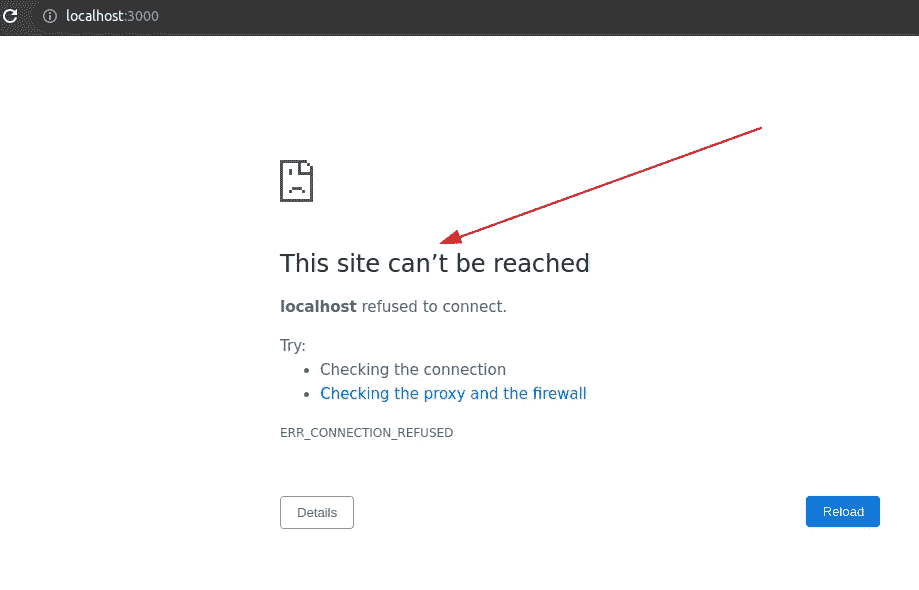
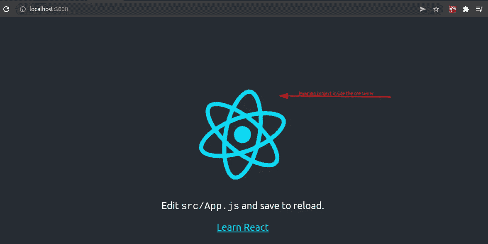
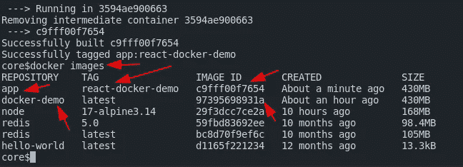

# 如何将申请归档[逐步]

> 原文：<https://blog.devgenius.io/how-to-dockerize-an-application-step-by-step-e32e8a9561c9?source=collection_archive---------3----------------------->

## 对任何应用程序进行 dockerize 是非常容易的，在本教程中，我们将以 React 项目为例。


码头工人官方形象

# 先决条件:

*   安装 [Docker](https://docs.docker.com/desktop/) 和 [docker-compose](https://docs.docker.com/compose/install/) (可以在 Mac / Windows / Linux 上安装)。
*   在 Docker 或[上创建一个](http://hub.docker.com/login)[账户，登录](https://hub.docker.com/signup)。
*   [创建 React 应用程序](https://reactjs.org/docs/create-a-new-react-app.html)(对于这个演示，我正在创建一个新的应用程序)。
*   VS 代码编辑器

您可以在这里查阅回购代码:
[https://github.com/sagarkudu/docker-ecr-react-demo](https://github.com/sagarkudu/docker-ecr-react-demo)

# 创建和运行 React 应用程序:

确保您运行的是 **npm** 的更新版本。

```
npm install -g npm@latest
```

让我们创建一个应用程序。

```
e.g npx create-react-app core
cd core
npm start
```

→您可以看到 React 应用程序正在端口 **3000** 运行

```
http://localhost:3000
```



运行 react 应用程序

# 为 React 应用程序创建 Docker 文件

现在让我们创建名为 **Dockerfile、docker-compose.yml 和。将 dockerignore** 添加到我们的项目中，并将以下代码添加到我们的应用程序的“**root“**”文件夹中。



在应用程序的根目录下创建 3 个文件。

# 1.创建文件 Dockerfile

创建一个文件 **Dockerfile** ，并将其添加到根目录下。

```
# pull the official base image (Background o.s for container)
 FROM node:17-alpine3.14# set working direction (directory for my project)
 WORKDIR /app# set environment path
 ENV PATH="./node_modules/.bin:$PATH"# Copy everything from local machine to our server, second dot refers to the directory on the container.
 COPY . .# install npm dependencies
 RUN npm install# lets build the application
 RUN npm run build

 # # start an application (starting our react server)
 CMD ["npm", "run", "start"]
```

## 建立我们的码头工人形象

让我们建立我们的 docker 图像，这将根据我们提供的信息建立图像。
**注意**:这将构建一个本地 docker 映像，即构建到我们的机器中，构建这个映像可能需要大约 5 分钟。

```
docker build --tag docker-demo .
```



docker 映像已成功创建。

## 登录 docker

请在此输入您的正确凭据:

```
docker login
```



docker 登录成功。

**获取所有 docker 图像:**



# 将我们的项目运行到 Docker 容器中

让我们在容器内部运行 react 项目。
*注意* : *请* ***关闭我们当前活动的 react 项目终端*** *，因为我们要在 docker 容器中直接运行我们的项目。*

```
docker run docker-demo
```



React 项目正在容器内部运行

## 检查所有运行中的容器

让我们打开一个**新的**终端并键入以下命令:

```
docker ps
```



docker 正在运行

## 获取错误

Opps！！！即使您在容器中运行我们的项目，页面刷新后也可能会出现错误。为什么？react 正在端口 **3000** 上运行，因此我们需要将端口绑定到容器。



错误

## 解决办法

这将启动我们的应用程序运行。但是你会看到它不会在 [**打开网站 http://localhost:3000**](http://localhost:3000) **注意:react 应用程序运行在端口号 **3000** 上，所以我们需要手动配置它，所以我们来映射一下端口。**

**请**关闭所有其他活动终端**并将以下命令输入到**新**终端。**

```
docker run --publish 3000:3000 docker-demo
http://localhost:3000
```

**注意:现在你可以看到它能够在端口 3000 上并且能够访问[**http://localhost:3000**](http://localhost:3000)**

**→现在，您可以看到我们的项目成功地进入了容器，因为我们已经将端口映射到了容器。**

****

**端口 3000 映射到容器，项目在容器内部运行。**

**注意:这是一个临时的解决方案。我们必须创建一个名为:
→**docker-compose . yml**的文件**

# **2.创建 docker-compose.yml**

**创建一个新文件 **docker-compose.yml** 并为图像添加一个新配置。**

```
version: "3.8"
services:
  app:
    build:
      context: .
    volumes:
      - .:/app
    ports:
      - 3000:3000
    image: app:react-docker-demo
    container_name: react_container
    command: npm start
```

# **3.创建文件。dockerignore**

**加一个**。dockerignore** 文件放入根目录**

```
node_modules
npm-debug.log
build
.dockerignore
**/.git
**/.DS_Store
**/node_modules
Dockerfile
```

## **建立码头工人形象**

**这将再次构建一个新的映像，可能需要 **~5** 分钟:`docker images`**

```
docker-compose build
docker images
```

****

**图像已创建**

# **运行我们的 Docker 图像**

**关闭所有终端并添加以下命令:**

```
docker-compose run app (page might not load after this commands)
docker-compose up (let's bring the server up)
```

****

**项目成功地从容器中运行。**

****结论**:现在 docker-compose 的好处是，每当新代码或者项目有任何改动，它都会自动检查改动，并拉到容器和服务器上，牛逼！！！**

# **您可能会对以下内容感兴趣:**

**[](/build-a-docker-image-and-publish-it-to-aws-ecr-using-github-actions-step-by-step-2cd2f4e667a7) [## 使用 Github 操作自动构建 Docker 映像并将其推送到 AWS ECR 逐步]

### 让我们看看如何在 Github 到 AWS 上构建 CI/CD 管道和云映像。

blog.devgenius.io](/build-a-docker-image-and-publish-it-to-aws-ecr-using-github-actions-step-by-step-2cd2f4e667a7) [](https://sagarkudu.medium.com/host-any-app-to-aws-and-github-using-continuous-deployment-ci-cd-pipeline-step-by-step-d4150dbee2e8) [## 托管网站或应用程序，使用 ECR 和 GitHub 自动构建 Docker 映像并将其推送到 AWS ECS | Continuous…

### 让我们为 AWS 托管一个 React 或任何应用程序或网站。

sagarkudu.medium.com](https://sagarkudu.medium.com/host-any-app-to-aws-and-github-using-continuous-deployment-ci-cd-pipeline-step-by-step-d4150dbee2e8) 

# 完整的 DevOps 博客列表:

[](https://sagarkudu.medium.com/lists) [## 媒介上的萨加尔·库杜策划了一些名单

### 开始探索 Devops，React，SpringBoot 和更多

sagarkudu.medium.com](https://sagarkudu.medium.com/lists) 

# 作者:萨加尔·库杜

1.  [Github](https://github.com/sagarkudu)
2.  [领英](https://www.linkedin.com/in/sagarkudu/)

感谢您的宝贵时间！**