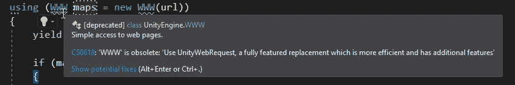
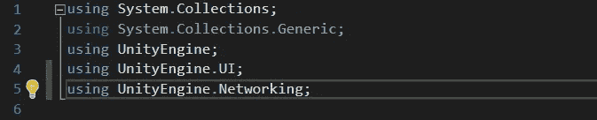
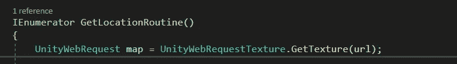
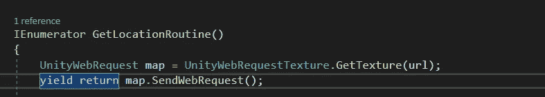
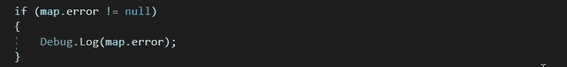
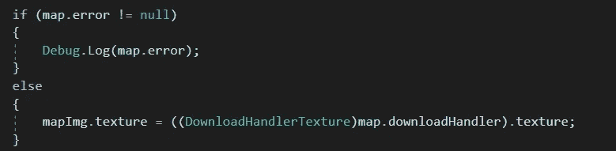
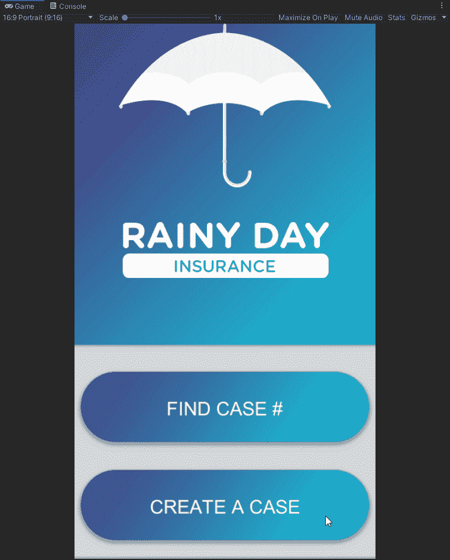

# 如何使用 Unity Web Request 下载静态地图！

> 原文：<https://blog.devgenius.io/how-to-download-static-maps-using-unity-web-request-f57a6d4b8350?source=collection_archive---------15----------------------->

目标:更新脚本以使用最新的方法“Unity Web Request”

如果您遵循了我的上一篇教程，您会注意到在 visual studio 的 www。这个警告告诉我们 www 已经过时了，并告诉我们应该使用 Unity Web Request。

上一个教程的结果显示 www 方法仍然有效，但是，我觉得学习当前的方法是有用的。让我们来看看什么是 Unity Web 请求。

我们将使用 Unity Web 请求从 HTTP 服务器检索纹理。为了从远程服务器获取纹理文件，我们将使用“UnityWebRequest”。“质地”。该函数与“UnityWebRequest”非常相似。然而，纹理方法是为了有效地下载和存储纹理。此函数接受单个字符串作为参数。该字符串指定您希望下载图像文件以用作纹理的 URL。

我们开始吧。我们需要添加名称空间“UnityEngine”。联网；”

该功能将类似于我们上次创建的内容。我们需要创建一个名为 map 的 unity web 请求局部变量。这被设置为 UnityWebRequestTexture。GetTexture(您的特定 URL)。

我们需要让出程序，我们将让出 unity，它开始使用' SendWebRequest()'方法与远程服务器通信。

然后，我们将像之前一样检查错误。

如果没有错误，我们将把地图图像纹理设置为下载句柄纹理。

保存并测试程序。

下期教程再见！