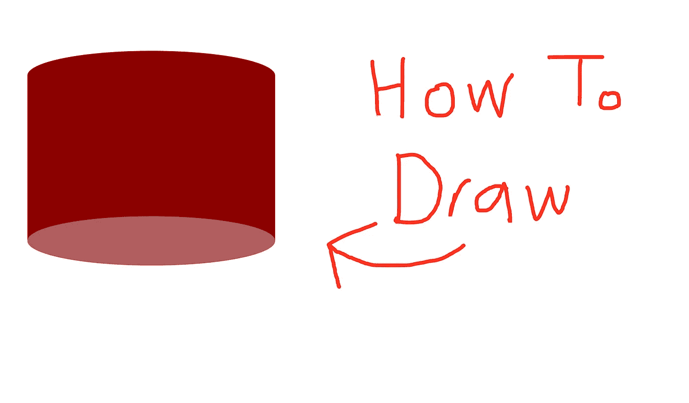
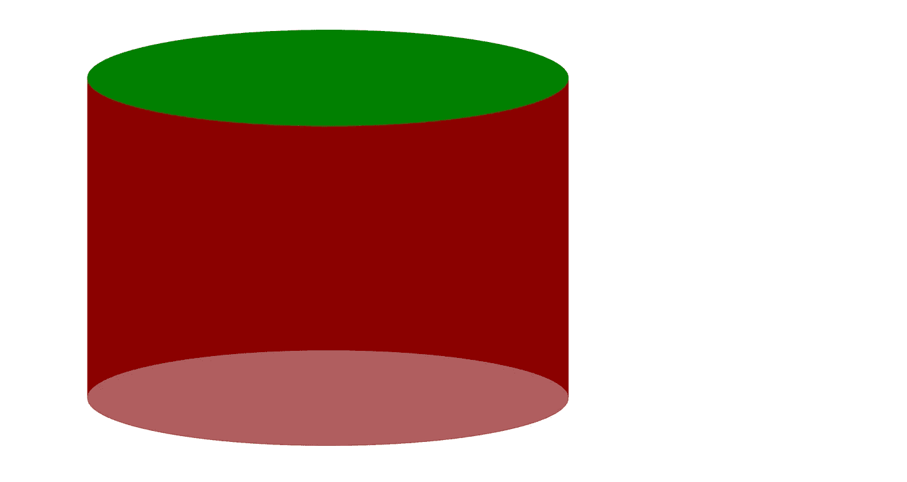
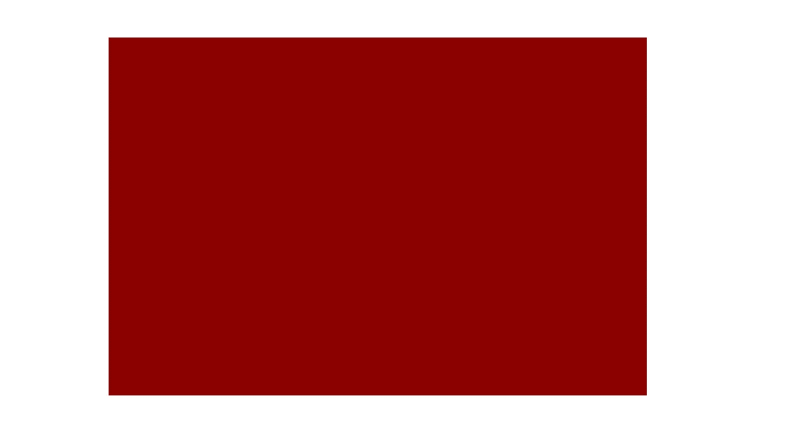
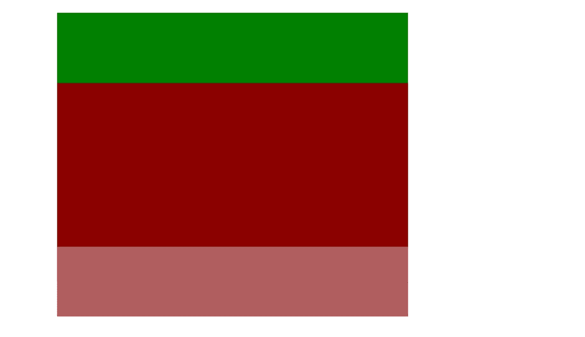
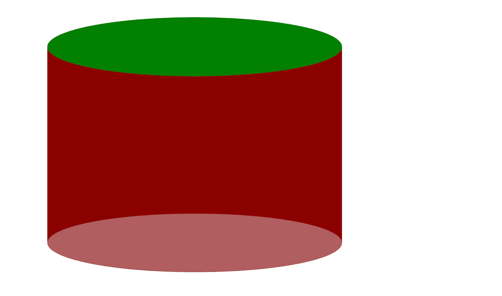
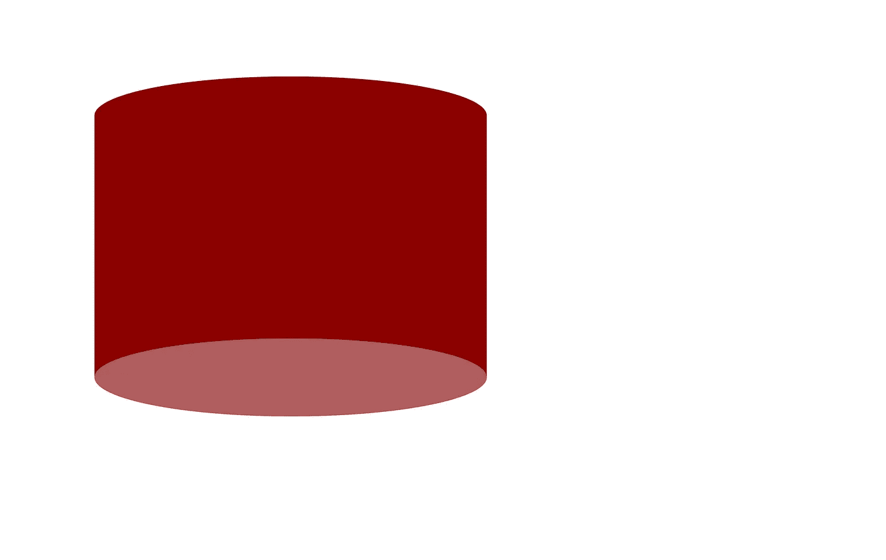

# 如何用 CSS 在 4 分钟内画出一个圆柱体

> 原文：<https://blog.devgenius.io/how-to-draw-a-cylinder-with-css-in-4-minutes-932cca6c9f9f?source=collection_archive---------4----------------------->

#逐步指南



最近，我在重新设计我的个人作品集网站，这涉及到相当多的 CSS，我还不是很擅长。在谷歌上搜索 CSS 代码确实比我想象的花费了更多的时间，但是它也教会了我很多我以前不知道的东西！

事不宜迟，下面是我们如何只用 CSS 绘制一个圆柱体(也是因为我可能会在几个月后忘记如何做这件事)

# 逻辑



请原谅这种颜色——我以后会换的

要画一个圆柱体，我们需要 3 个形状:

1.  身体——中间的深红色矩形
2.  顶部椭圆形—顶部的绿色椭圆形(颜色稍后会更改)
3.  底部的椭圆形——下面的棕色椭圆形

# 步骤 1 —编写 HTML

```
<div class="rectangle">
    <div class="oval top-oval"></div>
    <div class="oval bottom-oval"></div>
</div>
```

# 步骤 2-设计矩形的样式

```
<style>.rectangle {
    background-color: darkred;
    height: 20vh;     /* or whatever other units you want */
    width: 30vh;
    position: relative;
}</style>
```

注意这里的`position: relative`很重要！



我们现在有一个红色的矩形

# 步骤 3-定位椭圆(还不是椭圆)

```
<style>.oval {
    position: absolute;
    width: 100%;
    height: 30%;
}.top-oval {
    background-color: green;
    top: -15%;
}.bottom-oval {
    background-color: rgb(176, 94, 94);
    bottom: -15%;
}</style>
```

这里，我们给顶部和底部的椭圆添加颜色(这样我们就能看到它)，让顶部的椭圆到顶部，让底部的椭圆到底部。



注意`top: -15%`和`bottom: -15%`作为椭圆的高度是`30%`(父代的高度)，因为我们希望恰好一半的绿色和棕色部分在暗红色的矩形内。

# 步骤 4-制作椭圆椭圆

这里，我们只需要为顶部和底部椭圆设置`border-radius: 100%`。这是将它们变成椭圆形的特性。

```
<style>.oval {
    position: absolute;
    width: 100%;
    height: 30%;
    border-radius: 100%;
}.top-oval {
    background-color: green;
    top: -15%;
}.bottom-oval {
    background-color: rgb(176, 94, 94);
    bottom: -15%;
}</style>
```



注意为什么我们现在设置`top: -15%`和`bottom: -15%`？

# 第五步——替换难看的绿色

让我们用与矩形`darkred`相同的颜色替换顶部椭圆的绿色。(或任何你想用的颜色)

# 所有 HTML 和 CSS 都在一个地方

```
<div class="container"> <div class="rectangle">
        <div class="oval top-oval"></div>
        <div class="oval bottom-oval"></div>
    </div></div><style>.container {
    padding: 5vw;
}.rectangle {
    background-color: darkred; 
    height: 20vh;
    width: 30vh;
    position: relative;
}.oval {
    position: absolute;
    width: 100%;
    height: 30%;
    border-radius: 100%;
}.top-oval {
    background-color: darkred;
    top: -15%;
}.bottom-oval {
    background-color: rgb(176, 94, 94);
    bottom: -15%;
}</style>
```

注意——我把所有东西都放在一个有衬垫的容器里，所以它不在页面的角落里。这是我们的圆柱体的样子:



注意——不要修改顶部和底部椭圆的高度，记得用它来改变`top`和`bottom`属性！

# 结论

如果你因为任何原因需要在 CSS 中画一个圆柱体(比如画一个低音鼓或者其他什么)，希望这有所帮助！

# 一些最后的话

*如果这篇文章有价值，并且你希望支持我，请考虑注册一个 Medium 会员——每月 5 美元，你可以无限制地访问 Medium 上的文章。如果你用我下面的链接注册，我会给你零额外费用赚一点佣金。*

[***注册使用我的链接在这里阅读无限媒体文章***](https://zl-liu.medium.com/membership) ***。***

我写编码文章(主要是 Python ),我认为这些文章可能会帮助年轻的我加快学习曲线。请加入我的电子邮件列表，以便在我发布时收到通知。

[](https://zl-liu.medium.com/subscribe) [## 每当 Zlliu 发布时收到一封电子邮件。

### 每当 Zlliu 发布时收到一封电子邮件。注册后，如果您还没有中型帐户，您将创建一个…

zl-liu.medium.com](https://zl-liu.medium.com/subscribe)