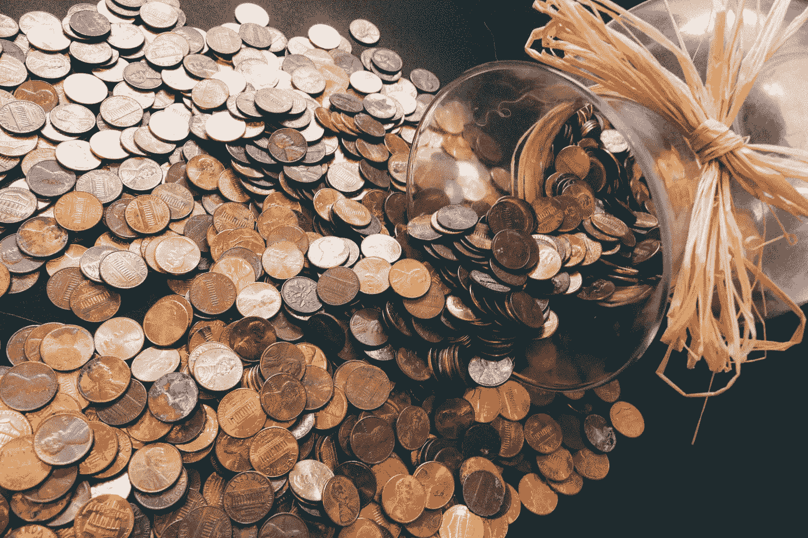

# 如何用 GlideApp 谋生

> 原文：<https://blog.devgenius.io/how-to-earn-a-living-with-glideapp-d12aa6a75e06?source=collection_archive---------5----------------------->

照片由 Pexels.com 的 [Pixabay](https://www.pexels.com/fr-fr/photo/lot-de-pieces-de-couleur-cuivre-259165/) 拍摄

如果你想让你的应用程序赚钱，你必须明白，对于每个应用程序来说，并不是只有一个解决方案。然而，有一些有效的方式让你的应用程序盈利。
创建应用程序有多种方式，GlideApp 就是其中之一。我将向你展示一些利用这项服务赚钱的方法。

# 付费下载服务

Pexels.com 的安内特·鲁西娜拍摄的照片

让你的应用程序付费下载是一种赚钱的方式。这些应用程序的价格从不到 1 美元到超过 100 美元不等。如果您选择使用此服务，您需要在商店(AppStoes 和 PlayStore)中提供您的应用程序。

这意味着您需要选择付费版本的 GlideApps PRO 应用程序，每月 32 美元，才能使用该选项。你还必须让你的应用程序的外观尽可能吸引人，因为你的应用程序的图片需要被张贴出来，以吸引最多的用户。

# 提供采购服务

你可以提供有偿服务。这在免费下载的电子游戏中经常见到，你需要付费解锁一些关卡、装备，或者只是如果你没有足够的时间自己玩来解锁游戏的某个部分。

你也可以以一定的价格提供一些新的特性，使使用更加愉快。

# 宣传

当然，我们也不会忘记宣传。当我们想从我们的应用程序中赚钱时，这是我们首先想到的事情。他们被看到的次数越多，就有越多的人愿意付费来展示他们的知名度。也就是说，要让这个选项可用，你至少需要有一个最低限度的知名度。

然而，如果你做了太多的宣传，你可能会吓跑用户。

# 增加你的销售额

如果你有自己的企业，也建议使用这个采购服务作为平台。

在这种情况下，你的应用不一定会直接盈利，而是通过煽动用户进行更多的购买。

如今，每个人都拥有一部手机，并且每天都在使用。意思是如果有人下载了你的 app，他每次都会收到通知，受到你产品的激励。就条件而言，万一有需要，你会是第一选择。