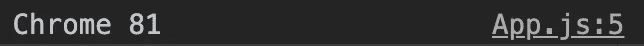

# 如何在 React 中轻松检测用户浏览器

> 原文：<https://blog.devgenius.io/how-to-easily-detect-the-user-browser-in-react-b4cd0290f257?source=collection_archive---------1----------------------->

## React 设备检测简介


由 [Domenico Loia](https://unsplash.com/@domenicoloia?utm_source=medium&utm_medium=referral) 在 [Unsplash](https://unsplash.com?utm_source=medium&utm_medium=referral) 上拍摄的照片

根据 StatCounter.com 的数据，将近 65%的用户使用谷歌浏览器。我也是其中之一。

然而，这也意味着 35%的用户没有使用谷歌 Chrome。在开发的时候，你应该总是尽可能的了解更多的用户。

有些功能在一种浏览器上运行良好，但如果你切换到另一种浏览器，事情就不会像我们预期的那样运行了。下面有一个方便的网站叫做[caniuse.com](https://caniuse.com/)，它可以检查一个功能是否能在浏览器上运行。

 [## 我能用吗...HTML5、CSS3 等的支持表

### 测试功能我们与 BrowserStack 的合作现在可以让您测试您的网站在 2，000 多个真实的…

caniuse.com](https://caniuse.com/) 

我最近发现我添加到 React 项目中的一个特性与 IE11 不兼容。添加兼容 IE11 的特性需要做很多额外的工作。相反，如果用户使用 IE11，我决定禁用这个特性。我想找到一种简单的方法来查看我的用户正在使用什么浏览器。

在本文中，我们将研究一个名为 react-device-detect 的包，它可以完成这一任务以及更多其他任务。

# 入门指南

在我们进入 react-device-detect 库之前，让我们看看在没有任何第三方包的情况下，我们将如何做这件事。

根据 [MDN Web Docs](https://developer.mozilla.org/en-US/docs/Web/API/Window/navigator) ，我们可以使用 window.navigator API 检测用户浏览器。但是对我来说，他们给出的示例代码有点复杂和凌乱。

来自 MDN Web 文档

更干净的方法是使用[反应设备检测](https://www.npmjs.com/package/react-device-detect)包。可以用 npm 或者 yarn 安装。

```
npm install react-device-detect --save

or

yarn add react-device-detect
```

# 检查浏览器名称

使用这个库很简单。我们可以导入许多道具。例如，为了获得浏览器名称和版本，我们将从库中导入`browserName`和`browserVersion`。

```
import { browserName, browserVersion } from "react-device-detect";
```

如果我们将这两个值记录到控制台，我们将看到以下内容。

```
console.log(`${browserName} ${browserVersion}`);
```



就是这样。这是一个非常方便的软件包，非常容易使用。

你也可以通过使用`is~`属性得到一个布尔值。例如，您可以使用`isChrome`、`isFirefox`、`isSafari`、`isIE`等等，根据用户使用的浏览器返回 true 或 false 值。

# 其他用途

除了检测用户浏览器，还可以检测 os 名称和版本，用`osName`和`osVersion`。也可以勾选`isWindows`或者`isMacOs`。

这个库的另一个好用途是检查用户在什么设备上。这可以帮助您提高应用程序的响应能力。他们有`MobileView`、`BrowserView`、`TabletView`，甚至还有`AndroidView`、`IOSView`。根据用户使用的设备，您可以选择要渲染的内容。

# 包扎

感谢阅读！这是一个非常好的库，可以很容易地检测出你的用户使用的是什么浏览器和操作系统。您还可以检测设备，以帮助您的应用程序做出响应。

虽然你可能觉得大家都用谷歌 Chrome，但事实绝对不是这样。因此，在创建应用程序时，记住这一点很重要。

如果您想了解 React 的另一个有用的库，请查看下面的文章来了解 React 图标。

[](https://javascript.plainenglish.io/tutorial-and-beginners-guide-to-using-react-icons-77c614696301) [## 使用 React 图标的初学者指南

### 在一个地方获得您需要的所有图标

javascript.plainenglish.io](https://javascript.plainenglish.io/tutorial-and-beginners-guide-to-using-react-icons-77c614696301)