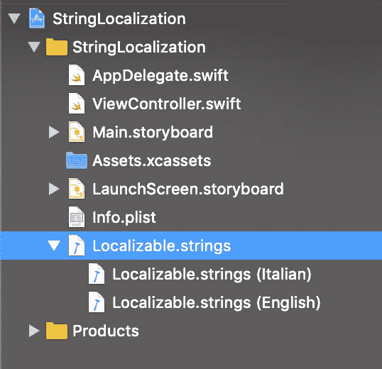

# 如何在 Swift 中轻松本地化您的应用字符串

> 原文：<https://blog.devgenius.io/how-to-easily-localize-your-app-strings-in-swift-fa28a380217b?source=collection_archive---------0----------------------->

## 在项目中本地化字符串的简单方法


法比安·格罗斯在 [Unsplash](https://unsplash.com?utm_source=medium&utm_medium=referral) 上拍摄的照片

# 介绍

本地化是将应用程序标签、按钮、文本和内容翻译成多种语言的过程。这很重要，因为你可以想象，我们的应用程序支持的语言越多，就有越多的用户*被鼓励下载并使用它*。

今天我将解释如何简单快速地执行本地化。

# 入门指南

首先，打开 [Xcode](https://developer.apple.com/xcode/) ，新建一个 Xcode 项目。选择单视图应用程序。


现在转到 *ViewController.swift* ，在屏幕中央添加一个写着“Hello”的标签。你应该这样做:

```
override func viewDidLoad() {
        super.viewDidLoad()
        // Do any additional setup after loading the view.

        let width = UIScreen.main.bounds.width
        let height = UIScreen.main.bounds.height
        let label = UILabel(frame: CGRect(x: width / 2, y: height / 2, width: 120, height: 30))
        label.text = "Hello"
        label.center = CGPoint(x: width / 2, y: height / 2)
        label.textAlignment = .center
        self.view?.addSubview(label)

    }
```

# 履行

好了，现在我们已经准备好了标签，但是如果我们的应用程序要支持许多不同的语言，我们如何动态地改变文本呢？

首先要做的是向我们的项目添加一个字符串文件，它将包含我们所有的字符串。

向项目中添加一个新文件，并在右上方的菜单中筛选出*字符串*。将其命名为“L *ocalizable* ”并保存。


在这个文件中插入一个*唯一代码*和*标签文本*，下面你可以找到一个例子:

现在我们需要在我们的应用程序中添加另一种语言！

选择项目并在“本地化”下，单击“ **+** ”图标。添加任何你想要的语言(我选择了意大利语)，然后点击“完成”。


现在回到 *Localizable.string 文件，*选择它，在文件检查器(右菜单)上选择“ *Localize* ”。选择您添加的新语言，然后单击“完成”。

如果您再次选择该文件，您应该会看到类似于下面的第一个图像(确保选择两种支持的语言)。

如果您在 Project Navigator 中仔细观察，您还可以看到在“ *Localizable.string* ”文件附近有一个小箭头——每种语言一个。



然后进入新的语言文件(在我的例子中是*localizable . strings(Italian)***)，将单词“Hello”更改为正确的翻译(在我的例子中是“Ciao”)。**

**我们快完成了。返回到 *ViewController.swift* 文件，将“Hello”字符串替换为“*NSLocalizedString(" view controller _ Label _ Hello "，注释:")*”。**

# **是时候测试一下了**

**如果我们不做任何改变就运行我们的应用程序，我们应该会看到“Hello”消息，因为英语是我们的默认语言。**

****

**但是如果我们进入设置→通用→语言&地区→ iPhone 语言，把它改成意大利语，我们的“Hello”字符串会怎么样？**

****

**标签文字改成了“Ciao”！太棒了。**

**[](https://www.buymeacoffee.com/nicolidomenico)**

# **结论**

**关于如何简单地本地化字符串的教程到此结束。**

****你可以在这里** **找到完整的代码** [**。**](https://github.com/domeniconicoli/StringLocalization)**