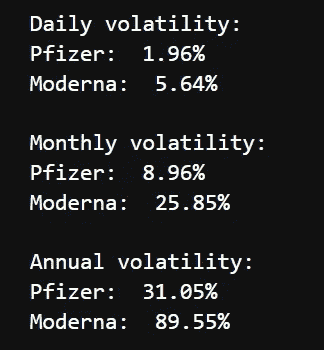
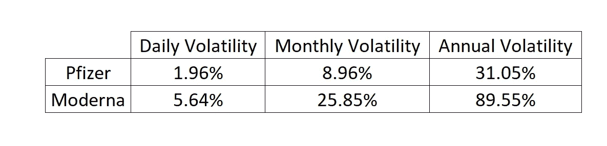
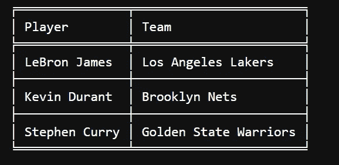
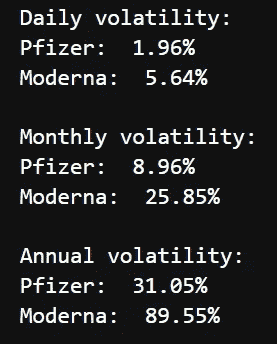
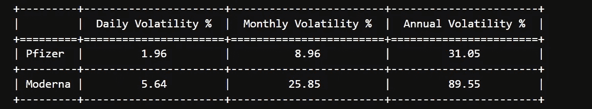

# 如何在 Python 中轻松打印和格式化表格

> 原文：<https://blog.devgenius.io/how-to-easily-print-and-format-tables-in-python-18bbe2e59f5f?source=collection_archive---------0----------------------->

让我们来看看如何以一种快速简单的方式来实现这一点。


马库斯·斯皮斯克在 Unsplash 上拍摄的照片

自从我开始职业生涯以来，我一直使用 Microsoft Excel。做了多少张表，算了多少张表，发了多少张表，我都数不过来。

自从使用 Python 以来，我意识到我已经不怎么使用表了。例如，在之前一篇关于股票波动的博文中，我是这样显示数据的:



用 Python 打印数据

坦率地说，我不会在 Excel 中展示这些，而是在如下表格中展示:



基本 Excel 表格

然后，我想用 Python 将这些数据打印在一个表格中，并意识到我不知道如何以一种简单快捷的方式来完成。

我发现了制表库，我希望它也能帮助你！

## 内容:

1.  [制表库](https://medium.com/p/18bbe2e59f5f#119e)
2.  [使用制表](https://medium.com/p/18bbe2e59f5f#f768)
3.  [格式化你的表格](https://medium.com/p/18bbe2e59f5f#2d3a)
4.  [具体用例](https://medium.com/p/18bbe2e59f5f#0ef2)
5.  [结论](https://medium.com/p/18bbe2e59f5f#b6eb)

## 1.列表库

要安装它，您可以执行以下命令:

```
pip install tabulate
```

要开始使用它，您需要导入制表函数

```
from tabulate import tabulate
```

## 2.使用制表

你可以在这里找到所有的文档。制表函数的第一个参数可以将以下所有数据类型转换成一个表格:

*   *列表的列表或另一个可迭代的列表*
*   *列表或另一个字典条目(作为列的关键字)*
*   *可重复项的字典(作为列的键)*
*   *二维数组*
*   *NumPy 记录数组(名称为列)*
*   熊猫。数据帧

然后，您可以为您的表使用可选参数“headers”。

*例子*:

```
nba_players = [['LeBron James',' Los Angeles Lakers'], ['Kevin Durant', 'Brooklyn Nets'], ['Stephen Curry', 'Golden State Warriors']]
print(tabulate(nba_players,headers =['Player','Team']))
```


一张非常简单的桌子

## 3.格式化您的表格

这里有几种可能性。

## a.表 fmt

添加名为“tablefmt”的参数，并选择所需的样式。

*例如:*

```
print(tabulate(nba_players,headers =['Player','Team'],**tablefmt = 'fancy_grid'**))
```



你可以在文档中找到许多不同的样式。

## b.列对齐

您可以使用 **stralign** 或 **numalign** 来选择以‘居中’，‘右’…的方式显示您的数据

*例如:*

```
print(tabulate(nba_players,headers =['Player','Team'],tablefmt = 'fancy_grid',**stralign='center'**))
```


我让您探索所有其他可选参数。

## 4.具体用例

如果我们回到我的第一个例子 Pfizer 和 Moderna 股票，让我们看看我打印它的代码:

```
import math
daily_volatility_pfe = pfizer['daily_returns'].std()
print('Daily volatility:')
print('Pfizer: ', '{:.2f}%'.format(daily_volatility_pfe))
daily_volatility_mrna = moderna['daily_returns'].std()
print('Moderna: ', '{:.2f}% \n'.format(daily_volatility_mrna))monthly_volatility_pfe = math.sqrt(21) * daily_volatility_pfe
print('Monthly volatility:')
print ('Pfizer: ', '{:.2f}%'.format(monthly_volatility_pfe))
monthly_volatility_mrna = math.sqrt(21) * daily_volatility_mrna
print ('Moderna: ', '{:.2f}%\n '.format(monthly_volatility_mrna))annual_volatility_pfe = math.sqrt(252) * daily_volatility_pfe
print('Annual volatility:')
print ('Pfizer: ', '{:.2f}%'.format(annual_volatility_pfe ))
annual_volatility_mrna = math.sqrt(252) * daily_volatility_mrna
print ('Moderna: ', '{:.2f}%'.format(annual_volatility_mrna ))
```



输出

借助制表功能和我们之前看到的内容，让我们将这些数据显示在一个表格中:

```
print(tabulate([['Pfizer',daily_volatility_pfe,monthly_volatility_pfe,annual_volatility_pfe], ['Moderna',daily_volatility_mrna,monthly_volatility_mrna,annual_volatility_mrna]],headers = ['Daily Volatility %', 'Monthly Volatility %', 'Annual Volatility %']**,tablefmt = 'fancy_grid',stralign='center',numalign='center',floatfmt=".2f"**))
```



这是用 Python 做的表格

你会注意到，在' tablefmt '和' stralign'/'numalign '参数之上，我还使用了' floatfmt '来只保留 3 位小数。

## 5.结论

使用制表功能将数据放入表格非常简单。我觉得它更自然，更容易阅读。我鼓励您测试和尝试不同的选项。还有更多的可能性！

我希望你喜欢阅读这篇文章！未来的文章请关注我。它激励我继续下去。

你也可以在 LinkedIn 上找到我。