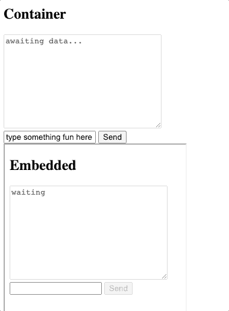

# 如何使用 iframe 轻松发送和接收数据

> 原文：<https://blog.devgenius.io/how-to-easily-send-and-receive-data-with-an-iframe-1a9c6da11723?source=collection_archive---------0----------------------->

从安全性问题到可用性和 SEO 问题，Iframes 的包装都很糟糕。尽管如此，它们是我们可以使用的工具之一，知道如何有效地使用它们可以为老问题打开新的解决方案之门。能够在 iframe 和父页面之间发送数据是交付更加集成的解决方案的一个有用技巧，而不是使用传统的无聊的“页面中的页面”方式。


在 [Unsplash](https://unsplash.com/s/photos/html?utm_source=unsplash&utm_medium=referral&utm_content=creditCopyText) 上 [Sai Kiran Anagani](https://unsplash.com/@_imkiran?utm_source=unsplash&utm_medium=referral&utm_content=creditCopyText) 拍摄的照片

不过，这里讨论的方法并不仅仅针对 iframes，它还适用于任何可以访问另一个页面的“window”对象的情况(因此弹出窗口和嵌入式 web 浏览器也可以加入进来)。但是 Iframes 很容易使用，所以我们将在这个例子中使用它们。

在子页面和父页面之间建立双向通信有几种方法。不过，一般来说，推荐的方法是使用“window.postMessage ”,如果你使用的技术支持的话(对不起 IE 用户)。

因此，让我们创建一个基本页面作为我们的父页面。

```
<!-- index.html -->
<!DOCTYPE html>
<html lang="en">
  <head>
    <meta charset="UTF-8" />
    <meta name="viewport" content="width=device-width, initial-scale=1.0" />
    <title>Parent Page</title>
  </head>
  <body>
    <h2>Container</h2>
    <textarea id="output" cols="30" rows="10" disabled>awaiting data...</textarea>
    <div>
      <input type="text" id="field" value="type something fun here" />
      <button id="send">Send</button>
    </div>
    <div>
      <iframe
        height="500px"
        id="inner"
        src=""
        frameborder="0"
      ></iframe>
    </div>
  </body>
</html>
```

这里我们有一个非常基础的页面。我将使用一个禁用的文本区域来显示来自嵌入式页面的消息数据，并使用一个输入和按钮来发送消息到所述页面。除此之外，我们有嘉宾，iframe 本身，目前没有它的来源，因为我们需要先做一个页面来嵌入。就这么办吧。

## 嵌入页面

这是将在 iframe 或 popup 中运行的页面。在结构上，我们将做一些与父页面非常相似的东西。

```
<!-- inner.html -->
<!DOCTYPE html>
<html lang="en">
  <head>
    <meta charset="UTF-8" />
    <meta name="viewport" content="width=device-width, initial-scale=1.0" />
    <title>Embedded Page</title>
  </head>
  <body>
    <h2>Embedded</h2>
    <textarea cols="30" rows="10" disabled id="output">awaiting data...</textarea>
    <input type="text" id="field" />
    <button id="send">Send</button>
  </body>
</html>
```

现在我们需要将这个页面加载到 iframe 中。最简单的方法是使用类似 npm 包“serve”的东西。如果您安装了“npm ”,请导航到这些文件所在的目录，然后运行“npx serve”。

您应该得到一些输出，指示资产在哪个端口上提供服务。在我的情况下，它们在端口 5000 上被服务。当我访问 [http://localhost:5000](http://localhost:5000) 时，我将得到父页面 inner.html，如果我访问[http://localhost:5000/inner . html](http://localhost:5000/inner.html)，我将得到我想要嵌入的页面。

这意味着我可以使用该 URL 作为我的 iframe 的源，所以我现在将它设置为我的“src”属性的值。

```
<iframe
    height="500px"
    id="inner"
    src="[http://localhost:5000/inner.html](http://localhost:5000/inner.html)"
    frameborder="1"
></iframe>
```

解决了这个问题，如果我们访问 index.html 页面，我们现在应该看到 iframe 下面包含了我们的另一个页面。下一步是编写一些 JavaScript 来促进两个页面之间的通信。

## JavaScript

首先，我们需要在索引页面上编写一些代码，等待 iframe 加载，然后获取对其“window”对象的引用，这样我们就可以对其调用“window.postMessage”函数。

我们还需要添加一个事件侦听器来在我们单击发送按钮时发送消息，并添加一个事件侦听器来显示我们从嵌入页面收到的任何消息。

在 index.html，在您的“

```
<script>
      // assign variables with references to the DOM nodes we will be interacting with
      const output = document.getElementById("output");
      const iframe = document.getElementById("inner");
      const button = document.getElementById("send");
      const field = document.getElementById("field");
      // we will assign this value once the iframe is ready
      let iWindow = null;// This event listener will run when we click the send button
      button.addEventListener("click", () => {
        // don't do anything if the iframe isn't ready yet
        if (iWindow === null) {
          return;
        }// otherwise, get the value of our text input
        const text = field.value;// and send it to the embedded page
        iWindow.postMessage(text);
      });// This event listener will run when the embedded page sends us a message
      window.addEventListener("message", (event) => {
        // extract the data from the message event
        const { data } = event;// display it in our textarea as formatted JSON
        output.value = JSON.stringify(data, null, 2);
      });// Once the iframe is done loading, assign its window object to the variable we prepared earlier
      iframe.addEventListener("load", () => {
        iWindow = iframe.contentWindow;
      });
</script>
```

尽管 JavaScript 本身不会做太多事情；我们需要在嵌入式页面中添加相应的代码，因此在 inner.html 中添加另一个包含以下内容的脚本标记。

```
<script>
      // set up references to DOM nodes
      const output = document.getElementById("output");
      const button = document.getElementById("send");
      const field = document.getElementById("field");// create a variable for the parent window. We will assign it once we get the first message.
      let parent = null;// add an event listener to send messages when the button is clicked
      button.addEventListener("click", () => {
        // don't do anything if there is no parent reference yet
        if (parent === null) {
          return;
        }// otherwise get the field text, and send it to the parent
        const text = field.value;
        parent.postMessage(text);
      });// add an event listener to run when a message is received
      window.addEventListener("message", ({ data, source }) => {
        // if we don't have a reference to the parent window yet, set it now
        if (parent === null) {
          parent = source;
        }// now we can do whatever we want with the message data.
        // in this case, displaying it, and then sending it back
        // wrapped in an object
        output.textContent = JSON.stringify(data);
        const response = {
          success: true,
          request: { data },
        };
        parent.postMessage(response);
      });
</script>
```

保存您的所有文件，刷新您的浏览器，并尝试一下。



双向沟通在起作用

当涉及到弹出窗口、iframes 和嵌入式浏览器时，使用这种发送消息的方法打开了一个全新的交互级别，如果你处理得当，为一些非常酷的交互铺平了道路。

Pastebin 链接来源:【index.html】—[https://pastebin.com/A0HFp6c5](https://pastebin.com/A0HFp6c5)
—inner.html—[https://pastebin.com/ba6TNXK5](https://pastebin.com/ba6TNXK5)