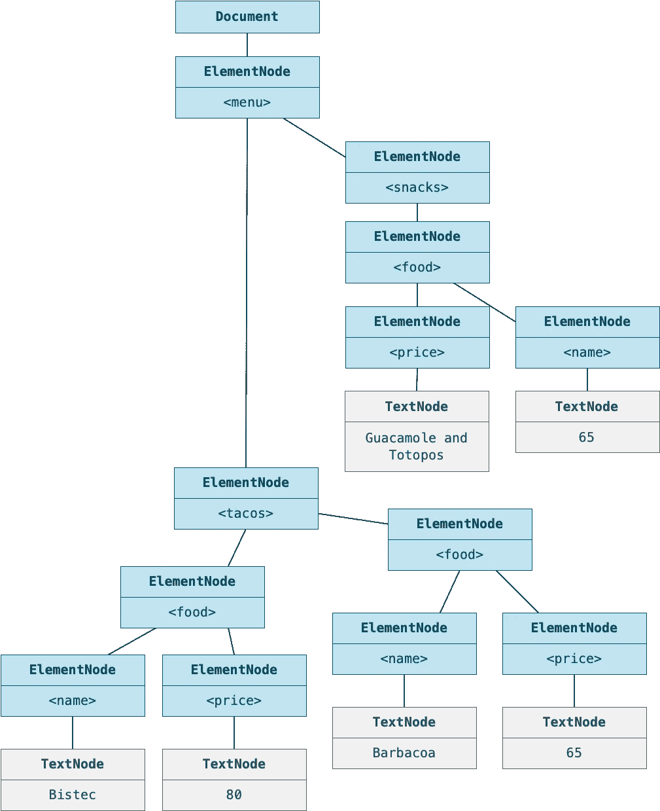
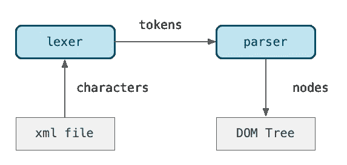
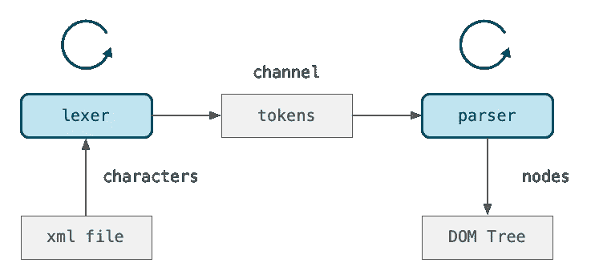

# 在 Julia 中从头开始编写 XML 解析器

> 原文：<https://blog.devgenius.io/how-to-easily-write-an-xml-parser-in-julia-7cd02f19d8c6?source=collection_archive---------5----------------------->


沙哈达特·拉赫曼在 [Unsplash](https://unsplash.com?utm_source=medium&utm_medium=referral) 上拍摄的照片

我将以一个激励性的咆哮开始，如果你只是想要一个实现的解释，你可以跳过它😄。

## 抱怨复杂的库和不必要的依赖

几年前，我不得不在 Julia 中使用 XML 解析器，我相信我最终使用了 [LightXML](https://github.com/JuliaIO/LightXML.jl) ，它是用 c 编写的 [libxml2](http://www.xmlsoft.org) 的包装器

当时，这并不是一次愉快的经历。这个包会崩溃，处理外部依赖(比如 C 库)在当时并不容易。对一个有很多功能都是黑匣子的库进行故障排除并不容易。

但是后来我想:“我只需要阅读非常简单明了的 XML 文档，这能有多难解析呢？”

特别是作为一名前 iOS 开发人员和顾问，人们会用那么多臃肿的框架和库来做最简单的事情，这让我抓狂。我浪费了太多时间调试多线程中的竞争条件，用来检查一个简单的文本字段是否包含电子邮件地址。

最终我意识到这款应用的前开发者一定是个白痴，因为这项工作可以通过单线程运行的正则表达式轻松完成。

在另一点上，我努力解决一个复杂的持久对象图系统的问题。才意识到只有少得可怜的 1 千字节的数据曾经使用这个系统读取或写入。一个简单的带有文件打开和文件关闭的标准 IO API 解决了这个问题。

将简单的问题过度复杂化是现代软件业的通病。在挑选功能最丰富臃肿的软件包来解决你的小问题之前。看看有没有更小图书馆。或者更好。也许，只是也许你可以用最少的代码自己写一个解决方案。

不幸的是，我们对重新发明轮子变得如此过敏，以至于我们为了避免写 100 行代码而导入 100 000 行代码。

事实上，具有讽刺意味的是，在我上面提到的例子中，在我扔掉大框架后，代码变短了。戈多发动机的创造者在更大范围内也有类似的经历。他们发现，将 Lua 或 Python 等现有编程语言嵌入到他们的引擎中的粘合代码最终比仅仅实现他们自己的语言 [GDScript](https://docs.godotengine.org/en/stable/getting_started/scripting/gdscript/gdscript_basics.html) 更长[。](https://docs.godotengine.org/en/stable/about/faq.html#what-were-the-motivations-behind-creating-gdscript)

我最终在包 [PList.jl](https://github.com/ordovician/PLists.jl) 中制作的 XML 解析器没有太大的不同。在大约 1000 行代码中，它可以读写旧的 NeXSTSTEP 属性列表格式以及更现代的基于 XML 的 Apple 属性列表格式。

这两种格式可以用代码解析，不依赖于 Julia 标准库。

相比之下，作为包装器的 LightXML 需要 400 行代码。事实上，PList.jl 库的 XML 部分只有 500 行。换句话说，本质上只是粘合代码，所用代码量几乎与我的 XML 库代码量相同。

## 越糟越好的哲学

支撑我的 PList 库的实际上是 Unix [越差越好的哲学](https://en.wikipedia.org/wiki/Worse_is_better)。这是一种强调简单而不是完整和正确的哲学。

基本上，如果你的解决方案很简单，那么没有被覆盖的情况或不正确的事情通常会很容易解决。然而，如果您的解决方案过于复杂，添加一个新的解决方案来解决某个特定的问题可能会变得几乎不可克服。

因此，解决方案遵循一种务实的方法。只正确解析我将处理的 XML 文件的种类，例如，在苹果财产列表格式中使用的那些。

不要添加一堆你不需要的东西，那会使解决方案复杂化。

## XML 和文档对象模型(DOM)

在讨论实现之前，我们必须看看什么是 XML 文档以及 XML 解析器实际上应该做什么。

有许多方法可以做到这一点，但我们选择遵循一种常见的方法，即将 XML 文档转换成一种数据结构，称为[文档对象模型](https://www.w3schools.com/Xml/xml_dom.asp)或简称为 *DOM* 。

假设我们从这个 XML 文档开始，表示我最喜欢的一家餐馆的菜单的一个子部分[“Taco Republica”](https://tacorepublica.no):

```
<menu>
    <snacks>
        <food>
            <name>Guacamole and Totopos</name>
            <price>95</price>
        </food>
        <food>
            <name>Quesadillas</name>
            <price>65</price>
        </food>
    </snacks>
    <tacos>
        <food>
            <name>Bistec</name>
            <price>80</price>
        </food>
        <food>
            <name>Barbacoa</name>
            <price>65</price>
        </food>        
    </tacos>
</menu>
```

我们最终想要的是一个内存中的数据结构，我们可以很容易地操纵它，如下图所示。



先前 XML 文档的 XML DOM 树。

下面是一个例子，说明我们在解析这个结构后如何处理它。我们首先获取树顶端的文档对象。

```
julia> doc = parsexml(read("examples/food.xml", String));

julia> typeof(doc)
Document
```

然后，我们可以用各种 API 函数遍历这个树结构:

```
julia> categories = nodes(root(doc));

julia> nodename(categories[1])
"snacks"

julia> snacks = nodes(categories[1]);
```

为了更容易看到发生了什么，我实现了一个`xml`函数来显示一个子树的 XML。

```
julia> xml(snacks[1])
<food>
  <name>Guacamole and Totopos</name>
  <price>95</price>
</food>
```

现在你已经知道我们实际上想要达到的目标了。期望的最终结果是什么。让我们看看如何到达那里。

我们将看看如何将 XML 文件中的一串字符转换成层次树结构。

## XML 解析器的实现

在编程中，当我们将文本转化为结构时，我们倾向于将问题分成两个逻辑部分:

*   **Lexer** 获取文本并将其转换成一串标记。这些标记被提供给解析器。
*   **解析器**将一串标记作为输入，并尝试识别语法结构。这用于产生更高级别的对象。

词元是一种由词元和词元类型组成的生成性词元。以下是一些例子:

词位标记类型描述 42 号码号码“hello”字符串文本字符串 foobar IDENT 标识符

所以基本上，词位是构成一个标记的字符的集合。我们解释这些字符并给它一个类型，比如一个数字或一个标识符。*标识符*可以是变量或函数的名字。



lexer 从 XML 文件中获取字符，将令牌传递给创建 DOM 树的解析器。

上面的数据流图概述了它是如何工作的。

构造词法分析器和解析器的常见问题是，您需要在词法分析器和解析器中维护一组状态。

lexer 需要跟踪它正在处理哪种类型的字符。与此同时，解析器试图将标记组合成 XML 节点。

通常这个问题是通过在词法分析器和语法分析器中存储一个状态作为枚举来解决的。然后我们有一个大的 switch-case 或 if-else 循环，它检查当前状态并做一些相关的处理。

但是这篇文章实际上是关于一种更简单、更优雅的方法来解决这个问题。

## 救援协管员

有了协程，我们可以独立运行词法分析器和语法分析器。

在 Julia 中，协程由两种数据类型`Task`和`Channel`管理。要创建一个协程，你需要向一个`Task`构造函数提供一个函数。

您可以安排这个协程运行。

```
task = Task(func)
schedule(task)
```

协程调度器将跟踪所有活动的协程。它在任何给定时间只运行其中一个。一旦一个协程阻塞(或让步)，调度程序将找到另一个协程继续运行。

Julia 中协调协程运行的一个很好的工具是`Channel`数据类型。这是一个 FIFO 队列。你把数据放进去。如果当你推数据时队列是满的，或者当你拉数据时队列是空的，那么活动的协程将被挂起。



两个协同程序通过持有令牌的通道进行通信。

所以我们可以想象 Lexer 和 Parser 各自运行一个协程，由一个`Task`对象管理。我们为代币做了一个队列，或者说是一个`Channel`。

Lexer 将继续把它发现的令牌推入通道。当通道被填满时，控制权将被传递给解析器，解析器将继续从通道中提取令牌。

一旦通道为空，解析器协程将被挂起，控制权再次传递给词法分析器。这被重复了一遍。

为了开始这个，我们需要一个 Lexer:

```
mutable struct Lexer
    input   :: String # scanned string
    start   :: Int    # start of lexeme
    pos     :: Int    # end of lexeme?
    tokens  :: Channel{Token}
end
```

这里的`input`是一个包含我们的 XML 文档的字符串。`start`是我们当前试图确定结束的词位在字符串中的位置。`pos`是我们目前正在探索的字符位置，看它是否代表词位的结束。

```
function Lexer(input::String)
    l = new(input, 1, 0, Channel{Token}(32))
    return l
end
```

我们构造了一个`Lexer`对象，其通道容量为 32 个令牌。这有些武断。可能更多或更少。

我们用这个函数来解释 lexing:

```
function lex(input::AbstractString, start::Function)
    l = Lexer(input)
    @async run(l, start)
    return l
end
```

这使用了`@async`宏，它基本上将`run`函数包装在一个`Task`对象中，并调度创建的任务对象。

因此我们把`run`函数变成了一个协程。

## 主循环

驱动 lexer 的主循环是这个`run`功能。

```
function run(l::Lexer, start::Function)
    state = start
    while state != lex_end
        state = state(l)
    end
    close(l.tokens)
end
```

每个状态都由一个 function 对象表示，该对象将 lexer 作为唯一的参数。

对文本节点内的文本进行词法分析可以是一种状态:

```
function lex_text(l::Lexer)
    ch = peek_char(l)
    while ch ∉ ['<', '>', EOFChar]
        next_char(l)
        ch = peek_char(l)
    end
    emit_token(l, TEXT)
    return lex_xml
end
```

注意，当我们完成了对文本的词法分析后，我们通过返回代表下一个状态的函数对象来切换到下一个状态。

那就是这个函数:

```
function lex_xml(l::Lexer)
    while true
        ignore_whitespace(l)
        ch = peek_char(l)

        if ch == EOFChar
            emit_token(l, EOF)
            return lex_end
        elseif ch == '<'
            return lex_begin_tag
        else
           return lex_text 
        end
    end
end
```

请注意，在这两种情况下，我们在找到令牌时都会发出一个令牌。然而，我们不必归还这个代币。相反，`emit_token`所做的是将令牌推入 lexer 的`tokens`通道。

```
function emit_token(l::Lexer, t::TokenType, s::String)
    token = Token(t, s)
    put!(l.tokens, token)
    l.start = l.pos + 1
end
```

如果`tokens`通道已满，那么这将导致 lexer 协程阻塞，控制权将移交给解析器协程(任务)。

## 分析器任务

开始解析 XML 文件的 API 就是这个函数。

```
function parsexml(xmlstring::AbstractString)
    l = lex_xml(s)
    p = Parser(l)
    Document(parse_node(p))
end
```

你可以看到我们创建了一个 lexer，然后将它传递给我们创建的`Parser`对象。

`parse_node`开始从频道中抽取代币。

```
function parse_node(parser::Parser)
    t = peek_token(parser)
    if t.kind == BEGIN_TAG
        parse_element(parser)::Node
    elseif t.kind == TEXT
        parse_text(parser)::Node
    else
        error("Had not expected token '$t' while looking for start of new XML node")
    end
end
```

您可以看到它调用了`peek_token`，它将尝试获取更多令牌，因为它还没有一个先行令牌。

```
function peek_token(p::Parser)
    t = @get(p.ahead_token, next_token(p.lexer))
    p.ahead_token = t
    t
end

next_token(l::Lexer) = take!(l.tokens)
```

这使用了在通道上调用`take!`的`next_token`。如果协程为空，则`take!`将导致协程挂起。

因此，当通道变满或变空时，我们将在词法分析器和语法分析器之间来回切换。每次词法分析器和解析器都会从之前被阻塞的`put!`或`take!`调用中恢复。