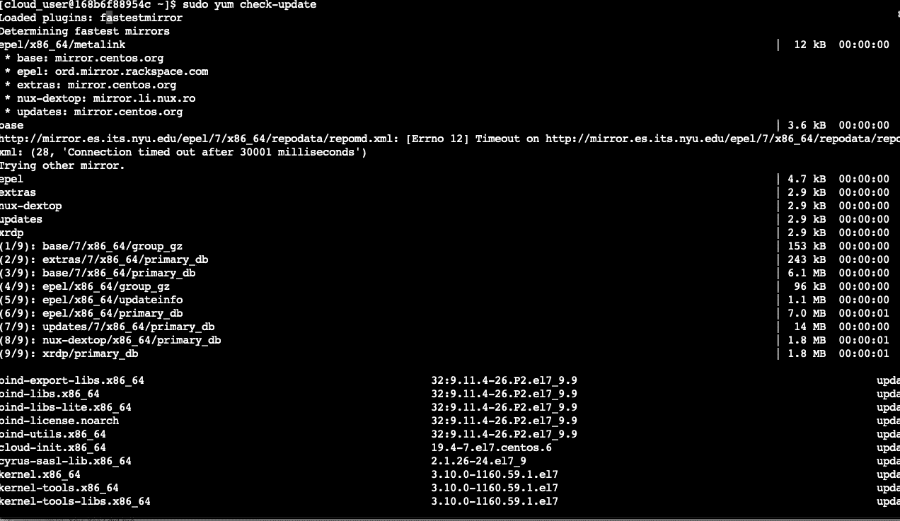
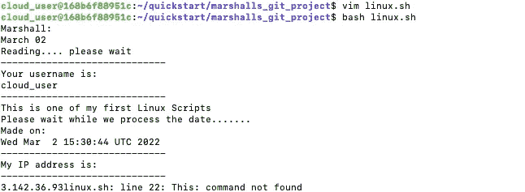

# 如何编辑代码，然后将代码分支到 Github 上的存储库中

> 原文：<https://blog.devgenius.io/how-to-edit-code-and-then-fork-it-to-a-repository-on-github-ac167007074f?source=collection_archive---------11----------------------->


[来源](https://github.com)

嘿伙计们，欢迎回到我的博客！这篇文章将讲述如何在专业环境下从 CLI 使用 Github。如果截图是不同的颜色，我提前道歉，但由于我日常工作的性质，我不得不在不同的计算机上完成这个项目。在我们开始之前，让我们复习一些定义，这样我们都在同一页上…

首先，什么是 [Git](https://git-scm.com) ？Git 是一个[免费开源的](https://git-scm.com/about/free-and-open-source)分布式版本控制系统，旨在快速高效地处理从小到大的项目。

"*好的，马歇尔，如果 Git 本质上是一个版本控制系统，那么 Github 是什么，为什么我们甚至需要它*？"你猜怎么着很高兴你问了。在高层次上，GitHub 是一个网站和基于云的服务，帮助开发人员使用 Git 的版本控制来存储和管理他们的代码，以及跟踪和控制他们代码的更改。本质上，Git 是源代码控制，Github 是显示您和其他开发人员项目的网站。这里有一个[链接](https://kinsta.com/knowledgebase/what-is-github/)，它更详细地解释了 Github，我曾经用它来帮助我自己理解它，如果你仍然对它感到好奇，它完全值得在继续之前读一读。这是我的 Github 账户的直接链接。我会定期更新更多的内容。[https://github.com/marshallhubb14](https://github.com/marshallhubb14)

现在我们已经有了这些定义，让我们来谈谈我们需要什么来完成这个项目。在使用终端的 linux 或 MacOS 系统上，或者在使用 Putty 或 Powershell 的 Windows 计算机上，您只需要一个 [Github](https://github.com) 帐户和一个 CLI(命令行界面)。

这个项目的目标是:你是一名开发运维/云工程师，你的任务是在技术团队的 repo(存储库)中从你的级别编辑和更改代码。做出更改后，团队希望在投入生产之前手动检查代码。

好吧，用我 6 岁儿子的话说，让我们开始派对吧！

**步骤 1** -更新您的服务器，然后将 Git 安装到您的 CLI



更新此 CentOS 7 云服务器

我们要做的第一件事就是更新我们的服务器。这是一个很好的实践，因为超过 90%的软件和操作系统更新都是为了修补安全漏洞。一个存在安全漏洞的程序可能会让可怕的事情发生在程序和整个服务器系统上。安全漏洞是恶意软件进入系统的常见切入点。具体来说，该服务器是 CentOS7，因此作为超级用户(sudo)使用下面的命令。请记住，如果您运行的是基于 Debian 的发行版，您的命令会有所不同。

```
sudo yum check-update
```


Git 到 CLI 的安装

下一步我们将安装 Git。我们将通过再次作为超级用户(sudo)键入下面的命令来完成这一步。一旦完成，我们将进入下一步。

```
sudo yum install git
```

**第二步** -派生您要修改的回购协议


LevelUpInTech 回购的屏幕截图

在这个截图的右上角，你会看到“Fork”请求。按下此键会将技术回购的等级提升到您自己的等级，这实质上意味着制作他们回购的精确副本，然后您可以修改它，而无需对原始版本进行任何更改。稍后我们将对此进行更深入的探讨…

**第 3 步**——用你的 Git 账户信息配置你的 CLI


在这一步中，您将使用您的 Github 用户名和电子邮件地址配置您的 CLI。为此，请使用以下命令:

```
git config —-global user.name <”your user name”>git config —-global user.email <”your email address”>
```


接下来我们要做的是用命令“ **mkdir gitkey** ”创建一个名为“gitkey”的目录，并用命令“ **cd gitkey** ”将目录切换到其中。下一件事是生成一个令牌，用于 Github，作为项目稍后的密码。要生成此令牌，请使用下面的命令。

```
ssh-keygen -t ed25519 -C “<your_email@example.com>”
```


为了确保正确生成了密钥，使用“ **ls** ”命令列出您的目录的内容。然后，使用“ **cat** ”命令和您的密钥名称来查看这个密钥的内容。请务必复制该文件的内容，因为下一步将需要它。

```
cat <keyname.pub>
```


下一步我们将在 Github 网站上生成令牌。我们将通过按右上角的绿色“New SSH key”来完成此操作。一旦它被打开，你将被提示输入你的密钥的名字和多少天你想要它有效。这也是您将输入您应该使用“cat”命令复制的文件内容的地方。

**步骤 3** -克隆回购以开始编辑它


克隆存储库

好了，现在我们冒险回到我们的主目录，在 cli 中创建新目录。我选择将我的命名为“quickstart ”,然后我更改了其中的目录。接下来，我们将克隆您选择的“https:”存储库(使用本页顶部的链接来解释什么是存储库)，然后将它放入您正在创建的指定目录的命令中。我选择了“marshalls_git_project”。该命令将在下面

```
git clone <insert the https from the search bar> <insert the directory that will hold the clone of the repository>
```

**步骤 4** -在存储库中编辑文件



接下来，我们将把目录切换到我命名为“marshalls_git_project”的克隆中，然后使用 Vim 编辑该文件。如果你不知道那是什么， [**Vim**](https://www.vim.org) 是一个高度可配置的文本编辑器，可以非常高效地创建和更改任何类型的文本。使用 Vim，我们将打开文件，然后通过添加我们自己的文本来编辑它。要进入 Vim，您只需输入以下命令。

```
vim <the file you want to edit>
```


linux.sh 文件中文本的图片

一旦进入 Vim，您将处于“命令”模式。在这种模式下，除了不能添加任何文本之外，您对文件拥有完全的控制权。要向文件中添加文本，您必须按键盘上的“I”键进入“插入”模式。一旦进入这种模式，你就可以随心所欲地编辑文件。要退出插入模式，请按退出键，这将使您回到命令模式。然后，要保存您的更改，您需要键入" **:wq！**”然后保存更改并退出 vim。要执行您的文件以查看它会说什么，只需在下面键入以下命令。如果您向上滚动到这个图片上方的图片，您将看到该文本执行后将显示的内容。

```
bash <your file>
```

步骤 5 - Git 添加、Git 提交和 Git 推送…


这一步会将您修改的文件添加到稍后提交的队列中，并保存任何更改。在这一步，您的文件实际上并没有被提交。如果您有一个正在编辑的文件，但实际上并没有准备好提交它，而是想要保存更改，请记住此命令。下面是执行此操作的命令。

```
git add <your file name>
```


这一步称为 git 提交，您将使用的命令如下。在运行 commit 命令之前，我运行了" **git status** "命令，以查看我在分支上的位置。git 提交步骤提交已经添加的文件，并使用日志创建一个新的修订。如果您实际上没有添加任何文件，git 不会提交任何东西。但是，您可以将“ **git add** ”和“ **git commit** ”这两个动作与“ **git commit -a** ”结合起来，以供将来参考。我添加的“ **-m** ”只是为了在执行命令后向我提供一条消息，解释我在这一步所做的一切。

```
git commit -m “<the explanation of what you did>”
```


现在" **git push** "步骤花费了这个项目的大部分时间。出于某种奇怪的原因，我后来终于明白了，即使在我输入我在步骤 2 中生成的令牌作为我的密码之后，我还是一直得到“认证失败”的消息。这个步骤本质上是*推动*你对项目所做的变更，并与团队的其他成员分享。在做了一些研究后，我想出了如何避开这个错误，如果你遇到了同样的错误，这应该也能帮助你…


我意识到我必须检查为我的 CLI 设置的“遥控器”。我使用了下面的命令。我读到的解释说，你应该有一个指向你的 GitHub 帐户上的副本(fork)的“origin”和一个指向原始文件的名为“upstream”的“origin”。只能从上游拉，不能推。

```
git remote -v
```


为了将我的 URL 固定到正确的原点，我使用了以下命令:

```
git remote set-url origin <urlto*your*fork>
```


在我的 CLI 被正确配置为将我的更改“推送”到我自己的 Github repo 之后，我输入了下面的命令。正如你可以从这张截图中看到的，与这一步顶部的截图相比，它没有任何错误。

```
git push -u origin
```

**步骤 6** -发送拉取请求


如果一切顺利，你应该会在你的个人资料页面上看到。这让你知道你是成功的，你几乎完成了。下一步是*将你的变更拉回到原来的项目中。拉取*或合并提供了一种简单的、基于网络的方式来提交你的作品(通常称为“补丁”)到一个项目中。这被称为拉请求**,因为您要求项目创建者从您的分叉中拉出变更，并将其添加到他们的**。


一旦你看到这个，你就完了。谢谢你在这个过程中一直陪着我！