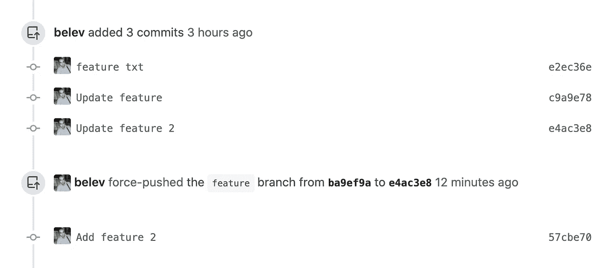

# 如何有效地使用 git rebase — onto？

> 原文：<https://blog.devgenius.io/how-to-effectively-use-git-rebase-onto-1296c8a7743?source=collection_archive---------26----------------------->


git rebase —到

这篇文章最初发表于[https://belev.dev/how-to-effectively-use-git-rebase-onto](https://belev.dev/how-to-effectively-use-git-rebase-onto)

我们将进一步探索`git rebase --onto`命令。它是什么，如何在重定基础后使用它来修复 Git 分支，如何改变分支的基础，等等？我们将通过探索`git rebase --onto`真正有用的真实世界场景来学习这些东西。

我们开始吧！

# 快速`git rebase`回顾

访问[文档](https://git-scm.com/docs/git-rebase)，我们会看到以下解释:

> *在另一个基础提示上重新应用提交*

这里最重要的一点是*基*是什么意思/指什么？这是上一次/父提交。让我们来看一个例子，这样会更清楚:

```
a--b--c--d--e  master
       \
        f--g--h  feature
```

`h`之前提交的是`g`。这意味着`h`的基数是`g`。

现在的`feature`的底座是`c`。通过检出`feature`分支并执行`git rebase master`，我们将把`feature`分支的基础改为`e`。

```
a--b--c--d--e  master
             \
              f'--g'--h'  feature
```

在[之前的博客文章](https://belev.dev/git-merge-vs-rebase-to-keep-feature-branch-up-to-date)中提到，这是创建新的提交，Git 历史被改变。在`f`、`g`、`h`之后的`'`，我们展示了这些是不同的提交。但是它们包含相同的变化。

当我们只有两个分支，并且希望一个分支在另一个分支之上保持同步时，`git rebase`可以完美地工作。然而，当我们需要在旧的基础上做出改变时，这是不够的。这里`git rebase --onto`进来帮忙。

# 什么是`git rebase --onto`？

我们可以说这是更改父分支的更精确的方式。它接受三个参数— `<new-base>`、`<old-base>`、`<end-inclusive>`，其中第三个是可选的。这使我们能够完全控制我们想要重定基础的内容和位置。

让我们以前面的例子为例，使用`--onto`获得相同的结果。

```
a--b--c--d--e  master
       \
        f--g--h  feature
```

我们想让`feature`离开`master`。所以我们知道我们的新基地是什么，它是`master`。旧基础是我们在分支中的第一个提交的基础，这意味着它将是`c`。现在我们知道了新的和旧的基础，我们可以运行命令:`git rebase --onto master c`。

这将引导我们:

```
a--b--c--d--e  master
             \
              f'--g'--h'  feature
```

结果和使用`git rebase master`一样。这向我们表明，他们在做同样的事情。`git rebase` master 只是`git rebase --onto master <old-base>`的速记语法。

# 如何跳过不需要的提交来改变基础？

我们已经看到了使用`--onto`最简单的情况。让我们再看一下前面的例子，但是我们不希望 commit `f`出现在 rebase 之后，因为它不再相关了。

```
a--b--c--d--e  master
       \
        f--g--h  feature
```

运行`git rebase --onto master f`给了我们:

```
a--b--c--d--e  master
             \
              g--h  feature
```

> *注意为* `*<old-base>*` *提供的值。认为它具有包容性是一个常见的错误。*

重要的是要记住/理解我们是在与基础打交道，而不是某个特定的承诺。`g`的基础是`f`，所以当我们说`<old-base>`是`f`时，这将被提供的`<new-base>`改变，我们将以这种方式释放提交`f`。

# 如何在重设基础后从分支修复分支

与多人一起工作或者在一个大的代码库中工作，几乎可以肯定的是，在某个时候你将需要从一个分支中创建一个分支。例如，您需要启动一个新特性，但是它依赖于另一个特性，因此您需要从以前的分支启动您的分支。或者您有自动化 QA，它从您的特性分支创建一个分支。

让我们来看看这个问题的直观表示:

```
a--b--c--d--e  master
       \
        f--g--h  feature-1
               \
                i--j--k--l  feature-2
```

在这种情况下，您想要移动整个树以基于`master`。这意味着`feature-1`将被重新设定在`master`的顶部，而`feature-2`将被重新设定在`feature-1`的顶部。

让我们检查`feature-1`并运行`git rebase master`。这将导致:

```
a--b--c--d--e  master
      |      \
      |       f'--g'--h'  feature-1
       \
        f--g--h--i--j--k--l  feature-2
```

如果您已经打开了从`feature-2`到`feature-1`分支的 PR，您将在您的 PR 中看到来自`feature-1`的提交。没有必要担心，因为正如我们可以从上面的视觉表示和下面的图像中看到的，这是意料之中的。



重设基础特征-1 个结果

我们现在可以检查`feature-2`并运行`git rebase --onto h' h`。这给了我们:

```
a--b--c--d--e  master
             \
              f'--g'--h'  feature-1
                       \
                        i'--j'--k'--l'  feature-2
```

请记住，如果 f/g/h 与 f'/g'/h '相同，有时简单的`git rebase feature-1`会起作用。Git 足够聪明，当我们使用 rebase 时，它将/能够删除具有相同变更集的提交。然而，检查另一个分支中的所有内容是否都相同是困难和烦人的，在这里使用`--onto`是更好的选择，因为否则，它会导致一个分支有不属于它的提交。

你应该试试`--onto`。然而，如果你还没有准备好，或者你不想使用它，并在上述情况下结束，有一个交互式 rebase 的解决方案。从`feature-1`重设`feature-2`的基础。检查是否有不属于该分支的提交，并通过进行交互式 rebase 来删除这些提交。如果你不熟悉如何做到这一点，看看以前的博客文章[一些最常用的 Git 交互式 rebase 选项](https://belev.dev/some-of-the-most-used-git-interactive-rebase-options)。

这是我们几个月来的一个问题。人们对他们在开放的 PRs 中看到的变化感到惊讶。毕竟，你什么也没做，突然你在你的 PR 中看到一些不属于那里的提交。这似乎很奇怪，但希望通过这篇文章，这将被清除，它不会再奇怪了。

# 如何改变 Git 分支的基数？

我们时常需要改变树枝的底部。两个例子是:

*   我们还没有从正确的分支开始我们的分支
*   我们从`master`开始工作，但是一位同事在他/她的部门做了一些改变，这将使我们的生活变得更容易。然后也许我们想把`master`换成一个基数，用同事的分支改动。

为了更好地理解，我们来看一个直观的表示:

```
a--b--c--d--e  master
             \
              f--g  feature-1
                  \
                   h--i  feature-2
```

我们从`feature-1`开始我们的分支`feature-2`，但是我们做错了。这些特征被证明根本没有联系，我们希望我们的`feature-2`分支从`master`开始。

我们将使用`--onto`并不奇怪。于是我们有了`git rebase --onto <new-base> <old-base>`。我们的老基地是`feature-1`，我们从那里开始了我们的分公司。我们的新基地应该是`master`，因为我们希望我们的分公司从这里开始。我们要处决`git rebase --onto master feature-1`。

这给了我们:

```
a--b--c--d--e  master
            | \
            |  f--g  feature-1
             \
              h--i  feature-2
```

我们在工作中使用 [Git flow](https://nvie.com/posts/a-successful-git-branching-model/) ，并且不时地改变分支的基础。在我们的例子中，主要是当热修复分支不是从正确的分支创建的时候。例如，hotfix 分支是开放的，但是我们从发布分支开始我们的分支。然后，我们需要将基础从版本更改为修补程序。

# `git rebase --onto`第三个论点怎么用？

`git rebase --onto`采用第三个参数，该参数用作结束点。

让我们看下面的例子:

```
a--b--c--d--e  master
       \
        f--g--h--i--j--k--l  feature
```

我们希望从`master`重新设定`feature`的基础，但是只接受某些提交——从`h`到`j`。我们已经看到了如何使用`--onto`跳过冗余提交。如果我们只想这样做，我们需要执行`git rebase --onto master g`。

现在我们想要最后一个的具体提交。`--onto`的第三个论点正是我们想要的。所以我们只需要说哪一个是最后一次提交。

> *注:含括取。*

运行`git rebase --onto master g j`，这将为我们提供:

```
a--b--c--d--e  master
       \
        h--i--j  feature
```

# 结论

我们更深入地研究了`git rebase --onto`。它是更高级的命令之一，使用它我们可以轻松地解决我们分支的某些 Git 问题。即使我们对此一无所知，我们也可以通过命令的组合来解决我们的问题——普通的和交互式的 rebase、cherry-pick 等。作为开发人员，我们应该尽可能多地尝试自动化我们的工作，因此使用较少数量的命令是了解`--onto`的充分条件。

我们讨论了很多内容，所以让我们快速总结一下:

*   快速回顾一下`git rebase`，它*的基础*和 rebase 的作用
*   使用`git rebase --onto`给了我们什么
*   如何使用`--onto`改变分支的基础并跳过不需要的提交
*   当我们有一个更深的分支结构——从一个分支到另一个分支——时，如何调整我们的分支
*   如何改变 Git 分支的基础，为什么它会有用
*   使用带有 3 个参数的完整形式的`git rebase --onto`,这允许我们从头到尾只进行某些提交

谢谢你把这个看完。我希望你喜欢它并且学到一些新的东西。如果是这样，请在 [Twitter](https://twitter.com/BelevMartin) 上关注我，我会在那里分享其他的技巧、新文章和我学到的东西。如果你想了解更多，想和我聊聊软件开发，或者给我一些反馈，不要害羞，给我发个邮件。