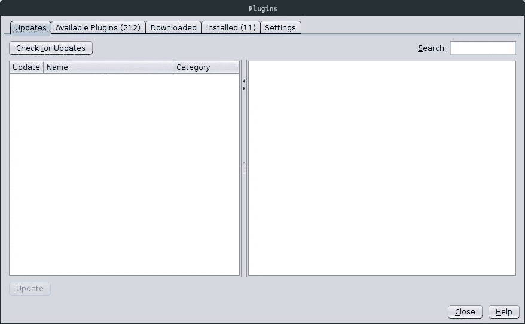
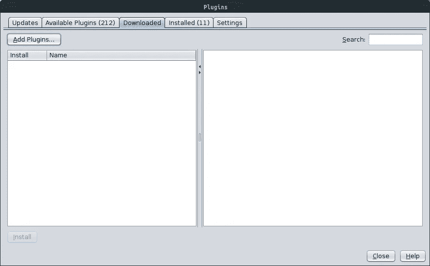
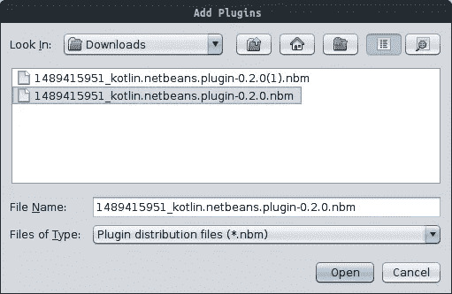
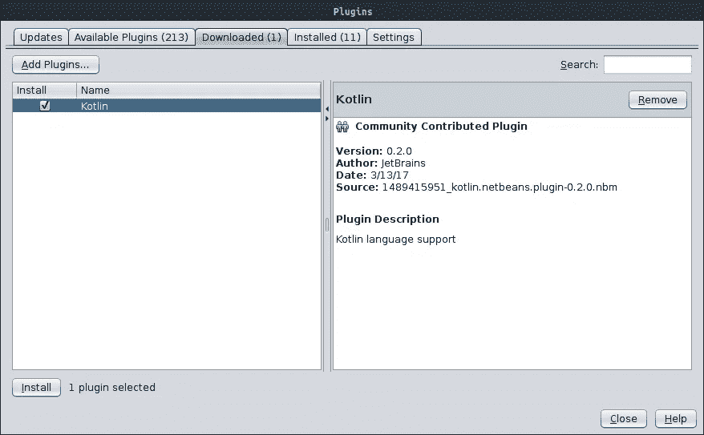
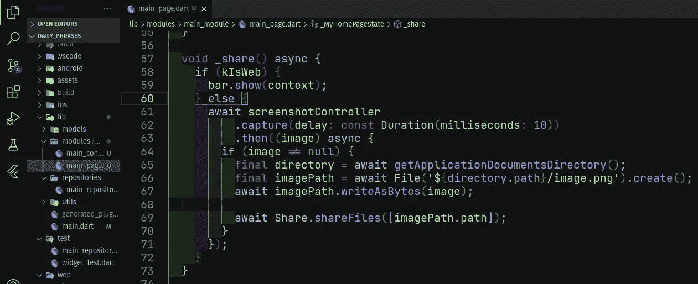
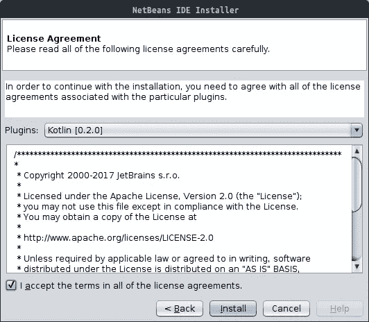
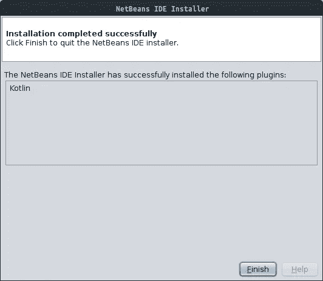

# 如何在 Netbeans 上启用 Kotlin

> 原文：<https://blog.devgenius.io/how-to-enable-kotlin-on-netbeans-40b9b94676c1?source=collection_archive---------0----------------------->

亲爱的读者你好！在本教程中，您将学习如何在集成开发(IDE) NetBeans 上安装 Kotlin 语言插件！

来源:https://kotlinlang.org/

**→** [**我的 GitHub 简介。**](http://github.com/wendreof) **→** [**我的 LinkedIn 个人资料**](https://www.linkedin.com/in/wendreof/) **。
→把** [**Ufo 主题**](https://marketplace.visualstudio.com/items?itemName=wendreof.ufo) **放到你的 VS 代码里。**

虽然我们现在有很多 IDE，比如 [JetBrains](https://www.jetbrains.com/) IDE，虽然它不像 NetBeans 一样可以免费下载，但是可以通过学生/教授的许可证和试用版(只有 30 天)获得。许多人仍然选择 NetBeans 作为自己的开发环境。

来源:[https://pngimage.net/netbeans-logo-png-5/](https://pngimage.net/netbeans-logo-png-5/)

NetBeans 是 Java 开发的官方环境，由 Oracle 推荐，目前的稳定版本是 8.02，可用于 Windows、Linux、macOS 和其他系统。

以下是**的安装步骤**:

**#1** —下载并安装与您的操作系统兼容的版本:
[https://netbeans.org/downloads/8.0.2/](https://netbeans.org/downloads/8.0.2/)

**#2** —现在在 JetBrains 网站上下载插件:[http://plugins.netbeans.org/plugin/68590/kotlin](http://plugins.netbeans.org/plugin/68590/kotlin)(仅适用于 8.02 和 8.01)

**#3** —在 IDE 打开的情况下，点击**工具- >插件**:

截图 01

**# 4**—点击**下载的**标签，然后点击**添加插件**:

Screnshot 02

**#5** —转到插件区域:

截图 03

**#6** —选择并点击**打开**，选择插件并点击**安装:**

截图 04

**等一下……** 如果你是 Visual Studio 代码用户，喜欢黑暗主题、UFO 的和科幻的，看看[**Ufo 主题**](https://marketplace.visualstudio.com/items?itemName=wendreof.ufo) **。**

截图 Ufo 主题

**# 7**—现在只需接受 therms 并点击**下一步- >安装:**

截图 05

恭喜你！现在，您可以使用 NetBeans IDE 用 Kotlin 语言进行开发:

截图 06

感谢你阅读这篇文章，❤

你们要在主面前自卑，他就必叫你们升高。詹姆斯，4–10

错误或建议？留下你的评论和掌声。

**→** [**我的 GitHub 简介。**](http://github.com/wendreof) **→**[**我的 LinkedIn 简介**](https://www.linkedin.com/in/wendreof/) **。
→把** [**Ufo 主题**](https://marketplace.visualstudio.com/items?itemName=wendreof.ufo) **拿到你的 VS 代码里。**