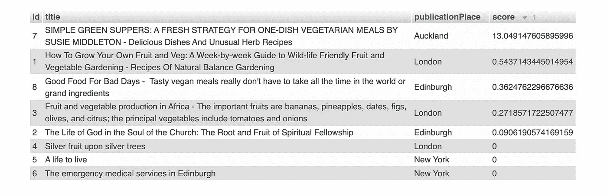

# 如何为您的应用启用强大的全文搜索——MySQL 与 Elasticsearch

> 原文：<https://blog.devgenius.io/how-to-enable-powerful-full-text-search-for-your-apps-mysql-vs-elasticsearch-f35ac45f816e?source=collection_archive---------2----------------------->

## MySQL 和 Elasticsearch 全文搜索和比较的分步指南


布鲁克·拉克在 [Unsplash](https://unsplash.com/s/photos/color-shopping?utm_source=unsplash&utm_medium=referral&utm_content=creditCopyText) 拍摄的照片

你是否曾经在超市或百货公司走来走去，却找不到你要找的东西？在网上购物时，你可能会有同样的经历。尽管大多数网站都是按类别排列产品，但如果你对目标产品的类别毫无头绪，浏览类别仍然是件苦差事。搜索栏节省了我们很多时间，因为我们可以简单地输入关键字或文本短语，然后它会显示所有相关的项目。毫无疑问，全文搜索是所有电子商务网站的基本功能。

全文搜索是一个受 MySQL 和 Elasticsearch 等许多数据库支持的流行功能。但是，MySQL 和 Elasticsearch 在全文搜索能力方面有什么区别呢？如果您在寻找实现全文搜索的解决方案，不了解这些差异就无法做出正确的决定。在本文中，我将向您展示 MySQL 和 Elasticsearch 上的全文搜索的用法，并强调它们的区别。

## 什么是全文搜索？

如果搜索引擎通过精确匹配来查找数据记录，你将很难得到任何搜索结果。例如，下面的 SQL 语句不太可能返回任何记录，因为可能不存在名称或描述与文本短语“鱼番茄罐头”完全相同的产品。

```
SELECT *
FROM products
WHERE name = ‘canned food with fish and tomato’
OR description = ‘canned food with fish and tomato’
```

如果我们使用通配符' LIKE % '可能会有所帮助，但您将只收到在数据字段中包含精确文本短语的记录。

```
SELECT *
FROM products
WHERE name LIKE ‘%canned food with fish and tomato%’
OR description LIKE ‘%canned food with fish and tomato%’
```

全文搜索的思想是将文本短语分解成标记。上例中的文本短语被分成这些标记:“罐头”、“食品”、“with”、“鱼”、“and”和“番茄”。然后，搜索引擎查找匹配任何一个标记的所有记录。记录匹配的标记越多，它与文本短语的相关性就越大。因此，搜索引擎通过在搜索结果中分配分数来指示相关性。如果查询字符串中的标记包含常见单词(如“food ”),并且许多产品可能匹配一个或多个标记，您可能会收到包含大量记录的搜索结果。但是，您总是可以按分数过滤结果，以便获得最相关的记录。

全文搜索是一个受 MySQL 和 Elasticsearch 等许多数据库支持的流行功能。启用此功能的设置实际上非常简单明了。例如，您可以在 MySQL 上打开所选数据字段的全文搜索功能，而无需对表模式进行任何更改。说到 Elasticsearch 就更简单了，因为它默认支持全文搜索，不需要额外的配置。

# 全文搜索一览— MySQL 与 Elasticsearch

简而言之，MySQL 和 Elasticsearch 都有相似的全文搜索思想。它是通过将文本内容分解成记号来创建索引。然后，查询会将查询文本分解成标记，并与索引匹配。基于匹配结果，搜索引擎计算分数并分配给代表相关性的搜索结果。

关键区别在于固定解决方案和可配置解决方案之间的解决方案方法。MySQL 在 3 种不同的模式下提供固定的全文搜索功能——自然语言、布尔和扩展查询。它几乎没有调整和微调的空间。

相反，Elasticsearch 的设计是高度可配置的。令牌分解和查询执行的过程是基于分析器、令牌化器和过滤器的集合来执行的。这些组件可以定制并组合在一起，以实现更高级的功能。

我将一步一步地介绍 MySQL 和 Elasticsearch 上全文搜索的用法。

# 样本数据集

全文搜索功能的演示基于一个样本数据集，它是一组图书馆图书记录。该模式相当简单，包含以下几列:id、title 和 publicationPlace。


示例数据模式

## **MySQL**

运行下面的 SQL 语句来创建图书馆图书表并导入示例数据。

```
CREATE TABLE `library-book` (
`id` int(11) NOT NULL,
`title` text COLLATE utf8_unicode_ci,
`publicationPlace` text COLLATE utf8_unicode_ci
);INSERT INTO `library-book` (`id`, `title`, `publicationPlace`) VALUES ('1', 'How To Grow Your Own Fruit and Veg: A Week-by-week Guide to Wild-life Friendly Fruit and Vegetable Gardening - Recipes Of Natural Balance Gardening', 'London');INSERT INTO `library-book` (`id`, `title`, `publicationPlace`) VALUES ('2', 'The Life of God in the Soul of the Church: The Root and Fruit of Spiritual Fellowship', 'Edinburgh');INSERT INTO `library-book` (`id`, `title`, `publicationPlace`) VALUES ('3', 'Fruit and vegetable production in Africa - The important fruits are bananas, pineapples, dates, figs, olives, and citrus; the principal vegetables include tomatoes and onions', 'London');INSERT INTO `library-book` (`id`, `title`, `publicationPlace`) VALUES ('4', 'Silver fruit upon silver trees', 'London');INSERT INTO `library-book` (`id`, `title`, `publicationPlace`) VALUES ('5', 'A life to live', 'New York');INSERT INTO `library-book` (`id`, `title`, `publicationPlace`) VALUES ('6', 'The emergency medical services in Edinburgh', 'New York');INSERT INTO `library-book` (`id`, `title`, `publicationPlace`) VALUES ('7', 'SIMPLE GREEN SUPPERS: A FRESH STRATEGY FOR ONE-DISH VEGETARIAN MEALS BY SUSIE MIDDLETON - Delicious Dishes And Unusual Herb Recipes', 'Auckland');INSERT INTO `library-book` (`id`, `title`, `publicationPlace`) VALUES ('8', 'Good Food For Bad Days -  Tasty vegan meals really don''t have to take all the time in the world or grand ingredients', 'Edinburgh');
```

MySQL 需要为全文搜索设置索引，运行下面的语句为“title”和“publicationPlace”创建一个全文索引，假设读者对基于这两个数据字段查找书籍感兴趣。

```
ALTER [TABLE](http://localhost:7080/url.php?url=https://dev.mysql.com/doc/refman/5.7/en/alter-table.html) `library`.`books` ADD FULLTEXT `book_free_text_index` (`title`, `publicationPlace`);
```

## **弹性搜索**

Elasticsearch 的所有 CRUD 操作都是通过 REST API 调用来完成的。要将同一组样本图书记录加载到 Elasticsearch 中，请运行下面的 curl 命令，它会提交一个批量数据插入的 POST 请求。如果你想知道如何在你的本地机器上运行 Elasticsearch 和 Kibana 进行测试，请点击[这篇文章](/how-to-build-a-marvelous-tech-stack-of-elasticsearch-798bae89b13c)，在 docker 上部署一个 Elasticsearch 节点。

与 MySQL 不同，Elasticsearch 是一个 NoSQL 数据库，可以在不事先创建表模式的情况下插入数据。Elasticsearch 中的“Index”是指关系数据库中的数据库，如果请求中指定的“library-book”还不存在，它会自动创建一个索引。此外，不需要创建全文搜索索引，因为 Elasticsearch 在数据插入或更新过程中将文本内容分解为标记并存储在索引中。

```
curl --request POST \
--url 'http://localhost:9200/_bulk?pretty=' \
--header 'Content-Type: application/json' \
--data '{ "index" : { "_index" : "library-book", "_type" : "_doc", "_id" : "1" } }
{ "title" : "How To Grow Your Own Fruit and Veg: A Week-by-week Guide to Wild-life Friendly Fruit and Vegetable Gardening - Recipes Of Natural Balance Gardening", "publicationPlace": "London"}
{ "index" : { "_index" : "library-book", "_type" : "_doc", "_id" : "2" } }{ "title" : "The Life of God in the Soul of the Church: The Root and Fruit of Spiritual Fellowship", "publicationPlace": "Edinburgh" }
{ "index" : { "_index" : "library-book", "_type" : "_doc", "_id" : "3" } }{ "title" : "Fruit and vegetable production in Africa - The important fruits are bananas, pineapples, dates, figs, olives, and citrus; the principal vegetables include tomatoes and onions", "publicationPlace": "London"}
{ "index" : { "_index" : "library-book", "_type" : "_doc", "_id" : "4" } }{ "title" : "Silver fruit upon silver trees", "publicationPlace": "London" }
{ "index" : { "_index" : "library-book", "_type" : "_doc", "_id" : "5" } }{ "title" : "A life to live", "publicationPlace": "New York" }
{ "index" : { "_index" : "library-book", "_type" : "_doc", "_id" : "6" } }{ "title" : "The emergency medical services in Edinburgh", "publicationPlace": "New York" }
{ "index" : { "_index" : "library-book", "_type" : "_doc", "_id" : "7" } }{ "title" : "SIMPLE GREEN SUPPERS: A FRESH STRATEGY FOR ONE-DISH VEGETARIAN MEALS BY SUSIE MIDDLETON - Delicious Dishes And Unusual Herb Recipes", "publicationPlace": "Auckland" }
{ "index" : { "_index" : "library-book", "_type" : "_doc", "_id" : "8" } }{ "title" : "Good Food For Bad Days -  Tasty vegan meals really don'\''t have to take all the time in the world or grand ingredients", "publicationPlace": "Edinburgh" }
```

# 简单关键字搜索

让我们从一个简单的搜索开始，假设我们搜索一个关键词‘爱丁堡’。

## **MySQL**

要查找匹配该关键字的所有记录，请在 MySQL 中使用 match()以布尔模式进行全文查询。运行此 SQL 语句来搜索“爱丁堡”。

```
SELECT id, title, publicationPlace,
MATCH (title, publicationPlace) AGAINST ('edinburgh' IN BOOLEAN MODE) AS score
FROM `library-book`
ORDER BY score DESC
```

搜索结果给每条记录打分，是为了显示相关性。分数越高，记录与关键字的相关性越大。有 3 条记录得分> 0，因为标题和出版地与关键字“爱丁堡”匹配，而其他记录与关键字不匹配，因此得分为零。


MySQL —简单的关键字搜索结果

## **弹性搜索**

Elasticsearch 支持多种查询方式，如关键字、文本短语、前缀等。在这个例子中，我们使用查询类型“multi_match”来搜索多个数据字段——“title”和“publicationPlace”。提交此帖子请求以搜索关键字“爱丁堡”。

结果与 MySQL 的结果一致。3 条记录匹配关键字“爱丁堡”，但由于 Elasticsearch 中不同的相关性计算机制，分配的分数不相同。


弹性搜索—搜索结果显示在基巴纳

## 基于指定数据字段微调分数

对于某些用例，某些数据字段更重要，这些字段的关键字匹配应该得到更高的分数。虽然 MySQL 不提供这样的灵活性，但在 Elasticsearch 中，通过在数据字段中添加脱字符号“^”可以实现这一点。此处的示例将“标题”字段配置为重要 3 倍。

因为“标题”更重要，所以“标题”字段与关键字匹配的记录会得到更高的分数。


弹性搜索—搜索结果显示在基巴纳

# 用逻辑条件搜索

您可能希望指定某些搜索标准，例如 AND / OR / NOT。比方说，我们想要搜索与关键词“生活”和“生存”都匹配的书籍。为此，我们在每个关键字前面加上一个符号“+”，以表明它是一个“与”条件。

## **MySQL**

MySQL 提供的布尔模式支持带逻辑条件的查询。让我们搜索一下同时带有“生活”和“活着”两个关键词的书籍。

```
SELECT id, title, publicationPlace,
MATCH (title, publicationPlace) AGAINST ('+life +live' IN BOOLEAN MODE) AS score
FROM `library-book`
ORDER BY score DESC;
```

现在只有《活着的生活》这本书得分> 0，而其余的书得分= 0。


布尔模式不仅支持 AND 运算符(+)，还支持 NOT (~)、higher relevance(>)、lower relevance ( MySQL 官方参考了解详情)等其他符号。

## **弹性搜索**

同样的一组符号可以应用于 Elasticsearch。我们可以在 POST 请求中为带有逻辑条件的文本短语使用查询类型“simple_query_string”。

结果只显示了一条记录，这与 MySQL 的结果相同。


弹性搜索—搜索结果显示在基巴纳

# 文本短语搜索

说“**美食菜谱**”的文本短语的搜索结果是什么？因为文本短语被分解成小写的记号“recipes”、“of”、“a”、“delicious”、“and”、“tasty”和“meal”。记录匹配更多的标记，这意味着它与文本短语更相关。

人们自然地用人类语言键入文本短语进行查询。考虑到人类语言，为了产生准确的结果，需要特殊的处理。例如，匹配那些在英语中出现频率高的单词，如“a”、“an”、“of”、“the”等。不可能产生有意义的结果。这些词被称为“停用词”，搜索引擎应该在文本短语查询中忽略它们。

## **MySQL**

MySQL 支持自然语言模式，该模式会忽略“停用词”并运行不区分大小写的搜索。运行此查询语句来搜索文本短语。

```
SELECT id, title, publicationPlace, 
[MATCH](http://localhost:7080/url.php?url=https://dev.mysql.com/doc/refman/5.7/en/fulltext-search.html#function_match) (title, publicationPlace) AGAINST ('Recipes Of A Delicious And Tasty Meal' [IN](http://localhost:7080/url.php?url=https://dev.mysql.com/doc/refman/5.7/en/comparison-operators.html#function_in) NATURAL LANGUAGE MODE) AS score 
FROM `library-book` 
ORDER BY score DESC;
```

得分最高的前 3 条记录匹配搜索文本短语中的大多数标记。


## **弹性搜索**

Elasticsearch 的默认索引设置不具备 MySQL 提供的自然语言模式等功能。

当您将此帖子请求发送到 Elasticsearch 以搜索相同的文本短语时，您会看到不同的结果。

默认设置将停用词考虑在匹配和分数计算中。结果，具有匹配大多数停用词(例如“of ' '和“and ”)的最高分数的搜索结果显然是不相关的。


弹性搜索—搜索结果显示在基巴纳

别担心，Elasticsearch 实际上是一个非常强大的搜索引擎，对自然语言搜索的支持可以通过在索引设置中为停用词配置令牌过滤器来完成。

Elasticsearch 提供了 15 个令牌化器和 50 多个令牌过滤器，适合各种用例。要实现类似 MySQL 的全文搜索，只需在分析器中添加停用词令牌过滤器即可。下图显示分析仪由以下组件组成:

*   **标准分析器** —将文本短语分解成标记
*   **小写令牌过滤器** —将令牌转换为小写以进行不区分大小写的搜索
*   **停用词标记过滤器** —去除常用词的标记，如“of”、“a”、“and”等。


弹性搜索—自然语言分析器

分析器在索引设置中配置，并映射到数据字段“标题”和“发布位置”。

提交这个 PUT 请求，用新的 analyzer 配置和字段映射创建一个名为“library-book-text-phrase”(即 Elasticsearch 中的数据库)的新索引。

然后，提交这个 POST 请求，将数据从原始索引“图书馆-图书”复制到新创建的索引“图书馆-图书-文本-短语”。

让我们对新索引“图书馆-书籍-文本-短语”运行相同的查询。这个结果现在更有意义了。


弹性搜索—搜索结果显示在基巴纳

# MySQL —扩展搜索标准

一个强大的搜索引擎不仅能够通过令牌匹配进行搜索，还能够理解关键字并扩展对具有类似含义的其他关键字的搜索。例如，当您搜索关键字“woods”时，搜索引擎应该查找与其他类似关键字(如“timber”、“lumber”和“trees”)匹配的记录。

MySQL 能够使用“查询扩展”模式来猜测您正在寻找什么。

```
SELECT id, title, publicationPlace,
MATCH (title, publicationPlace) AGAINST ('green' WITH QUERY EXPANSION) AS score
FROM `library-book`
ORDER BY score DESC
```

当我们搜索关键词“绿色”时。将返回 3 条记录。第二和第三记录的标题字段实际上不包含关键字“绿色”，但是搜索引擎以某种方式猜测这些记录的内容与关键字“绿色”相关



然而，当我们向搜索标准中添加更多的关键字时，搜索结果会包含更多的“噪音”。几乎所有的图书记录都在查询扩展模式下找到了文本短语“美好的生活”。

如果你对搜索结果的准确性不满意，就没有办法对其进行微调。


# 弹性搜索—使用同义词标记过滤器的广泛搜索

Elasticsearch 提供了许多方法来实现广泛的搜索，类似于 MySQL 支持的扩展模式。使用令牌过滤器不是提供固定的解决方案，而是可以实现高级全文搜索功能。

我们来看看同义词搜索的支持。我们配置令牌过滤器，使其将搜索扩展到同义词。我们使用一个免费的词汇数据库 WordNet。一般来说，它存储超过 20k 个单词和到同义词的映射。

配置是为同义词添加新的令牌过滤器，过滤器从 WordNet 文件中读取同义词映射。


带有 WordNet 同义词标记过滤器的 Elasticsearch Analyzer

要启用新的索引设置，下载 WordNet 文件并复制到[elastic search folder]/config/analysis，然后提交这个 PUT 请求来创建一个名为“library-book-synonym-wordnet”的新索引

然后，提交这个 POST 请求，将数据从原来的索引“library-book”复制到新创建的索引“library-book-synonym-wordnet”。

现在，在新索引中搜索关键字“green”。然后，您将获得与“green”的同义词匹配的记录列表。

结果:


弹性搜索—搜索结果显示在基巴纳

# 使用自定义单词映射的 Elasticsearch Token 同义词过滤器

如果 WordNet 不能满足您的需求，Elasticsearch 支持同义词的自定义映射。我们配置了一个同义词标记过滤器，它将关键字“水果”映射到一个关键字列表——“香蕉”、“菠萝”、“枣”、“无花果”、“橄榄”和“柑橘”。因此，搜索关键字“香蕉”将匹配任何带有“水果”的记录。


具有自定义同义词标记过滤器的 Elasticsearch Analyzer

提交这个 PUT 请求，创建一个新的索引和带有标记过滤器“synonym_filter”的定制分析器。

将数据复制到新创建的索引后，将这个 POST 请求提交给关键字“banana”的搜索。然后，您将看到结果包含所有匹配“水果”关键字的记录。

结果:


弹性搜索—搜索结果显示在基巴纳

# 最后的想法

MySQL 和 Elasticsearch 都提供了强大的全文搜索功能。如果您的系统使用 MySQL 作为数据存储，可以通过为目标数据字段创建全文索引来快速启用全文搜索功能。该解决方案非常适合大多数用例，因为它为用户提供了一种快速搜索多个数据字段上的关键字和文本短语的方法。然而，当涉及到搜索结果的微调和定制时，MySQL 中的选项是有限的。因此，Elasticsearch 可能是高级功能和定制搜索行为的更好选择，因为该解决方案高度可配置且更加灵活。