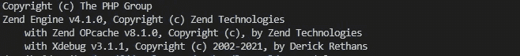
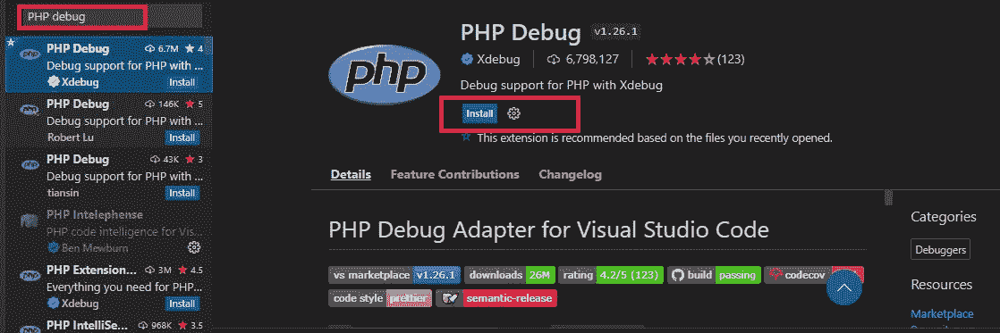
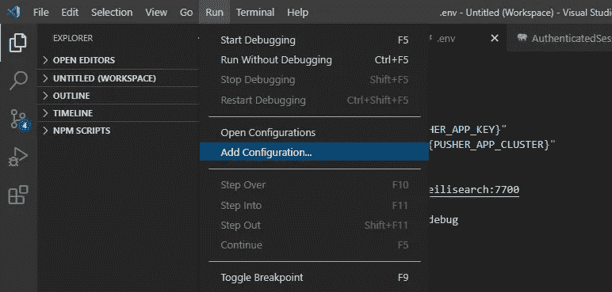
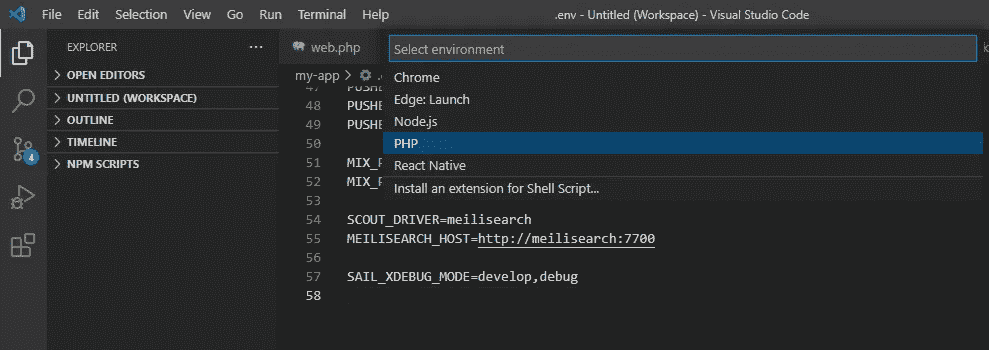
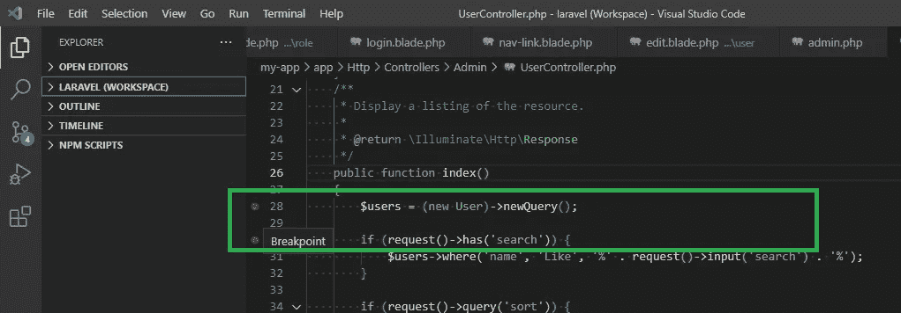
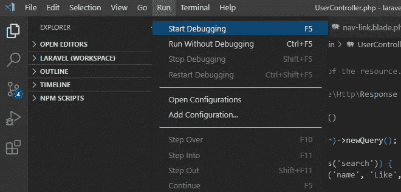
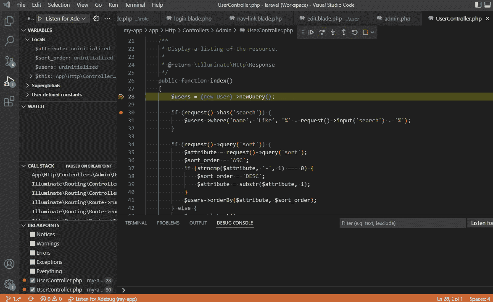
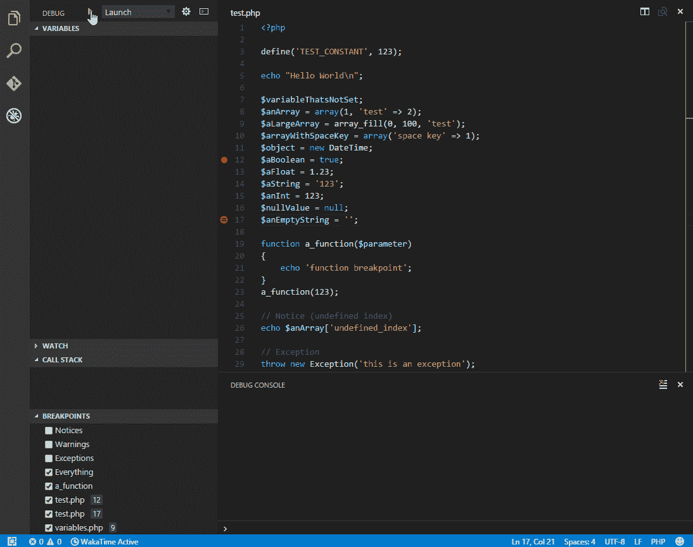

# 如何在 Laravel Sail 上启用 Xdebug 并用 VS 代码调试代码

> 原文：<https://blog.devgenius.io/how-to-enable-xdebug-on-laravel-sail-and-debugging-code-with-vs-code-872fd750b340?source=collection_archive---------0----------------------->

## 用 XDebug 和 Visual Studio 代码调试 Laravel


凯文·Ku 在 [Unsplash](https://unsplash.com?utm_source=medium&utm_medium=referral) 上的 iPhoto

如果您尚未安装 Laravel sail，您可以阅读 [Laravel Sail 安装](/laravel-create-an-admin-panel-from-scratch-part-1-installation-8c11dae7e684)并完成 Laravel Sail 设置。

为了调试 Laravel 代码，我们需要执行以下步骤。

*   1.在 Laravel Sail 中启用 Xdebug
*   2.VS 代码配置 PHP 调试
*   — 2.1 VS 代码安装 PHP 调试扩展
*   — 2.2 创建一个 launch.json 文件
*   3.开始调试

# 1.在 Laravel Sail 中启用 Xdebug

Laravel Sail Docker 默认支持 Xdebug。Xdebug 是一个流行且强大的 PHP 调试器。

打开。env 配置文件，并添加以下配置

```
SAIL_XDEBUG_MODE=develop,debug
```

放下后开始航行。环境配置更新。

```
sail down
sail up
```

使用`sail php -v`成功安装测试 Xdebug



# 2.VS 代码配置 PHP 调试

## 2.1 VS 代码安装 PHP 调试扩展

打开 VS 代码，在扩展搜索中搜索“ [PHP debug](https://marketplace.visualstudio.com/items?itemName=xdebug.php-debug) ”。



安装 PHP 调试扩展。

## 2.2 创建一个 launch.json 文件

安装后点击`Run`标签，点击`Add configuration`

**运行** > **添加配置**



之后选择`PHP`环境。VSCode 会将`launch.json`文件添加到根目录下。



复制下面的代码，并将其添加到 launch.json 文件中

```
{
    "version": "0.2.0",
    "configurations": [
        {
            "name": "Listen for Xdebug",
            "type": "php",
            "request": "launch",
            "port": 9003,
            "pathMappings": {
                "/var/www/html": "${workspaceFolder}"
            }
        }
    ]
}
```

# 3.开始调试

单击行号添加断点。



点击`Run`选项卡，选择`Start Debugging`

**运行** > **开始调试(或)F5**



在浏览器打开路径的断点处添加了控制器。在 VS 代码中，你的断点被突出显示。



使用`debug toolbar`开始调试您的代码。关于用 VS 代码调试的更多一般信息可以在[https://code.visualstudio.com/docs/editor/debugging](https://code.visualstudio.com/docs/editor/debugging)上找到。

*   继续/暂停 F5
*   跨过 F10
*   步入 F11
*   移出 Shift+F11
*   重新启动 Ctrl+Shift+F5
*   停止 Shift+F5



感谢您的阅读。

敬请关注更多内容！

*跟我来*[](https://balajidharma.medium.com/)*。*