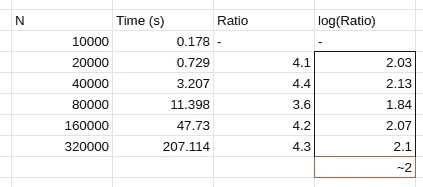

# 如何估计算法？第一部分，观察和注意

> 原文：<https://blog.devgenius.io/how-to-estimate-algorithms-part-i-watch-and-notice-e3eaa1788d6a?source=collection_archive---------20----------------------->

大家好。在本系列文章中，我将尝试总结一些关于算法估计的想法，希望能帮助您更好地理解它。

我们将尝试一套由历史上的计算机科学家开发的系统方法，比较数字，做一些数学计算，看看每一种方法的优缺点。

通常情况下，我们并不认为这样的话题会很有趣，因为那不是一堆数学和情节用来给我们生活带来的东西，但我在这里的工作是让它比你在书中所能找到的更简单😄

对于代码示例，我将使用 Java 编程语言，但我不会深入研究标准库，只会有在您认为更方便的另一种语言上可再现的基本用法。

***注意:*** *如果你熟悉增长顺序这个术语，看到下面描述的原始方法你可能会有些痛苦，但我的目标是通过历史展示这种方法的发展，我计划在该系列的最新文章中介绍更复杂和精确的估计方法。*

# 问题陈述❓

Elvis 是一名软件开发人员，他试图想出一个解决简单排序问题的方法:输入 *N* 个数字，目标是按升序对这些数字进行排序..

对于这个问题，埃尔维斯有一个解决方案，但他不知道它是好是坏。坦率地说，他不知道在这种情况下“坏”和“好”是什么意思，因为他不知道如何*测量*或**估计**他的解决方案的质量。

让我们看看下面 ***非常熟悉的*** 代码。

简单的冒泡排序实现

# 测量执行时间⏰

首先，假设 Elvis 已经用 Java 实现了他的解决方案，我们可以提出，程序的运行时间将是最合适的质量度量:如果它很慢——那么它是一个糟糕的解决方案，否则——它是一个好的解决方案。这是最重要的指标，也是最容易实现的指标。让我们试着观察跑步时间的结果。请记住，执行时间可能取决于输入元素的大小，所以让我们对代表输入数组初始大小的 *N* 的递增序列进行采样，并尝试使用该输入运行程序。

但是如果 *N* 非常大呢？那么我们可以测量执行时间吗？等待结果可能非常耗时(当然也是不可持续的)，而且它只显示了特定的 *N* 的时间。如果我们能够以某种方式推断出任何 *N、*的执行时间，不管它有多长，这将是完美的。

如果我们是科学家，第一个想法是绘制一个图并寻找可能的相关性。

嗯，结果不太有代表性。我们无法确定 *N* 和 *T(N)* 之间是什么依赖关系。因此，我们既不能将其形式化为一条定律，也不能因此预测超大 *N* 的运行时间，因为，正如它通常在繁琐的程序中发生的那样，这可能需要几个小时(对于更昂贵的算法，可能需要几年)。

# 闭嘴，直线前进📈

在实用科学中，许多量可以描述为幂律。让我们假设我们是数学家，并假设数字遵循定律:

但是定义一个 *n* 有一个小问题，因为我们不确定它如何影响一个 *x-y* 依赖关系，以及我们现在有什么幂律。

让我们做一些数学计算，对两边都应用对数。我们将使用 *log2* 来完成它，就像我们在计算机科学中使用的一样，但是实际上，在这里，我相信基数并不重要。

是啊！这样更好看，对吧？线性定律似乎更适合定义 *b* 和 *N* 来解开我们的幂律之谜。

# 可疑加倍

最快速的方法是遵循加倍的方法:我们简单地将输入大小加倍，然后测量执行时间，然后找到比率 *2N/N。*

这里最重要的是定义一个对数(比率)在哪个点会有一个稳定的值，比如+-常数(是的，这种方法非常经验性)，然后假设这是我们的目标值。

在我们的例子中，n 等于 2，这在这里实际上是有意义的，如果你看代码(如果你熟悉增长顺序的话题，你会发现，这个函数有二次复杂度😛).

好吧，假设我们的依赖关系是一个幂律——剩下的唯一事情就是猜测一个 *C* 值，当我们知道 n 和 *C* 时，计算起来相当简单。最终会有这样的东西。

我不想说这是否准确，当我们谈论任何评估时，有太多的事情需要我们考虑，比如您在哪个硬件上运行该代码，以及您使用哪个软件，等等。但至少它说了一些关于依赖函数的顺序，这让我们可以在未来做一些有用的假设。

# 总结和承认

不管怎样，那是一次相当好的经历，坦率地说，我第一次写这个话题，所以我很高兴能够深入研究并试图理解最基本的东西。

下一次我将写增长的顺序，以及人们对待算法估计有多认真，所以请继续关注！

当然，注意安全，❤️