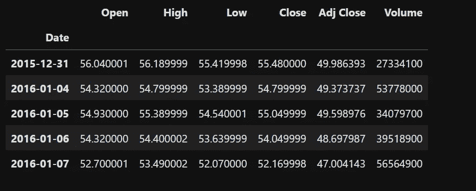
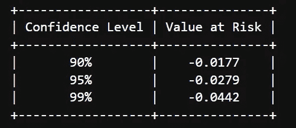

# 如何用 Python 估算股票的风险价值

> 原文：<https://blog.devgenius.io/how-to-estimate-the-value-at-risk-for-a-stock-with-python-a8d152325972?source=collection_archive---------5----------------------->

重温信心水平的好机会


AJ Yorio 来自 Unsplash 的照片

股市正在经历艰难时期。如果你投资股票，你需要能够衡量它们的风险水平。

正如我在之前的[博客文章](https://medium.com/dev-genius/how-to-calculate-the-daily-returns-and-volatility-of-a-stock-with-python-d4e1de53e53b)中所展示的，计算波动率是一个指标。让我们看看另一个:风险价值(VaR)的**。**在这篇文章中，我将重点介绍计算它的历史方法。

***免责声明*** *:* *这篇博文的目的只是为了展示如何计算一只股票的风险价值。没有任何股票的投资建议或推广。*

## 内容:

1.  [什么是风险价值(VaR)？](https://medium.com/p/a8d152325972#e5cc)
2.  [风险值计算](https://medium.com/p/a8d152325972#aee4)
3.  [VaR 限制](https://medium.com/p/a8d152325972#b24a)
4.  [结论](https://medium.com/p/a8d152325972#3969)

## 1.什么是风险价值(VaR)？

VaR 使用统计方法来计算置信水平，量化一个公司或一项投资在一段时间内的潜在损失风险。

置信度为 90%、95%或 99%。让我们看看这意味着什么:

> 如果一只股票的风险值为-5%，置信水平为 90%，这意味着根据历史价值，在给定的一天内，其损失不会超过-5%，概率为 90%。

让我们用微软股票来练习一个具体的案例吧！

## **2。风险值计算**

让我们导入我们需要的 Python 库:

```
import pandas as pd
import numpy as np
import matplotlib.pyplot as plt
import yfinance as yf
```

我们通过股票代码检索微软股票数据:

```
ticker= "msft"
msft  = yf.download(ticker, start="2016-01-01", end="2022-06-30")
msft.head()
```



输出

如之前的[博文](https://medium.com/dev-genius/how-to-calculate-the-daily-returns-and-volatility-of-a-stock-with-python-d4e1de53e53b)所示，我们来计算一下股票的日收益。

*注意:(这一次你需要使用‘Adj Close ’,因为它通过适用的分割和股息分配来调整股票的收盘价。它经常被用来分析历史收益。)*

```
msft_close = msft['Adj Close'].pct_change()
```

为了计算风险值，我们使用分位数法得出 90/95/99 %的置信水平。

```
# we sort the returns first
msft_close.sort_values(inplace=True, ascending=True)# Use quantile method
VaR_90 = msft_close.quantile(0.1).round(4) # for 90%
VaR_95 = msft_close.quantile(0.05).round(4)# for 95%
VaR_99 = msft_close.quantile(0.01).round(4)# for 99%
```

让我们用制表库的表格格式来看看结果

```
from tabulate import tabulateprint(tabulate([['90%', VaR_90], ['95%', VaR_95], ['99%', VaR_99]], headers=['Confidence Level', 'Value at Risk'],tablefmt='pretty'))
```



**99%怎么读**:微软股票单日损失不会超过-4.4%，基于其最近 6 年的历史价值，置信水平为 99%。

## 3.VaR 限制

尽管 VaR 很有趣，但它也有弱点:

*   历史数据可能会低估风险值，如果它不包含过去的危机，当面对一个实际的危机。选择观察的时间是至关重要的。
*   历史数据不能预测未来的结果

## 4.结论

我希望这篇文章能帮助你更好地理解风险价值。不要犹豫，用其他股票或案例来练习。评估一只股票没有“放之四海而皆准”的办法。不过包里有几个工具还是不错的。

我希望你喜欢阅读这篇文章！未来的文章请关注我。它激励我继续下去。

你也可以在 [LinkedIn](https://www.linkedin.com/feed/) 上找到我。