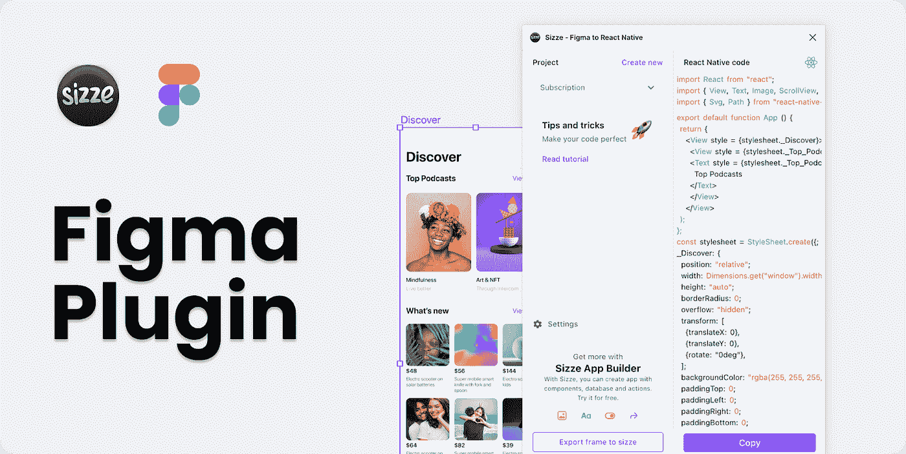

# 如何从 Figma 导出设计以反应本机代码— Sizze 插件

> 原文：<https://blog.devgenius.io/how-to-export-designs-from-figma-to-react-native-code-sizze-plugin-a253da17e8a6?source=collection_archive---------1----------------------->

**如何从 Figma 导出设计以反应本机代码— Sizze 插件**

在这篇综述中，我们将向您展示如何在不编码的情况下将 Figma 布局转化为成品。一个将现成的设计卸载到 React 本机代码中的插件将帮助我们做到这一点。

Sizze 是 Sizze.io 创建者提供的一个插件，它允许您从 Figma 交互式导出您的移动应用程序界面布局，以对本机代码做出反应，而不会丢失源文件的质量和结构。

**主要优势:**

-从设计到代码的准确转换
-代码清洁度
- Flexbox 支持
-快速实施到现有项目中

**插件特性**

自动布局

在自动布局模式下组装的所有组件都变成了易于构建动态列表和连接后端的元素。

限制

创作者已经开发了算法来适应所有应用程序屏幕的布局。通过简单地添加 constraints 属性，您可以看到使尺寸适应不同的设备是多么容易。

滚动和网格

您可以直接从原型创建动态内容。要添加动画，您只需向元素写入属性，无需任何编程即可获得结果。

出口机会

使用 Sizze 插件，您可以卸载细节丰富的 SVG 元素，还可以导出字体。

**外挂多少钱？**

该插件提供三种免费下载，无需订阅。通过订阅该插件，您还可以访问 sizze.io，在那里您可以从应用程序本身的现成模板中开发自己的设计，并从 Figma 导入现成的布局。无限下载的月费是 22 美元，还有一个 169 美元的高级计划。如果你购买一年的订阅，你会得到 20%的折扣。

**怎么用？**

你可以在 Figma 社区下载插件，或者点击 sizze.io/plugin.链接。激活插件后，会打开一个窗口，你可以在其中复制所选布局的代码。

接下来，在 expo.dev 网站上，您需要创建一个新的点心，其中需要粘贴前面复制的代码。在不同设备上检查完代码后，剩下的就是下载 zip 文件了。

卸载代码的第二种选择:进入 sizze.io 平台，在这里你也可以进行修改，检查不同设备上的适配情况，并在 React Native 中下载现成的代码。

**结论——外挂适合谁？**

该插件绝对适合所有人:新手开发者、UI 和 UX 设计师、团队和移动应用开发工作室，以加快和简化应用创建过程。无代码开发可以满足部分产品需求，节省时间和资源。即使你有足够的钱，也值得考虑没有代码的平台。他们可以帮助你更快地做出决定，测试想法，并领先对手一步。Sizze 插件让你能够在几天内创建和测试产品。

*更多内容尽在*[*blog . dev genius . io*](http://blog.devgenius.io)*。*