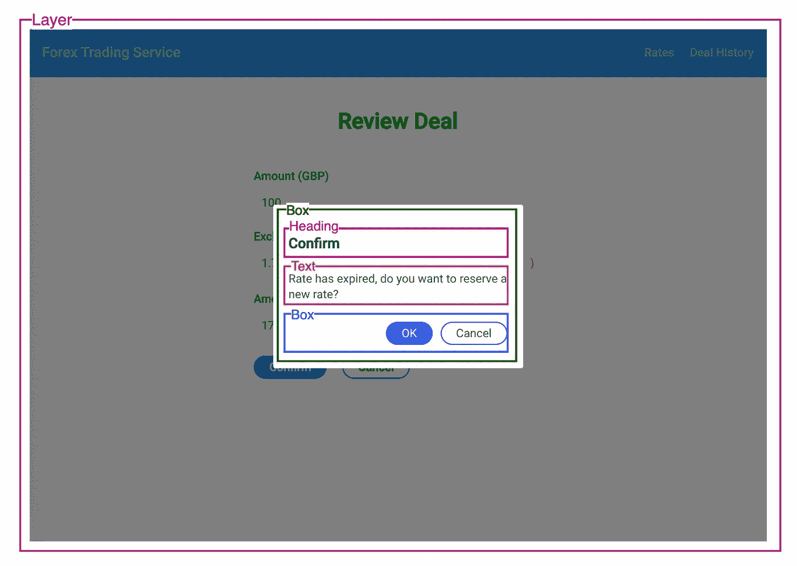

# 如何使用 React JS + Grommet 快速跟踪您的应用和网站开发

> 原文：<https://blog.devgenius.io/how-to-fast-track-your-apps-website-development-using-react-js-grommet-b54b1353a3e1?source=collection_archive---------2----------------------->

从头开始构建精彩应用程序的快速入门指南


希瑟·福特在 [Unsplash](https://unsplash.com?utm_source=medium&utm_medium=referral) 上拍摄的照片

基于组件的设计概念在前端应用程序和网站开发领域很流行。许多流行的前端框架和库，如 React JS 和 Angular，都提倡这种设计方法。要开始构建一个应用程序或网站，第一步就是将屏幕分解成组件。

事实上，许多现代应用程序共享一组常见的 UI 模式，如 Accordion、Calendar、Clock 等。如果您掌握了一个现有的开发良好的 UI 组件库，您的开发速度将会提高 10 倍，而不是重新发明轮子来自己编写这些组件。

好消息是，现在有许多阅读制作的 UI 组件库可供您使用，其中大多数是开源的，有强大的社区支持。在这篇文章中，我将向你展示如何使用一个流行的 React 组件库— **Grommet** ，你将拥有强大的工具，这样你就可以事半功倍地快速开发一个应用或网站。

# 什么是索环？为什么？

说到 React UI 组件库，有很多耳熟能详的名字比如 React bootstrap，Material UI。Grommet 引起了我的注意，因为它提供了一套全面的 UI 组件，可以满足大多数用例。此外，它提供免费的模板，以便我们使用 Sketch、Adobe XD 和 Figma 等设计工具包来创建基于其 UI 组件的设计。它有助于从 UI 设计到实际编码的无缝开发过程。它的设计系统，或者说设计指南，使得设计和开发屏幕变得更加容易

## **高度可重用的 UI 组件一览**

索环提供了许多现成的组件，可以满足大多数场景和使用情况。下面是组件截图，供您快速参考。


索环组件—布局、类型、颜色


索环组件—可视化和媒体


索环组件—控制和输入

## **设计套件的免费设计模板**

在实际编码之前，设计是至关重要的工作。如果你的设计工具包中有一套现成的组件，这项工作会变得更容易，所以你可以像在设计工具包中玩乐高积木一样构建你的设计。你可以去 [Grommet 的 GitHub](https://github.com/grommet/design-kit) 免费获取模板。


Figma 上的索环主题和组件

## **T 恤尺寸**

也许，当您试验不同的像素值时，您会发现确定正确的大小和间距非常耗时。Grommet 通过定义 t 恤尺寸来简化它，如小号、中号、大号、加大号等，因此，您可以通过混合和搭配尺寸来找到合适的尺寸。


将 t 恤尺寸应用于 UI 组件

# 用例

为了在开发中应用这些组件，我将演示如何利用 Grommet UI 组件构建一个外汇交易应用程序。

下面的屏幕流程图说明了用户从汇率显示到外汇交易完成的过程:

1.  **汇率显示** —用户的旅程从汇率显示屏开始，该显示屏显示具有卖出和买入汇率的货币对列表。
2.  **外汇交易输入** —用户可以点击按钮，输入货币交易金额。
3.  **审核价格** —就在提交交易之前，系统会保留一个价格，并在 5 秒内提示确认，到期时间。如果用户对保留的价格满意，他们可以继续或取消。如果用户在 5 秒钟内没有做出任何决定，则会显示一个对话框，询问用户是否要保留新的价格。
4.  **完成** —交易过账完成后，将显示交易历史。


外汇交易应用程序屏幕流程

# 屏幕设计

在详细介绍组件的用法之前，我们先来看看屏幕设计。屏幕布局是一个标准的布局，它由一个顶部菜单和两边留有空白的内容片段组成。


屏幕布局

## **速率显示屏**

基于屏幕布局，我们将 UI 组件放入内容片段。下面的屏幕显示了一个数据表中的货币对和汇率列表，供用户选择哪一个来创建外汇交易。


外汇交易应用程序—汇率显示屏

## **外汇交易创建屏幕**

当用户点击买入或卖出按钮时，将显示一个输入金额的屏幕。


外汇交易应用程序—交易创建屏幕

## **外汇交易审核屏幕**

根据输入的货币对和金额，系统将保留汇率并提示确认。有一个计时器显示费率到期的时间段。


外汇交易应用程序—交易审核屏幕

## **外汇交易完成画面**

用户将看到外汇交易成功过账的交易确认。


外汇交易应用程序—交易完成屏幕

## **外汇交易历史屏幕**

在用户旅程结束时，用户将看到外汇交易历史，以便对之前的外汇交易进行回顾。


外汇交易应用程序—交易历史屏幕

# 设置

## 软件包安装

要使您的应用程序能够使用索环组件，您需要安装以下软件包:

```
npm install grommet grommet-icons styled-components --save
```

接下来，将您的内容包含在`<Grommet>`中，以便能够使用它的 UI 组件，就这样。

代码片段—启用索环 UI 组件

## 布局

让所有屏幕基于相同的布局构建对于前端应用程序或网站来说至关重要，以便提供一致的数字体验。

为了创建屏幕布局，`<Grid>`组件允许你定义具有定义大小的行和列。在本例中，您可以在屏幕布局中看到顶部菜单栏和内容


带屏幕布局的速率显示屏

在 React JS 中，可以使用`<Grid>`组件定义布局。在下面的代码片段中，您可以看到菜单栏是一个`<TopMenu>`组件，后跟`<Grid>`，它为左边距、内容片段和右边距定义了 3 列。两个边距的大小都是“xsmall”，在索环主题配置中是 96px。

带有应用程序布局的 App.tsx

# 速率显示屏

外汇汇率显示屏由基础货币搜索栏和货币对表组成。每个组件都放在一个容器`<Box>`中，并且在更高的级别中有一个父容器`<Box>`。它用于管理边距、填充和放置顺序(如行或列)。`<Box>`是 Grommet 中的关键构建模块之一，您可能会在整个应用中经常用到它。


突出显示框组件的速率显示屏

代码片段—费率显示屏

## **数据表**

`<DataTable>`组件是显示数据记录列表的合适选择。您需要做的是指定标题和内容呈现的列定义、列大小、对齐方式和数据键。它支持排序和其他高级功能，如分组。

下面是如何为外汇汇率表设置表格列的示例代码。

数据表组件用法的示例代码

# 外汇交易输入屏幕

## **表单提交**

外汇输入屏幕包含一个简单的形式，有一个金额输入字段，而其他领域是只显示。下图显示了索环组件中的屏幕组件细目。Grommet 为表单域提供组件，支持表单验证、错误消息显示和表单提交。组件`<FormField>`是一个容器，它将一个字段表示为一个整体，包括标签和输入字段。


外汇交易创建屏幕—索环组件

下面是将组件翻译成源代码的代码片段:

代码片段—外汇交易创建屏幕

## **主题定制**

有时，索环默认主题中的组件样式可能不适合屏幕设计。在本例中，Grommet 的表单字段以默认的主题样式显示一条底部边框线。然而，它看起来很奇怪，我们想消除边界线。

要定制 Grommet 的主题，您可以指定定制并合并到 Grommet 的主题中。然后，您可以将它应用到`<Grommet>`组件，使其在应用程序级别有效，或者使用`<ThemeContext.Extend>` 将定制限制在屏幕级别。


索环默认主题中的表单字段

这个代码片段是一个如何在应用程序级别定制主题样式的例子。你可以先创建一个自定义的主题，然后通过设置主题属性来应用到`<Grommet>`。

代码片段—对索环应用自定义主题

# 外汇交易审查屏幕

## **倒计时定时器**

交易审核屏幕类似于输入屏幕，但它有一个倒计时定时器，指示保留的价格何时到期。`<Clock>`是一个有用的组件，因为它不仅可以显示数字和模拟格式的时间，而且还支持倒计时定时器模式。

一旦倒计时定时器到达 00:00，字体颜色将更新为状态临界颜色，以提醒用户费率已过期。

代码片段—索环时钟组件

## **对话框弹出**

为了提供更好的用户体验，将显示一个对话框，询问用户是否希望在费率到期时保留新的费率。要做到这一点，索环组件`<Layer>` 可以帮助我们在当前屏幕 UI 上创建一个对话框显示的覆盖图。



使用层组件弹出索环对话框

在下面的代码片段中，您可以看到`<Layer>`组件是基于`*showDialog*`标志有条件地呈现的，并且当停机时间计时器达到 00:00 时设置该标志。

代码片段—弹出对话框

# 外汇交易历史屏幕

最后，交易历史屏幕显示了使用`<DateInput>`组件按日期字段搜索过滤的`<DataTable>`组件中的历史交易记录列表。下面的屏幕显示了交易历史屏幕上的索环组件。


外汇交易历史屏幕—索环组件

与其他 UI 组件库类似，Grommet 提供的`<DateInput>` 组件支持日历上的日期选择。


扣环数据输入组件

代码片段显示了如何将`<DateInput>`组件应用到事务历史屏幕。

代码片段—交易历史屏幕

# 结论

毫无疑问，使用现成的用户界面组件可以大大减少开发前端应用程序和网站的工作量并缩短交付时间。索环是流行的 UI 组件库之一，它值得我们关注，因为它提供了一套全面的有用组件，并且易于学习。

此外，它是友好的用户界面/UX 设计师，因为索环团队提供了免费的模板文件，可用于大多数设计工具包。如果您掌握了这个 UI 组件库的用法，您可以在短时间内毫不费力地创建一个新的应用程序。

## GitHub 存储库

如果您有兴趣详细探索代码，您可以从这个 GitHub 存储库中找到完整的源代码。

它是一个静态应用程序，用于演示 UI 组件和屏幕流，因此没有状态管理或 API 集成。

[](https://github.com/gavinklfong/react-forex-trade-app) [## gawinklfong/reactor-forex-trade-app

### 反应 JS 中的外汇交易应用。通过在…上创建帐户，为 gawinklfong/react-forex-trade-app 开发做出贡献

github.com](https://github.com/gavinklfong/react-forex-trade-app)