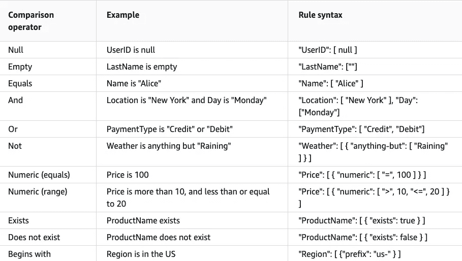
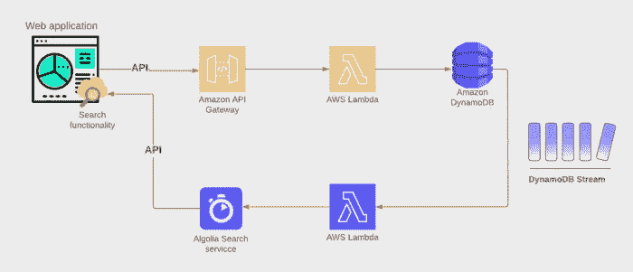
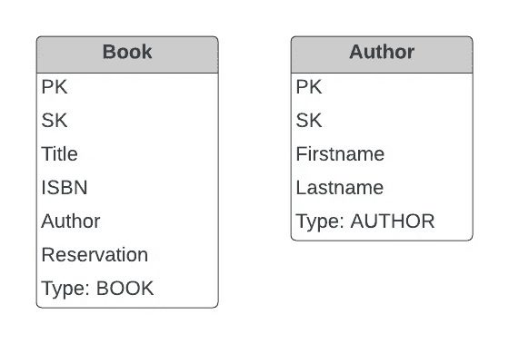
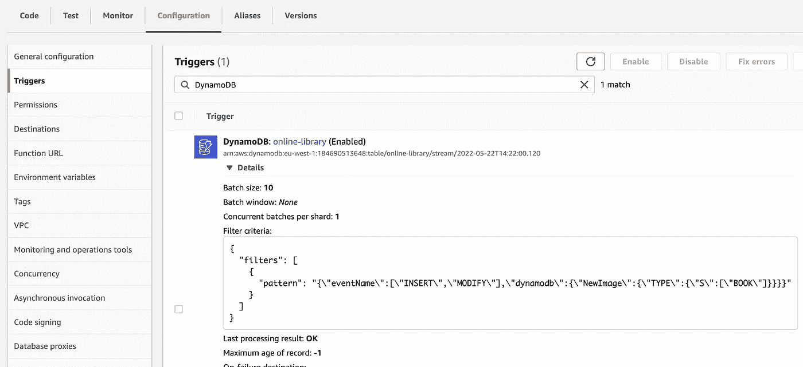

# 如何从 DynamoDB 流中过滤无服务器事件

> 原文：<https://blog.devgenius.io/how-to-filter-serverless-events-from-dynamodb-streams-c5f7c7250674?source=collection_archive---------4----------------------->

## 用过滤器模式节省 Lambda 调用的费用


泰勒·尼克斯在 [Unsplash](https://unsplash.com?utm_source=medium&utm_medium=referral) 上的照片

使用带有 DynamoDB 的[单表设计策略](/how-to-do-single-table-design-with-dynamodb-db9101a43277)可以在表内给出许多不同的实体。从这样的表格中读取事件流就像一群人用十几种不同的语言和你交谈。幸运的是，亚马逊发布了一个新功能，你可以根据 Lambda 函数的事件类型和有效负载来过滤事件。

在 Lambda 函数被触发之前过滤事件可以为您节省大量不必要的调用，并帮助您从代码中去除这种逻辑。在这个故事中，我想展示如何借助[无服务器框架](https://www.serverless.com/framework/docs/providers/aws/events/streams#setting-filter-patterns)过滤事件。

我将包含一个示例，演示如何在无服务器框架中使用过滤器模式，这是对我之前的故事的扩展，在我之前的故事中，我读取了一个 [DynamoDB 流来提供外部服务](/how-to-use-dynamodb-streams-to-feed-algolia-search-2f1de8eba64d)。

> 这是两篇文章的第 2 部分**,介绍如何使用无服务器的 DynamoDB 流。本文详细介绍了如何使用无服务器事件过滤将特定事件定向到 Lambda 函数。**
> 
> ★ [本系列的第 1 部分是关于如何使用 AWS Lambda 和 DynamoDB 流来提供辅助服务](/how-to-use-dynamodb-streams-to-feed-algolia-search-2f1de8eba64d)
> 
> ★本系列的第 2 部分着眼于如何将特定事件从 DynamoDB 流定向到 Lambda 函数。

## 事件结构

为了知道如何过滤 DynamoDB 流事件，让我们看一下事件结构:

```
{
  "eventName": "INSERT" | "MODIFY" | "REMOVE",
  "dynamodb": {
    "Keys": {...},
    "NewImage": {...},
    "OldImage": {...}
  }
}
```

根据对 DynamoDB 记录的更改，事件名称的值为“插入”、“修改”或“删除”。“*键*部分包含分区键。“旧图像”是改变前的记录，“新图像”是改变后的记录。事件中是否包含*【新图像】**【旧图像】*或两者都包含取决于您如何配置 DynamoDB 流。

## 过滤规则语法

您可以使用以下比较运算符来过滤事件:



过滤器比较运算符

参见下面的[页](https://docs.aws.amazon.com/lambda/latest/dg/invocation-eventfiltering.html#filtering-examples)了解如何应用这些运算符的一些示例。它与 Amazon EventBridge 使用的语法和规则是相同的。

## 定义过滤模式无服务器框架

[无服务器框架](https://www.serverless.com/framework/docs)在这里是你的朋友，因为它使得在 serverless.yml 配置文件中为任何作用于 DynamoDB 流事件的 lambda 函数定义过滤器模式变得非常容易。

> 无服务器框架的版本 [2.68.0](https://github.com/serverless/serverless/compare/v2.67.0...v2.68.0) 中增加了⚠️事件过滤。

serverless.yml 中的过滤器语法

您可以在 lambda 函数的 DynamoDB 流事件触发器的属性*‘filter patterns’*下添加多个过滤器模式。作为 *'eventName'* ，您可以定义以下一个或多个事件类型(插入、修改、删除)。

您可以向事件中的字段添加路径，并使用比较运算符来匹配该字段。在上面的例子中，*‘等于’*运算符用于将字段与值进行比较。当对您的项目使用[单表策略](/how-to-do-single-table-design-with-dynamodb-db9101a43277)时，记得为您将放入表中的每个实体包含一个*‘Type’*属性。这将使基于实体类型从流中过滤事件变得更加容易。

# 这个例子

读完所有这些之后，您可能希望看到一些实际应用了上述内容的代码。别担心，我会掩护你的。我将用一个例子来演示无服务器框架的事件过滤。

> 本文的完整项目可以在 Github[https://github.com/cyberworkz/examples](https://github.com/cyberworkz/examples)的 online-library-stream-filter 文件夹中找到。

在这个例子中，我们将修改在我之前关于在线图书馆服务的故事中使用的项目，使用 DynamoDB 流中的“Book”实体事件来提供外部搜索服务，从而实现图书搜索功能。为了强调这一点，我还将包括“作者”事件。



Strem 事件提供给搜索服务

“图书”和“作者”实体的数据模型可能如下所示:



数据模型

这两个实体都有一个“Type”参数来标识它们的类型。在 serverless.yml 配置文件中的以下配置向两个不同的 lambda 函数添加了一个过滤器模式，一个用于处理“Book”事件，另一个用于处理“Author”事件。

有趣的部分是“filterPatterns”属性。让我们仔细看看这个片段。

```
- eventName: [INSERT, MODIFY]              
  dynamodb:                  
    NewImage:                  
      TYPE:                    
         S: [BOOK]
```

该模式从创建(插入)或更新(修改)记录的流中过滤所有事件。此外，的“Type”属性应等于值“BOOK”。

一旦部署到 AWS 上，您就可以找到用 AWS Lambda 函数的触发器配置定义的过滤器模式。



带过滤器模式的触发器

> ⚠️并不是所有的比较运算符都能很好地将无服务器框架转换成 AWS 配置。如果你坚持使用“等于”运算符，你肯定这个模式会起作用。

# 结论

AWS 上的过滤器模式允许您过滤 DynamoDB 流事件，并将它们定向到您特定的 AWS Lambda 函数。无服务器框架使得为 Lambda 配置过滤器模式变得很容易。

使用过滤模式可以节省 Lambda 的调用次数，并保持代码简单。

# 完成的🙏

所以，这就结束了。我希望这对你的无服务器之旅有所帮助。同样，这个项目的代码可以在 Github 上找到👇[https://github.com/cyberworkz/examples](https://github.com/cyberworkz/examples)在`online-library-stream-filter`文件夹里。

# 海科·范德沙夫

*   ***如果你喜欢这个，请跟随 Serverlesscorner.com 上***[](https://serverlesscorner.com/about)****。****
*   ****爱情*** ❤️ ***阅读*** ***我的故事和其他关于媒？*** [***成为会员***](https://serverlesscorner.com/membership) ***如果你还不是会员。****
*   ****想阅读更多无服务器？报名我的*** [***月报***](https://serverlessconsulting.org/newsletter) ***📬关于无服务器技术和使用案例的启发性和深刻的故事。****