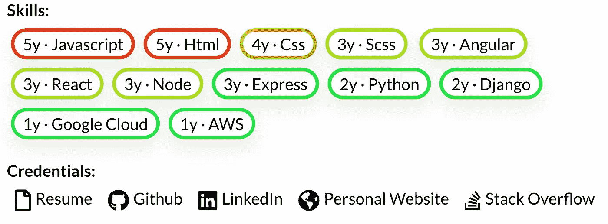
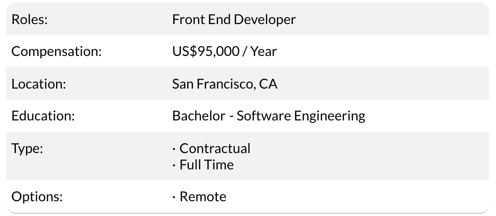
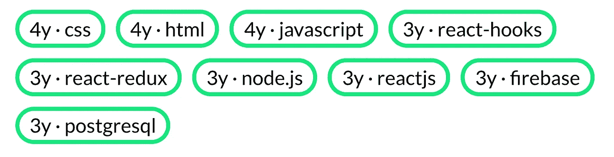
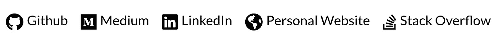

# 如何在软件行业找到工作——最简单的方法。

> 原文：<https://blog.devgenius.io/how-to-find-a-job-in-software-the-easy-way-99d13c97e014?source=collection_archive---------18----------------------->

我们都有过这样的经历:“我的简历就像我奶奶的银器一样光滑”，“我每天都在网上申请工作职位”，“我甚至回复了招聘机构的电话”，然而不知何故，失望总是会敲门。幸运的是，通过对我们的简历做一些简单的修改，并使用新的“反向求职板”*(文章的最后一部分)*我们的搜索可以很快变得富有成效…下面是方法:

## 在搜索之前

无论我们做什么，我们都会不由自主地创造期望。失望往往来自于我们的“理想场景”和现实之间的不匹配。不知何故，我们希望被选中参加面试。我们假设我们的简历会被浏览，研究，分类:左堆还是右堆。我们期待对申请的回应。如果我们真的接到电话，有时工作的描述会突然改变，或者工资范围已经被打破。或者，最初列出的闪亮的新技术堆栈只用于一个非常小的模块。

期望一点也不坏——当合理时，它们是非常好和健康的。问题是在整个过程中缺乏对这些重要因素和个人要求的沟通。当同意一份从一开始就让我们烦恼的工作合同时，我们更有可能在一年后重返就业市场。没人能猜到在你下一次职业冒险中，什么会让**你开心**。如果这些因素可以成为简历的一部分，或者从一开始就表达出来，每个人都可以节省大量的时间…谢天谢地，我们可以利用这一点。

## 现代简历的制胜法宝

我们严重高估了人们阅读我们简历的时间。如果想要的信息不能在眨眼之间提取出来，那么下一个更有条理的文档将会抢尽风头。

我们需要明确我们的目标。包括期望的薪水、工作类型、地点和期望的角色。这看起来像是一个大胆的举动，但是如果我们开诚布公地谈一谈，这些工作会立刻变得更像我们梦想中的工作。这些重要的细节不仅为谈判条件打下了良好的基础，还能防止你和雇主在重要的交易破坏因素上浪费大量时间。我们希望避免任何迟来的惊喜，尤其是在经历了严格的面试过程之后。

对话前——雇主知道我们的要求

接下来，我称之为“技能快照”。就像看照片一样，这个部分应该收集我们所有的技能和他们各自的经验。许多人力资源和技术面试官*花费大量时间从我们简历的各种工作经历中提取这些信息*。简洁地组织它给了我们一个明确的优势。专注于你想使用的技能。

“技能快照”

我们立刻明白，这个人是一个前端或全栈开发人员，对 React 情有独钟。虽然这看起来显而易见或简单，但执行这一步骤可以极大地提高评估我们技术概况的速度。另一件我们经常忘记的重要事情是展示我们的在线形象。我们在任何地方都有配置文件:中型账户、堆栈溢出、Github 库、个人网站、博客，等等。这些资产非常强大。许多团队领导或技术面试官会看一下这些。分享一个 Github 库可以让你深入了解你的编码技能、风格和质量，这是一份简历所无法解释的。

在线展示

如果我们刚刚完成了一个编码训练营，正在进行一个项目，或者参与开源，让我们向世界展示它。我们的其他档案也带来了可观的价值。它们展示了我们对工作的热情。他们展示了团队合作的品质、毅力和对我们个性的洞察。

对于简历中其他更经典的部分:工作经历、教育等。，保持事情简洁。在工作经历部分经常看到的是充满专有术语的职责和任务总结:“在公司的 ATRM 系统工作过”。这对公司内部的人来说可能意义重大，但对外部的人来说却毫无意义。除非在同一家公司申请新的职位，否则不要使用这些行话。相反，保持事情简单，以结果为导向。例如:

“改进的 **X** *(特性/问题/业务度量)*由 **Y** *(结果)*做 **Z** *(解决方案/改进/任务)*

这是根据你以前的成就展示你对公司真正价值的最好方式之一。

## 自动搜索

这部分很乏味。这就是我们花费无数时间阅读职位描述和最低要求的地方。一张接一张的表格，一个接一个的求职板，我们祈祷“这一个，就是那一个”。如果…某人或某物能为我们做这项工作会怎么样？从技术上讲，我们在简历中定义的新标准可以用来自动申请合格的工作机会。

想象一下，如果角色互换:公司向你申请——把漏斗倒过来。有了我们增强的简历，现在任何公司都可以评估他们是否能成为我们的新家。这引导我们使用这样的工具:

## 反向工作板

一群开发人员一遍又一遍地抛弃了过时的招聘广告模式和旧的简历格式，决定开发一种新工具来扭转局面。

> 我们想为自己提供一个简单的集中的地方，说:“你好，世界，我在找工作。”

到目前为止，我们在整篇文章中看到的实际上是典型的英国人简介。在这里，所有部件都组装好了:

[英国的典型工作请求](https://www.britehat.com/?utm_source=Medium&utm_medium=Article&utm_term=Find-a-job-in-software-the-easy-way&utm_content=&utm_campaign=BH-M-C)

一旦我们的工作简介被发布，我们就可以高枕无忧了。能够**满足我们要求的公司**只需点击“连接”按钮进行联系。很快，来自寻找公司的连接请求开始出现在我们的收件箱中。就这么简单。我马上想到的一个问题是:“如果我现在的雇主看到这个怎么办？!"谢天谢地，工作请求中的所有内容都是匿名的。只有当我们接受一家公司的邀请时，我们才会透露自己的私人信息。很快，我们让公司知道在什么条件下我们是可以应聘的，我们避免了目前在找工作时可能出现的任何就业尴尬。

BriteHat 背后的开发人员刚刚开始建立这个社区驱动的反向工作板。他们积极倾听社区可能提出的新功能需求。

## 结果呢

今天，我们已经建立了一套清晰的求职标准，并与潜在雇主分享。我们已经根据我们所处的时代调整了简历，并且实现了求职自动化。最后一项是行业的重要转变。许多公司都渴望得到他们想要的人才。他们经历了难以想象的重重困难才找到我们:招聘广告、过期的简历、收费过高的招聘机构、外包等等。在一开始就考虑求职者的需求和工作要求的设计中，像 BriteHat 这样的反向求职板创造了一个传统求职网站前所未有的机会。毕竟，我们不都觉得工作描述有时就像是我们应该符合的另一个模型吗？不再是了。

关于我:
我对开发者社区和他们所能取得的成就感到激动。作为社区的一员，我最棒的经历之一是在开发人员一对一的简历回顾会议中帮助编写代码。随着 BriteHat 的推出，我们希望能够触及并帮助更多的受众。如果你在简历和求职方面有任何问题或需要帮助，给我写封电子邮件，我很乐意帮忙。