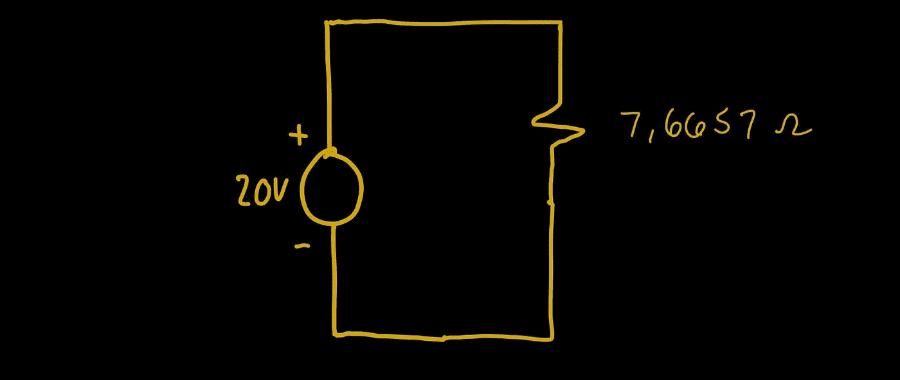

# 如何求电路中的等效电阻

> 原文：<https://blog.devgenius.io/how-to-find-equivalent-resistance-in-circuits-a071ecfff2e8?source=collection_archive---------9----------------------->

## 电路介绍

这个电路有这么多电阻？！我怎么能理解某些事情呢？！

嗯，有个东西叫**“等效电阻”**。你可以通过组合电阻来获得它。相当直接！

有两个公式可以解决我们的小问题:

让我们来解决问题吧！

让我们从底部的 2 个电阻开始。注意，我们可以从其他地方开始。

使用并联等效电阻公式，我们可以将 5 欧姆和 10 欧姆的电阻组合成一个 3，33 欧姆的电阻。

让我们继续结合 3 欧姆和 4 欧姆电阻。

通过再次使用并联电阻的公式，我们得到 1，7143 欧姆的等效电阻。

看起来好像我们有一堆串联的电阻。让我们把那些东西清理干净！

我们将 3 欧姆、1，7143 欧姆、7 欧姆以及 6 欧姆的电阻器组合在一个 17.7143 欧姆的电阻器中。

这个数字来自于第一个公式。

我们可以把 5 欧姆和 3，33 欧姆结合起来。

它们是串联的，我们得到 8，33 欧姆的单个电阻器。

我们继续将 8，33 欧姆和 17，7143 欧姆并联。

通过使用第二个公式，我们得到 56657 欧姆。

我们把 2 欧姆和 5，6657 欧姆结合起来就完成了。

我们得到了最终的电阻器。其值为 7，6657 欧姆。

这是最终的电路:

令人满意不是吗？它留给我们一个干净的电路。

基本上，这意味着一个 7，6657 欧姆的电阻相当于我们开始时所有电阻的总和。

我觉得这很有趣，你呢？

> 现在，您应该能够聚合电阻了！

 [## 谷歌地图如何找到最短路径？

### 谷歌地图使用一种叫做 Dijkstra 最短路径的算法。

medium.com](https://medium.com/dev-genius/how-does-google-maps-find-the-shortest-path-44be4b1c74c6)