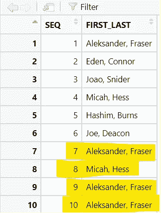
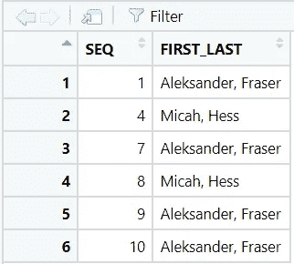
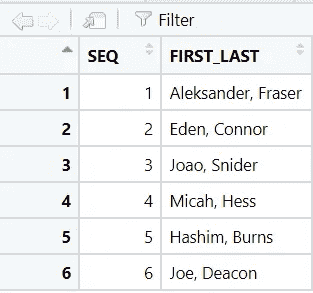

# 如何在 R 中找出重复项

> 原文：<https://blog.devgenius.io/how-to-find-out-duplicates-in-r-715d007c721a?source=collection_archive---------7----------------------->

清理数据是一项艰巨的任务，通常需要花费大量时间来提取项目所需的信息。有时，您会意识到在您的数据集中有重复多次的相同记录。这可能会导致不准确的报告。在今天的话题中，我想讨论一下在进行数据分析时，我们如何*找出 R* 中的重复项。


如何在 R 中找到重复项

让我们看看下面的样本数据集:

```
library(dplyr)
df <- data.frame(SEQ = 1:10, 
FIRST_LAST = c("Aleksander, Fraser","Eden, Connor","Joao, Snider",
"Micah, Hess","Hashim, Burns","Joe, Deacon", "Aleksander, Fraser", 
"Micah, Hess","Aleksander, Fraser","Aleksander, Fraser"))
```



我们可以看到**亚历山大、弗雷泽**和**迈卡、赫斯**是复制品。我们需要找到一个解决方案来过滤这些重复或没有重复。我们可以使用`**duplicated()**`函数找出重复项。让它成为一个功能，以便我们将来可以重用它。

```
find_up <- function(data){
  data[duplicated(data)]}
```

如果你传递一个字符串向量，它将返回一个只有重复的字符串向量。例如，`**find_up(df$FIRST_LAST)**`将返回

```
find_up(df$FIRST_LAST)
[1]"Aleksander, Fraser" "Micah, Hess" "Aleksander, Fraser" "Aleksander, Fraser"
```

返回与**SEQ**7，8，9 和 **10** 相关的记录。你还记得当我们想用`**%in%**`算子过滤时，我们需要一个矢量，对吗？`**find_up(df$FIRST_LAST)**`的结果是一个向量。通过理解，我们可以在`**filter**()`函数中应用它。

```
df2 <- df %>% 
  filter(FIRST_LAST %in% find_up(FIRST_LAST))
```



你可以在这里看到，它用一行代码返回所有的副本。现在，您可以仔细查看您的副本，然后决定是保留还是删除它们。同时，如果您想过滤掉完全不重复的名字，您可以使用**而不是**运算符，并在**后面加上** **感叹号** ( **！**)如下:

```
df2 <- df %>% 
  filter(!FIRST_LAST %in% find_up(FIRST_LAST))
```


不重复的名称

在这一步，您可以找出重复的和非重复的。您可能想知道如何才能只获得不同的/唯一的值。您可以使用`**distinct()**`来完成此操作。

```
df2 <- df %>% 
  distinct(FIRST_LAST, .keep_all = TRUE)
```



删除 R 中的重复项

记住带`**.keep_all = TRUE**`的选项，如果不指定`**.kepp_all = TRUE**`，它将只返回列 **FIRST_LAST** 。如果您指定`**.keep_all = TRUE**`，它也将保留其他列。

在数据分析中，过滤掉重复数据是非常重要的一部分。它能让你更近距离地观察你的数据。在这一步，你可以根据你的上下文来检查并决定是保留还是删除它们。

今天有一个小提示，当你处理副本的时候，我希望你会发现它很有用，不要忘记给我你的任何反馈。