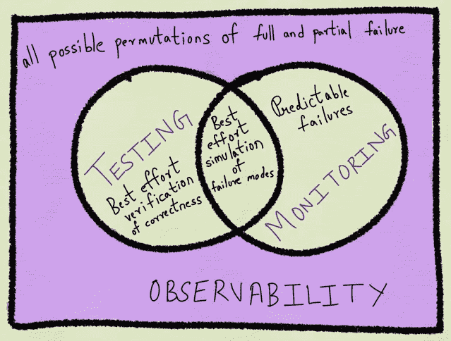
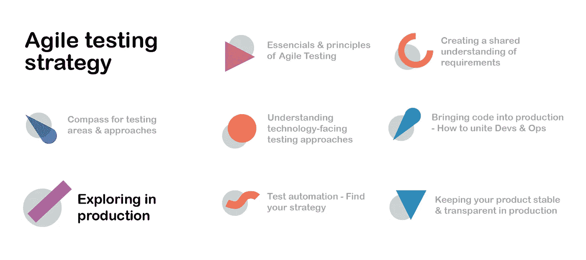

# 如何发现你的产品是否真的创造了价值

> 原文：<https://blog.devgenius.io/how-to-find-out-if-your-product-really-creates-value-829337de593f?source=collection_archive---------4----------------------->

你有没有想过测试如何帮助你发现你的产品是否给你的用户带来了预期的价值？我将给你一个非技术性的介绍，这样你可以很容易地找到适合你的团队或组织的方法。

在[系列的第二篇文章](https://medium.com/swlh/how-to-find-the-right-testing-strategy-with-an-easy-framework-9e496a8b7768)中，我给了你一个构建测试策略的指南针，即[敏捷测试象限](https://lisacrispin.com/2011/11/08/using-the-agile-testing-quadrants/)。在这篇文章中，我将向您展示第三象限的测试方法(面向业务和产品评论测试)。

# **生产中的测试**

生产中的测试听起来有点像在舞台上当着所有观众的面做声音检查。但事实并非如此。事实上，它有各种优势:

*   因为测试/试运行环境通常不能一对一地反映产品，所以在产品中进行测试可以最真实地洞察产品的行为。
*   它能从顾客那里得到快速而真实的反馈。在我的[上一篇文章](https://medium.com/dev-genius/a-non-technical-guide-about-bringing-code-to-your-customer-a51696b4d1f7)中，我描述了[特性切换](https://martinfowler.com/articles/feature-toggles.html)，它有助于向少数用户显示新特性。因此，在与所有人分享之前，您可以安全地发现您的新软件是否有效，并且是否被您的用户所认可。
*   [A/B 测试](https://www.oracle.com/cx/marketing/ab-testing/)提供独立、可靠的反馈来比较生产中的特性。这意味着向一个用户组显示一个特性变化，向另一个用户组显示另一个变化，以比较用户的行为。
*   生产中的测试显示了哪些功能被频繁使用，哪些功能可以删除。这有助于减少与用户无关的功能的维护成本。

## 探索性测试

> …同时设计和执行测试以了解系统，利用您从上一个实验中获得的见解指导下一个实验。—伊丽莎白·亨德里克森，[探索它！](https://pragprog.com/book/ehxta/explore-it)

探索性测试属于最常见的面向业务的测试。它们可以在产品中完成，也可以在软件开发生命周期的任何其他阶段完成(比如单元测试、负载测试等等)。

目标是降低风险，并获得产品以最佳方式与用户交互的信心。探索性测试属于非脚本测试。脚本测试可以是…

> [……]任何有详细的分步说明和预期结果的测试。[……]他们并没有让软件变得更好，他们只是一次又一次地遵循同样的步骤。—伊琳娜·苏普伦

正如伊琳娜·苏普伦在她的[文章](https://medium.com/xandr-tech/exploratory-testing-et-what-when-why-and-how-a29a879cb20e)中指出的，探索性测试有助于发现已知的未知以及未知的未知，这意味着你的产品存在任何你无法预测的缺陷或对用户不友好的方面。为了识别这些缺陷，提出问题和探索答案是有帮助的。不过，你想有目的地回答问题，这意味着这不是盲目地瞎猜，希望找到一个 bug，而是有意识地探索。为此，有不同的方法。

## 有目的地探索的技巧

*   **人物角色、工作和角色**:想出不同的[人物角色](https://www.innovationtraining.org/create-personas-design-thinking/)(一类客户或用户的虚构代表)以及工作描述和具体特征，从他们的角度测试你的产品或功能。一个 30 岁、时间很少的行政助理会如何使用你的产品，会有什么影响？黑客会如何处理您的应用程序？
*   **工作流程**:这种方法着眼于在使用你的产品时经常发生的普通工作流程。您只需测试那些工作流所需的相关特性。然后，您还可以考虑这种“标准流程”的变体，例如，考虑一个酒店预订流程:您搜索特定区域和日期范围内的酒店，然后选择一个房间并输入详细的地址信息。变体可以是另一个国家的地址。应用程序是否接受不同类型的邮政编码？
*   **参观**:类似于工作流方法，你寻找用户关注的特定方面。这可以是一个[主题](https://medium.com/xandr-tech/exploratory-testing-et-what-when-why-and-how-a29a879cb20e)，比如“钱”(顾客为什么要为你的产品付钱？).
    地标之旅的工作原理是思考一个产品最有特色的特征(可以与具有特色元素的城市地标相提并论，比如艾菲尔铁塔)并测试这些特征。
    为了确定正确的标志性功能或主题，与销售人员的密切接触会有所帮助，销售人员会在客户面前使用演示，展示他们最感兴趣的内容。这些特性显然应该是没有 bug 的。你可以从顾客可能提出的问题中学到很多。
*   **风险&对客户的价值**:关注风险和最重要的客户价值有助于发现隐藏的假设。问这样的问题:
    ——“可能发生的最糟糕的事情是什么？”“能发生的最好的事情是什么？”
    揭示需要探索的风险，确保具有最大商业价值的特性尽可能完美地工作。
*   **两人一组探索**:“Mob 测试”有助于揭示更多观点。一个人是司机，控制键盘，其他人通过提问、提出建议或记录学习来提供帮助。
*   **章程**:章程通过将您的测试组织成适当的时间段，帮助组织您需要获得的信息。你永远不知道你会发现什么。因此，你不应该“永远”测试一个宪章是这样建立起来的:
    **探索** <目标>
    **拥有** <资源>
    **发掘** <对某人有价值的信息>

    举例:
    **探索**一个游戏(如棋盘游戏)作为朱迪(一个孩子)
    **拥有**她所有的精力、意想不到的动作和力量
    朱迪是具有特定属性(如年龄、性格等)的人物角色。)从孩子的角度帮助测试游戏。

无论你选择哪种方式，不要过多考虑第一次包机或旅游。从做开始，边做边学。一轮又一轮，你可以适应学习。

## 监控和可观察性

除了非脚本测试，比如探索性测试，还有一些方法可以通过更具分析性的方式来观察系统的行为。监控和可观察性是生产测试的基本方法。

**监控**是你的安全网。[用于基于症状的预警。](https://medium.com/@copyconstruct/monitoring-and-observability-8417d1952e1c)这意味着它会提醒并帮助澄清错误的影响及其原因。有些失败你可能无法完全避免。但你可以确保他们一出现你就知道了。团队可以为某些类型的错误或超出错误限制设置警报，例如，当“503 错误”(服务不可用)的数量平均超过 10%时发布警报。像这样，错误可能仍然会发生，但是您会更早地发现它，并且可以做出适当的反应。根据经验，尽量保持监控指标的数量较少([最好在 3 到 7 个](https://medium.com/@copyconstruct/monitoring-and-observability-8417d1952e1c))之间。否则，您将花费更多的精力来维护度量标准，而不是从它们给你的信息中获益。

**可观察性**描述了记录生产代码中每个事件的行为，通过不同种类的度量和跟踪来分析数据，从而了解系统的使用情况。它比单独的监测更全面，更有针对性。目的是更好地了解您的系统是如何被使用的。就当是实验室日记吧。研究者记录他/她做的每一件事。当期望的结果出现时，文档有助于了解导致该结果的确切操作。

此外，可观察性有助于识别不寻常的模式。可以更早的识别风险。它是一种工具辅助的探索性测试，适用于调试。

因此，当用户报告错误时，可观察性也会有所帮助。通过分析用户与系统交互的日志数据并寻找不正确的系统反应，可以更快地识别错误，从而减少恢复时间(修复错误的时间)。

尽管观察和监控发生在部署之后，但是在编写代码之前记住这一点是很重要的。团队应该考虑他们以后想要测量什么，以测试产品、特性或故事是否做了它应该做的，并且交付了价值。在任务级别，代码应该启用自动测试或监控工具。所以不要说这个太晚了！

测试、监控和观察齐头并进，以最大化代码质量和最小化风险。由于 Cindy Sridharan 已经将此包含在一个图形中，我也想与您分享它。

[辛迪·斯里达哈兰的](https://medium.com/@copyconstruct) [测试、监控和可观察性](https://medium.com/@copyconstruct/monitoring-and-observability-8417d1952e1c)

既然您已经知道如何在将产品部署到生产环境之后测试产品的功能，那么还有最后一个测试象限可以帮助您确保产品的技术质量。你如何确保你的产品即使在流量很大的情况下也是稳定的？你如何保护它免受黑客攻击？在下一篇文章中，我将向您介绍那些重要的非功能性质量属性，它们往往被遗忘，但却是高质量软件的决定性部分。

# 参考

*   [Oracle 进行的 A/B 测试](https://www.oracle.com/cx/marketing/ab-testing/)
*   [伊丽莎白·亨德里克森的探索性测试](https://pragprog.com/titles/ehxta/explore-it/)
*   [伊琳娜·苏普伦的探索性测试](https://medium.com/xandr-tech/exploratory-testing-et-what-when-why-and-how-a29a879cb20e)
*   [功能切换由马丁·福勒](https://martinfowler.com/articles/feature-toggles.html)
*   [系列文章的主要来源:敏捷测试概要:Janet Gregory 和 Lisa Crispin 的简介](https://www.goodreads.com/book/show/48516589-agile-testing-condensed)
*   [Cindy Sridharan 的监测和可观察性](https://medium.com/@copyconstruct/monitoring-and-observability-8417d1952e1c)
*   [通过创新培养人物角色](https://www.innovationtraining.org/create-personas-design-thinking/)
*   [敏捷测试象限](https://lisacrispin.com/2011/11/08/using-the-agile-testing-quadrants/)

# 系列文章

敏捷测试策略——图片作者 [Alexandra Oliveira](https://www.linkedin.com/in/aoliveira11/)

*   [第 1 篇:每个人都能理解的敏捷软件测试要点指南](https://medium.com/@lautenbacheralexa/a-guide-through-the-essentials-of-agile-software-testing-that-everyone-can-understand-789999c89585)
*   第二篇文章:如何用一个简单的框架找到正确的测试策略
*   [第 3 篇:你成功测试的超能力:创造共同的理解](https://medium.com/swlh/your-superpower-for-successful-testing-creating-a-shared-understanding-61d6d95c7570)
*   第 4 篇:关于单元和集成测试你需要知道的一切
*   [第 5 篇:](https://medium.com/dev-genius/a-non-technical-guide-about-bringing-code-to-your-customer-a51696b4d1f7) [关于向客户提供代码的非技术性指南](https://medium.com/dev-genius/a-non-technical-guide-about-bringing-code-to-your-customer-a51696b4d1f7?source=your_stories_page-------------------------------------)
*   [第六条:如何发现自己的产品是否真的创造了价值](https://medium.com/dev-genius/how-to-find-out-if-your-product-really-creates-value-829337de593f?source=your_stories_page-------------------------------------)

# 关于“敏捷软件测试——像我这样的非技术人员的见解”系列文章

在这些孤立的时期，我抓住机会学习了更多关于软件测试的知识。如果没有技术背景，这可能相当具有挑战性。因此，我读了 Janet Gregory 和 Lisa Crispin 写的书 [*【敏捷测试概要:简介】*](https://www.goodreads.com/book/show/48516589-agile-testing-condensed) *，并仔细阅读了书中描述的内容。为了让你更容易快速获得最重要的见解，我总结了我从这本书和一些其他来源学到的东西，并希望在一系列短文中与你分享。它们是按照产品开发阶段组织的，你可以一篇一篇地阅读以获得一个整体的概述，也可以选择你最感兴趣的主题。我相信这将对你有所帮助，因为它帮助我在没有技术背景的情况下对测试世界有了更多的了解。*