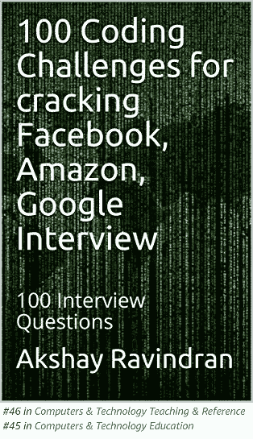
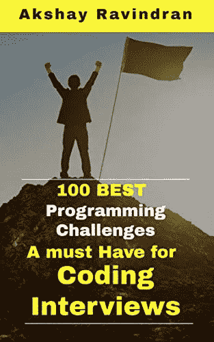

# 如何求所有奇数长度子数组的和？(滑动窗口方法)

> 原文：<https://blog.devgenius.io/how-to-find-sum-of-all-odd-length-subarrays-sliding-window-approach-33cee45923a1?source=collection_archive---------3----------------------->

## 第 54 天–100 天到 LinkedIn、雅虎、甲骨文


图片来自[皮克斯拜](https://pixabay.com/?utm_source=link-attribution&utm_medium=referral&utm_campaign=image&utm_content=4768679)的[菲利普萨尔](https://pixabay.com/users/philippsaal-8486910/?utm_source=link-attribution&utm_medium=referral&utm_campaign=image&utm_content=4768679)

# 介绍

嘿，伙计们，今天是领英挑战 100 天的第 54 天。

[](https://www.amazon.com/gp/product/B081969QH5/ref=as_li_tl?ie=UTF8&camp=1789&creative=9325&creativeASIN=B081969QH5&linkCode=as2&tag=houseofcode0c-20&linkId=b31509b40068fd3ba7741cdff726083a)

Kindle 阅读器[免费](https://www.amazon.com/gp/product/B081969QH5/ref=as_li_tl?ie=UTF8&camp=1789&creative=9325&creativeASIN=B081969QH5&linkCode=as2&tag=houseofcode0c-20&linkId=b31509b40068fd3ba7741cdff726083a)

如果你在准备面试。即使你已经在工作中安顿下来，让自己了解最新的面试问题对你的职业发展是至关重要的。从**这里**开始你的**准备**！

上个月，我一直在研究这些公司的常见问题。我已经收集了这些问题中的 100 个，我不能保证你会在面试中得到这些问题，但我相信这些“面试问题”中的大多数都有相似的逻辑，并且从这些挑战中运用了相同的思维方式。

在我们进入第一个问题之前，如果你想知道我为什么选择 LinkedIn、雅虎和甲骨文而不是 FAANG，是因为我已经完成了一项挑战[重点是亚马逊和脸书的面试](https://medium.com/javarevisited/100-days-to-amazon-day-1-b9e07228f079)。

# 新的一天，新的力量，新的想法

# 第 54 天—所有奇数长度子阵列的总和🏁

# 目的

给定一个正整数数组`arr`，计算所有可能的奇数长度子数组的和。

子数组是数组的连续子序列。

返回 `arr`的所有奇数长度子数组之和*。*

# 例子

```
**Input:** arr = [1,4,2,5,3]
**Output:** 58
**Explanation:** The odd-length subarrays of arr and their sums are:
[1] = 1
[4] = 4
[2] = 2
[5] = 5
[3] = 3
[1,4,2] = 7
[4,2,5] = 11
[2,5,3] = 10
[1,4,2,5,3] = 15
If we add all these together we get 1 + 4 + 2 + 5 + 3 + 7 + 11 + 10 + 15 = 58
```

*关注**[***代码之家***](https://medium.com/@akshay_ravindran)***s****了解编程面试世界最新动态。**

# *密码*

*作者:[阿克谢·拉文德兰](https://www.linkedin.com/in/akshay-ravindran-096)*

# *算法*

*   *这个问题是巩固你在**滑动窗口方法**上解决问题的基础的好方法。*
*   *你需要用奇数窗口遍历整个数组。1,3,5..等等*
*   *首先需要设置这个交替的窗口大小，然后遍历每个窗口的子数组。*
*   *这就是 I 和 j 发挥作用的地方，I，j 用于遍历每个子数组窗口。*
*   *每次访问特定元素时，将每个元素添加到结果变量中。*
*   *在遍历结束时返回总值。*

# *进一步阅读*

*[4 个非常有用的面试链表技巧](https://medium.com/javarevisited/4-incredibly-useful-linked-list-tips-for-interview-79d80a29f8fc?source=your_stories_page---------------------------)
[亚马逊 SDE 25 大面试问题](https://medium.com/javarevisited/top-25-amazon-sde-interview-questions-cfe0ef70ba9e?source=your_stories_page---------------------------)
[你以为你真的了解斐波那契数列吗？](https://medium.com/javarevisited/are-you-making-these-fibonacci-number-mistakes-5e3cbedd367e?source=your_stories_page---------------------------)
[用 C 编程解决 9 个最佳字符串问题](https://medium.com/@akshay_ravindran/9-best-strings-problem-solved-using-c-5e2a1d373fc2?source=your_stories_page---------------------------)
[一个人不简单地解决 50 个黑客等级挑战](https://medium.com/javarevisited/top-50-coding-challenges-in-hacker-rank-3d79c181528?source=your_stories_page---------------------------)*

# *线的尽头*

*你现在已经到了这篇文章的结尾。谢谢你阅读它。祝你编程面试好运！*

*如果你在面试中遇到这些问题。请在下面的评论区分享它。我会很高兴读到它们。*

# *[二叉树的终极指南](https://medium.com/javarevisited/the-ultimate-guide-to-binary-trees-47112269e6fc)*

*[](https://medium.com/javarevisited/the-ultimate-guide-to-binary-trees-47112269e6fc) [## 二叉树的最终指南

### 任何你必须知道的关于二叉树的事情！

medium.com](https://medium.com/javarevisited/the-ultimate-guide-to-binary-trees-47112269e6fc) 

当我们发布新的编码挑战时，不要忘记点击**关注 button✅** 来接收更新。告诉我们你是如何解决这个问题的。🔥我们会很高兴阅读它们。❤:我们可以在一篇博文中介绍你的方法。

> *想成为 java 编程中的佼佼者？*



已经解决的 **100 个 Java(面试)编程问题**汇编。**(黑客等级)🐱‍💻。**这是完全**免费的**🆓如果你订阅了亚马逊 kindle。


作者:[阿克谢·拉文德兰](https://www.linkedin.com/in/akshay-ravindran-096)*