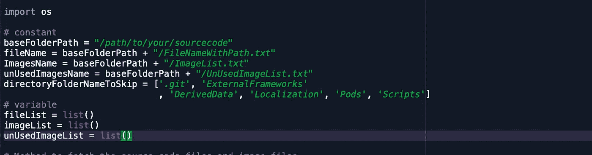
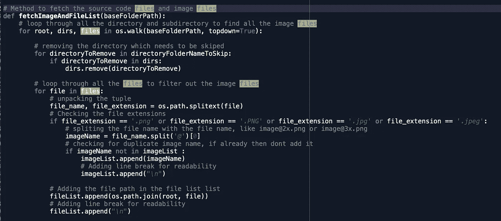
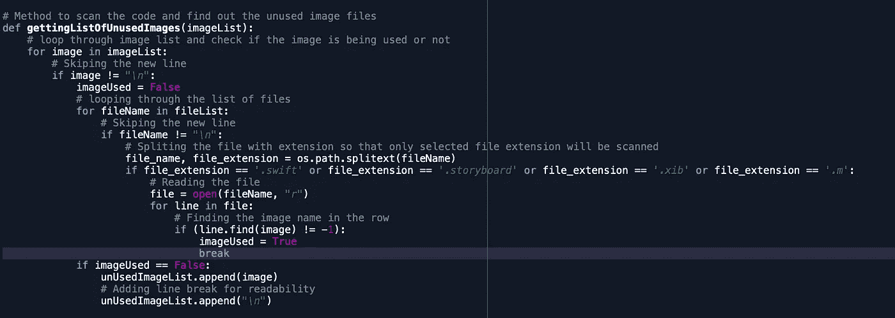
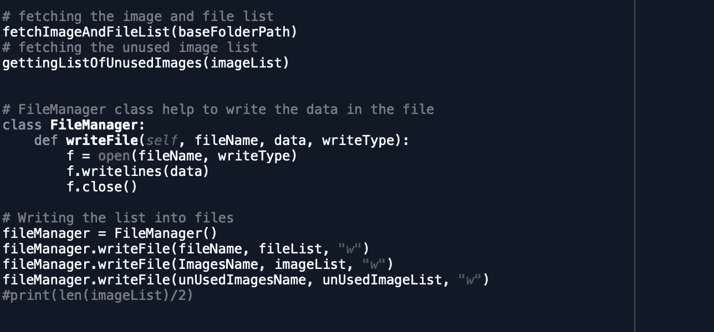

# 如何在您的 iOS 代码中找到未使用的图像

> 原文：<https://blog.devgenius.io/how-to-find-unused-images-in-your-ios-code-88164b346135?source=collection_archive---------21----------------------->

扫描未使用的图像

随着应用功能的增长，源代码也在增长。这带来了新的挑战，比如未使用的类文件、死代码、未使用的方法、未使用的图像等等。这也会影响应用程序的大小、编译时间和性能。找出未使用的资源是非常重要的。

今天我们将关注我们通常想要避免的一个问题——未使用的图像

有很多方法可以找出你的源代码中没有使用的图片，比如 1)通过一些工具扫描源代码

2)手动检查

3)编写您自己的脚本，该脚本将检查您的源代码并找出未使用的图像

我们将专注于编写我们自己的 python 脚本，该脚本将逐行扫描代码，找出未使用的图像。

这个脚本将需要源代码的位置，并生成以下 3 个文件

**输入数据**

1.  要扫描代码的源代码文件夹的绝对路径。
2.  要跳过列表的文件夹(任何添加到此列表的文件夹都将被扫描)

**输出数据**

1.  **UnUsedImageList.txt** —这是给你未使用的图像的文件
2.  ImageList.txt —这将列出源代码文件夹中的所有图像(已用/未用)
3.  **FileNameWithPath.txt** —该文件将包含源代码中所有可用文件的列表(可能有助于查看所有具有绝对路径的文件)

# Python 脚本

**定义常量&变量**

变量和常数

*   **baseFolderPath** —传递源代码的路径
*   **directory foldernametoskip**—您想跳过扫描的所有文件夹的列表

**获取所有图像文件和源文件**

获取图像和源文件

*   这个方法将获取所有的源代码文件和图像文件。
*   跳过扫描列表中的文件夹

**扫码找出未使用的图像**

扫描代码

*   这种方法将扫描每一个源代码文件，并找到图像的使用

**将数据写入文件**

方法调用和文件操作

*   这里我们调用上面的方法
*   将所有数据写入 3 个文件，所有图像文件，带有绝对路径的源代码和未使用的图像文件

# **完整的 Python 脚本**

[https://github . com/nileshrkdf/Scripts/tree/master/Unused-Images-in-iOS-code](https://github.com/nileshrkdf/Scripts/tree/master/Unused-Images-in-iOS-code)

# 需要牢记的事情

1.  在删除未使用的图像之前，交叉使用它们总是一个好主意。
2.  如果 image-name 与变量名匹配，那么脚本可能会认为这是对 image 的有效使用，并将该图像视为已使用过的图像，即使它可能不会在代码中的任何地方使用。但是如果遵循命名约定，那么这是可以避免的

# **其他有用的资源**

*   **通过对话流程启用语音支持:**https://www.youtube.com/playlist?[list = pltrhdhavoeizohzegc GL 1 hpojqpf 0 AAV 2d](https://www.youtube.com/playlist?list=PLTRHDhavoEIZoHzecGl1hpOJqpf0aAv2d)