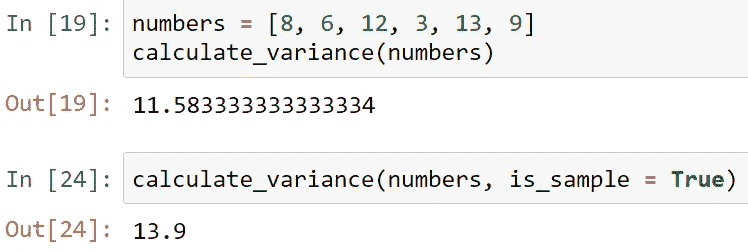
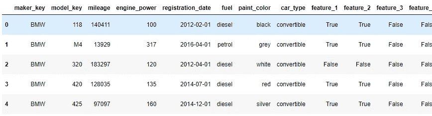
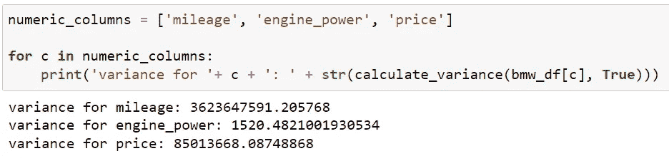
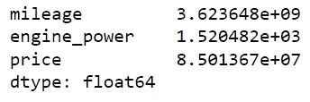

# 如何使用 Python 计算方差

> 原文：<https://blog.devgenius.io/how-to-find-variance-using-python-999ec6883842?source=collection_archive---------7----------------------->

## 了解如何使用 Python 计算方差以及如何理解统计数据


在 [Unsplash](https://unsplash.com?utm_source=medium&utm_medium=referral) 上拍摄的 [ThisisEngineering RAEng](https://unsplash.com/@thisisengineering?utm_source=medium&utm_medium=referral)

# 用于数据分析的统计

方差是数据分析和机器学习中使用的一种强大的统计数据。它是与极差、四分位距()和标准差一起衡量变异性的四个主要指标之一。了解方差非常重要，因为它使您能够深入了解数据的分布情况，并可用于比较样本组中的差异或识别重要的建模特征。方差也用于机器学习中，以了解由于使用不同的训练数据样本而导致的模型性能的变化。

理解方差很重要，使用 Python 计算方差很容易。在深入 Python 代码之前，我将首先解释什么是方差以及如何计算方差。在本教程结束时，您将更好地理解为什么方差是一个重要的统计量，以及使用 Python 计算方差的几种方法。

# 什么是方差？

方差是衡量离差的统计量。低方差表示值通常相似，并且与平均值相差不大，而高方差表示值与平均值相差较大。您可以在样本集或整个总体上使用方差，因为计算会考虑给定集中的所有数据点。虽然当您查看样本与总体时，计算略有不同，但是您可以将方差计算为平均值的平方差的平均值。

由于方差是一个平方值，与标准差等其他可变性度量相比，它可能很难解释。不管怎样，回顾差异是有帮助的；这样做可以让你更容易决定对你的数据使用哪些统计测试。根据统计测试，样本间的不均匀差异可能会使[结果产生偏差](https://builtin.com/data-science/skewed-data)或[结果产生偏差](https://builtin.com/data-science/bias-variance-tradeoff)。

应用方差的一种流行的[统计测试](https://builtin.com/data-science/t-test-vs-chi-square)被称为方差分析(ANOVA)测试。当分析分类自变量和数量因变量时，ANOVA 检验用于衡量任何组均值是否彼此显著不同。例如，假设你想分析社交媒体的使用是否会影响睡眠时间。你可以将社交媒体的使用分为不同的类别，如*低使用*、*中使用*和*高使用*，然后进行方差分析测试，以衡量组均值之间是否存在统计差异。测试可以显示结果是由群体差异还是个体差异来解释。

# 你如何计算方差？

根据数据集是整个总体还是总体的一个样本，计算数据集的方差会有所不同。

计算总体方差的公式如下所示:

> **σ**=∑(xᵢ**—μ)**t14】/n

## 公式的解释:

σ =总体方差
σ=总和……
*χ*ᵢ*=每个值
μ =总体均值
*ν*=总体中值的个数*

*使用一个数字范围示例，让我们一步一步地完成计算:*

## *数字范围示例:*

*8, 6, 12, 3, 13, 9*

## *求总体平均值(μ):*

*(8+6+12+3+13+9)/6
= 51/6
=**8.5***

## *通过从每个值中减去平均值来计算与平均值的偏差:*

*8–8.5 =**-0.5**-6–8.5 =**-2.5
-12–8.5 =**3.5**
3–8.5 =**-5.5**-5.5
13–8.5 =**4.5**
9–8.5 =**0.5*****

## *计算每个偏差的平方，得到一个正数:*

*-0.5 =**0.25**
-2.5 =**6.25**
3.5 =**12.25**
-5.5 =**30.25**
4.5 =**20.25**
0.5 =**0.25***

## *对平方值求和:*

*0.25+6.25+12.25+30.25+20.25+0.25
=**69.5***

## *将平方和除以 N 或 n-1*

*因为我们处理的是整个人口，所以我们将除以 n。如果我们处理的是人口样本，我们将除以 n-1。*

*69.5/6 = **11.583***

*我们做到了！我们人口的方差是 11.583*

## *计算样本方差时为什么用 n-1？*

*将 n-1 应用到公式中称为[贝塞尔修正](https://en.wikipedia.org/wiki/Bessel%27s_correction)，以弗里德里希·贝塞尔命名。使用样本时，我们需要计算总体的估计方差。如果我们对样本使用 N 而不是 n-1，估计会有偏差，可能低估了总体方差。使用 n-1 会使方差估计值变大，高估样本的可变性，从而减少偏差。*

*让我们重新计算方差，假设这些值来自一个样本:*

*69.5/(6–1)
= 69.5/5
=**13.9***

*我们可以看到，方差更大！*

# *使用 Python 计算方差*

*现在我们已经手工完成了计算，我们可以看到，对于一大组值来说，完成计算将是非常繁琐的。幸运的是，Python 可以轻松处理非常大数据的计算。我们将探索使用 Python 的两种方法:*

*   *写我们自己的方差计算函数。*
*   *使用熊猫内置功能。*

## *编写方差函数*

*当我们开始编写计算方差的函数时，回想一下我们手工计算时所采取的步骤。我们希望该函数接受两个参数:*

*   ***人口**这是一个数字数组。*
*   ***is_sample** 是一个布尔值，它根据我们正在处理的是样本还是总体来改变计算。*

*首先定义接受两个参数的函数:*

```
*def calculate_variance(population, is_sample = False):*
```

*接下来，添加计算总体平均值的逻辑:*

```
*#calculate the mean
    mean = (sum(population) / len(population))*
```

*计算平均值后，找出每个值与平均值的差异。您可以使用[列表理解](https://builtin.com/data-science/nested-list-comprehension-python)在一行中完成此操作。：*

```
*#calculate differences
    diff = [(v - mean) for v in population]*
```

*接下来，求差的平方并求和:*

```
*#Square differences and sum
    sqr_diff = [d**2 for d in diff]
    sum_sqr_diff = sum(sqr_diff)*
```

*最后，计算方差。使用 *If/Else* 语句，我们可以利用 **is_sample** 参数。如果 **is_sample** 为真，使用( **n-1** )计算方差。如果为假(默认)，使用 **N** :*

```
*#calculate variance
    if is_sample == True:
        variance = sum_sqr_diff/(len(population) - 1)
    else:
        variance = sum_sqr_diff/(len(population))

    return variance*
```

*完整的 **calculate_variance** 函数如下所示:*

```
*def calculate_variance(population, is_sample = False):
    #calculate the mean
    mean = (sum(population) / len(population))

    #calculate differences
    diff = [(v - mean) for v in population]

    #Square differences and sum
    sqr_diff = [d**2 for d in diff]

    #sum squared differences
    sum_sqr_diff = sum(sqr_diff)

    #calculate variance
    if is_sample == True:
        variance = sum_sqr_diff/(len(population) - 1)
    else:
        variance = sum_sqr_diff/(len(population))

    return variance*
```

*我们可以用手工处理的一系列数字来测试它:*

**

*测试 calculate_variance 函数*

# *使用 Pandas 库查找差异*

*虽然我们可以用不到 10 行代码编写一个函数来计算方差，但是有一种更简单的方法来计算方差。使用 pandas 库只需一行代码就可以完成！让我们加载一些数据，并通过一个真实的例子来寻找方差。*

## *加载示例数据*

*熊猫的例子使用了来自 Kaggle 的[宝马价格挑战](https://www.kaggle.com/datasets/danielkyrka/bmw-pricing-challenge?resource=download)数据集，可以免费下载。首先导入 Pandas 库，然后将 CSV 文件读入 Pandas 数据框:*

```
*#import dependencies
import pandas as pd#read csv file into dataframe
bmw_df = bmw_df = pd.read_csv("bmw_pricing_challenge.csv")*
```

*我们可以计算数据集中的行数，并显示前 5 行，以确保所有内容都正确加载:*

```
*#print row count
print(len(bmw_df))
#4843 rows#verify the dataframe is as expected
bmw_df.head()*
```

**

*使用 bmw_df.head()显示第一行*

## *寻找宝马数据的方差*

*由于 BMW 数据集有 4843 行，手工计算并不有趣。相反，我们可以简单地将数据帧中的列插入到我们的 **calculate_variance** 函数中，并返回方差。让我们找出数字列*里程*、*发动机功率*和*价格*的方差:*

**

*bmw 数据框架中数字列的方差*

## *使用熊猫 var()函数*

*万一我们忘记了方差的计算并且不能编写自己的函数，pandas 有一个名为 **var()** 的内置函数来计算方差。默认情况下，它假设一个样本总体，并在计算中使用*n-1*；但是，可以通过传入 ***ddof=0*** 参数来调整计算。*

```
*bmw_df[['mileage', 'engine_power', 'price']].var()*
```

**

*熊猫 var()函数*

*正如我们所看到的， **Var()** 函数与我们的 **calculate_variance** 函数**、**产生的值相匹配，并且只有一行代码。回顾结果，我们可以看到*里程* 具有很高的方差，这意味着这些值往往与平均值相差很大。这是有道理的，因为一个人需要驾驶的距离受到许多因素的影响。相比之下，*发动机 _ 功率*的方差较小，表明这些值与平均值相差不大。*

# *包扎*

*理解方差可能是数据分析和机器学习的一个重要部分，因为你可以用它来评估群体差异。方差也会影响哪些统计测试可以帮助我们做出数据驱动的决策。高方差意味着数值与平均值相差很大，而低方差意味着数值与平均值相差不大。如果我们有一小组值，只需五个步骤就可以手工计算方差。对于大型数据集，我们看到了使用 Python 和 Pandas 计算方差是多么简单。Pandas 中的`Var()`函数只用一行代码就计算出了数据框中数值列的方差，非常方便！*

***本文原写为**[](https://builtin.com/data-science/how-to-find-the-variance)****。*****

***[**内置于**](https://builtin.com/) **是创业公司和科技公司的在线社区。查找创业职位、科技新闻和事件。*****

# ***谢谢大家！***

*   ****如果你喜欢这个，* [*在 Medium 上关注我*](https://medium.com/@erickleppen) *了解更多****
*   ***[*通过订阅*](https://erickleppen.medium.com/membership) 获得完全访问权限并帮助支持我的内容***
*   ****我们连线上*[*LinkedIn*](https://www.linkedin.com/in/erickleppen01/)***
*   ****用 Python 分析数据？查看我的* [*网站*](https://pythondashboards.com/)***

***[**—埃里克·克莱本**](http://pythondashboards.com/)***