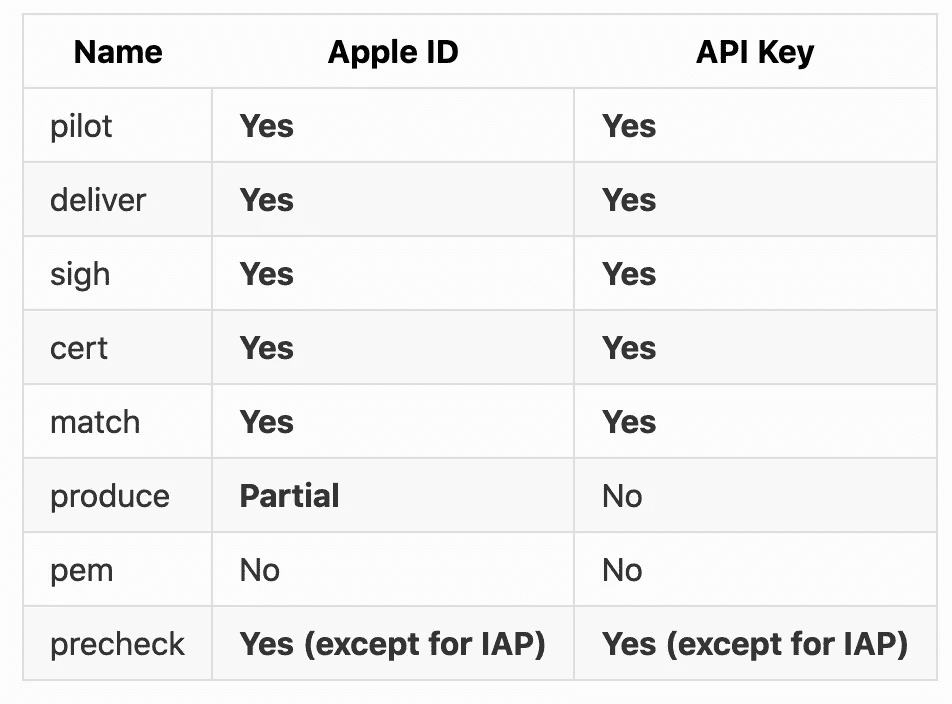
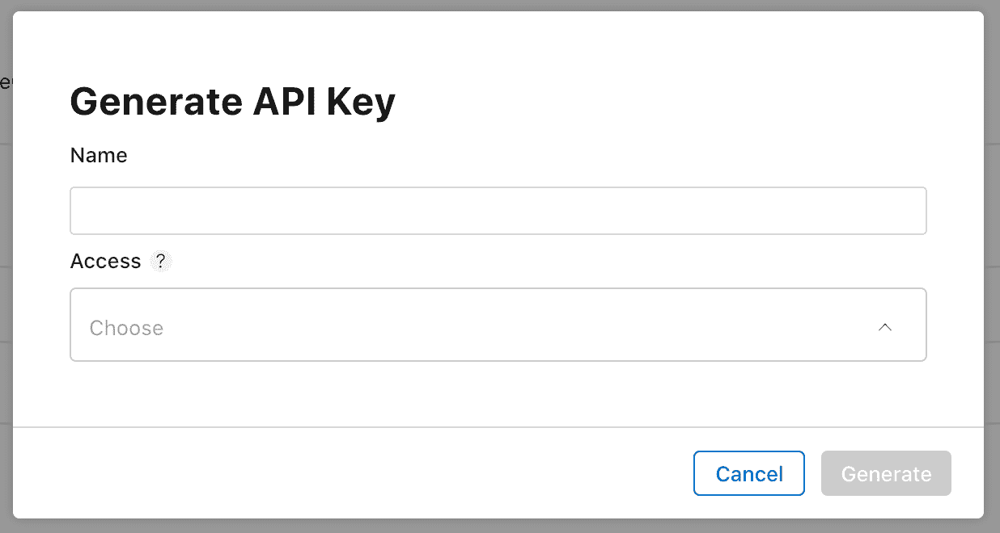

# 如何修复你的 CI 避免苹果的 2FA

> 原文：<https://blog.devgenius.io/how-to-fix-your-ci-to-avoid-apple-2fa-e1b101555dc1?source=collection_archive---------1----------------------->

## 快速简便地将通过浪子设置的配置项迁移到 Appstore Connect API


照片由 [Fotis Fotopoulos](https://unsplash.com/@ffstop?utm_source=medium&utm_medium=referral) 在 [Unsplash](https://unsplash.com?utm_source=medium&utm_medium=referral) 上拍摄

# 苹果 2FA

如果你们还记得，**2019 年 2 月 20 日**，苹果宣布了 2FA 消息

> 为了使帐户更加安全，从 2019 年 2 月 27 日开始，在开发者计划中担任帐户持有人角色的开发者需要启用双因素身份验证来登录他们的苹果开发者帐户和证书、标识符和个人资料。你的 Apple ID 的这一额外安全层有助于确保你是唯一可以访问你的帐户的人。

对于新的 Apple 帐户，2FA 是强制性的，但以前旧帐户切换到新的 2FA 认证是可选的。但是最近苹果公司甚至给老账户持有人发了邮件，所以现在我们不能避免 2FA，这将导致破坏你的 CI，如果它是用这样的账户设置的。

当我遇到这个问题时，有几篇文章用不同的方法来解决 2FA 问题。

*   短信解析器使用 [Twilio](https://www.twilio.com)
*   2FA 发电机
*   特定于应用程序的密码
*   Appstore 连接 API

但是最后一种 **(Appstore Connect API)** 是我发现的最好的方法，它只需花费最少的精力和时间来迁移我们的 CI，而不会破坏它。

# 先决条件

下面是使您的 CI 为您工作的先决条件，但是同样，如果您的 CI 没有以相同的方式设置，您肯定可以转到下面的方法。

*   浪子融入您的 CI
*   Appstore connect 帐户(Apple 开发者帐户)

# 对 Appstore 连接 API 的浪子支持

浪子增加了对 2018 年 WWDC 发布的新 Appstore connect API 的支持。

然而，并不是所有的 API 都与这个新的 API 集成在一起。以下是支持这一新 API 的工具/操作，有关更多详细信息，请查看此 [**链接**](https://docs.fastlane.tools/app-store-connect-api/)



浪子行动支持表

# Appstore 连接 API

以下是我们在浪子整合 Appstore connect API 所需的 3 样东西

*   密钥 id
*   发行人 id
*   . p8 文件

你必须创建一个密钥并收集所有这些信息，点击这个 [**链接**](https://appstoreconnect.apple.com/access/api/new) 开始。



# 更新快速文件中的车道

现在迁移所有上传二进制动作的通道，在我的例子中，我使用的是 deliver 和 pilot。

浪子不支持使用 Appstore 连接 API 的工具/操作。下面我已经分享了一个**飞行员**动作的例子。跟随此 [**链接**](https://docs.fastlane.tools/app-store-connect-api/) 查看浪子支持 Appstore Connect API 的动作/工具列表。

```
lane :testflight_upload do
  gym(… configuration params …)
  api_key = app_store_connect_api_key(
    key_id: “Your Key id”,
    issuer_id: “Your Issuer Id”,
    key_filepath: “.p8 File path”
  )
  pilot(api_key: api_key, 
        … more configuration params …
  )
end
```

# 结论

就这样，搞定。我们已经成功地从 Apple ID 实现迁移到 Appstore Connect API。下面我分享了一些帮助我做出这个决定的好的参考资料，希望这篇文章能帮助你顺利地迁移你的 CI。

# 参考

*   [WWDC 2018 Appstore 连接 API](https://developer.apple.com/videos/play/wwdc2018/303/)
*   [浪子应用商店连接 API](https://docs.fastlane.tools/app-store-connect-api/)