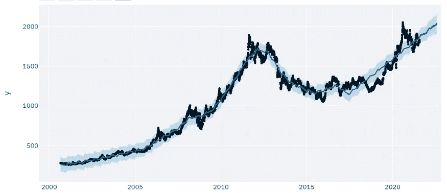
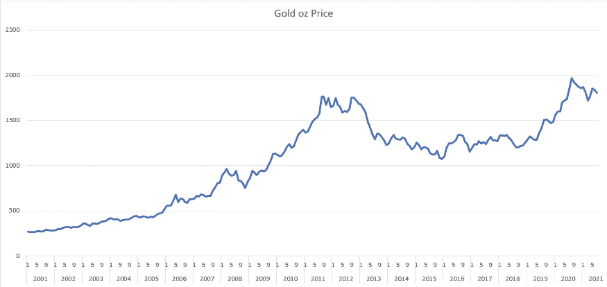
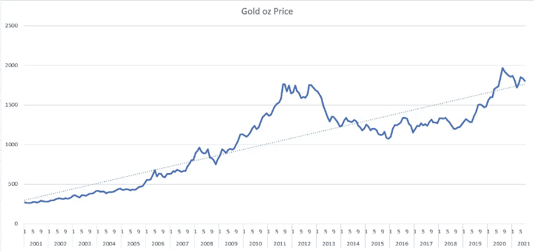
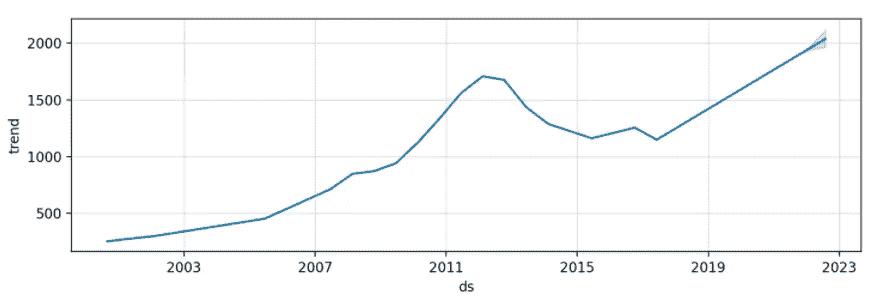
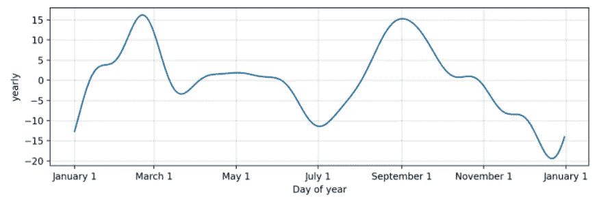
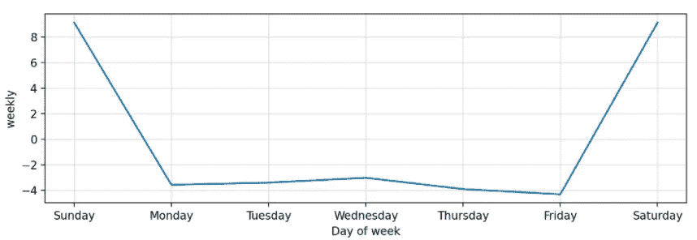
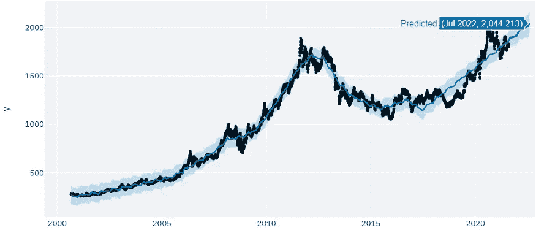

# 如何预测与时间相关的价格

> 原文：<https://blog.devgenius.io/how-to-forecast-time-related-prices-8d119ecdcfe8?source=collection_archive---------10----------------------->

时间序列分析基础

作者使用 fbprophet 生成的图像

时间序列分析是一个被大多数产品和数据科学家遗忘的问题，尽管如果我们把它与现实世界联系起来，它是最重要的领域之一，

在我学习数据科学、机器学习和人工智能的时候，我看到了很多视频，说你可以使用神经网络、机器学习模型或使用时间序列分析来预测股票价格，那个演示使用时间序列分析的家伙用了脸书先知，这让我注意到了我学习期间错过的整个主题。

所以，我深入研究这个课题，以便更好地理解这个课题，以便在我的生活中找到合适的应用，下面是我所理解的，

# 1-什么是时间序列分析/模型。

我们可以说，任何与时间单位相关的数据都可以应用几个步骤，并将其分解为各个组成部分，基于这些组成部分的结果，它允许您预测价格或数量的短期波动，或者任何与时间单位相关的事情。

为了简单明了，我们将使用从 2001 年到 2021 年的黄金价格数据

作家笔下的黄金盎司价格

# 2-什么是时间序列组件

任何你能碰到的时间图表，无论是股票价格，投诉数量，看医生的数量，甚至是西红柿价格，你可能会注意到图表中的一些模式

a)您可能注意到的主要模式是使用许多时间单位的价格整体的角度和方向，我们称之为 ***趋势*** ，您可以在下面的图表中看到它:

黄金盎司价格图表与虚线趋势线考虑所有的持续时间

考虑较小时间单位的黄金盎司价格

在上面的图表中，您可以看到一条虚线，表示趋势线，在数据科学中也称为线性回归。

线性回归的意思是:在最佳位置拟合一条线，减少平均误差和的结果，或者你可以想象它是数据点的平均线“简单的图像，真的很简单”

b)正如我们在图表中看到的那样，趋势线附近几乎没有起伏，这反映出该组件不仅是趋势，而且实际上不是，

你遇到过多少次这样的信息:任何东西的价格在周末都涨到了最高点，但在工作日它的价格却下降了？

以上运动指 ***季节性*** ，

季节性指的是时间上的任何顺序或重复模式，有工作日季节性，月份季节性，假期季节性“每年”，还有直到今天都无法预测的崩溃季节性。

所以，让我们在上面的价格图表中得到季节性，

按作者列出的年度季节性

在上面的图表中，你会注意到 2 月份的黄金价格是最高的，1 月、7 月和 8 月有上涨的趋势，参考真实世界的价格。

按作者划分的每周季节性

最后一个要素是 ***不规则*** ，它指的是这样一个事实，不管你收集了多少数据，清理了多少数据，构建了多少数据，你仍然无法预测现实世界会如何行动，有很多因素，事件促成了现实世界的行动，

可能会将价格提高到月球上的重大事件，另一个像科罗纳疫情这样影响全球并导致所有商业股票价格跌至有史以来最低水平的事件，人们的心理也会影响运动，市场萧条也有很大影响，我们需要消除这些影响以防止其对预测的影响。

因此时间序列的预测将假设没有重大事件可能影响趋势，季节性，并考虑不规则性作为一个数据噪声不能遵循一定的模式。

# 结论:

时间序列图有三个主要部分:

a)趋势

b)季节性

c)不规则性

并且该值在任何时候都可以根据下面的公式进行分解

**V**T =**V**(T-1)X**T**T X**S**T X**I**T

其中:

**V** t =此时的值单位

**V** t-1 =前一时间单位的值

t =趋势因子

S t =季节性因素

I =数据的不规则性

根据上面的公式，我们可以预测下一个即将到来的值，考虑到没有不规则性出现，我们可以使用下面的公式:

**V**T =**V**(T-1)X**T**T X**S**T

接下来，我将写一篇文章，带你一步一步地看上面的例子，我们还将根据我们掌握的数据预测一年的价格。

使用 fbprophet 预测黄金盎司价格

# 如果你喜欢阅读我的内容，可以考虑订阅我的订阅。

*还有，如果你不是中等会员，想获得平台的无限使用权，可以考虑用我的* [***推荐链接***](https://medium.com/@arch.mo2men/membership) *报名。每月 5 美元，你可以无限制地阅读我的文章和许多其他文章。谢了。*