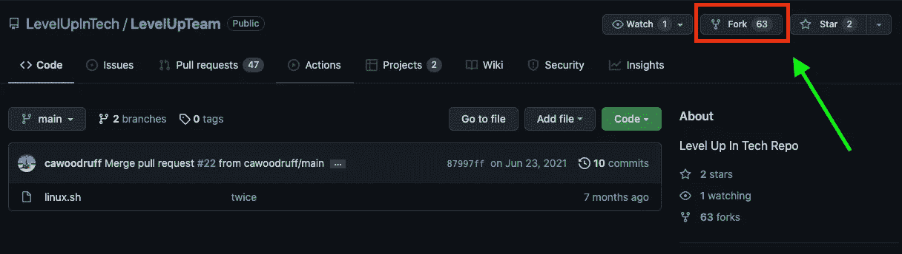
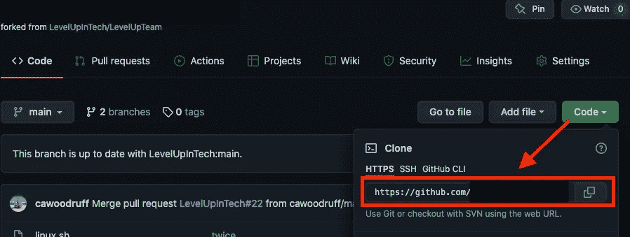
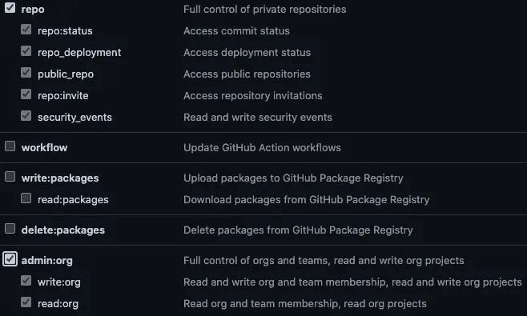
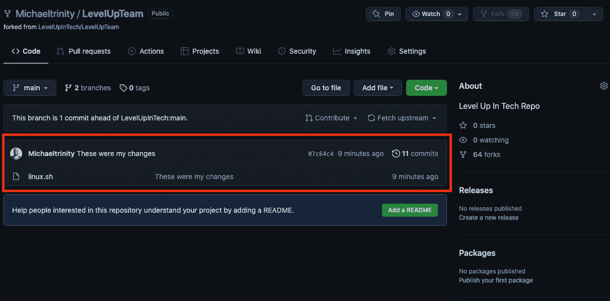

# 如何用 GitHub 派生存储库

> 原文：<https://blog.devgenius.io/how-to-fork-a-repository-and-push-and-pull-with-github-48b296b2b623?source=collection_archive---------0----------------------->

GitHub 初学者指南。

**什么是 GitHub？**

**GitHub** 是一个 Git 存储库版本控制系统，您可以在终端工作时使用。**版本控制**允许任何人在项目上同时协作，对文件进行修改，并保存或**“提交”**。Git 跟踪对文件所做的更改，这样您就有了所做工作的记录，并且如果需要的话，您可以恢复到文件的以前版本。

> ***先决条件:*** GitHub 账号
> CentOS7 服务器
> 命令行终端
> 一个拥有 Sudo 访问权限的用户账号
> Vim

在本教程中，你将学习如何…
1。安装并配置 Git
2。在 GitHub
3 中派生一个库。使用 GitHub 推送文件

# 步骤 1:派生一个存储库

派生出您想要处理的存储库的副本。

# 第二步:安装 Git

通过输入以下命令在 CentOS7 服务器上安装 Git:

# **第三步:设置 Git**

使用以下命令输入您的用户名和电子邮件地址。我们需要这样做，以便跟踪我们的 Git 提交。

# **步骤 4:克隆分叉的存储库**

从 GitHub 复制 URL。

然后用 git clone 命令将其粘贴到您的计算机上。这将创建一个目录，并允许您访问本地计算机上的文件。

# 步骤 5:移动到存储库目录

在您的本地计算机上，输入移动到存储库的命令:

# 第 6 步:添加您的更改

通过输入以下命令，使用 Vim 打开文件:

文件打开后，进行个人更改，然后点击 **ESC** 并键入 **:wq** 保存并退出。

# 步骤 7:提交更改

通过输入以下命令提交对文件所做的更改:

# **第八步:将文件推回 GitHub**

我们必须生成一个个人访问令牌来将文件推回 GitHub。个人访问令牌将用作您的密码。您将能够按照以下说明生成个人访问令牌:

*   单击设置>开发者设置>个人访问令牌
*   单击“生成新令牌”
*   键入注释以描述令牌的用途
*   选择这些权限:

单击生成令牌并复制它。

在您的本地计算机上，键入以下命令以获取远程名称:

获得远程名称后，输入以下命令将文件推回 GitHub:

现在输入您的 GitHub 用户名，并使用您复制的个人访问令牌作为您的密码。一旦完成，你会看到修改已经完成，并显示在 GitHub 库上。

# **最后一步:提交拉取请求**

在 GitHub 仪表板上，单击“拉请求”选项卡，然后单击“新建拉请求”。

最后，只需添加您对更改的意见，然后单击“创建拉动式请求”

你做到了！您已经安装并配置了 Git，在 GitHub 中派生了一个存储库，并使用 GitHub 推/拉了一个文件。开发人员现在可以访问您的更改，如果他们愿意，可以将它们合并到主文件中。恭喜你！