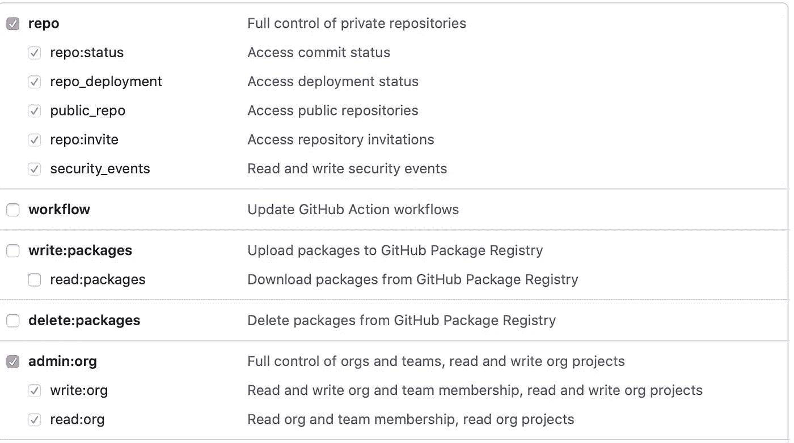

# 如何在 GitHub 上派生一个存储库

> 原文：<https://blog.devgenius.io/how-to-fork-a-repository-in-github-11eaabcfca2f?source=collection_archive---------8----------------------->


GitHub 是一个 Git 存储库托管服务，允许开发人员托管他们的代码，用于版本控制和协作目的。它允许来自世界各地的开发人员相互联系并为项目做出贡献。

*什么是版本控制？*

版本控制，也称为源代码控制，允许用户同时处理一个项目。每个用户将处理他们自己的文件副本，并与其他开发人员共享他们的贡献。版本控制跟踪所做的更改，包括进行更改的用户和更改时间的详细信息。它对个人项目也很有帮助，因为您可以轻松浏览不同的版本，并根据需要访问在线备份。

**本教程将提供如何在 GitHub 中安装 Git、设置 Git 配置和派生存储库的说明。贡献将被添加到分叉的存储库中，然后推回 GitHub。最后，将提交一个拉请求来合并变更。本教程将使用 CentOS7 服务器完成。**

**先决条件:**

*   CentOS7 服务器
*   具有 sudo 权限的用户帐户
*   精力
*   GitHub 帐户
*   命令行终端

# **步骤 1:派生存储库**

访问您希望在 GitHub 上派生的存储库的项目页面。单击右上角的叉形图标。


这将在您的 GitHub 帐户中创建一个存储库副本。

接下来，您需要将存储库克隆到您的本地机器上。

在您的项目仪表板上复制以下 URL:


# 步骤 2:安装 Git

您将使用 CentOS7 的默认存储库安装 Git。

输入以下命令:

```
sudo yum install git
```

出现提示时，输入“y”接受下载大小。

# **步骤 3:设置 Git 配置**

在这一步中，您将输入关于您的身份的信息，以便跟踪您的 Git 提交。

让我们首先使用以下命令设置您的用户名:

```
git config --global user.name "Your Name"
```

接下来，让我们添加您的电子邮件:

```
git config --global user.email "*email@example.com*"
```

# **步骤 4:克隆分叉的存储库**

为了访问本地机器上的文件，您需要克隆分叉的存储库。使用从 GitHub 复制的 URL，输入以下命令:

```
git clone https://github.com/<your-username>/<project-name>.git
```

该命令将创建一个包含项目文件的目录。

# **第五步:添加你的贡献**

如果适用，使用 Vim 打开新项目目录中的文件。输入以下命令来访问 Vim:

```
vim <filename>
```

输入对该文件和任何其他文件的必要更改。

# 步骤 6:提交文件

对文件进行更改后，您需要提交文件。输入以下命令提交更改并添加注释:

```
git commit -a -m "Comment"
```

# **第七步:将文件推回 GitHub**

为了通过 HTTPS 将文件推回 GitHub，您需要创建一个个人访问令牌。个人访问令牌将用来代替您的密码。按照 GitHub 概要文件中的以下说明来创建这个令牌:

*   单击设置->开发人员设置->个人访问令牌
*   单击生成新令牌
*   插入注释以描述令牌的用途
*   选择访问权限:



*   单击生成令牌。复制您的令牌。

现在您有了个人访问令牌，可以将文件推回到 GitHub。为此，您将需要远程名称。输入以下命令来查找它:

```
git remote
```

使用远程名称，输入以下命令将文件推回 GitHub:

```
git push <remote name>
```

出现提示时，输入您的 GitHub 用户名和个人访问令牌作为您的密码。

# **步骤 8:发送一个 Pull 请求来合并贡献**

在 GitHub 仪表板上，点击 Pull Requests 选项卡下的 New Pull Request。


输入您对存储库所做贡献的注释。然后点击“创建拉式请求”。

就是这样！开发人员现在可以访问您的贡献，并将决定是否将它们与主文件合并。