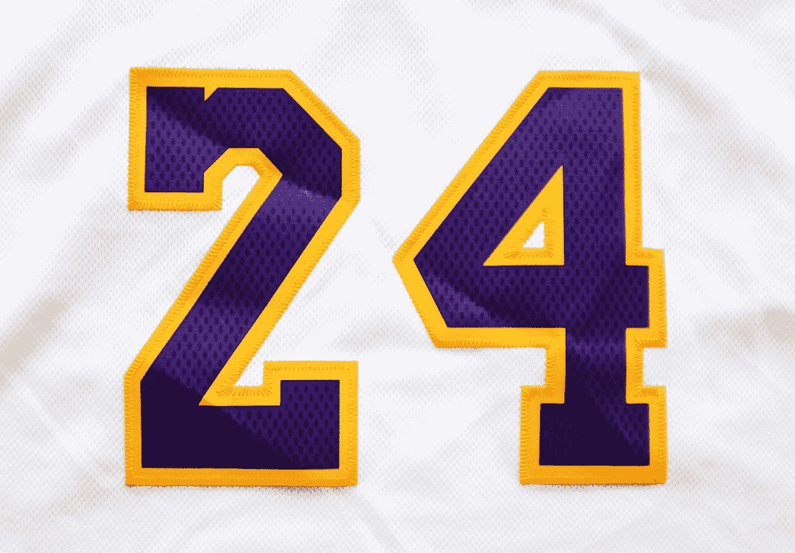

# 如果一个数字是一千或一千以上，如何格式化一个以 K 结尾的数字，否则在 JavaScript 中显示这个数字？

> 原文：<https://blog.devgenius.io/how-to-format-a-number-with-k-at-the-end-if-it-is-one-thousand-or-more-and-show-the-number-283ad5141280?source=collection_archive---------8----------------------->



照片由 [Olivier Collet](https://unsplash.com/@ocollet?utm_source=medium&utm_medium=referral) 在 [Unsplash](https://unsplash.com?utm_source=medium&utm_medium=referral) 上拍摄

有时，我们想要格式化一个数字，如果它是 1000 或更大，我们就在末尾显示 K，如果它小于 1000，就返回显示的数字。

在本文中，我们将研究如何格式化一个结尾为 K 的数字，如果它是 1000 或更大，否则返回整数。

# 使用数学方法

我们可以创建自己的函数，使用`Math`方法来检查一个数字的绝对值是否大于或等于 1000。

如果是，那么我们除以 1000，在它后面加一个 K。

否则，我们返回整数。

为此，我们写道:

```
const kFormatter = (num) => {
  return Math.abs(num) > 999 ? Math.sign(num) * ((Math.abs(num) / 1000).toFixed(1)) + 'k' : Math.sign(num) * Math.abs(num)
}console.log(kFormatter(1200));
console.log(kFormatter(-1200));
console.log(kFormatter(900));
console.log(kFormatter(-900));
```

我们创建了接受`num`数字参数的`kFormatted`函数。

然后我们检查`num`的绝对值是否大于 999。

`Math.abs`让我们计算一个数的绝对值。

如果大于 999，那么我们用`Math.sign`来得到数字的符号。

如果数字是负数，返回-1，否则返回 1。

然后我们把它乘以`num`的绝对值除以 1000。

然后我们用 1 调用`toFixed`来返回四舍五入到一个小数位的数字的字符串版本。

然后我们在它后面加上`'k'`。

否则，我们只返回数字本身:

```
Math.sign(num) * Math.abs(num)
```

所以我们得到:

```
1.2k
-1.2k
900
-900
```

从控制台日志结果。

# 结论

我们可以使用各种`Math`方法来格式化数字，如果是 1000 或更大，则返回截断的数字，否则返回整数。