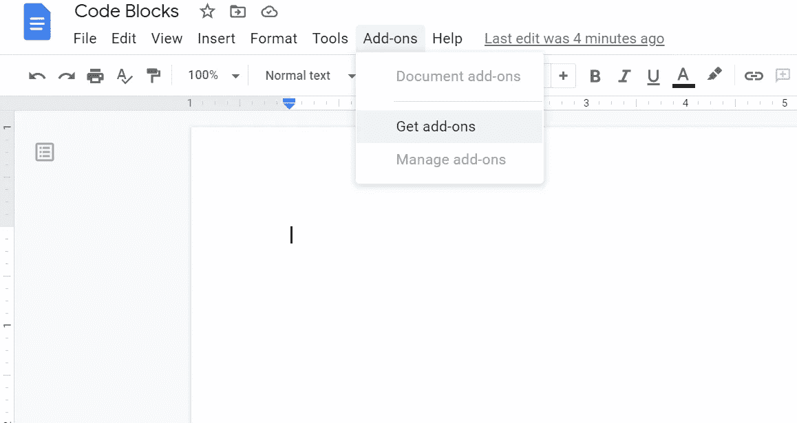
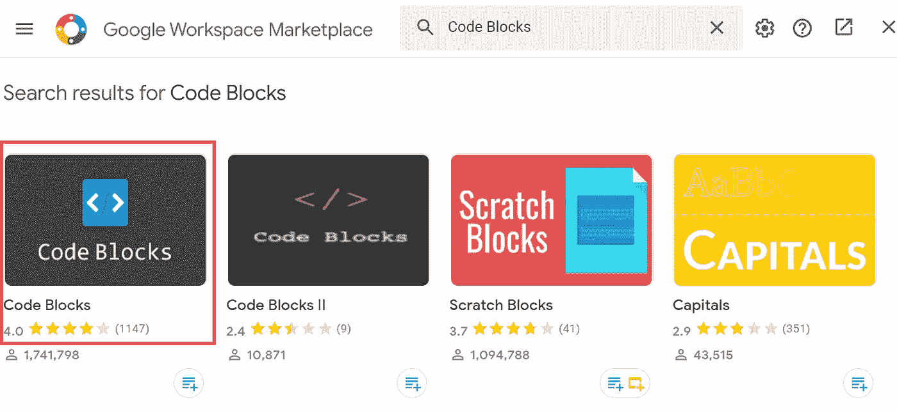
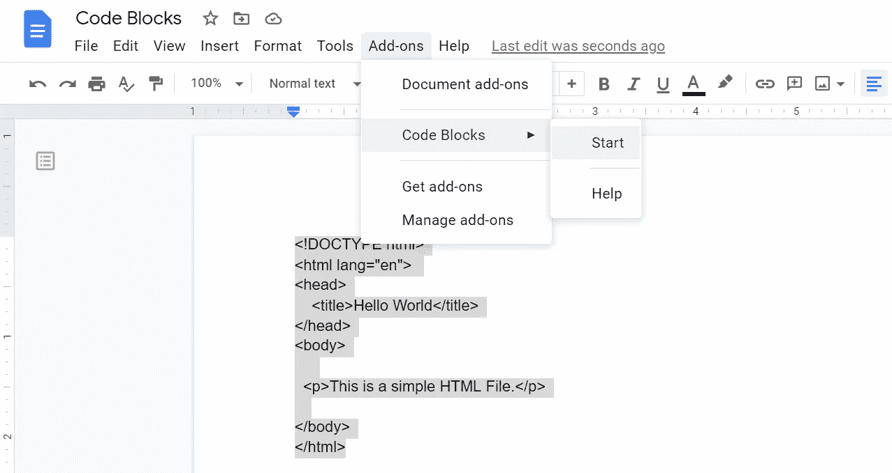
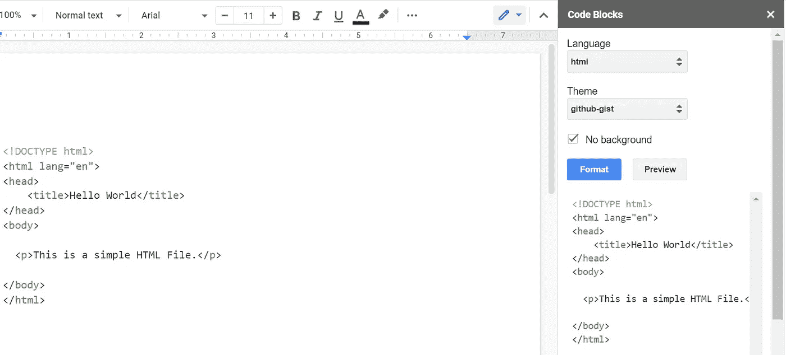

# 如何在谷歌文档上格式化你的代码

> 原文：<https://blog.devgenius.io/how-to-format-your-code-on-google-docs-86d1e538d359?source=collection_archive---------0----------------------->

## 代码块来拯救。

[安德鲁·尼尔](https://unsplash.com/@andrewtneel?utm_source=unsplash&utm_medium=referral&utm_content=creditCopyText)在 [Unsplash](https://unsplash.com/s/photos/typing-on-a-computer?utm_source=unsplash&utm_medium=referral&utm_content=creditCopyText) 上拍照

# 介绍

像所有其他文字处理器一样，谷歌文档支持与谷歌工作空间效率应用程序协调的快速加载项，如[字数](https://workspace.google.com/u/0/marketplace/app/word_counter_max_for_google_docs/364683295233)、[翻译+](https://workspace.google.com/u/0/marketplace/app/translate+/212391231529) **、**和[等等](https://workspace.google.com/marketplace)。类似地，Code Blocks 是一个**语法高亮工具**，可以在[**Google Workspace Marketspace**](https://workspace.google.com/u/0/marketplace/appfinder/category/works-with-doc)上获得。简而言之，[代码块](https://workspace.google.com/marketplace/app/code_blocks/100740430168)工具格式化并简化了谷歌文档的代码插入。

# 入门指南

## 1)从 Google Workspace Marketplace 安装代码块

打开你的谷歌文档，在工具栏顶部，导航到“**附加组件**，然后点击“**获取附加组件**”，如下所示。

**加载项→获取加载项**

导航到市场后，搜索“**代码块**，如下所示。将该工具安装到您的谷歌文档中。

安装代码块

> 安装完成后，您可以在附加组件列表中找到代码块。

## 2)将您的代码添加到 Google Docs 并启动该工具

作为一个例子，我使用了一个简单的 HTML 代码。复制粘贴并选择整个代码，然后点击代码块的**开始**选项。

选择代码，然后点击开始

## 3)用代码块的主题格式化你的代码

代码块包括几个主题。使用 GitHub-Gist 让代码显得专业。您还可以预览代码格式并相应地进行调整。最后，按“格式化”按钮查看格式化后的代码。

使用要点主题

# 准备好向全世界展示您的代码了吗

恭喜你，在这个快速教程的帮助下，你已经学会了在 Google Docs 上格式化代码。你的代码现在已经可以发布了。感谢谷歌代码块插件。