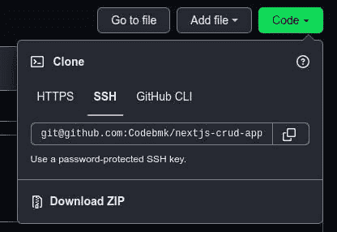

# 如何生成新的 SSH 密钥

> 原文：<https://blog.devgenius.io/how-to-generate-a-new-ssh-key-192e6a5bd139?source=collection_archive---------26----------------------->

## 在本文中，我们将创建一个新的 SSH 密钥，并使用它来认证 GitHub 上的 Git 操作。


创造了与[Midjourney.com](http://midjourney.com)

快速提问。

# 什么是宋承宪？

> *“SSH，全称 Secure Shell，是一种用于从一台计算机安全登录到另一台计算机的网络协议。”我在*[*hosting er*](https://www.hostinger.com/tutorials/ssh-tutorial-how-does-ssh-work)*上找到的另一个有用的定义是，SSH 是一种远程管理协议，允许用户通过互联网访问、控制和修改他们的远程服务器。*

使用 SSH 协议的应用程序的一个例子是 GitHub。

# 在 GitHub 上摆脱基于密码的认证

GitHub 认证 Git 操作有三种方式。

*   双因素认证的用户名和密码
*   个人访问令牌
*   SSH 密钥

然而，GitHub [宣布](https://github.blog/2020-07-30-token-authentication-requirements-for-api-and-git-operations/)出于安全增强的原因，他们将逐步淘汰基于密码的认证。

跨多个应用程序回收密码是很常见的，这使得攻击者更容易使用您回收的密码重新访问您的 GitHub 帐户。使用基于令牌的身份验证，由于以下特征，安全性更高:

*   每个用户会话或设备的令牌都是唯一的。
*   令牌是随机生成的。
*   令牌经过加密并由机器生成，因此比人工生成的密码更强。

# 生成新的 SSH 密钥

要生成新的 ssh 密钥，请在终端中运行`ssh-keygen`命令。遵循 cmd 中返回的说明。它将产生以下输出。

```
$ ssh-keygenGenerating public/private rsa key pair.Enter file in which to save the key (/home/pc_name/.ssh/id_rsa):Enter passphrase (empty for no passphrase):Enter same passphrase again:Your identification has been saved in /home/pc_name/.ssh/id_rsa.
Your public key has been saved in /home/pc_name/.ssh/id_rsa.pub.
The key fingerprint is: SHA256:Up6KjbnEV4Hgfo75YM393QdQsK3Z0aTNBz0DoirrW+c pc_name@belinda
The key's randomart image is:
+---[RSA 2048]----+ |    .      ..oo..| |   . . .  . .o.X.| |    . . o.  ..+ B| 
|   .   o.o  .+ ..| |    ..o.S   o..  | |   . %o=      .  | |    @.B...     . |
|   o.=. o. . .  .| |    .oo  E. . .. | +----[SHA256]-----+ pc_name (11:40)
```

您需要输入一个您能回忆起来的密码。它将被用作访问您计算机上的私钥的密码。

获取存储在这个路径`/home/pc_name/.ssh/id_rsa.pub`中的公钥，并将其作为一个新的 SSH 密钥添加到 GitHub 设置下。

# 使用新的 SSH 密钥在 GitHub 上验证 Git 操作

当创建一个新的 git 存储库时，会为您提供一组在本地终端上运行的 git 命令。git 命令如下所示:


正如您在该图中看到的，有两种方式来设置回购。使用 SSH 协议或 HTTPS 协议。如果你已经用 HTTPS 协议设置了回购，不用担心。您可以通过点击项目的 GitHub repo 中的`Code`按钮来轻松添加 SSH 远程 URL 路径。



复制链接，然后使用以下命令将其添加到本地 repo 中

```
$ git remote set-url origin git@github.com:Codebmk/nextjs-crud-app.git
```

如果您没有在 SSH 代理中添加 save pass phrase，那么每次您需要连接到 GitHub 时，都会提示您输入密码。这在某种程度上是好的，因为它增加了额外的安全层，以防攻击者访问您的计算机。但是，如果您将密码短语添加到 SSH 代理中，就不需要在每次需要连接到 GitHub 时都输入密码短语。

*感谢你读到最后。喜欢，留下评论，并与您的网络分享，如果你觉得这篇文章有帮助。*

## 资源:

1.  [关于对 GitHub 的认证](https://docs.github.com/en/authentication/keeping-your-account-and-data-secure/about-authentication-to-github)
2.  [关于远程存储库](https://docs.github.com/en/get-started/getting-started-with-git/about-remote-repositories)
3.  [什么是 SSH？](https://www.oreilly.com/library/view/ssh-the-secure/0596008953/ch01s01.html)

*最初发布于*[*https://Belinda marionk . hash node . dev*](https://belindamarionk.hashnode.dev/how-to-generate-a-new-ssh-key)*。*