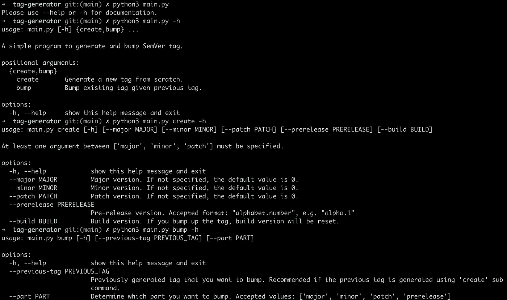
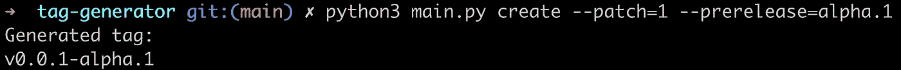
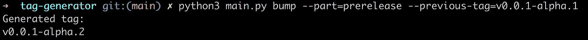

# 如何用 Python 生成和碰撞 SemVer 标签

> 原文：<https://blog.devgenius.io/how-to-generate-and-bump-semver-tag-with-python-c3ab5209f780?source=collection_archive---------7----------------------->

## 语义版本控制

## 如何与语义版本格式保持一致

[布雷特·乔丹](https://unsplash.com/@brett_jordan?utm_source=medium&utm_medium=referral)在 [Unsplash](https://unsplash.com?utm_source=medium&utm_medium=referral) 上的标签照片

作为程序员工作的一部分，无论是软件开发、web 开发，还是其他编程工作，我们最有可能会处理版本控制。版本控制帮助用户识别我们在程序上取得的进展。

但是比简单的版本控制更重要的是，版本控制是其他程序员想要使用的。这种版本控制(我想称之为“库的版本控制”)对于确定我们使用的库或框架中是否有突破性的变化是很重要的。因此，对库的版本化有一个标准化的符号是很重要的，这样我们就知道是否以及何时应该升级版本。

# `SemVer`简介

一个非常流行的版本标准(我可以说是最流行的？)就是[语义版本化](https://semver.org/)(常缩写为`SemVer`)。`SemVer`是一个管理软件版本的标准，不管是给最终用户还是给其他程序员使用的库。

基本上，`SemVer`格式有几个部分:

1.  Major:这部分是告诉用户是否引入了足够大的变化，从而改变了用法。这可能会破坏 API 合同或重大的 UI/UX 更改。
2.  Minor:这一部分是在不改变原有流程的情况下，告知是否有新的功能被添加。例如，将 API 或功能添加到应用程序中。
3.  补丁:这部分是告诉用户是否有一个 bug 正在被修复。通常，程序员会在不改变程序的情况下升级补丁。
4.  预发布:这部分是告诉程序员一个还没有“发布”的程序(也就是说，它仍然包含 bug 并且不够稳定)。您可以尝试新的预发布版本，但要自担风险。通常，这是术语“alpha”和“beta”插入的地方。
5.  构建:这部分是例行/夜间构建。如果您正在使用这一部分，很可能它在预发布版本中不太稳定，因为有许多 bug 尚未解决。

你可以在[semver.org](https://semver.org/)查看整个格式。该网站甚至包括正则表达式符号，所以那些想使用正则表达式验证标签的人可以直接使用他们的符号。

`SemVer`的一个警告是，没有标准的指南来决定一个变化是否打破。或者一个变化应该被视为补丁还是小变化。这都是图书馆或应用程序开发人员的工作来决定的。

# 该计划

为了方便我们生成和碰撞 SemVer 标签，我用 Python 做了一个简单的命令行界面来生成和碰撞标签。该标签随后可以在 Github、Gitlab 或其他版本控制平台中使用。

## 先决条件

1.  Git(用于克隆代码，但也可以下载到 ZIP)。
2.  Python 3.x(在我的地方，我使用 Python 3.10)。
3.  Python 3 的 PIP(`pip3`)。

## 使用程序

1.  克隆此存储库:[https://github.com/iamdejan/tag-generator](https://github.com/iamdejan/tag-generator)并转到克隆的 repo。
2.  遵循说明。您可以运行`python3 main.py -h`查看可用命令列表。

您可以在这里看到源代码:

 [## 标记生成器/main.py 位于 main iamdjan/tag-generator

### 此文件包含双向 Unicode 文本，其解释或编译可能与下面显示的不同…

github.com](https://github.com/iamdejan/tag-generator/blob/main/main.py) 

以下是我所做的一些演示(取自存储库):

帮助命令。

生成标记。

凹凸标签。

# 参考

*   [带 ArgParse 的命令行参数简单指南](https://towardsdatascience.com/a-simple-guide-to-command-line-arguments-with-argparse-6824c30ab1c3)
*   [如何用 argparse 在 Python 中构建命令行界面](https://realpython.com/command-line-interfaces-python-argparse/)