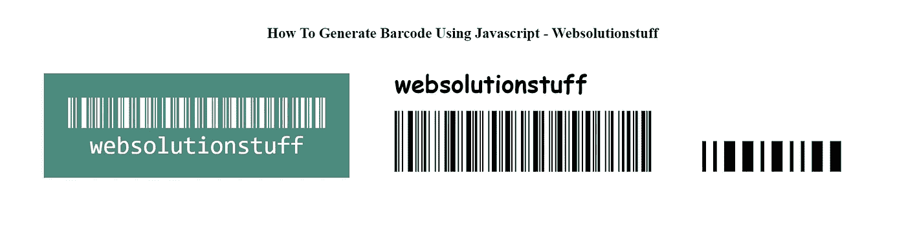

# 如何使用 Javascript 生成条形码

> 原文：<https://blog.devgenius.io/how-to-generate-barcode-using-javascript-8c42a0c0746a?source=collection_archive---------17----------------------->

在本文中，我们将看到如何使用 javascript 生成条形码。我们将使用 javascript 插件来生成或创建条形码。

使用该库，您可以轻松生成不同类型的条形码。条形码生成库可在 web 浏览器和 Node.js 上运行。对于 web 浏览器，只需使用 JsBarcode CDN 文件。

我们将使用 [**JsBarcode**](https://github.com/lindell/JsBarcode/) 库。 **JsBarcode** 是一个用 JavaScript 编写的**条形码生成器**。

JsBarcode 支持多种条形码格式和多个选项。根据需要，我们可以更改条形码，如宽度、高度、颜色、背景、字体、格式、边距、文本对齐等。

生成条形码非常容易。

因此，让我们看看如何使用 jquery 和 jquery 条形码生成器生成条形码。

# Javascript 条形码生成

**包含库**

首先，我们将使用 CDN 添加最新的 jquery 和条形码库。

```
<script src="//code.jquery.com/jquery-latest.min.js"></script>
<script src="https://cdn.jsdelivr.net/npm/jsbarcode@3.8.0/dist/JsBarcode.all.min.js"></script>
```

根据需要，您可以添加不同的 CDN 文件作为下面的链接。

```
<!-- All the barcodes!-->
<script src="https://cdn.jsdelivr.net/npm/jsbarcode@3.11.5/dist/JsBarcode.all.min.js"></script>

<!-- CODE39 -->
<script src="https://cdn.jsdelivr.net/npm/jsbarcode@3.11.5/dist/barcodes/JsBarcode.code39.min.js"></script>

<!-- CODE128 -->
<script src="https://cdn.jsdelivr.net/npm/jsbarcode@3.11.5/dist/barcodes/JsBarcode.code128.min.js"></script>

<!-- EAN+UPC -->
<script src="https://cdn.jsdelivr.net/npm/jsbarcode@3.11.5/dist/barcodes/JsBarcode.ean-upc.min.js"></script>

<!-- ITF -->
<script src="https://cdn.jsdelivr.net/npm/jsbarcode@3.11.5/dist/barcodes/JsBarcode.itf.min.js"></script>

<!-- ITF-14 -->
<script src="https://cdn.jsdelivr.net/npm/jsbarcode@3.11.5/dist/barcodes/JsBarcode.itf-14.min.js"></script>

<!-- MSI -->
<script src="https://cdn.jsdelivr.net/npm/jsbarcode@3.11.5/dist/barcodes/JsBarcode.msi.min.js"></script>

<!-- Pharmacode -->
<script src="https://cdn.jsdelivr.net/npm/jsbarcode@3.11.5/dist/barcodes/JsBarcode.pharmacode.min.js"></script>
```

**另请参阅:** [**如何从 Laravel 中移除包**](https://websolutionstuff.com/post/how-to-remove-package-from-laravel)

**创建画布或图像**

现在，我们将在**主体**标签中添加 HTML 代码。您可以创建不同的类型来生成条形码。

```
<canvas id="canvas"></canvas>
<!-- or -->

<!-- or -->
<svg id="barcode"></svg>
```

**添加 Javascript**

在这一步，我们将使用普通 javascript 生成一个条形码。此外，您可以使用多种方法来生成条形码。

```
// By using querySelector
JsBarcode("#barcode", "websolutionstuff_barcode_generator");

// or by passing an element variable
var element = document.getElementById("barcode");
JsBarcode(element, "websolutionstuff_barcode_generator");

// using jQuery
$("#barcode").JsBarcode("websolutionstuff_barcode_generator");
```

**例如:**

```
<html>
    <head>
        <script src="//code.jquery.com/jquery-latest.min.js"></script>
        <script src="https://cdn.jsdelivr.net/npm/jsbarcode@3.8.0/dist/JsBarcode.all.min.js"></script>
    </head>
    <body>
        <h3>How To Generate Barcode Using Javascript - Websolutionstuff</h3>
        
    </body>
</html>
<script>
    $(document).ready(function(){
        JsBarcode("#barcode", "websolutionstuff", {  
            lineColor: "#03aa96",
            width: 2,
            height: 100,
            displayValue: true
        });
    });
</script>
```

**阅读也:** [**Laravel 9 电话号码验证使用 Regex**](https://websolutionstuff.com/post/laravel-9-phone-number-validation-using-regex)

**输出:**


如何使用 Javascript 生成条形码

**生成带选项的条形码**

**格式:**格式选项用于定义不同类型的格式。

**默认:“自动”(代码 128)**

```
JsBarcode("#barcode", "123456789012", {
  format: "EAN13"
});
```

**宽度:**宽度选项用于定义单个条形的宽度。

**默认值:2**

```
JsBarcode("#barcode", "Smallest width", {
  width: 1
});
```

```
JsBarcode("#barcode", "Wider barcode", {
  width: 3
});
```

**自定义条形码有**[](https://lindell.me/JsBarcode/#options)****17 种不同的选项。****

****举例:****

```
<html>
    <head>
        <script src="//code.jquery.com/jquery-latest.min.js"></script>
        <script src="https://cdn.jsdelivr.net/npm/jsbarcode@3.8.0/dist/JsBarcode.all.min.js"></script>
        <style>
        svg {
        margin: 30px;
        }
        body{
        margin: 50px;
        }
        h2{
        text-align: center;
        }
        </style>
    </head>
    <body>
        <h2>How To Generate Barcode Using Javascript - Websolutionstuff</h2>
        <svg id="barcode1"></svg>
        <svg id="barcode2"></svg>
        <svg id="barcode3"></svg>
    </body>
</html>
<script>
    $(document).ready(function(){
        JsBarcode("#barcode1", "websolutionstuff", {
            fontSize: 40,
            background: "#4b8b7f",
            lineColor: "#ffffff",
            margin: 40,
            marginLeft: 40  
        });
        JsBarcode("#barcode2", "websolutionstuff", {
            textAlign: "left",
            textPosition: "top",
            font: "cursive",
            fontOptions: "bold",
            fontSize: 40,
            textMargin: 15,
            text: "websolutionstuff"
        });
        JsBarcode("#barcode3", "1234", {
            format: "pharmacode",
            displayValue: false,
            height: 50,
            width: 6
        });
    });
</script> 
```

****读还:** [**Laravel 9 条码生成器示例**](https://websolutionstuff.com/post/laravel-9-barcode-generator-example)**

****输出:****

****

**如何使用 Javascript 生成条形码**

****你可能也会喜欢:****

*   ****阅读另:** [**如何使用 Javascript 生成二维码**](https://websolutionstuff.com/post/how-to-generate-qr-code-using-javascript)**
*   ****阅读也:** [**Laravel 9 二维码生成器示例**](https://websolutionstuff.com/post/laravel-9-qr-code-generator-example)**

**如果这篇文章有帮助，请点击拍手👏下面的按钮。**