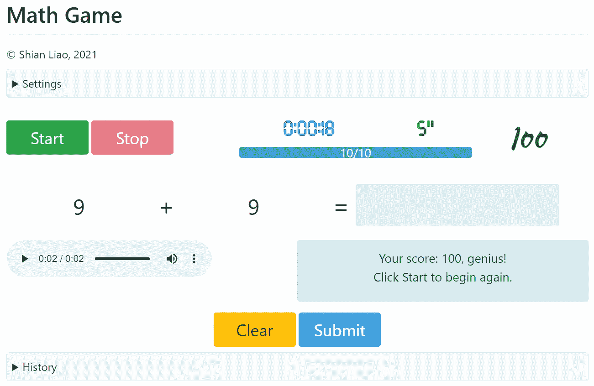
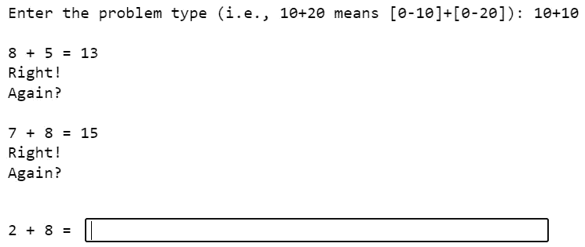
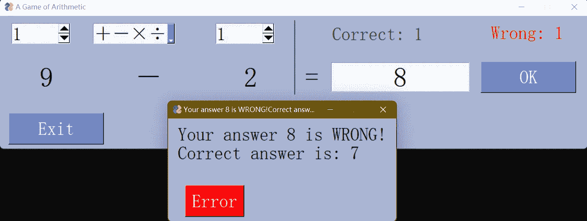
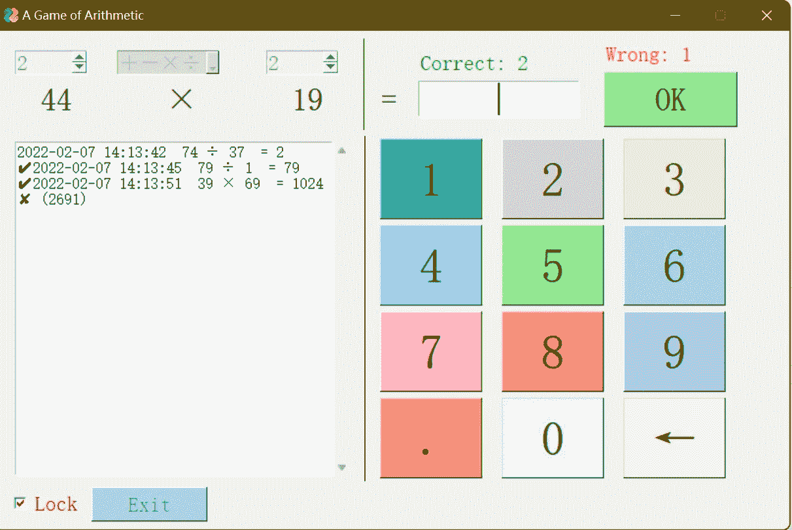
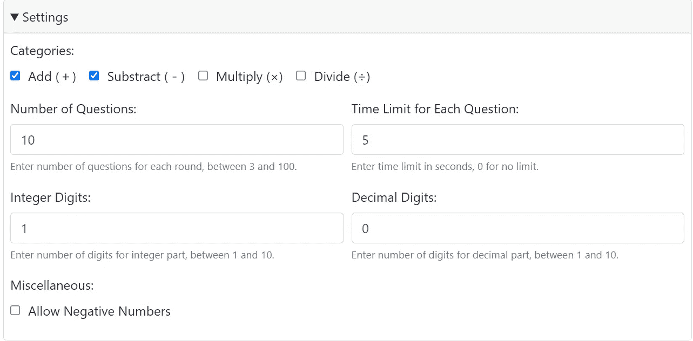
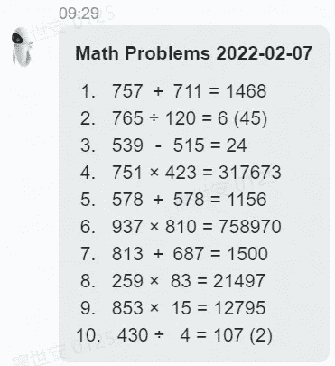

# 如何用 Python 生成随机数学问题

> 原文：<https://blog.devgenius.io/how-to-generate-random-math-problems-with-python-9a9317031503?source=collection_archive---------10----------------------->

*省去教我 6 岁儿子的麻烦*



作者版权

我去年给我 6 岁的儿子写了上面截图中的*数学游戏*，用 [PyWebIO](https://pywebio.readthedocs.io/) 生成 web 前端和一段随机的数学问题生成代码在后台。

本文不会深入讨论前端生成的细节，它只阐述了生成随机数学问题的代码。

# 步骤概述

正如我之前提到的，完整的计划是成功执行的 50%，但在这种情况下，跳入其中肯定没问题。要求没那么复杂。

1.  先生成两个随机数。
2.  将这两个随机数放入一个简单的数学方程中，可以是加法、减法、乘法或除法。
3.  计算方程式并验证用户输入。
4.  避免被零除之类的错误。
5.  尽量避免太容易(例如 5–5 = 0)或太难(例如分数或负结果)的问题。
6.  生成多个问题时尽量避免重复。

# 版本 1:命令行版本

我的最初版本实际上是作为命令行输入/输出完成的，根本没有用户界面，这对于一个 6 岁的孩子来说并不理想。



作者版权

代码很简单，做了一些调整，比如接受范围限制的模式:

```
import random
import datetimepattern = input('Enter the problem type (i.e., 10+20 means [0-10]+[0-20]): ')
if pattern=='':
    pattern = '10+10'
if '+' in pattern:
    op = '+'
elif '-' in pattern:
    op = '-'
elif '*' in pattern:
    op = '*'
elif '/' in pattern:
    op = '/'
left_limit = int(pattern.split(op)[0].strip())
right_limit = int(pattern.split(op)[1].strip())
rights = wrongs = 0
while True:
    a = random.randint(0 if op!='/' else 1, left_limit)
    b = random.randint(0 if op!='/' else 1, right_limit)
    if op in ['-', '/']:
        a, b = max(a, b), min(a, b)
    if op=='+':
        result = a + b
    elif op=='-':
        result = a - b
    elif op=='*':
        result = a * b
    elif op=='/':
        result = a / b
    question = '\n' + ' '.join([str(a), op, str(b), '= '])
    answer = input(question)
    if int(answer)==result:
        rights += 1
        print("Right!")
    else:
        wrongs += 1
        print("Wrong!")
    again = input('Again? ')
    if again.lower() in ['no', 'n']:
        score = str(rights) + ' right, ' + str(wrongs) + ' wrong.'
        print('\nYour score:', score)
        break
```

# **版本 2:第一次使用 PySimpleGUI**

我的第一个版本并不成功，我偶然发现了一个名为 [PySimpleGUI](https://pysimplegui.readthedocs.io/en/latest/) 的 Python GUI 库，它使我能够将我的*算术游戏*(向*权力的游戏*致敬)升级到一个新的水平:



作者版权

您可以看到命令行版本和第一个 GUI 版本之间的相似性，以及一些改进，例如随机选择操作符。

# **版本 3:第二次尝试使用 PySimpleGUI**

随着对 PySimpleGUI 库(不幸的是，它仍然有一些致命的问题)有了更多的了解，我将我的*算术游戏*升级为类似 GUI 的“计算器”:



作者版权

这次升级的一个额外功能是每当你按下一个数字时都会有语音提示，就像一个语音计算器:)

# 版本 4:带有 PyWebIO 的 Web GUI

我的最终版本是用 PyWebIO 完成的，这是一个比 PySimpleGUI 更好的选择，尽管它仍然有很多限制。


作者版权

折叠的`Settings`部分实际上包含了更多的选项来提供对游戏难度的精细控制。



作者版权

# 最终工作版本

我的实际最终工作版本根本不需要任何 GUI，它实际上是由一个 Python 脚本生成的，该脚本计划在每天早上 9:30 运行，并向我的舒菲帐户发送一条消息:



作者版权

我所需要做的就是把问题(当然没有答案)复制到我儿子的便签本上，并且在他完成后检查他的答案。到目前为止，他已经在 3 位数乘以 3 位数的问题上困了将近半年，很少能把每个问题都做对。

纸张加上父母的私人时间永远是对抗所有电子设备的最佳教材。