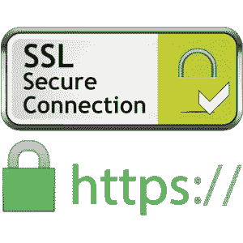

# 如何生成自签名 SSL 证书

> 原文：<https://blog.devgenius.io/how-to-generate-self-signed-ssl-certificates-b85562830ab?source=collection_archive---------0----------------------->

## 关于如何生成自签名根 CA、服务器和客户端 SSL 证书的初学者指南



SSL 证书在 web 服务器上启用 HTTPS

SSL 证书是保护服务器和客户端通信的[公钥基础设施(PKI)框架](https://www.thesslstore.com/blog/how-pki-works/)的一部分。我们通常在 web 服务器上使用 SSL 证书来实现 HTTPS 通信。

例如，要将 SSL 证书部署到托管“kahhoetan.com”的生产 web 服务器，您需要执行以下操作。

1.  生成 RSA 私钥。
2.  使用“kahhoetan.com”上的 RSA 私钥生成证书签名请求(CSR)。
3.  将 CSR 提交给可信的证书颁发机构(CA ),如 Sectigo 或 Comodo，并在“kahhoetan.com”域上提交某种形式的验证，以证明您拥有该域。您还需要向 CA 付款。
4.  然后，CA 将签署 CSR，并向您发送“kahhoetan.com”域的新 SSL 证书。

由可信 CA 签署的生产级 SSL 证书的价格并不低。当然，你可以从 PositiveSSL 获得入门级加密级别证书，费用为每年 10 美元，但不建议在生产环境中使用，特别是电子商务相关网站。另一个流行的选择是 LetsEncrypt，这是一个可以免费签署 SSL 证书的可信 CA。

您仍然会遇到另一个问题:**受信任的 CA 无法签署本地主机域 SSL 证书**。要为本地主机开发启用 HTTPS，您需要生成自签名证书。您可以根据需要在任何域或 IP 地址上生成任意数量的自签名证书，但是因为受信任的 CA 不对它们进行签名，所以如果您使用它们，浏览器或客户端应用程序将会遇到“不受信任的 CA”错误。这意味着您**应该只在开发环境**中使用自签名证书。

在本指南中，我将与您分享生成自签名证书的步骤。本指南中的命令基于 macOS，但是 Linux 命令应该是相似的。

**更新 2021–10–26**:添加了关于使用 4096 位私钥以提高安全性的说明。感谢洛根·兰德的建议。

# 先决条件

1.  确保您已经安装了`openssl`系统。Linux 和 macOS 应该已经预装了`openssl`。如果没有，你可以在 macOS 上运行`brew install openssl`或者按照本[指南](https://wiki.openssl.org/index.php/Compilation_and_Installation)获取详细的安装步骤。
2.  创建一个空目录来管理这些证书，以避免不必要的混乱。

# 自签名 CA

## 配置文件

第一步是生成自签名 CA 证书。您将创建自己的 CA 来签署您需要的证书，而不是让受信任的 CA 来签署您的证书。

用以下配置创建一个`ca.cnf`配置文件。用您定制的详细信息更新`[ root_dn ]`部分。

```
[ req ]
encrypt_key = no
utf8 = yes
string_mask = utf8only
prompt = no
distinguished_name = root_dn
x509_extensions = extensions[ root_dn ]
countryName = MY
0.organizationName = KahHoe Tan
commonName = Root CA[ extensions ]
keyUsage = critical,keyCertSign,cRLSign
basicConstraints = critical,CA:TRUE
subjectKeyIdentifier = hash
```

让我们看看每一行，理解它的意思。

`[ req ]`:这意味着配置的这一部分处理`req`子命令，您将使用它来生成 CSR 或证书。

`encrypt_key`:指定是否要加密密钥对。如果启用，您将需要输入密码/口令来访问私钥。

`utf8`和`string_mask`:用 UTF8 编码证书。除非您的证书包含非 ASCII 字符，否则您不需要定义这些选项。

`prompt`:设置“否”可防止提示输入证书值，并直接从配置文件中获取值。我个人倾向于在生成证书之前，首先在配置文件中定义所有参数。

`distinguished_name`:指定包含识别名字段的部分。

`x509_extensions`:指定包含使用`-x509`子命令时要添加的扩展名列表的部分。

`countryName`:证件的两个字符国家代码。

`0.organizationName`:代表证书的组织名称。从`0.`开始表示这是`organizationName`的第一个条目。因为它可以是多值字段，所以必须定义索引。

`commonName` aka CN:表示受 SSL 证书保护的服务器名称。在 web 服务器场景中，SSL 证书的 CN 必须与 web 服务器的域相匹配。因为我们正在生成一个自签名的 CA，所以您可以放入任何字符串。

*CN 最多只能包含一个条目。* [*主题别名扩展*](https://support.dnsimple.com/articles/what-is-ssl-san) *(也称为主题别名或 SAN)的引入解决了这一限制。SAN 允许发布多名称 SSL 证书。稍后我会给你看一个例子。*

具有`critical`值的`keyUsage`和`basicConstraints`表示这两个扩展为关键扩展。任何使用证书的系统如果遇到它无法识别的关键扩展或包含它无法处理的信息的关键扩展，都必须拒绝该证书。

`keyCertSign`和`cRLSign`被指定为 CA 证书的标准用法:签署证书和发布 [CRL](https://searchsecurity.techtarget.com/definition/Certificate-Revocation-List) 。

带有`CA:TRUE`值的`basicConstraints`表示该证书为 CA。

`subjectKeyIdentifier`与`hash`是与[滑轨规格](https://www.rfc-editor.org/rfc/rfc3280#section-4.2.1.2)相关的。如果您正在创建信任链，则需要填充此扩展。

## 生成 CA 证书和私钥

接下来，请运行以下命令来生成根证书及其私钥。

> **提醒:不要让未经授权的人员获取您的私钥。**

```
$ openssl req -x509 -sha256 -days 3650 -newkey rsa:2048 \
  -config ca.cnf -keyout ca.key -out ca.crt
```

`openssl req`:这个子命令主要用于为 CA 的签名生成 CSR，但是因为我们正在生成 CA 根证书，所以我们现在使用它来生成证书本身。稍后我还将向您展示如何使用`openssl req`命令来生成 CSR。

`-x509`:输出证书而不是 CSR。

`-sha256`:指定此证书要用 SHA256 签名哈希签名。

`-days`:本证书有效期多少天。

`-newkey rsa:2048`:该命令还会生成一个新的 2048 位的 RSA 私钥。

*注意:如果您打算保护敏感数据，而不仅仅是为了开发/测试目的，4096 位私钥可以提供更好的安全性，但代价是性能非常低。*

`-config`:该命令将使用我们之前创建的配置文件，而不是默认的配置文件。

`-keyout`:输出私钥的路径。

`-out`:输出证书的路径。这个定义也适用于大多数其他子命令。

您现在应该有两个文件:`ca.crt`作为 CA 证书，`ca.key`作为它的私钥。您可以运行此命令来检查您的证书。

```
$ openssl x509 -in ca.crt -text -noout
```

`openssl x509`:处理证书的子命令，如显示证书信息，签署证书，或将证书转换成各种格式。

`-in`:指定输入的证书文件。这个定义也适用于大多数其他子命令。

`-text`:以文本形式打印出证书的全部内容。

`-noout`:阻止输出请求的编码版本，因为我们只检查证书。

*您将经常运行这个命令来检查 SSL 证书。好好记着！*

# 服务器证书

## 生成私钥

要生成 SSL 证书，我们首先需要生成一个私钥。运行此命令生成私钥。

```
$ openssl genrsa -out server.key 2048
```

`openssl genrsa`:该子命令用于生成 RSA 私钥。

`2048`:这表示要生成的私钥的大小，以位为单位，类似于前面生成 CA 证书时使用的`-newkey rsa:2048`参数。此参数必须是最后指定的选项。默认值也是 2048。我在这里指定它是为了提供信息。

*注意:如果您打算保护敏感数据，而不仅仅是为了开发/测试目的，4096 位私钥可以提供更好的安全性，代价是性能非常低。*

您现在应该有了一个新的私钥`server.key`。

您可以运行此命令来检查新生成的 RSA 私钥。该命令非常类似于检查证书时的命令，但带有`rsa`子命令。

```
$ openssl rsa -in server.key -noout -text
```

*也可以使用* `*-keyout*` *和* `*-newkey*` *参数，在同一个命令中生成 RSA 私钥和 CSR，类似于前面生成 CA 证书的命令。*

## 生成 CSR

接下来，我们生成一个由我们自己的自签名 CA 证书签名的 CSR。

准备`server.cnf`配置文件，用域或 IP 地址更新`[ dn ]`和`[ san ]`部分。这个示例配置支持多个域或 IP 地址，根据我的经验，这对于 Kubernetes 环境是必要的，在 Kubernetes 环境中，一些应用程序需要接受不同 URL 上的内部和外部通信。

```
[ req ]
distinguished_name = dn
req_extensions = req_extensions
prompt = no[ dn ]
countryName = MY
0.organizationName = KahHoe Tan
commonName = Test Site[ req_extensions ]
basicConstraints = CA:FALSE
keyUsage = nonRepudiation, digitalSignature, keyEncipherment
subjectAltName = [@san](http://twitter.com/san)[ san ]
DNS.1 = localhost
IP.1 = 127.0.0.1
```

让我们来看一下前面几节中没有涉及到的配置。

`req_extensions`:指定包含要添加到 CSR 的扩展列表的部分。

`basicConstraints`:我们通过值`CA:FALSE`指定这不是一个 CA。

`keyUsage`:指定证书的公钥用法。你可以在这里阅读不同的密钥使用扩展。

`subjectAltName`:用于多域证书，参见`[ san ]`部分，带域和 IP 地址列表。

现在，您可以使用之前使用该命令生成的配置文件和私钥来生成 CSR。

```
$ openssl req -new -key server.key -out server.csr \
  -config server.cnf
```

`openssl req`:我们仍然使用`req`子命令，但是因为我们没有使用`-x509`开关，所以它生成 CSR 而不是证书。

`-new`:生成新的 CSR。

`-key`:指定私钥文件路径。

您现在有了一个新的 CSR 文件`server.csr`。您可以使用这个命令检查 CSR。

```
$ openssl req -in server.csr -text -noout -verify
```

记下`-verify`参数。添加此参数还将验证 CSR 的签名。

## 签署 CSR

最后，使用这个命令让 CA 签署您的 CSR。

```
$ openssl x509 -req -days 365 -in server.csr -CA ca.crt \
  -CAkey ca.key -CAcreateserial -out server.crt \
  -extensions req_extensions -extfile server.cnf -sha256
```

`-req`:指定将 CSR 作为输入，而不是默认证书。

`-CA`:指定用于签名的 CA 证书。

`-CAkey`:指定用于签署证书的 CA 私钥。

`-CAcreateserial`:该命令将为同一个 CA 颁发的每个证书创建一个唯一的序列号。

`-extfile`:指定包含扩展配置的文件。

`-sha256`:指定使用 SHA-256 签名算法的证书。

证书现在准备好了！

同样，您可以运行这个命令来检查您新生成的证书。

```
$ openssl x509 -in server.crt -text -noout
```

# 客户证书

生成客户端证书的步骤类似，只是配置文件更简单。

```
[ req ]
distinguished_name = dn
req_extensions = req_extensions
prompt = no[ dn ]
countryName = MY
organizationalUnitName = KahHoe Tan
commonName = Test Client[ req_extensions ]
basicConstraints = CA:FALSE
keyUsage = digitalSignature
extendedKeyUsage = clientAuth
```

主要区别是客户端认证的`extendedKeyUsage`被设置为`clientAuth`。

# PFX 密钥库

如果您需要 PFX/PKCS#12 密钥库中的整个证书链，您可以运行此命令来生成包含任意数量证书的证书密钥库文件。根据我的经验。NET 应用程序需要 PFX 格式的证书文件来进行客户端身份验证。

```
$ openssl pkcs12 -export -out client.pfx -inkey client.key \
  -in client.crt -certfile ca.crt
```

`openssl pkcs12`:处理 PFX/PKCS#12 密钥库文件的子命令。

`-export`:指定要创建的新 PKCS#12 文件。

`-out`:结合`-export`使用时，指定输出 PKCS#12 文件的路径。

`-inkey`:指定输入私钥文件的路径。

`-in`:指定要包含在 PKCS#12 文件中的 PEM 证书的路径。

`-certfile`:指定要包含在 PKCS#12 文件中的任何附加证书文件。

# 摘要

生成 SSL 证书相对简单。希望以上我的经验对你有帮助。我欢迎任何反馈和问题。