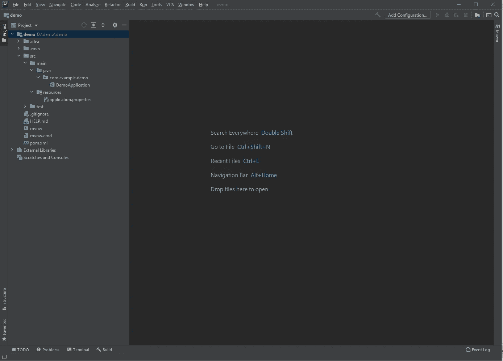

# 通过 JDBC 第 1 部分设置您自己的 spring boot 服务器

> 原文：<https://blog.devgenius.io/how-to-get-a-spring-boot-server-running-via-jdbc-part-1-659d33a5e373?source=collection_archive---------3----------------------->

马库斯·斯皮斯克在 [Unsplash](https://unsplash.com?utm_source=medium&utm_medium=referral) 上的照片

你有没有为你自己的项目想出一个主意，你完成了你的 UI，但是你不知道如何启动你自己的后端服务器？

阅读本文时，我假设您在继续学习之前已经掌握了核心 java 的基础知识。

我将讨论如何在 pc 上运行 spring jdbc 项目。这篇文章将讨论如何在你的机器上安装所有需要的组件。

由[托拜厄斯·费希尔](https://unsplash.com/@tofi?utm_source=medium&utm_medium=referral)在 [Unsplash](https://unsplash.com?utm_source=medium&utm_medium=referral) 拍摄的照片

在获得项目设置之前，让我们了解什么是 jdbc。

它代表 Java 数据库连接，这是一个 Java API，用于在 Java 语言和各种数据库之间建立连接，如 mysql、postgres 等。

通过 spring boot，我们可以建立一个正在运行的服务器，它接收来自客户端代码的请求，执行 crud 操作来更新我们的数据库，并将这些数据返回给客户端。

首先，让我们列出设置项目所需的所有步骤:

*   下载 intellij ide
*   设置项目
*   设置库和配置设置
*   从头开始设置数据库
*   为服务器代码设置目录

照片由 [Jukan Tateisi](https://unsplash.com/@tateisimikito?utm_source=medium&utm_medium=referral) 在 [Unsplash](https://unsplash.com?utm_source=medium&utm_medium=referral) 上拍摄

步骤 1:下载 intellij

转到[下载 IntelliJ IDEA:由 JetBrains 开发的功能强大的&符合人体工程学的 Java IDE](https://www.jetbrains.com/idea/download/#section=windows)并下载 community exe(如果您在 pc 上)。他们也有 mac 版本。如果你愿意付费，你也可以得到 intellij ultimate。

第二步:下载 Java

进入 [Java SE —下载|甲骨文技术网|甲骨文](https://www.oracle.com/java/technologies/javase-downloads.html)下载一个 Java 包。点击“JDK 下载”，它将下载一个可执行文件。正确地遵循这些步骤，它将把 java 库安装到您的机器上。它可以是任何版本，但我个人使用 Java 8，因为它是我们支持一个简单的 jdbc 项目所需要的。

步骤 3:在你的机器上安装 postgres。

从技术上来说，你可以使用任何关系数据库来完成这一部分。在我的例子中，我使用 postgres 作为连接的数据库。进入 [PostgreSQL: Downloads](https://www.postgresql.org/download/) 可以下载 postgres 数据库。

如果这一步可能不清楚，请阅读本教程来安装 postgres，并进一步澄清:【postgresqltutorial.com】安装 PostgreSQL(T3)[。](https://www.postgresqltutorial.com/install-postgresql/)

页（page 的缩写）将密码设置为“密码”,以便与文章的其余部分保持一致。

步骤 4:安装 pgAdmin

在这一步中，您将下载一个 UI 应用程序来帮助您管理数据库。我个人使用 pgAdmin，但是如果你愿意，你可以随意使用其他任何东西。

安装完成后，在你的电脑上打开应用程序，它会提示你输入密码。成功登录后，您应该能够看到您的数据库:

现在，我们不打算做太多，但最终我们需要使用 pgAdmin 来验证

第五步:进入 spring initializer io，设置你的 spring boot 项目。

从技术上来说，一旦你完成了 intellij 的设置，你可以自己设置它，但是 spring initializer 可以帮助我们自动导入很多文件和设置。

进入 [Spring Initializr](https://start.spring.io/) ，你应该能看到这个页面:

现在选择 maven 项目作为您的项目选项。选择“Java”作为您的语言选项。你可以选择任何一个 spring boot 版本，但我只是保留了默认的版本。

之后，您可以设置项目元数据，其中包含项目的描述细节。您可以保持原样，也可以根据应用程序的功能进行修改。

现在将打包设置为一个 jar 文件，并将 java 版本设置为 java 8。您可以选择任何您想要的 java 版本，但是要确保该版本与您安装在这台机器上的 java 库相匹配。

点击“添加依赖项”,在搜索栏中输入“PostgresSQL 驱动程序”,然后按 enter 键。

之后，点击“添加依赖项”,在搜索栏中输入“Spring Data JDBC”并选中它。

现在点击“生成”，它将生成一个 zip 文件。你可以解压它，它将是一个包含项目本身的文件夹。为方便起见，您可以将该文件夹放在 c 盘或 D 盘下。只需创建一个项目文件夹，并将项目放入该文件夹中。

步骤 6:打开 intellij 并在 pom.xml 中设置附加的依赖项

在你的电脑上打开 intellij idea，它会提示你创建一个新的项目或者打开一个。单击“打开”并找到项目的文件夹。之后，您的项目应该如下所示:

现在让我们在 pom.xml 文件中设置附加的依赖项。

是的，我知道。我们应该在步骤 3 中包含所有需要的依赖项，但这是为了通过包含所有重要的包来确保项目正常运行。现在找到您的 pom.xml，并确保它看起来类似于下面提供的文件:

r

这里，我们有 spring boot starter jdbc、spring boot starter web 和 spring boot starter 作为依赖项。所有这些都是建立基于 maven 的 spring boot jdbc 项目的重要配置设置。

当然，我们还获得了 postgres 依赖项，它告诉 spring boot 我们将使用哪种数据库。

请注意，还有一个名为 lombok 的包。这个包是可选的，它是一个 java 库，允许您在稍后设置我们将数据库数据映射到的实体对象时跳过编写 getters 和 setters 的步骤。

步骤 7:在 application.properties 文件中设置数据库设置

在资源路径下找到 application.properties 文件，并放置以下内容:

如果您在数据库上安装了 postgres，默认情况下，postgres 将始终设置为端口 5432。对于我们的用户名，它将默认为 postgres，密码将为“password”，这是在您将 postgres 安装到您的机器上时设置的。

现在你可以在 src/main/java/com.example/demo 下进入 DemoApplication.java，点击第 9 行的绿色 play 图标:

您的应用程序应该运行在端口 8080 上！

这就是本教程的第一部分。我将讲述 crud 操作以及我们需要知道什么来完全建立这个项目。

对于第二部分，请点击此链接完成完整教程:[通过 JDBC 设置您自己的 spring boot 服务器第 2 部分|作者 Michael Tong | 2021 年 1 月| Medium](https://kaleongtong282.medium.com/setting-your-own-spring-boot-server-via-jdbc-part-2-96763d67a310)