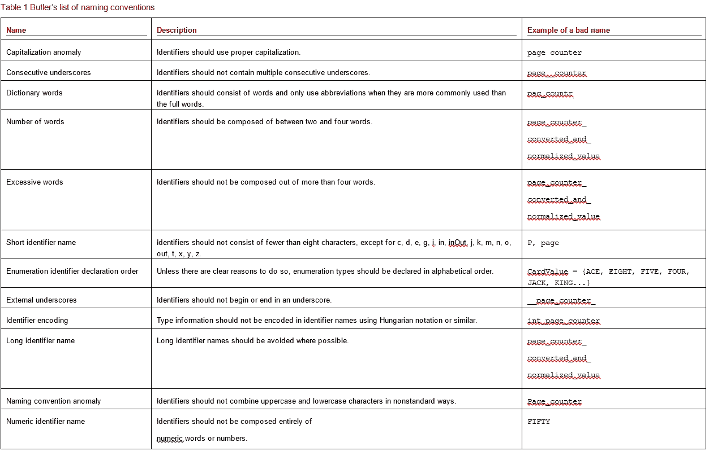
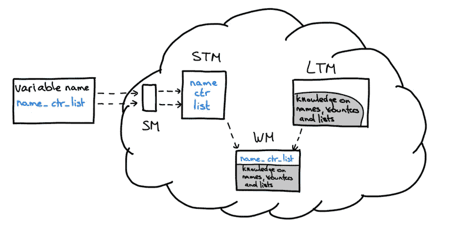
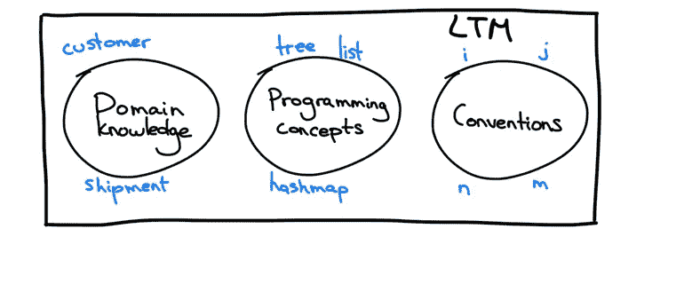
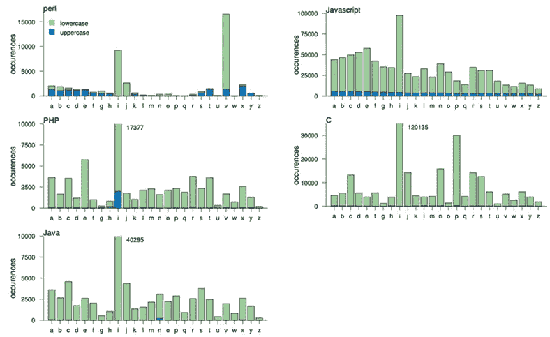
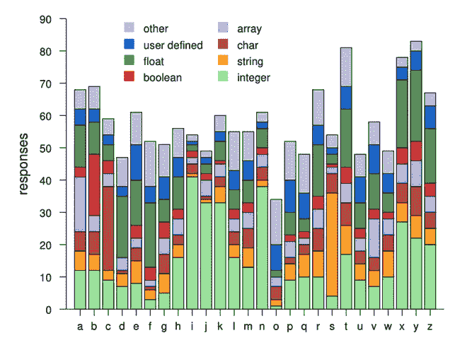
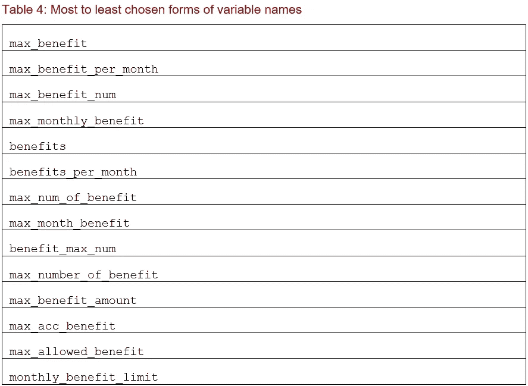

# 如何更好地命名事物

> 原文：<https://blog.devgenius.io/how-to-get-better-at-naming-things-a0a3262acd6e?source=collection_archive---------2----------------------->

## 媒体独家文章

## 费利恩·赫尔曼斯的《程序员的大脑》

*本文涵盖:*

*比较关于良好命名实践的不同观点*

*理解名字和认知过程的关系*

*探索不同命名风格的效果*

*调查坏名字对 bug 和错误的影响*

*学习如何构造变量名以最大化理解*

在[manning.com](https://www.manning.com/?utm_source=medium&utm_medium=organic&utm_campaign=book_hermans2_programmers_12_8_20)的结账处，将 **fcchermans** 输入折扣代码框，程序员的大脑 享受 35%的折扣。

本文旨在研究如何在代码中最好地命名事物，比如变量、类和方法。既然我们现在对大脑如何处理代码有了相当多的了解，我们就能更深刻地理解为什么命名对代码理解如此重要。好的名字有助于激活你的长期记忆(LTM)，找到你已经知道的关于代码领域的相关信息。另一方面，不好的名称会导致您对代码做出假设，从而导致误解。

尽管命名很重要，但也很难。名称通常是在建模解决方案或解决问题时创建的。在这样的活动中，很可能你正在经历一个高认知负荷:你的工作记忆完全有能力创建一个心智模型并使用心智模型进行推理。在这种情况下，考虑一个好的变量名可能会导致过多的认知负荷，而这正是你的大脑想要阻止的。因此，从认知的角度来看，选择一个简单的名字或占位符名称是有意义的，这样就不会超出工作记忆的容量。

本文深入讨论了命名的重要性和难度。一旦我们了解了命名和认知过程的基础知识，我们将放大名字对编程的两个不同方面的影响。我们将首先研究什么类型的名字使代码更容易理解。其次，我们将看看坏名字对 bug 发生的影响。在文章的结尾，我们给出了想出好名字的具体指导方针。

## 为什么命名很重要

选择一个好的变量名很难。网景公司的程序员 Phil Karlton 有一句名言:计算机科学中只有两个难题:缓存失效和事物命名。事实上，许多程序员都在为事物命名。

用一个明确的词来表示一个类或数据结构所做的一切并不是一件容易的事情。耶路撒冷希伯来大学的计算机科学教授德罗尔·费特尔森和贝特霍尔德·巴德勒最近进行了一项实验，以了解想出一个明确的名字到底有多难。Feitelson 进行了一项实验，让近 350 名受试者在不同的编程场景中选择名字。这项研究的对象是平均有六年工作经验的学生和编程专业人员。参与者被要求为变量、常数、数据结构以及函数及其参数选择名称。Feitelson 的实验证实了命名是困难的，或者至少很难选择其他人也选择的名字。在实验中，两个开发者选择同一个名字的概率很低。总的来说，对于必须命名的 47 个对象(即变量、常数、数据结构、函数和参数的组合)，两个人选择相同名称的中值概率仅为 7%。

尽管命名很难，但为我们在代码中推理的对象选择正确的名称是很重要的。在我们深入研究大脑中命名和认知过程之间的联系之前，让我们看看为什么命名很重要。

对于标识符名称，我们指的是由程序员命名的代码库中的所有东西。标识符名称包括我们分配给类型(类、接口、结构、委托或枚举)、变量、方法、函数、模块、库或命名空间的名称。标识符名称很重要，主要有四个原因。

## 名称构成了代码库的很大一部分

变量名很重要的第一个原因是，在大多数代码库中，你将读到的很大一部分是名字。例如，在由大约两百万行代码组成的 Eclipse 源代码中，33%的标记和 72%的字符用于标识符。[【1】](#_ftn1)

## 名字在代码评审中扮演着重要的角色

除了它们在代码中频繁出现之外，程序员还经常谈论名字。Miltiadis Allamanis 现在是剑桥微软研究院的研究员，他调查了代码评审中提到标识符名称的频率。为此，阿拉曼尼斯分析了 170 多篇评论，其中有 1000 多条评论。他发现四分之一的代码审查包含与命名相关的注释，而关于标识符名称的注释出现在 9%的代码审查中。

## 姓名是最容易获取的文件形式

虽然代码的正式文档可能包含更多的背景信息，但是名称是一种重要的文档类型，因为它们就在代码库中。将来自不同地方的信息混淆在一起会增加认知负荷。因此，程序员尽量避免在代码库之外阅读文档。因此，阅读最多的“文档”是代码和名称中的注释。

## 名字可以充当灯塔

信标是代码的一部分，帮助不熟悉的读者解开代码的含义。变量名是帮助读者理解代码和注释的重要灯塔。

## 关于命名的不同观点

选择一个好名字很重要。许多不同的研究人员试图定义变量名称的好坏，他们对这个问题都有不同的观点。但是在我们看这些不同的观点之前，让我们激活你的 LTM，通过一个练习来看看你对变量名的看法。

**练习 1**

在你看来，什么定义了一个好的标识符名称？你能想出一个好名字的例子吗？

什么定义一个坏名字？这仅仅是好名字的反义词吗，或者你能想出你见过的坏名字的特征吗？你从你的实践中知道一个坏名声的例子吗？

既然你已经思考了是什么让一个名字成为一个好名字，让我们看看研究命名的研究人员对好的命名实践的三种不同观点。

## 一个好名字可以从语法上定义

一些人认为应该遵守几个基于名字语法的规则。例如，英国开放大学的副高级讲师 Simon Butler 创建了一个带有变量名的问题列表，如表 1 所示。

表 1 Butler 的命名约定列表

虽然 Butler 的列表包含不同类型的规则，但大多数都是语法规则。例如，规则“外部下划线”规定名称不应以下划线开头或结尾。Butler 的规则还意味着禁止系统匈牙利符号，它规定变量名如 strName，用于表示以字符串形式存储的名称的变量。

虽然关于变量名的精确形式的规则听起来可能有点琐碎，但是代码中不必要的信息可能会导致额外的认知负担，并影响对代码的理解，所以使用表 1 中的语法规则是明智的。

当然，许多编程语言都有关于如何格式化变量名的约定，比如 Python 中的 PEP8，它规定了变量名的 snake 大小写，以及 Java 命名约定，它规定变量名应该是 camel 大小写。

## 代码库中的名称应该一致

关于好的命名的另一个观点是一致性。Allamanis，他在代码审查和命名方面的工作我们在文章的前面提到过，也考虑过好名字。他指出，一个好的命名方案最重要的方面类似于跨代码库的执行。

反对不一致的命名实践符合我们对认知科学的了解。如果同一个单词用于代码库中的相似对象，大脑将更容易找到存储在 LTM 中的相关信息。西蒙赞同阿拉马尼斯的观点党；他的列表包含一条规则，即名字不能使用不一致的大写字母。

## 最初的命名实践具有持久的影响

约翰·霍普金斯大学的高级研究科学家道恩·劳里对命名进行了广泛的研究，他也调查了命名的趋势。与十年前相比，现在的命名方式有所不同吗？随着时间的推移，代码库中的名称是如何变化的？

为了回答这些问题，Lawrie 分析了用 C++、C、Fortran 和 Java 编写的总共 186 个版本的 78 个代码库。这些版本总共有超过 4800 万行代码，跨越了 30 年。Lawrie 分析的集合包含专有代码和开源项目，包括众所周知的代码库，如 Apache、Eclipse、mysql 和 gcc 以及 samba。

为了分析标识符名称的质量，Lawrie 调查了命名实践的两个方面。首先，她观察了名字是否会在名字中拆分单词，例如在单词之间使用下划线或者使用大写字母。劳里认为，拆分单词的名字更容易理解。其次，她根据 Butler 的名字应该由单词组成的规则，查看变量名中出现的单词是否出现在字典中。

因为 Lawrie 随着时间的推移研究了同一代码库的不同版本，她可以分析命名实践如何随着时间的推移而变化。她观察了所有 78 个代码库的命名质量如何随着时间的推移而变化，发现现代代码比旧代码更多地在名称中使用由字典单词组成的标识符，既使用更多的字典单词，也更常见地在变量名中拆分单词。Lawrie 将这些改进的命名实践贡献给了作为一门学科走向成熟的编程。代码库的大小与质量没有相关性，所以代码库越大，标识符名称的质量越好(或越差)。

劳里不仅将较老的代码库与较年轻的代码库进行了比较；她还查看了同一代码库的以前版本，以了解代码库中的命名实践是否会随着时间的推移而改变。她发现，在一个代码库中，命名并不会随着代码的老化而改进。Lawrie 在这里得出了一个重要的和可行的结论，他说“标识符质量在程序开发的早期就已经存在了。”所以，当你开始一个新项目时，你可能要格外小心地选择好名字，因为你在项目早期阶段创造名字的方式很可能会成为永远创造名字的方式。

对 GitHub 中测试使用的研究发现了一个类似的现象:一个存储库的新贡献者经常查看现有的测试并修改它们，而不是阅读项目的指南。当一个存储库已经有了测试，新的贡献者感到有义务也添加测试，并且同样遵守项目是如何组织的。

## 关于长期命名实践的发现

现代代码更好地遵循命名原则

但是，在同一个代码库中，命名惯例保持不变

就命名实践而言，较小和较大的代码库之间没有区别

到目前为止，在本文中，我们已经看到了关于命名的两种不同观点，如表 2 所示。

表 2 对命名的不同观点

Butler 的观点是，我们可以遵循几个主要的语法准则来选择正确的名字。另一方面，Allamanis 对名字的质量没有规定固定的规则或指导方针，但采取的立场是代码库应该是领先的，一致和不好比好但不一致要好。如果有一种明确的方法来命名代码中的标识符，那就太好了，但事实上，即使是研究人员也有不同的意见，这强调了什么是好名字取决于旁观者。

## 命名的认知方面

既然我们已经讨论了为什么命名很重要以及对命名有哪些不同的观点，那么让我们从我们所知道的认知的角度来深入研究命名。

## 格式化名称支持您的 STM

了解了我们所知道的大脑中代码的认知处理，我们可以看到，从认知的角度来看，这两种观点都是有意义的，如表 3 所示。对于如何格式化变量名有一个清晰的规则可能会帮助你的 STM 理解你正在阅读的名字。

表 3 命名的不同观点及其与认知的联系

例如，Allamanis 的方法规定在整个代码库中使用一致的命名实践。这是明智的，因为它可能支持分块。如果所有的名字都以不同的方式格式化，你将不得不在每个名字上花费一些努力来找到它的意思。

巴特勒的观点也符合我们对认知加工的了解。他提倡使用句法相似的名字，例如不允许前导下划线，并使用一致的大写。相似的名字也可能会降低你阅读名字时的认知负荷，因为相关信息每次都以相同的方式呈现。Butler 对一个标识符名称中的四个单词的限制，虽然看起来有点随机，但符合工作记忆的限制，现在估计在两到六个组块之间。

## 提高代码库中名称的一致性

为了提高代码库中名称的一致性，Allamanis 将检测不一致名称的方法实现到了一个名为 Naturalize 的工具中，该工具 [[4]](#_ftn4) 使用机器学习从代码库中学习好的(一致的)名称，然后可以为局部变量、参数、字段、方法调用和类型建议新的名称。在第一项研究中,《归化》的作者使用它在现有的代码基础上生成了 18 个拉请求，并提出了改进名称的建议。其中，14 项被接受，这让它的成功有了一定的可信度。可悲的是，在目前的形式下，归化只适用于 Java。

在他们关于归化的论文中，作者分享了一个可爱的故事，他们使用归化来为 Junit 生成一个拉请求。这个请求没有被接受，因为根据开发人员的说法，提议的更改与代码库不一致。归化然后可以指出他们到所有其他地方，在这个公约被违反，引起的建议。他们自己的惯例经常被打破，因此归化似乎是更自然的错误版本！

## 清晰的名字有助于你的 LTM

到目前为止，我们所看到的关于命名的两种观点彼此不同，但有一些相似之处。这两种方法都是句法或统计方法，根据这两种模型，可以用计算机程序来衡量名字的质量，正如我们所看到的，Alllamadis 的模型也可以在软件中实现。

图 1 当您读取一个名字时，这个名字将首先被分解成独立的块，然后被发送到工作存储器。同时，在 LTM 搜索与变量名不同部分相关的信息。来自 LTM 的相关信息也被发送到工作记忆中。

但是命名当然不仅仅是为变量名选择正确的语法。我们选择的词汇也很重要，尤其是从认知的角度来看。我们在书的前面已经看到，当思考代码时，工作记忆处理两种类型的信息。这如图 1 所示。首先，变量名由感觉记忆处理，然后发送到 STM。我们知道 STM 的大小是有限的，因此试图将变量名分隔成单词。格式化的系统名称越多，STM 就越有可能识别各个部分。例如，在像 nmcntravg 这样的名称中，查找和理解组件可能需要相当大的努力。或者，在 name_counter_average 这样的名字中，更容易看出这个名字的含义。尽管大约有两倍多的字符，当你读它的时候，需要很少的精神努力。

在处理变量名时，不仅仅是短时记忆向工作记忆提供信息。工作记忆在搜索了相关事实后，也会从你的 LTM 接收信息。对于第二个认知过程，标识符名称中单词的选择很重要。对变量名或类使用正确的域概念可以帮助代码读者在他们的 LTM 中找到相关信息。

变量名可以包含不同类型的信息来帮助您理解它们。

如图 2 所示，三种类型的知识可以出现在标识符名称中，并且可以帮助您快速理解一个不熟悉的名称。

1.名字可以支持你对代码领域的思考。像“客户”这样的域名在你的 LTM 中会有各种各样的联想。客户可能正在购买产品，需要姓名和地址等。

2.名字可以支撑你对编程的思考。像树这样的编程概念也将从 LTM 中解锁信息。一棵树有一个根，可以被穿越和夷平，等等。

3.在某些情况下，变量名的选择还包含 LTM 所知道的约定的信息。例如，一个名为 j 的变量会让你想起一个嵌套循环，其中 j 是最里面循环的计数器。

图 2 存储在 LTM 中的三种类型的知识可以出现在变量名中，并有助于理解变量名:领域知识(如客户或发货)、编程概念(如列表、树或散列表)和约定(如 I 和 j 可能是循环计数器，n 和 m 是维度)。

考虑变量名如何支持未来读者的 S-和 LTM，对选择名字有很大的帮助。

**练习 2**

选择一段不太熟悉的源代码。它不应该是完全陌生的，例如，你不久前工作过的一些代码，或者你工作的代码库中其他人写的一段代码。

浏览代码，写下代码中所有标识符名称的列表:变量名、方法名和类名。对于每个名字，思考这个名字是如何支持你的认知过程的。

名称的格式支持您的 STM 吗？能否改进名称，使个别部分更清晰？

这个名字是否支持你的 LTM 理解这个域名？名字能不能改进的更清楚一点？

这个名字是否支持你的 LTM 理解所使用的编程概念？名字能不能改进的更清楚一点？

该名称是否支持您的 LTM 理解，因为它的使用是基于编程约定？

## 什么时候评估名字的质量

我们已经看到，命名是困难的，因为与编码相关的认知过程。当你忙于解决一个问题时，你可能正经历着高认知负荷。也许你在解决问题的时候负荷太大了，以至于你已经没有什么可以想出一个好的变量名了。我想我们都写过将变量命名为 foo 的复杂代码，因为除了解决手头的问题之外，我们不想考虑命名。此外，也许你命名的东西的含义直到编程过程的后期才变得清晰。

因此，编码不是考虑名字和提高名字质量的好时机。最好在编码过程之外考虑命名质量。代码审查可以是一个很好的时机来反映你的标识符名称的代码质量。练习 4 可以作为要使用的名称的清单，您可以在代码评审中使用它来特别关注代码中的名称。

**练习 3**

在开始代码审查之前，机械地列出所有出现在变更代码中的标识符名称。在代码之外列出这些名称，例如在白板上或单独的文档中。对于每个标识符名称，回答以下问题:

在对代码一无所知的情况下，名字的意思清楚吗？例如，你知道这个名字所包含的单词的意思吗？

有什么名字是模糊不清的吗？

这些名字是否使用了容易混淆的缩写？

有哪些名字是相似的？这些相似的名字也是指代码中相似的对象吗？

## 什么类型的名字更容易理解？

到目前为止，我们已经调查了为什么好名字很重要，并且我们已经探索了名字对认知过程的影响。我们现在将放大到如何格式化标识符名称的更详细的选择。

## 缩写还是不缩写？

到目前为止，我们已经看到了这样一种观点:名字应该由字典中的单词组合而成。虽然使用完整的单词似乎是一个合理的选择，但深入研究我们拥有的证据是有益的，即由完整单词组成的标识符确实更容易理解。

德国帕绍大学的研究人员 Johannes Hofmeister 对 72 名专业 C#开发人员进行了一项实验，在实验中，开发人员必须找到 C#代码片段中的错误。Hofmeister 感兴趣的是标识符名称的含义或形式对于成功发现 bug 更重要。他向开发人员展示了三种不同类型的程序:一种程序的标识符是字母，第二种程序的标识符是缩写，最后一种程序的标识符是单词。霍夫迈斯特要求参与者找出语法和语义错误。然后，他测量了参与者在给定程序中发现错误所花费的时间。

与字母和缩写相比，参与者平均每分钟发现 19%以上的缺陷。字母和缩写在速度上没有显著差异。

虽然其他研究证实，由单词组成的变量有助于理解，但使用更长的变量名也可能有负面影响。Lawrie 的工作我们在本文前面已经介绍过了，他进行了一项研究，要求 120 名平均拥有 7.5 年专业经验的专业开发人员理解并记住具有相同的三种不同类型标识符的源代码:单词、缩写或单个字母。

这项研究的参与者被展示了一种使用三种识别风格之一的方法。然后将代码从视野中移除，之后要求参与者用文字解释代码，然后回忆程序中出现的变量名。与 Hofmeister 相反，Lawrie 通过从 1 到 5 对参与者给出的答案进行评分来衡量代码摘要与代码实际功能的对应程度。

劳里发现了和霍夫迈斯特一样的结果:由单词组成的标识符比其他两类都更容易理解。研究人员对使用单词标识符的代码摘要的评分比使用单字母标识符的代码摘要高出近一分。

这项研究还揭示了使用单词标识符的一个缺点。在调查回忆任务的结果时，劳里发现越长的变量名称越难记住，记住它们需要更多的时间。使变量名更难记忆的不是长度本身，而是名字包含的音节数。从认知的角度来看，这当然是可以理解的:更长的名字可能会在 STM 中使用更多的组块，而音节是一种可能的组块方法。因此，选择一个好的变量名需要在单词的清晰度和缩写的简洁性之间进行仔细的平衡，前者可以提高读者理解代码和发现错误的能力，后者可以提高对名称的回忆。

基于她的研究，Lawrie 建议小心使用涉及标识符前缀或后缀的命名约定。应该仔细评估这些做法，以确保增加的信息超过难以记住的名称所增加的成本。

## 当心前缀和后缀

Lawrie 建议小心使用涉及标识符前缀或后缀的命名约定。

## 单个字母通常用作变量

到目前为止，我们已经看到单词是比缩写或字母更好的标识符，无论是在更快地发现错误方面还是在更好的理解方面。然而，实际上通常使用单个字母。耶路撒冷希伯来大学的研究员 Gal Beniamini 研究了 C、Java、JavaScript、PHP 和 Perl 中使用单个字母的频率。对于这五种编程语言中的每一种，Beniamini 都从 GitHub 下载了 200 个最流行的项目，以及超过 16 GB 的源代码。

Beniamini 的结果表明，不同的编程语言对于单字母变量名的使用有着非常不同的约定。例如，对于 Perl，三个最常用的单字母名称依次是 v、I 和 j，而对于 JavaScript，最常见的单字母名称是 I、e 和 d。

图 Beniamini 分析的五种不同编程语言中使用的单字母变量

Beniamini 不仅关注单字母变量名的出现，他还对程序员对字母的联想感兴趣。对于 I 这样的字母，大多数程序员会想到循环迭代器，x 和 y 很可能是平面上的坐标，但是其他字母呢，比如 b，f，s，或者 t？这些字母被很多程序员联想到一个共同的意思吗？了解人们对变量名的假设可能有助于防止误解，并帮助理解其他人对代码的困惑。

为了了解程序员与变量名关联的类型，Beniamini 对 96 名有经验的程序员进行了一项调查，他要求他们列出一个或多个与单字母变量关联的类型。正如您在图 4 中所看到的，对于大多数信件的类型几乎没有共识。值得注意的例外是 s，它被压倒性地投票为字符串，c 被压倒性地投票为字符，而 I、j、k 和 n 是整数。但是对于其他所有的字母，几乎什么都可以。

图 4 与单字母变量相关的类型

有点令人惊讶的是，d、e、f、r 和 t 往往与浮点数相关联，而变量 x、y 和 z 与整数的关联度与浮点数的关联度一样强，这可能意味着当用作坐标时，它们既用于坐标是整数的地方，也用于坐标是浮点数的地方。

Beniamini 关于单字母变量名的类型关联的结果主要提醒我们，我们不能想当然地假设他人。我们可能会认为某个字母一定会传达某种类型的思想，帮助读者理解代码，但这不太可能，除了一些特定的情况。因此，选择单词作为名称或约定是未来代码理解的更好选择。

## 蛇案还是骆驼案？

虽然大多数编程语言都有描述变量名的样式指南，但并不是所有的样式指南都一致。众所周知，C 系列语言，包括 C、C++、C#和 Java，都使用 camel case，其中任何变量的第一个字母都是小写的，名称中的每个新单词都以大写字母开头，例如 customerPrice 或 nameLength。另一方面，Python 使用一种称为 snake case 的约定，它用下划线分隔标识符名称中的单词，例如 customer_price 或 name_length。

马里兰州罗耀拉大学的计算机科学教授戴夫·宾克利进行了一项研究，调查了用骆驼和蛇书写的变量在理解上的差异。Binkley 想知道这两种标识符风格是否会影响人们改编程序的速度和准确性。在 Binkley 的研究中，有 135 人参与，包括程序员和非程序员。这项研究的参与者首先看到一个描述变量的句子，例如，“将一个列表扩展到一个表格。”在研究了句子之后，参与者被给予了四个多选题来选择，其中一个代表句子。参与者可以选择的选项示例有 extendListAsTable、expandiastable、expandAliasTitle 或 expandiastable。

Binkley 的研究结果表明，使用 camel case 可以提高程序员和非程序员的准确性。该模型发现，对于以 camel case 样式编写的标识符，有 51.5%的更高机会选择正确的选项。但是这种更高的精确度是有代价的:速度。参与者多花了半秒钟才找到写在 camel case 中的标识符。

除了比较这两种不同的标识符风格，并查看程序员和非程序员的结果，Binkley 还查看了编程教育对受试者表现的影响，将没有受过培训的人与受过多年培训的人进行了比较。在宾克莱的研究中，接受过训练的参与者大部分都是使用骆驼案例进行训练的。

在比较不同经验水平的人时，Binkley 发现受过更多 camel case 训练的程序员能更快地找到用 camel case 风格编写的正确标识符。一种识别风格的训练似乎对一个人使用其他风格的表现有负面影响。Binkley 的结果表明，在骆驼案例中受过更多训练的受试者比没有受过任何训练的受试者在识别蛇案例中表现得更慢。

鉴于我们对认知过程的了解，这些结果并不像看起来那么令人惊讶。如果人们经常练习用大小写字母书写姓名，他们会更好地将姓名分块并从中寻找含义。

当然，如果您正在使用 snake case 的现有代码库中工作，根据这项研究更改所有变量名是不明智的。一致性也是一个重要的方面。然而，如果您发现自己处于决定命名约定的位置，您可能希望选择 camel case。

## 名字对虫子的影响

到目前为止，在本文中，我们已经了解了为什么命名很重要，以及什么类型的名称更容易理解。然而，不良的命名实践也会直接影响 bug 的发生。

## 名字不好的代码有更多的错误

Simon Butler，他在本文前面提到的命名准则方面的工作，也分析了坏名字和 bug 之间的关系。Butler 在 2009 年进行了一项研究，通过调查用 Java 编写的开源存储库，包括 Tomcat 和 Hibernate，调查了糟糕的命名和糟糕的代码之间的关系。

Butler 创建了一个工具来从 Java 代码中提取变量名，并检测违反命名准则的情况。使用他的工具，Butler 在八个案例库中找到了不良命名风格发生的地方。如前所述，Butler 既研究了结构命名问题，如两个连续的下划线，也研究了名称的组成部分，如它们是否出现在字典中。

Butler 然后将代码中命名风格不好的位置与 bug 的位置进行比较，就像 FindBugs 一样，FindBugs 是一种使用静态分析定位潜在 bug 位置的工具。有趣的是，Butler 的研究发现了命名问题和代码质量之间的统计显著关联。Butler 的发现表明，糟糕的命名风格可能指向可能是错误的代码，而不是仅仅难以阅读、理解和维护的代码。

当然，臭虫位置和坏名字位置之间的相关性不一定意味着因果关系。可能是臭虫和坏名字都是由一个新手或者粗心的程序员写的代码造成的。也可能是这样的情况:错误发生的位置是解决复杂问题的地方。这些复杂的问题可能与其他方面的命名错误有关。正如我们之前讨论过的，也许程序员在创建代码时的认知负荷非常高，因为他们在解决一个难题。这也可能是因为代码的领域很复杂，因此很难想出一个好的名字，而找到正确名字的复杂性导致了混乱，从而导致了错误。

因此，虽然解决命名问题不一定能解决或防止错误，但检查您的代码库以找到发生不良命名做法的位置，可能会帮助您找到可以改进代码和防止错误的地方。这是继续寻找代码中的坏名字的额外原因:改进名字可能会间接导致更少的错误，或者至少缩短修复时间，因为更好的名字会使代码更容易理解。

## 如何选择更好的名字

我们已经看到，不良命名的影响是严重的，可能导致理解代码的机会降低，甚至可能增加错误的机会。费特森，他在选择名字方面的工作我们之前已经讨论过了，他也研究了开发人员如何选择更好的名字。 [[8]](#_ftn8)

## 命名模具

在他的调查中，开发人员被要求选择变量名称，费特森发现，即使开发人员很少为变量选择相同的名称，他们也能理解其他开发人员选择的名称。当在费特森的实验中选择一个特定的名字时，它通常被大多数开发人员所理解。这种看似矛盾的一个原因是开发人员使用了费特森所说的名字模型。

名称模型是可变名称中的元素通常被组合在一起的模式。例如，当某人每个月能获得的最大保险金需要一个名字时，这些名字都被选中了。名称也是标准化的，因此“max”可以是“max”或“max”,“benefit”可以是“benefits”表 1 按从大到小的顺序列出了这些名字。

表 4:变量名最常见到最不常见的形式

查看这些模型有助于我们理解为什么在 Feitenson 的研究中，两个开发人员选择相同变量名的几率如此之低。实验中过多的不同名字主要来自使用不同名字模型的开发者。

虽然所有这些名称在概念上代表相同的值，但在风格上有很多不同。Feitelson 研究中的开发人员并不都在同一个代码库中工作，但是即使在同一个代码库中，也可能出现这些不同的模型。根据我们现在对认知负荷和 LTM 的了解，在一个代码库中使用不同的模型并不是一个好主意。

首先，就认知负荷而言，在变量名(在本例中是 benefit)和变量名中的不同位置寻找相关的概念会增加不必要的、无关的认知负荷。你花在寻找正确概念上的精力不能花在理解名字上。在文章的前面，我们看到人们可以被训练识别某种风格的变量，如骆驼案或蛇案。虽然没有关于名字模型的研究，但是当人们经常使用它们时，他们可能会更好地识别以特定模型编写的变量。

第二，如果变量名相似，使用相同的模型，您的 LTM 可能会更容易找到相关信息。例如，如果变量名为 max_interest_amount，max_benefit_amount 可能会让您想起之前编写的计算最大利息金额的代码。当涉及的变量被称为 interest_maximum 时，你的 LTM 将很难记住类似的代码，即使计算是相似的。

因为相似的模型能最好地支持你的工作记忆和 LTM，所以建议在每个代码库中使用有限数量的不同模型。当你开始一个项目时，就模型达成一致是朝着这个方向迈出的良好一步。在现有的代码库中，您可以从为代码库创建或提取现有变量名称的列表开始，查看哪些模型已经在使用中，并决定这些模型的发展方向。

## Feitelson 关于更好的变量名的三步模型

我们已经看到，程序员经常对同一对象使用许多不同的名称模型，而使用相似的模型有助于理解。基于这些发现，Feitelson 设计了一个三步模型来帮助开发者选择更好的名字:

1.选择要包含在名称中的概念。

2.选择代表每个概念的单词。

3.用这些单词构造一个名字。

## 详细的三步模型

让我们更详细地探讨这三个步骤。第一步，选择要包含在名称中的概念，是非常特定于领域的，决定包含哪些维度可能是命名中最重要的决定。根据 Feitelson 的说法，在选择名称中包含哪些部分时，要考虑的主要问题是名称的意图，即应该代表对象包含的信息以及它的用途。当你觉得有必要写一个注释来解释这个名字，或者当你遇到一个与你使用的代码中的名字相近的注释时，注释中的措辞应该包含在变量名中。在某些情况下，还包括这是哪种信息的指示可能是重要的，例如，长度是水平还是垂直维度，重量是以千克存储的，或者缓冲区包含用户输入，因此应该被认为是不安全的。有时我们甚至会在数据转换时使用新的名称。例如，在输入被验证之后，它可以被存储在另一个变量中，其名称表明它是安全的。

Feitelson 模型的第二步是选择代表每个概念的单词。选择正确的单词通常很简单，其中一个特定的单词是显而易见的选择，因为它用于代码领域或者已经在整个代码库中使用过。然而，在他的实验中，Feitelson 观察到，在许多情况下，参与者对至少一个单词提出了许多不同的争论选项。当开发人员对同义词是否表示相同的事物或表示细微的差异感到困惑时，这种多样性会带来问题。一个项目词典，其中记录了所有重要的定义和同义词的替换，可以帮助程序员一致地选择名称。

Feitelson 指出，他的模型的步骤不一定需要按顺序执行。有时你可能会想出用在变量名中的词，而没有考虑它们所考虑的概念。在这种情况下，仍然考虑这些概念是很重要的。

Feitelson 模型的第三步是使用选择的单词构造一个名字，这归结为选择一个命名模型。正如我们所解释的，当选择一个模具时，与你的代码库保持一致是很重要的。一致的名称将使其他人更容易找到名称中的重要元素，并将该名称与其他名称相关联。Feitelson 建议的第二个考虑是使用模型，这样它们就符合定义变量的自然语言。例如，在一个英语句子中，你会说“最大点数”而不是“最大点数”因此，您可能更喜欢 max_points 而不是 points_max。另一种让变量名听起来更自然的方法是添加一个介词，比如在 indexOf 或 elementAt 中。

## 费特尔森三步模式的成功

在定义了三步模式后，Feitelson 用 100 名新参与者进行了第二次实验。

研究人员向新参与者解释了这个模型，并给了他们一个例子。在解释之后，参与者被赋予了与费特尔森最初研究中的参与者相同的名字。然后，两位外部法官被要求比较两个名字的配对:一个来自第一项研究，参与者并不知道这个模型，另一个来自第二项实验，参与者接受了使用这个模型的训练。评委们不知道哪个名字来自哪个研究。

评委的选择显示，使用该模型的受试者选择的名字被认为优于原始实验中选择的名字，比例为二比一。因此，使用这三个步骤可以得到更好的名字。

## 摘要

关于什么是好名字有不同的观点，从句法规则，比如使用 camel case，到强调代码库中的一致性。

除此之外，camel case 变量比用 snake case 编写的变量更容易记忆，但是当使用 snake case 时，人们会更快。

代码中出现错误命名的位置也更有可能包含 bug，但这并不一定意味着存在因果关系。

人们使用许多不同的名字模型来塑造变量名，但是限制你自己使用较少的模型可能有助于理解。

应用 Feitelson 的三步模式(在名字中使用什么概念，为那些概念使用什么词，以及如何组合它们)会产生更高质量的名字。

本文到此为止。如果你想了解更多，可以在曼宁的 liveBook 平台上查看这本书[这里](https://livebook.manning.com/book/the-programmers-brain?origin=product-look-inside&utm_source=medium&utm_medium=organic&utm_campaign=book_hermans2_programmers_12_8_20)。

[【1】](#_ftnref1)弗洛里安·迪恩博克和马库斯·皮兹卡，《简明一致的命名》，[https://www . cqse . eu/file admin/content/news/publications/2005-简明一致的命名. pdf](https://www.cqse.eu/fileadmin/content/news/publications/2005-concise-and-consistent-naming.pdf)

道恩·劳里，亨利·菲尔德和大卫·宾利，“量化识别器质量:一种安全的方法。趋势分析”，[http://www.cs.loyola.edu/~lawrie/papers/lawrieJese07.pdf](http://www.cs.loyola.edu/~lawrie/papers/lawrieJese07.pdf)

[【3】](#_ftnref3)Raphael Pham 等人，“在社交编码网站上创建对测试文化的共同理解”，2013，【http://etc.leif.me/papers/Pham2013.pdf 

【4】[【http://groups.inf.ed.ac.uk/naturalize/】](http://groups.inf.ed.ac.uk/naturalize/)

[【5】](#_ftnref5)道恩·劳里等，《理解与记忆的有效标识符名称》，2007，[https://www . research gate . net/publication/220245890 _ Effective _ Identifier _ Names _ for _ Comprehension _ and _ Memory](https://www.researchgate.net/publication/220245890_Effective_identifier_names_for_comprehension_and_memory)

[【6】](#_ftnref6)戴夫·宾克利，《为了骆驼案还是低于 _ 分数》，2009 年，[https://ieeexplore.ieee.org/abstract/document/5090039](https://ieeexplore.ieee.org/abstract/document/5090039)

[【7】](#_ftnref7)西蒙·巴特勒，“关于标识符命名缺陷与代码质量的实证研究”，2009，[http://oro.open.ac.uk/17007/1/butler09wcreshort_latest.pdf](http://oro.open.ac.uk/17007/1/butler09wcreshort_latest.pdf)

[【8】【https://www.cs.huji.ac.il/~feit/papers/Names20TSE.pdf】德罗尔·g·菲特尔森，《开发商如何选择名字》](#_ftnref8)

*更多内容请看*[*blog . dev genius . io*](http://blog.devgenius.io)*。*