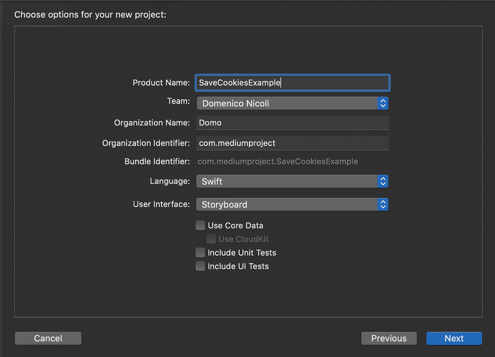
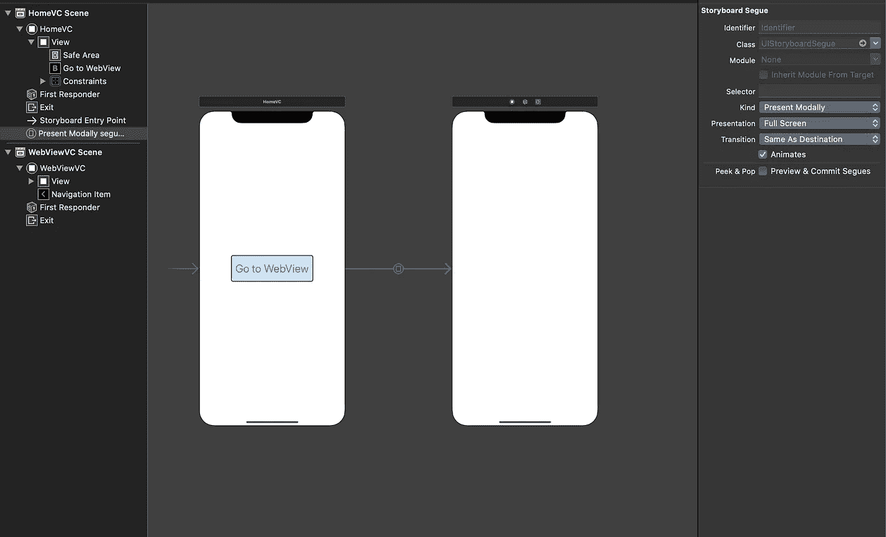
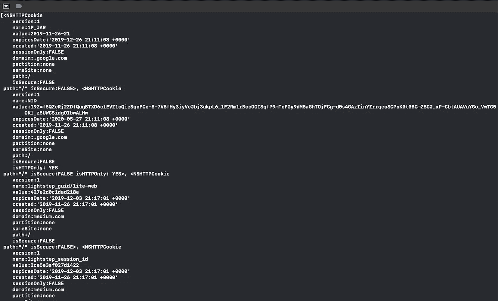

# 如何在 Swift 中从 WKWebView 和 UIWebView 获取 Cookies

> 原文：<https://blog.devgenius.io/how-to-get-cookies-from-wkwebview-and-uiwebview-in-swift-46e1a072a606?source=collection_archive---------0----------------------->

## 学习如何从 WebView 获取 cookies 的简单指南


卡斯帕·卡米尔·鲁宾在 [Unsplash](https://unsplash.com?utm_source=medium&utm_medium=referral) 上拍摄的照片

今天，在本教程中，您将学习如何创建一个`WebView`，在其中加载一个网站，然后从该页面获取所有 cookies。然后，您可以解析它们或将它们保存在本地以备将来的请求。

# 入门指南

首先，打开 [Xcode](https://developer.apple.com/xcode/) 并创建一个新项目。选择*单视图 App* 。



转到`Main.storyboard`并创建一个名为`WebViewVC`的新`ViewController`。在这里，我们将添加我们的`WebView`,我们将从其中获得所有的 cookies。

然后，在第一个`ViewController`(我称之为`HomeVC`)中添加一个新按钮，并创建一个到`WebViewVC`控制器的 segue。



# 履行

现在，进入`WebViewVC.swift`文件并声明以下两个变量:

```
var webView: WKWebView!
var oldWebView: UIWebView!
```

第一个是 iOS 11+系统用的，第二个是之前 iOS 版本用的。

基于版本，我们需要创建一个`UIWebView`或`WKWebView`，所以用下面的代码覆盖`loadView`方法:

```
override func loadView() {

        if #available(iOS 11, *) {
            let preferences = WKPreferences()
            let webConfiguration = WKWebViewConfiguration()
            webConfiguration.preferences = preferences

            webView = WKWebView(frame: .zero, configuration: webConfiguration)

            let userAgentValue = "Chrome/56.0.0.0 Mobile"
            webView.customUserAgent = userAgentValue
            webView.autoresizingMask = [.flexibleWidth, .flexibleHeight]
            webView.uiDelegate = self
            view = webView

        } else {
            oldWebView = UIWebView()
            oldWebView.frame =  CGRect(x: 0, y: 0, width: UIScreen.main.bounds.width, height: UIScreen.main.bounds.height)
            oldWebView.delegate = self
            view = oldWebView
        }

    }
```

然后，我们需要在我们的`WebView`中加载一个网站，在您的`viewDidLoad`方法中添加下面的代码:

```
let myURL = URL(string: "https://www.medium.com")
let myRequest = URLRequest(url: myURL!)

if #available(iOS 11, *) {
  webView.load(myRequest)
  webView.navigationDelegate = self
} else {
  oldWebView.loadRequest(myRequest)
  oldWebView.delegate = self
}
```

最后，我们可以从页面中获得我们的 cookies！

为此，添加以下代码，当我们点击 back 按钮并返回第一个控制器时，将触发该代码:

```
override func viewWillDisappear(_ animated: Bool) {
        if #available(iOS 11, *) {
            let dataStore = WKWebsiteDataStore.default()
            dataStore.httpCookieStore.getAllCookies({ (cookies) in
                print(cookies)
            })
        } else {
            guard let cookies = HTTPCookieStorage.shared.cookies else {
                return
            }
            print(cookies)
        }

    }
```

# 试验

我们已准备好测试您的应用程序！

运行模拟器，点击按钮，当页面加载后，点击后退按钮。在控制台中，您将看到所有 cookies 的信息:

[](https://www.buymeacoffee.com/nicolidomenico)

# 完整代码

你可以在 [GitHub](https://github.com/domeniconicoli/SaveCookiesExample) 上找到完整的代码。

感谢您的阅读。如果你有任何问题或建议，请在评论中告诉我。