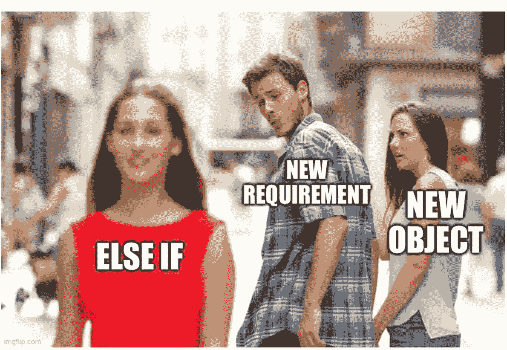

# 如何永远摆脱烦人的 if

> 原文：<https://blog.devgenius.io/how-to-get-rid-of-annoying-ifs-forever-317033474484?source=collection_archive---------2----------------------->

为什么我们学习编程的第一条指令应该是最后使用的。

没有人再使用 [GOTO 指令](https://en.wikipedia.org/wiki/Goto)，也很少有编程语言仍然支持它。

我们已经成熟，并确认[面条代码](https://en.wikipedia.org/wiki/Spaghetti_code)是不可维护的，容易出错。结构化编程在几年前就解决了这个问题。

多亏了 Edsger Dijkstra 令人难以置信的论文，我们去掉了这个句子。

下一步将是删除大部分 [IF 语句](https://en.wikipedia.org/wiki/Conditional_(computer_programming)

**if/Cases**和 ***开关*** 是伪装成结构化流程的 *GOTOs* 。

我们的工具将是面向对象的编程原则。

照片由 [Pixabay](https://pixabay.com/) 中的[przemysaw Bromberek](https://pixabay.com/es/users/przemko-1606435/)拍摄

# 问题是

大多数**如果**的句子都耦合到*偶然的决定*。这种耦合会产生连锁反应，使代码更难维护。

 [## 耦合:唯一的软件设计问题

### 对我们软件的所有故障进行根本原因分析，会发现一个有多种伪装的单一罪魁祸首。

codeburst.io](https://codeburst.io/coupling-the-one-and-only-software-design-problem-869e293a9f04) 

if 被认为是[有害的](https://sddconf.com/brands/sdd/library/If_considered_Harmful_-_Jules_May_-_SDD2017.pdf)，就像 **GOTOs** 一样。

**如果**句子违反[开/关原则](https://en.wikipedia.org/wiki/Open%E2%80%93closed_principle)。我们的设计将缺乏可扩展性和封闭性。

更重要的是，**if**为更糟糕的问题打开了大门，比如**开关**、**案例**、**违约**、**返回**、**继续**和**中断**。

它们让我们的算法变得更加黑暗，并迫使我们构建*偶然复杂的*解决方案。

 [## 没有银弹

### “没有灵丹妙药”这句话在业内广为使用。在这篇文章中，我们将重温弗雷德的经典论文…

medium.com](https://medium.com/dev-genius/no-silver-bullet-65cba1775f9b) 

软件开发之外的人无法解释我们为什么使用这个分支句子。这是代码的味道。

 [## 代码气味 36 — Switch/case/elseif/else/if 语句

### 第一节编程课:控制结构。高级开发人员的教训:避免它们。

medium.com](https://medium.com/dev-genius/code-smell-36-switch-case-elseif-else-if-statements-73f0215abf2b) 

# 解决方法

在我们继续并删除 IF 句子之前，我们应该决定它是必要的还是偶然的。

为了验证这一点，我们将通过双射在现实世界中寻找答案。

 [## 唯一的软件设计原则

### 如果我们在一个单一的规则上建立我们的整个范式，我们可以保持它的简单并做出优秀的模型。

codeburst.io](https://codeburst.io/the-one-and-only-software-design-principle-5328420712af) 

# 基本 if

让我们来看一个*本质*如果的陈述

我们应该决定是否删除这个 **if 句**。

我们必须理解它是代表一个业务规则(*本质*)还是一个实现工件(*偶然*)。

在上述情况下，我们将兑现我们的[双射](https://codeburst.io/the-one-and-only-software-design-principle-5328420712af)。所以我们不会更换 if。

现实世界中的人们用自然语言描述年龄限制，使用**if**

# 偶然的如果

现在让我们深入探讨一下*坏的*和**如果。**

电影分级 **IF** 与**现实世界 If** 无关，而是与意外(和耦合)实现有关。

我们的设计决定是用*字符串*来模拟*评级*。

这是一个经典的*解决方案，既不能扩展，也不能修改*。

让我们看看新需求会发生什么。

我们可以检测到一些*代码气味*:

1.  代码被 **IFs** 污染。
2.  缺少默认语句。
3.  新的评级将带来新的**if**。
4.  代表等级的字符串不是第一类对象。一个错别字会引入难以发现的错误。
5.  我们被迫在*电影*上添加*getter*来做决定。

# 食谱

让我们通过以下步骤来解决这个问题:

> 1-为每个 IF 条件创建多态层次结构(如果尚不存在)。
> 
> 2 —将每个 *IF 体*移至之前的抽象。
> 
> 3-用多态方法调用替换 IF 调用。

在我们的例子中:

有了这个结果:

1-代码被**if**污染

*我们不应该再增加如果了。扩展模型就足够了。*

2-缺少默认语句

*在这种情况下，不需要默认行为，因为异常会中断流程。很多时候一个空对象就足够了。*

 [## 代码气味 12 —空

### 程序员使用 Null 作为不同的标志。它可以提示缺席、未定义的值、错误等。

medium.com](https://medium.com/dev-genius/code-smell-12-null-64fbd7792a7c) 

3-新的评级将带来新的国际单项体育联合会

我们将用多态新实例来解决这个问题。

4-表示评级的字符串不是一级对象。一个错别字会引入难以发现的错误。

*这隐藏在评级实施中。*

5-我们被迫在*电影*上添加 getters 来做决定。

*我们将明确这一点，偏向于* [*德米特里定律。*](https://en.wikipedia.org/wiki/Law_of_Demeter)

 [## 代码气味 08——长长的合作链

### 使长链产生耦合和涟漪效应。任何连锁变化都会破坏代码。

medium.com](https://medium.com/dev-genius/code-smell-08-long-chains-of-collaborations-68aa0207ddd0) 

## 打破这种合作链

评级是私有的，所以我们不会破坏封装。

因此，我们可以安全地避开吸气剂。

 [## 裸体模特第二部分:吸气剂

### 可靠的数据结构及其有争议的(读)访问。

medium.com](https://medium.com/dev-genius/nude-models-part-ii-getters-b039e5ad3427) 

# 将配方应用于所有 IF 条件

现在我们有了秘密公式，我们可以更进一步，试着去掉与年龄相关的条件的必要***。***

*我们替换了所有的**if**。在后一种情况下使用[双调度技术](https://en.wikipedia.org/wiki/Double_dispatch)*

*我们使用了我们的公式，它的工作。但是有一股**过设计**的味道。*

1.  *在我们的[模型](https://codeburst.io/what-is-software-9a78c1172cf9)上，代表年龄的类与真实概念无关。*
2.  *模型太复杂。*
3.  *我们将需要与新年龄组相关的新班级。*
4.  *年龄组可能不会脱节。*

*我们应该避免最后一个设计，在*本质*和*偶然*if 之间设置一个**清晰的边界**。*

> *一个好的设计规则是，如果它们属于同一个领域(电影和评级)，就创建抽象，如果它们跨领域(电影和时代)，就不要这样做。*

## *它很臭吗？*

*根据上面显示的证据。我们应该把许多 if 看作是一种代码气味，用我们的方法来处理它们。*

* [## 设计模式和重构

### 问题:您有一个根据对象类型或属性执行各种操作的条件。解决方案:创建…

sourcemaking.com](https://sourcemaking.com/refactoring/replace-conditional-with-polymorphism) 

## 为什么会这样？

这篇文章(以及许多其他文章)建议避免使用大多数 **IF 句子。对于所有习惯使用它的开发者来说，这将是非常困难的。**

记住，懒惰和隐藏的假设深深植根于我们的职业。我们已经使用 **IFs** 几十年了，我们的软件并不是最好的版本。

这是一个懒惰案例导致的 IOS 上严重 SSL 缺陷的根本原因分析:

 [## 关于花括号的思考--苹果的 SSL 缺陷和我们应该从中吸取的教训--以代码为中心的 AG…

### 每个人都在摇头。首先，我想现在，每个读过他/她的推特的人…

blog.codecentric.de](https://blog.codecentric.de/en/2014/02/curly-braces/) 

这篇文章的论点表明 **IFs/Switch/Case** 与缺陷之间存在关联。

你应该试一试，避免使用条件句。

# 结论

用这个简单的技术，我们将能够以一种程序化的方式消除所有偶然的 if。

这将使我们的模型耦合更少，范围更广。

空对象模式是这种技术的一个特例。我们将能够删除所有空值，因为:

> 空 if 总是偶然的。

 [## Null:十亿美元的错误

### 他不是我们的朋友。它不会简化生活，也不会让我们更有效率。只是更懒。是时候停止了…

codeburst.io](https://codeburst.io/null-the-billion-dollar-mistake-c2918c92f7e0) 

# 信用

几年来，我们一直在布宜诺斯艾利斯大学使用 If 去除技术。向我所有的老师同事们致敬，因为我们一起分享了所有的经验。

这一系列文章的部分目标是为软件设计的辩论和讨论提供空间。

 [## 目标设计清单

### 这是已经发表的软件设计文章的索引。

mcsee.medium.com](https://mcsee.medium.com/object-design-checklist-47c63d351352) 

我们期待着对这篇文章的评论和建议。

这篇文章还有西班牙语版本[点击这里](https://mcsee.medium.com/c%C3%B3mo-deshacerse-de-los-molestos-if-para-siempre-9c0c3f192c5f)。*