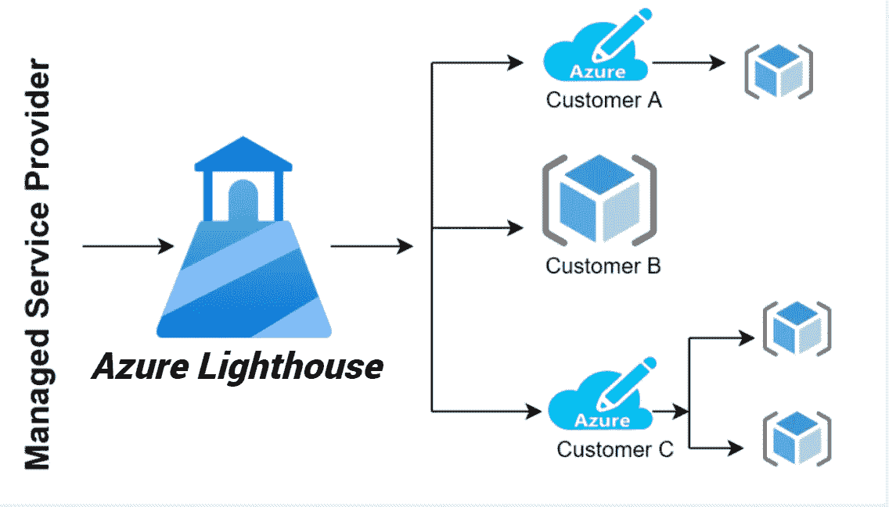
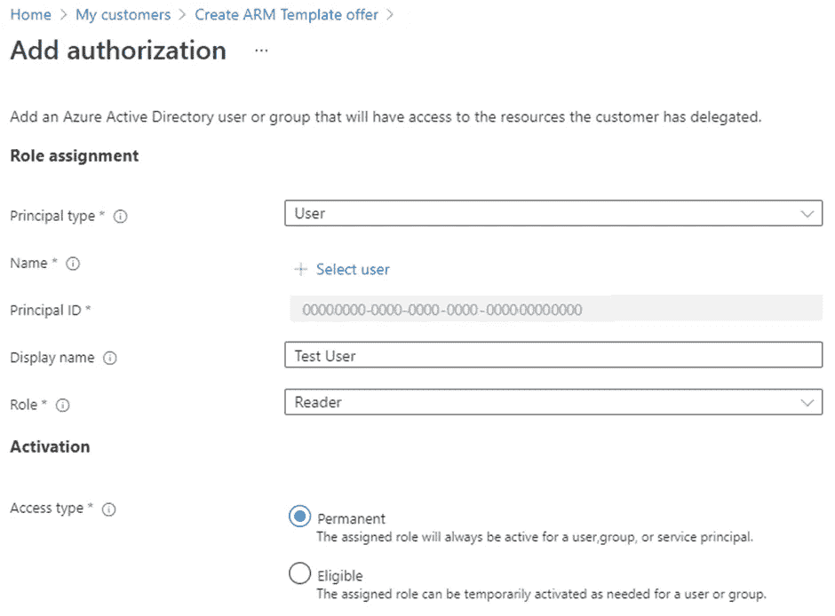

# 如何开始使用 Azure Lighthouse

> 原文：<https://blog.devgenius.io/how-to-get-started-with-azure-lighthouse-b902ff5fa76?source=collection_archive---------6----------------------->



[https://www . kontex . com/azure-light house-a-game-changer-for-msps-customers/](https://www.kontex.com/azure-lighthouse-a-game-changer-for-msps-customers/)

Azure Lighthouse 是微软为服务提供商提供的一项服务，该服务提供具有更高和增强的可伸缩性、自动化和治理的多租户管理。在本文中，我们将了解什么是 Azure Lighthouse 服务，以及它如何为服务提供商带来好处。我们还将了解如何通过 Azure Lighthouse 获得新客户。

**蔚蓝灯塔是什么？**

让我们通过一个实际的例子来了解一下灯塔。假设海里有一座灯塔，用来为海上的船只导航。这同样适用于 Azure Lighthouse。MSP 是向客户提供微软服务的组织。如果您有 2-3 个客户，那么您可以轻松管理它，但是 100 个客户怎么办？你很难管理更多的顾客。在这里，Azure Lighthouse 使服务提供商能够通过充当控制面板来管理多个租户或客户端。

**蔚蓝灯塔的定价**

Azure Lighthouse 不收取额外费用。在日志分析、安全中心等 Azure 服务上使用这些功能的合作伙伴。将继续为基础服务付费。如果底层服务是免费的(Azure Policy、Azure Resource Health 等)，那么就没有变化，这些服务将继续免费。请参考此[链接](https://azure.microsoft.com/en-us/pricing/details/azure-lighthouse/#pricing)了解更多定价详情。

**使用 Azure Lighthouse 有什么好处？**

●**Azure 服务的清晰可见性和控制:**服务提供商和客户对他们分别分配和使用的 Azure 服务都有透明的可见性和控制。客户可以看到服务提供商的操作并管理访问。

● **可扩展管理:** Lighthouse 使管理客户参与度和分配给客户的资源的生命周期变得更加容易和更加可扩展。此外，现有的工具和 API 可以与分配的资源一起使用。

● **降低风险:** Azure Lighthouse 使用 Azure Active Directory 提供基于批准和基于时间的角色激活。它通过在所需的时间内分配所需的访问来降低风险。

● **集成和适应性:** Lighthouse 支持多种工具、API、合作伙伴程序和 Azure 管理的应用程序，采用按需付费的定价模式。

**什么是租户？**

每个租户代表一个组织。它们被称为 Azure AD 的专用实例，当你注册包括 Azure 和微软 365 在内的任何微软服务时，你会收到作为一个组织的 Azure AD。

【Azure Lighthouse 是如何工作的？

1.  确定用户、组或服务主体管理 Azure 资源所需的角色。
2.  指定访问和机载客户。
3.  入职后，授权用户可以登录租户并执行任务。

**搭载一名顾客前往蔚蓝灯塔**

在这里，我们将看到如何让客户以服务提供商的身份加入 Azure Lighthouse。您可以为多个客户重复这一入职流程。

要开始入职培训，请收集以下详细信息:

●服务提供商租户 ID

●客户租户 ID

●将由服务提供商管理的每个特定订阅的订阅 id(来自客户的租户)。

如果你不知道你的租户 ID，你可以[通过](https://docs.microsoft.com/en-us/azure/active-directory/fundamentals/active-directory-how-to-find-tenant) Azure CLI、PowerShell 或 Portal 获得它。

**定义角色和权限**

您可能需要为一个客户执行不同的任务，这些任务需要不同的角色和权限。您可以为它定义多个授权，并且您需要知道您想要访问的租户的每个用户和用户组的 ID。同样，您可以使用 Azure CLI、PowerShell 和门户来检索这些 id。

**创建 Azure 资源管理器模板**

要加入新客户，您需要使用以下信息创建 Azure 资源管理器模板-

**mspOfferName:** 这必须是唯一的，它将作为标题优惠向客户显示。

**mspOfferDescription:** 您的报价说明

**managedByTenantID:** 您的租户 ID

**授权:**使用 DisplayName 和 roleDefinedID 为租户的用户、组和 SPN 提供主有效值。

**从 Azure 门户创建模板，**

1.  转到**我的客户>创建手臂模板。**
2.  在下一页上，提供您的姓名和描述。这将被用作 **mspOfferName** 和 **mspOfferDescription** 。基于 Azure AD 租户的登录信息，将自动提供 **managedByTenantID** 。
3.  接下来，我们将在**资源组**和**订阅**之间进行选择。这个要看客户。如果选择资源组，则为其命名并继续。这里可以有多个资源组。
4.  现在，点击 **+添加授权**，输入如下详细信息:

● **主体类型:**取决于账户、用户、组或服务主体。

● **+选择用户:**将打开一个选择窗格，您可以在其中搜索您想要添加的客户。

● **主体 ID:** 根据选择的用户名自动选择。

● **显示名称:**它将基于您选择的用户，您可以根据需要查看和更改它。

● **角色:**选择角色。

● **访问类型:**如果您设置为特定时间，则选择**合格**，否则选择**永久。**



Azure 门户

5.添加授权详情后，点击**确定。**您将被导航回 ARM 模板页面，在此您可以添加更多授权。

6.添加授权后，点击**视图模板**，你会看到一个. json 文件。下载该文件的副本。现在，您可以在客户的租户中部署模板。

**部署 Azure 资源管理器模板**

创建模板后，客户租户的用户需要为每个订阅进行单独的部署。要了解谁应该部署这些模板，请访问此处的。

您可以通过 Azure CLI、PowerShell 和门户部署模板。

1.  Azure CLI

```
*# Deploy Azure Resource Manager template using template and parameter file locally**az deployment sub create --name <deploymentName> \**--location <Region> \**--template-file <file path> \**--verbose**# Deploy external Azure Resource Manager template, with local parameter file**az deployment sub create --name <deploymentName> \**--location <Region> \**--template-uri <templateUri> \**--verbose*
```

要使用单独的模板文件部署模板，请在–verbose 之前添加*–parameters<参数文件> \* 。

**2。Azure Powershell**

```
*# Deploy Azure Resource Manager template using template and parameter file locally**New-AzSubscriptionDeployment -Name <deploymentName> `**-Location <Region> `**-TemplateFile <Path of template file> `**-Verbose**# Deploy Azure Resource Manager template that is located externally**New-AzSubscriptionDeployment -Name <deploymentName> `**-Location <Region> `**-TemplateUri <templateUri> `**-Verbose*
```

**3。Azure 门户**

从这个 [Github 仓库](https://github.com/Azure/Azure-Lighthouse-samples/)中，选择 deploy to Azure，它将在 Azure Portal 中打开一个模板。输入数值并点击**查看和创建>创建。**几分钟后，您的部署将完成。

要检查您是否已成功加入客户，您可以导航至**我的客户页面**，在客户部分，您将看到带有优惠名称的订阅。

**结论**

Azure Lighthouse 提供服务提供商，这是一种交付和管理 Azure 服务的简单方法，具有强大的安全性和管理功能。它简化了客户入职和参与。此外，客户还可以控制其资源的可访问性。