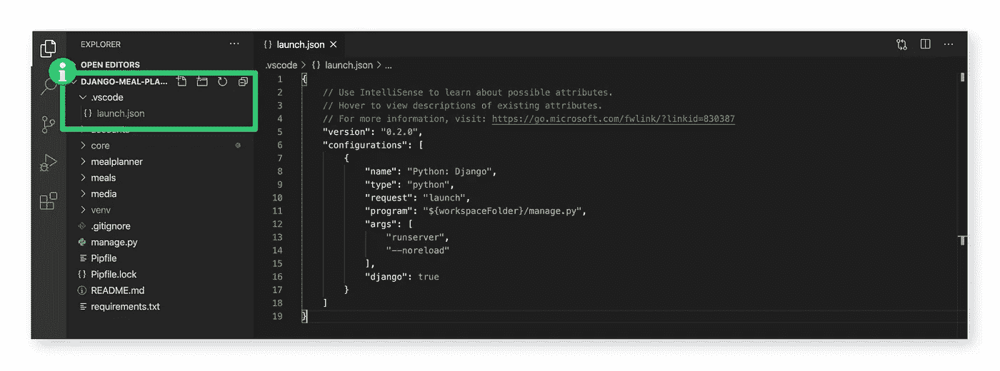

# 如何开始使用 VS 代码中的调试器

> 原文：<https://blog.devgenius.io/how-to-get-started-with-the-debugger-in-vs-code-c9cd6a903f83?source=collection_archive---------5----------------------->

## 消灭这些虫子的最快方法

我要坦白一件事。直到昨天，我还在使用 print 语句调试我的 Python 代码。

打印报表会帮助你完成工作，但是使用起来很麻烦。你需要一个单独的语句来描述你的代码逻辑可能经过的每一条路径，并且当你完成时，你必须记得删除它们。

Print 语句也以字符串形式返回信息，所以所见即所得。如果您正在调试复杂的东西，您可能希望能够探索整个对象。

有一个更简单的方法。

使用调试器将在不修改代码的情况下为您提供更多的信息。设置起来也很快。

我将使用我当前的 Django (Python)项目作为例子，但是这些步骤可以很容易地适应您正在使用的任何编程语言。

让我们开始吧…

## 用 VS 代码启动你的项目

首先，让我们找到调试选项卡；它是在左边向下第四个。

接下来，单击创建一个 launch.json 文件。这将存储项目的配置。

当您点击创建一个 launch.json 文件时，VS 代码会为您提供一些选项。选择最适合你的项目的。我选择了 Python，然后是 Django。

这将自动为您的项目创建带有正确配置的 launch.json。为了将来参考，它存储在一个名为。项目根目录下的“vscode”。

## 这是调试设置，现在使用它…

我们要做的是在我们的代码中设置一个断点，在这里我们将放置一个打印语句。

当我们运行调试器时，它将正常运行我们的开发服务器。当开发服务器到达一个断点时，VS 代码将自动调出调试面板，我们可以检查我们的变量。

首先，我们需要设置一个断点。找到你想中断的那一行，点击行号左边的空白处。

在启动调试器之前，我们必须首先停止开发服务器。当我们按 Play 时，调试器将使用 launch.json 中指定的命令运行开发服务器。

调试器的成功启动将在屏幕的右上角显示命令面板。

现在，我们将运行我们的代码。我的项目是一个 Django web 应用程序，所以我将从浏览器运行我的代码。

我将断点放在请求页面更新成员时运行的代码块中。

随着调试器的运行，我点击了马蒂的个人资料。我没有加载他可以更新这个配置文件的页面，而是返回到 VS 代码，因为它遇到了断点。

我把断点放在第 92 行。IF 语句还没有运行，但是我可以检查第 90 行中定义的变量“member”。

成员是从数据库中提取的对象。该对象将存储成员的名字，他们的个人资料照片的 URL，创建它的用户的引用，以及更多。

显示这么多信息需要大量的打印语句。

相反，我可以在调试面板中展开成员变量来获得更多信息。

在第 93 行留下了打印声明…哎呀

当我研究完变量后，我在命令面板中找到了一些选项。

1.  继续
2.  跨过
3.  步入(运行下一行)
4.  走出去
5.  重新开始
6.  停止调试器

命令选项板

现在，我将选择选项 6 并停止调试器。

仅此而已——这是打印报表的一种快捷方便的替代方式。

感谢阅读