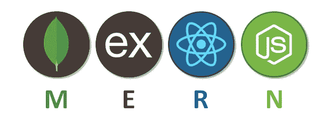

# 设置 MERN 堆栈应用程序的最简单方法

> 原文：<https://blog.devgenius.io/how-to-get-started-with-the-mern-stack-the-easy-way-b9758fe45956?source=collection_archive---------0----------------------->



*声明:本文是原文章的更新版本—* [*此处*](https://www.digitalocean.com/community/tutorials/getting-started-with-the-mern-stack) *。*

# 介绍

MERN 栈由 MongoDB、Express、React 和 Node.js 组成。MERN 栈是构建现代单页面 web 应用程序最流行的 JavaScript 栈之一。

在本教程中，您将构建一个使用 RESTful API 的 **todo 应用程序**，您也将在本教程的后面构建该应用程序。

# 先决条件

要完成这个教程，你需要 [**Node.js**](https://nodejs.org/) 。

遵循安装说明并在本地运行 MongoDB，但本教程不会涵盖该过程，出于教育目的，按原样保留。

下载并安装一个类似[邮差](https://www.getpostman.com/)、[失眠](https://insomnia.rest/)的工具，或者一个 VSCODE 扩展 [ThunderClient](https://www.thunderclient.com/) 测试 API 端点。

# 步骤 1 —设置应用程序

让我们从设置开始。打开终端，在本地机器上任何方便的位置创建一个新的文件目录。您可以将其命名为任何名称，但在本例中，它被称为`mern-todo`。

现在，进入文件目录:

```
cd mern-todo
```

下一步是用一个`package.json`文件初始化项目。该文件将包含一些关于您的应用程序及其运行所需的依赖项的信息。

您可以使用:

```
npm init -y
```

并按照提示进行操作。或者您可以使用:

使用默认值。

# 步骤 2 —设置节点服务器

要在后端运行 JavaScript 代码，您需要启动一个服务器来编译您的代码。

服务器可以通过两种方式创建:第一种是使用 Node 内置的`http`模块；其次是利用 [Express.js 框架](https://expressjs.com/)。

本教程将使用 Express.js。它是一个 Node.js HTTP 框架，可以处理许多现成的东西，并且只需要很少的代码就可以创建全功能的 RESTful APIs。要使用 Express，请使用 npm 安装它:

```
npm install express
```

现在，创建一个文件`index.js`，在其中键入以下代码并保存:

```
const express = require('express');
const app = express();
const port = process.env.PORT || 5000;app.use((req, res, next) => {
  res.header('Access-Control-Allow-Origin', '*');
  res.header('Access-Control-Allow-Headers', 'Origin, X-Requested-With, Content-Type, Accept');
  next();
});app.use((req, res, next) => {
  res.send('Welcome to Express');
});app.listen(port, () => {
  console.log(`Server running on port ${port}`);
});
```

上述代码的这个片段有助于处理您在开发和测试期间尝试从不同域访问 API 时可能会遇到的与 CORS 相关的问题:

```
app.use((req, res, next) => {
  res.header('Access-Control-Allow-Origin', '*');
  res.header('Access-Control-Allow-Headers', 'Origin, X-Requested-With, Content-Type, Accept');
  next();
});
```

是时候启动你的服务器看看它是否工作了。在与您的`index.js`文件相同的目录中打开您的终端，并键入:

```
node index.js
```

如果一切顺利，您将在您的终端中看到运行在端口 5000 上的**服务器。**

# 步骤 3-创建路线

该应用程序需要做三件事:

*   创建任务
*   查看所有任务
*   删除已完成的任务

对于每个任务，您将需要创建路由，这些路由将定义 todo 应用程序将依赖的多个端点。因此，让我们创建文件夹`routes`并创建一个包含以下代码的文件`api.js`。

```
mkdir routes
```

编辑`api.js`,并在其中粘贴以下代码:

```
const express = require('express');
const router = express.Router();router.get('/todos', (req, res, next) => {
  // get placeholder
});router.post('/todos', (req, res, next) => {
  // post placeholder
});router.delete('/todos/:id', (req, res, next) => {
  // delete placeholder
});module.exports = router;
```

这为 GET、POST 和 DELETE 提供了占位符路径。

# 步骤 4 —定义模型

现在，有趣的部分来了。由于应用程序将使用 NoSQL 数据库 [MongoDB](https://www.mongodb.com/) ，我们需要创建一个*模型*和一个*模式*。模型是使用模式接口定义的。该模式允许您定义存储在每个文档中的字段以及它们的验证要求和默认值。本质上，模式是如何构建数据库的蓝图。此外，您可以定义静态和实例帮助器方法，以便更容易地处理您的数据类型，还可以定义虚拟属性，您可以像使用任何其他字段一样使用这些虚拟属性，但它们不存储在数据库中。

要创建一个模式和一个模型，安装[mongose](https://mongoosejs.com/)，这是一个使 MongoDB 工作更容易的节点包。

```
# ensure that you are in the `mern-todo` project directory
npm install mongoose
```

在根目录下创建一个新文件夹，命名为`models`。在其中创建一个文件并命名为`todo.js`，包含以下代码:

用文本编辑器将以下内容粘贴到`todo.js`中:

```
const mongoose = require('mongoose');
const Schema = mongoose.Schema;// Create schema for todo
const TodoSchema = new Schema({
  action: {
    type: String,
    required: [true, 'The todo text field is required'],
  },
});// Create model for todo
const Todo = mongoose.model('todo', TodoSchema);module.exports = Todo;
```

现在，我们需要更新我们的路线，以利用新的模型。

```
const express = require('express');
const router = express.Router();
const Todo = require('../models/todo');router.get('/todos', (req, res, next) => {
  // This will return all the data, exposing only the id and action field to the client
  Todo.find({}, 'action')
    .then((data) => res.json(data))
    .catch(next);
});router.post('/todos', (req, res, next) => {
  if (req.body.action) {
    Todo.create(req.body)
      .then((data) => res.json(data))
      .catch(next);
  } else {
    res.json({
      error: 'The input field is empty',
    });
  }
});router.delete('/todos/:id', (req, res, next) => {
  Todo.findOneAndDelete({ _id: req.params.id })
    .then((data) => res.json(data))
    .catch(next);
});module.exports = router;
```

# 步骤 5 —连接到数据库

你需要一个数据库来存储你的数据。为此，您将使用 [mLab](https://mlab.com/) 。按照[文档](https://docs.mlab.com/connecting)开始使用 mLab。

设置好数据库后，您需要用以下代码更新`index.js`文件:

```
const express = require('express');
const bodyParser = require('body-parser');
const mongoose = require('mongoose');
const routes = require('./routes/api');
require('dotenv').config();const app = express();const port = process.env.PORT || 5000;// Connect to the database
mongoose
  .connect(process.env.DB, { useNewUrlParser: true })
  .then(() => console.log(`Database connected successfully`))
  .catch((err) => console.log(err));// Since mongoose's Promise is deprecated, we override it with Node's Promise
mongoose.Promise = global.Promise;app.use((req, res, next) => {
  res.header('Access-Control-Allow-Origin', '*');
  res.header('Access-Control-Allow-Headers', 'Origin, X-Requested-With, Content-Type, Accept');
  next();
});app.use(bodyParser.json());app.use('/api', routes);app.use((err, req, res, next) => {
  console.log(err);
  next();
});app.listen(port, () => {
  console.log(`Server running on port ${port}`);
});
```

前面的代码利用`process.env`来访问需要创建的环境变量。在根目录下创建一个名为`.env`的文件，并编辑:

```
DB = 'mongodb://<USER>:<PASSWORD>@example.mlab.com:port/todo'
```

确保在创建了数据库和用户之后，使用 mLab 中自己的 MongoDB URL。用用户名替换`<USER>`,用您创建的用户的密码替换`<PASSWORD>`。

要使用环境变量，你必须安装一个名为`dotenv`的节点包，确保你可以访问存储在`.env`文件中的环境变量。

```
# ensure that you are in the `mern-todo` project directory
npm install dotenv
```

然后在`index.js`中要求并配置:

```
require('dotenv').config()
```

使用环境变量而不是直接将凭据写入应用程序代码，可以对您的版本控制系统隐藏敏感信息。以这种方式将配置和机密数据从应用程序代码中分离出来被认为是一种最佳实践。

# 步骤 6 —测试 API

这是我们开始尝试确保你的 RESTful API 工作的部分。由于您的前端还没有准备好，您可以利用一些 API 开发客户端来测试您的代码。

你可以使用 [Postman](https://www.getpostman.com/) 、[失眠症](https://insomnia.rest/)或者一个 VSCODE 扩展 [ThunderClient](https://www.thunderclient.com/) 测试 API。

使用以下命令启动服务器:

```
node index.js
```

现在，打开您的客户端，创建一个 GET 方法并导航到`[http://localhost:5000/api/todos](http://localhost:5000/api/todos)`。

测试所有的 API 端点，确保它们工作正常。对于需要`body`的端点，发送 JSON 和必要的字段，因为这是您在代码中设置的。

示例发布请求:

```
POST localhost:5000/api/todos
Body
raw
```

示例帖子值:

```
{
  "action": "build a mern stack application"
}
```

获取请求示例:

```
GET localhost:5000/api/todos
```

获取响应示例:

```
[
  {
    "id": "5bd4edfc89d4c3228e1bbe0a",
    "action": "build a mern stack application"
  }
]
```

样本删除请求:

```
DELETE localhost:5000/api/todos/5bd4edfc89d4c3228e1bbe0ad
```

测试并观察 GET、POST 和 DELETE 的结果。

# 步骤 7 —创建前端

既然您已经完成了希望从 API 获得的功能，那么是时候为客户机创建一个与 API 交互的接口了。从 todo 应用程序的前端开始，您将使用`[create-react-app](https://www.digitalocean.com/community/tutorials/how-to-set-up-a-react-project-with-create-react-app)`命令来搭建您的应用程序。

在与后端代码相同的根目录下，即`mern-todo`目录，运行:

```
npx create-react-app frontend
```

这将在您的`mern-todo`目录中创建一个名为`frontend`的新文件夹，您将在其中添加所有的 React 代码。

# 步骤 8 —运行 React 应用程序

在测试 React app 之前，需要在项目根目录下安装很多依赖项。

首先，安装`[concurrently](https://www.npmjs.com/package/concurrently)`作为开发依赖项:

```
npm install concurrently --save-dev
```

Concurrently 用于从同一个终端窗口同时运行多个命令。

然后，安装`[nodemon](https://nodemon.io/)`作为开发依赖项:

```
npm install nodemon --save-dev
```

Nodemon 用于运行服务器并对其进行监控。如果服务器代码有任何变化，Nodemon 将使用新的变化自动重启它。

接下来，在 app 项目的根文件夹中打开您的`package.json`文件，并粘贴以下代码:

```
{
  // ...
  "scripts": {
    "start": "node index.js",
    "start-watch": "nodemon index.js",
    "dev": "concurrently \\\\"npm run start-watch\\\\" \\\\"cd frontend && npm start\\\\""
  },
  // ...
}
```

进入前端文件夹，然后找到`package.json`文件，并在其中添加以下键值对。

```
{
  // ...
  "proxy": "http://localhost:5000"
}
```

我们的`package.json`文件中的这个代理设置将使您能够进行 API 调用，而不必键入完整的 URL，只需`/api/todos`将获得您所有的 todos

打开您的终端并运行`npm run dev`，确保您在`todo`目录中，而不是在`frontend`目录中。

您的应用将在`localhost:3000`打开并运行。

# 步骤 9 —创建 React 组件

React 的优势之一是它利用了组件，这些组件是可重用的，并且还使代码模块化。对于您的 todo 应用程序，将有两个状态组件和一个无状态组件。

在您的`src`文件夹中创建另一个名为`components`的文件夹，并在其中创建三个文件`Input.js`、`ListTodo.js`和`Todo.js`。

打开`Input.js`文件并粘贴以下内容:

```
import React, { Component } from 'react';
import axios from 'axios';class Input extends Component {
  state = {
    action: '',
  }; addTodo = () => {
    const task = { action: this.state.action }; if (task.action && task.action.length > 0) {
      axios
        .post('/api/todos', task)
        .then((res) => {
          if (res.data) {
            this.props.getTodos();
            this.setState({ action: '' });
          }
        })
        .catch((err) => console.log(err));
    } else {
      console.log('input field required');
    }
  }; handleChange = (e) => {
    this.setState({
      action: e.target.value,
    });
  }; render() {
    let { action } = this.state;
    return (
      <div>
        <input type="text" onChange={this.handleChange} value={action} />
        <button onClick={this.addTodo}>add todo</button>
      </div>
    );
  }
}export default Input;
```

要使用 Axios，这是一个用于浏览器和 Node.js 的基于 Promise 的 HTTP 客户端，您需要从终端导航到您的`frontend`目录:

```
cd frontend
```

并运行`npm install axios`:

```
npm install axios
```

之后，打开您的`ListTodo.js`文件并粘贴以下代码:

```
import React from 'react';const ListTodo = ({ todos, deleteTodo }) => {
  return (
    <ul>
      {todos && todos.length > 0 ? (
        todos.map((todo) => {
          return (
            <li key={todo._id} onClick={() => deleteTodo(todo._id)}>
              {todo.action}
            </li>
          );
        })
      ) : (
        <li>No todo(s) left</li>
      )}
    </ul>
  );
};export default ListTodo;
```

然后，在你的`Todo.js`文件中写下如下代码:

```
import React, { Component } from 'react';
import axios from 'axios';
import Input from './Input';
import ListTodo from './ListTodo';class Todo extends Component {
  state = {
    todos: [],
  }; componentDidMount() {
    this.getTodos();
  } getTodos = () => {
    axios
      .get('/api/todos')
      .then((res) => {
        if (res.data) {
          this.setState({
            todos: res.data,
          });
        }
      })
      .catch((err) => console.log(err));
  }; deleteTodo = (id) => {
    axios
      .delete(`/api/todos/${id}`)
      .then((res) => {
        if (res.data) {
          this.getTodos();
        }
      })
      .catch((err) => console.log(err));
  }; render() {
    let { todos } = this.state; return (
      <div>
        <h1>My Todo(s)</h1>
        <Input getTodos={this.getTodos} />
        <ListTodo todos={todos} deleteTodo={this.deleteTodo} />
      </div>
    );
  }
}export default Todo;
```

您需要对您的 React 代码做一点调整。删除徽标并调整您的`App.js`,如下所示:

```
import React from 'react';
import Todo from './components/Todo';
import './App.css';const App = () => {
  return (
    <div className="App">
      <Todo />
    </div>
  );
};export default App;
```

然后将下面的代码粘贴到`App.css`中:

```
.App {
  text-align: center;
  font-size: calc(10px + 2vmin);
  width: 60%;
  margin-left: auto;
  margin-right: auto;
}input {
  height: 40px;
  width: 50%;
  border: none;
  border-bottom: 2px #101113 solid;
  background: none;
  font-size: 1.5rem;
  color: #787a80;
}input:focus {
  outline: none;
}button {
  width: 25%;
  height: 45px;
  border: none;
  margin-left: 10px;
  font-size: 25px;
  background: #101113;
  border-radius: 5px;
  color: #787a80;
  cursor: pointer;
}button:focus {
  outline: none;
}ul {
  list-style: none;
  text-align: left;
  padding: 15px;
  background: #171a1f;
  border-radius: 5px;
}li {
  padding: 15px;
  font-size: 1.5rem;
  margin-bottom: 15px;
  background: #282c34;
  border-radius: 5px;
  overflow-wrap: break-word;
  cursor: pointer;
}@media only screen and (min-width: 300px) {
  .App {
    width: 80%;
  } input {
    width: 100%
  } button {
    width: 100%;
    margin-top: 15px;
    margin-left: 0;
  }
}@media only screen and (min-width: 640px) {
  .App {
    width: 60%;
  } input {
    width: 50%;
  } button {
    width: 30%;
    margin-left: 10px;
    margin-top: 0;
  }
}
```

还在`index.css`中添加了以下规则:

```
body {
  margin: 0;
  padding: 0;
  font-family: -apple-system, BlinkMacSystemFont, "Segoe UI", "Roboto", "Oxygen", "Ubuntu", "Cantarell", "Fira Sans", "Droid Sans", "Helvetica Neue", sans-serif;
  -webkit-font-smoothing: antialiased;
  -moz-osx-font-smoothing: grayscale;
  box-sizing: border-box;
  background-color: #282c34;
  color: #787a80;
}code {
  font-family: source-code-pro, Menlo, Monaco, Consolas, "Courier New", monospace;
}
```

假设在保存所有这些文件时没有错误，todo 应用程序将准备就绪，并具有前面讨论的功能:创建任务、删除任务和查看所有任务。

# 结论

在本教程中，您使用 MERN 堆栈创建了一个 todo 应用程序。您使用 React 编写了一个前端应用程序，它与使用 Express.js 编写的后端应用程序进行通信。

> 感谢阅读，如果你觉得这篇文章有帮助，你可以为它鼓掌。我也希望有人能关注我😊