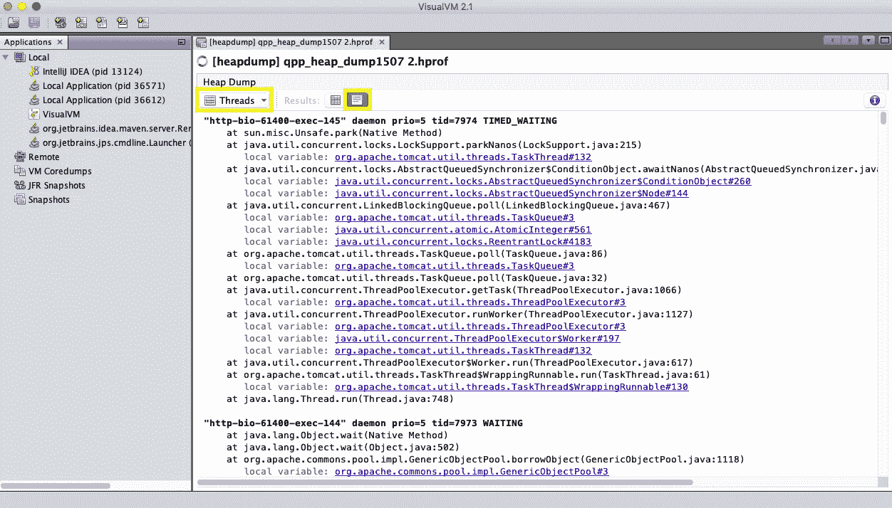

# 如何从堆转储中获取线程转储

> 原文：<https://blog.devgenius.io/how-to-get-thread-dump-from-heap-dump-6ed185d1965d?source=collection_archive---------4----------------------->

最近我在调试一些讨厌的死锁，在这种情况下，我需要查看线程转储。对我来说不幸的是，我唯一拥有的就是堆转储。不要误会，堆转储包含更多的信息，包括所需的线程信息。但是堆转储也非常大(可能是千兆字节)，所以如果你想与同事分享它们或者将它们上传到在线分析工具，如 [FastThread](https://fastthread.io/) ，它们就不太实用。我想要的只是一个带有线程转储的简单文本文件。

我开始用谷歌搜索，令我惊讶的是，我找不到可以做到这一点的简单易用的工具。大多数堆转储分析工具可以显示线程数据，但是不能以与线程转储相关的格式导出。我接受了我的信仰并继续下去。直到我注意到 VisualVM 中这个漂亮的按钮，它做的正是我想要的。

# 逐步地

## 打开 VisualVM

[VisualVM](https://visualvm.github.io/) 是一个 JVM 故障排除工具，它与 JDK 6、7、8 捆绑在一起，是一个独立的免费工具。它可以帮助您进行 JMX、分析、内存监控、获取和显示线程和堆转储等等。如果您的本地计算机上没有它，请下载并学习如何使用它。我一定会提高你的故障排除能力。

## 在 VisualVM 中打开您的堆转储

很直白。通过 Load Snapshot 按钮打开堆转储(hprof 文件)。

## 切换到线程视图

加载堆转储后，选项卡的左上角是一个下拉列表。切换到线程。

## 将线程视图切换到 HTML 移动

这个名字很容易让人混淆，但是它确实能满足你的需要。

下拉列表旁边是几个按钮，用于切换线程视图的显示方式。第一个是漂亮的 UI，第二个(名字容易混淆的 HTML)将线程信息转换成线程转储文本格式。此操作将花费一些时间，因为 VisualVM 正在将线程信息转换为格式。

## 复制并粘贴

现在您可以复制文本并享受您的线程转储。

## 一张图片代替 1000 字

更多类似的建议，你可以在[推特](https://twitter.com/pavel_polivka)上关注我。

*原载于*[*https://ppolivka.com*](https://ppolivka.com/posts/getting-thread-dump-from-heap-dump)*。*