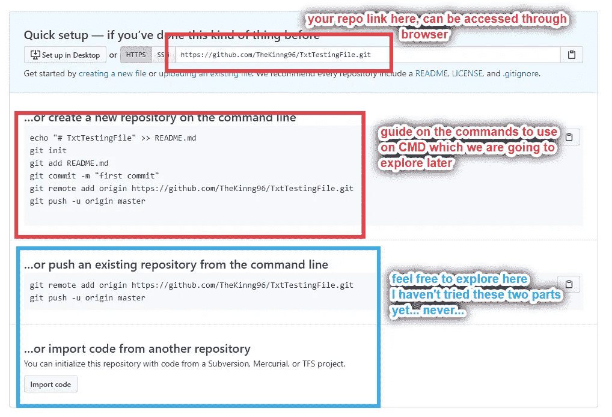

# 怎么 Git？

> 原文：<https://blog.devgenius.io/how-to-git-5ee5a325a8b5?source=collection_archive---------20----------------------->

## GitHub 初学者指南

## 这是我的 GitHub 系列的第二部分。怎么 Git？本文就是为初学者解答这个问题。


来自[GitHub 初学者指南](https://medium.com/@fengyuan.yap)

# 没看过第一部分吗？

[](https://medium.com/@fengyuan.yap/what-is-github-260412a0dcd7) [## 什么是 GitHub？

### 这是一篇面向初学者的文章，讲述了为什么我们应该使用并上传我们的代码到 GitHub。以下是我对…的回答

medium.com](https://medium.com/@fengyuan.yap/what-is-github-260412a0dcd7) 

在[第一部分](https://medium.com/@fengyuan.yap/what-is-github-260412a0dcd7)中，我们对 GitHub 进行了一些探索，包括什么和为什么。本文将传授 Git 的一些基本而有用的命令。所以，准备好你的机器，我们走吧:)

# 在我们学习魔咒之前…

```
1.Install [Git](https://git-scm.com/). *Remember restart might be needed
2.Register an account on [the GitHub](https://github.com/).
3.Prepare a txt file.
```

# 建立一个回购魔法游乐场

这一小段是设置 GitHub cloud 新 repo 和新文件夹和文件的快速指南，我将在本文的其余部分使用。如果你自己做过，请随意跳过。

# 在您的 GitHub 页面

*   转到您的个人资料页面，您应该会在浏览器的中上方看到这个。去仓库。


我在 GitHub 上的个人资料页面

# 在存储库页面中

*   单击 new，它应该位于页面正文部分的右上方


创建新的回购

# 在创建页面上

*   键入您首选的回购名称；我的习惯:`languageNameProjectName` →例如`ReactjsE-Commerce`
*   添加描述。如果没什么可写的，就留空白。LOL。
*   选择公立或私立。
*   创建回购


创建页面

# 创建了回购后

*   像这样离开它
*   我们稍后会用到一些信息



创建新的回购页面后

# 在您的桌面上

*   打开 CMD 或 Bash。
*   两个操作系统的所有命令应该是相同的，只有一个不同:`dir` → Windows，`ls` → macOS & & Linux。
*   如果您还没有完成需求，请随意跟进。


## 想探索更多的 CMD 命令吗？↓↓↓↓↓

[](https://medium.com/dev-genius/tips-to-know-your-command-prompt-better-75bc218bbab3) [## 更好地了解命令提示符的技巧

### 探索一些有用的 CMD 命令。让 CMD 成为你的伙伴！

medium.com](https://medium.com/dev-genius/tips-to-know-your-command-prompt-better-75bc218bbab3) 

# 如何使用 GitHub？

最后，让我们跳进魔咒:)

打开你的 CMD 或 Bash 并运行`**git**`，看看你是否看到这个。如果是，说明你已经成功安装了 Git！恭喜你。通过这个简单的`git`命令，Git 返回所有可以与 Git 一起使用的命令。


输入“git”后应该返回什么。

第一部分告诉您可以使用哪些命令。例如，`[--version]`是一个命令，要执行它，只需在新行中键入`git --version`,它就会返回当前版本的 Git。[请在这里随意查看](https://git-scm.com/doc)。该链接将指向 Git 的官方文档。阅读文档是程序员的必备技能。这可能对你来说很无聊，但是说实话，我只在需要的时候才会去看医生。

第二部分(在`These are common Git commands used in various situations:`之后)是常用命令部分。它们是您将在日常活动中使用的命令。哈哈，别怕，我们每天只用 4 到 5 个。

```
Important commands:clone : copy & download a repository from other userinit : tell Git to start tracking the folderadd : add files for later commitment to the GitHub cloudstatus : to check what files have been changed (Git compares the code with the closest commitment)commit : commit your code and upload it to the GitHub cloud. No upload can be done before commit.remote remove : remove the cloned git files 
```

# 对于第一次使用 Git 的人来说，还有一件事要做

```
git config --global user.name 'Your Name'
git config --global user.email 'Your Email Address'
```

这是为了在我们运行`[--global]`时，在所有 git 跟踪文件中设置用户名和电子邮件。

# 这些命令的逻辑是什么？

通常，我们将为新项目运行以下块中的命令。

```
git init git add .git commit -m “some comments”git remote add origin [https://github.com/username/projectOrRepoName.git](https://github.com/username/projectOrRepoName.git)git push -u origin master
```

还记得我们创建回购协议后留在 GitHub 上的那一页吗？我们只是简单地将第四和第五行代码复制并粘贴到我们的 CMD 或 Bash 中。

## 重要:逐行运行代码。

在我们看这个例子之前，让我们先了解一下在引擎盖下发生了什么。

## git 初始化

`git init`会在你当前所在的目录(文件夹)下创建一个名为`.git` 的隐藏文件夹。在`.git`文件中，它存储了你的云信息和跟踪信息。还有，不是人类可读的哈哈。

## git 添加。

`git add .`会将你目录中的所有文件添加到一个“等待提交”列表中。在您只想向列表中添加一个文件的情况下，运行`git add *filename*`而不是`.`。但是，我建议初学者使用`.`一次性添加所有内容。

## git commit -m“一些注释”

`git commit -m “messages”`将提交您添加到等待列表的所有文件。如果您将消息部分留空，则不会执行。通常，我们会写下我们做了哪些改变。这个消息将会显示在云上，这个特性对于通知你的队友关于变化的信息是至关重要的。


该消息将显示在文件的右侧。

## git 推送

`git push`有很多变化，但作为初学者，大多数时候我们只是单独工作，所以`git push origin master`现在就足够了。更多 git push 命令将在另一篇文章中讨论。

然而，第一次将我们的机器与云连接时，我们需要告诉我们的机器我们要存储哪个云的回购。因此，我们需要复制图片中的第五行和最后一行代码。


可以看做是回购的地址。

## git 状态

如果您不确定哪些文件已被重写，只需运行`git status`，CMD 将为您返回文件夹状态，红色=尚未添加，绿色=已添加到等待提交的列表中。

## git 远程删除

重要的是在克隆了别人的回购之后，否则，你将无法把它推送给你自己的回购。该命令将删除文件夹的`.git`文件夹。此外，您需要运行`git init`来创建您自己的 `.git`文件。

[](https://medium.com/dev-genius/tips-to-know-your-command-prompt-better-75bc218bbab3) [## 更好地了解命令提示符的技巧

### 探索一些有用的 CMD 命令。让 CMD 成为你的伙伴！

medium.com](https://medium.com/dev-genius/tips-to-know-your-command-prompt-better-75bc218bbab3) 

# 示例:将我们的 txt 文件添加到我们的 REPO 中


*   cd 到你要推送到 GitHub 的文件夹
*   在我的例子中，我想将 testing 文件夹中的 test.txt 推送到我的 GitHub repo 中，称为 TxtTesting。


1.  `git init`
2.  `git add test.txt` * *使用 tab 自动完成文件名
3.  `git commit -m`
4.  从 GitHub 复制地址
5.  `git push`
6.  刷新 GitHub 页面 **↓**


在 GitHub repo

恭喜你！您现在已经能够创建文件并将其保存到您的 repo！

对于第二次推送，我们可以跳过`git remote`代码，因为信息已经存储在我们第一次创建的 `.git`文件中。


## 感谢您的阅读。请随时留言:)

第三部分

[](https://medium.com/dev-genius/git-to-getting-repos-from-others-ff829802ba54) [## Git 从别人那里得到回复

### 这是我的 GitHub 系列的第三部分。本文将谈及如何克隆和分叉其他用户的回购。

medium.com](https://medium.com/dev-genius/git-to-getting-repos-from-others-ff829802ba54)