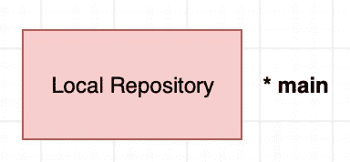

# 如何变得更好— 1

> 原文：<https://blog.devgenius.io/how-to-git-better-1-ef996cb86a23?source=collection_archive---------2----------------------->

…所以在接下来的项目中，你可以成为一个更体面的人:-)

在下面的文章中，我们将学习使用可视化的 Git 的最基本的命令。

## 设置本地存储库

在下一步中，您可以创建一个本地存储库，如下所示:



`git init`:在您的本地机器上创建一个新的存储库


`git clone <URL>`:保存远程存储库的副本

现在，让我们从最基本的 Git 命令开始。

## 学习 Git 定义(如果你没有)


提交是一组有意义的变化。它通常是增量更新。


一个*分支*是一个开发者的独立工作流或者一个包含提交列表的特性工作流。它要么是另一个分支的副本，要么是主分支本身。


标签*或*版本*是关于功能的分支的当前状态。通常，每个版本由*主要版本*、*次要版本*和*修订版本*组成。根据提交的重要性，主版本/次版本/修订版本会递增。*


让我们区分 3 种类型的局部变化:

*未暂存的更改*:这是使用 CTRL+S 保存文件更改时发生的情况。更改必须暂存，以便它们可以包含在提交中。

*阶段性变更*:这些变更被标记为准备提交。

*提交的变更*:文件变更不再存在于暂存区中，它们已经被打包成一个提交。

## 暂存(和取消暂存)变更


您可以使用以下命令来处理临时区域:

`git status`:在本地查看所有已实施和未实施的变更。

`git add <path>`:暂存文件变更。

`git reset <path>`:取消文件变更。

## 提交(和取消提交)更改


`git commit -m "<message>"`:提交阶段性变更。

*注意*:处理提交略有不同，尤其是在撤销提交时，因为它会影响提交历史。

取消提交有两个主要原因:

要么您希望在最近一次提交的基础上进行反向提交，要么您希望直接从历史记录中删除该提交。

`git revert <commit>`:进行反向提交。

`git reset <commit>`:撤销提交并将其从历史记录中删除，保留未完成的更改。如果与选项`--hard`一起使用，它将放弃更改。


*注意*:在提交任何东西之前，确保你已经配置了你的名字和电子邮件地址，这样人们就可以看到是谁提交的。

`git config user.name <username>`:设置您的用户名

`git config user.email <email>`:设置您的电子邮件地址。

如果您在所有项目中使用相同的信息，那么在两个命令的末尾添加`--global`。

## 忽略更改


不将文件包含在远程存储库中可能有许多原因，例如，它可能是机密文件，它可能太大等等。

在这种情况下，您必须在一个名为`.gitignore`的新文件中写下文件名或文件模式。

然后使用`git add .gitignore`暂存文件，这样包含敏感信息的暂存文件将从暂存区域中排除。

`.gitignore`文件的一个例子:

```
<file>
*.<ext>
<filename>.*
<directory>/
```

## 存储(和取消存储)更改


为了让一些操作正常工作(我们将在下一篇文章中看到)，必须暂时移除未提交的更改。

一个 *stash* 是一个临时提交，包括将被移回登台区的更改，它被存储在一个堆栈中。

`git stash`:将未提交的更改添加到堆栈顶部。

`git stash list`:列出所有隐藏提交。

`git stash pop`:从栈顶弹出最新的 stash commit，并将新的变更添加为未 staged 变更。

`git stash drop`:永久删除栈顶的 stash commit。

现在 Git 的整个[图](https://viewer.diagrams.net/?tags=%7B%7D&highlight=0000ff&edit=_blank&layers=1&nav=1#R7V1Zc9s4Ev4t%2B6BKVaqkInhKjz6SOLO5ary7MzsvUzAJSUhIQktCtjUP89sX4CGRaNCSHUmkKdlVtgiCoPh93Y3uxsGBdRU9fkjwYv6ZBSQcmEbwOLCuB6aJXGSJf7JklZc4tpMXzBIaFJU2Bbf0L1IUGkXpkgYkrVXkjIWcLuqFPotj4vNaGU4S9lCvNmVh%2Fa4LPCOg4NbHISz9jQZ8npeOTW9TfkPobF7eGbmT%2FEyEy8rFk6RzHLCHSpH1bmBdJYzx%2FFP0eEVCCV6JS37d%2B4az6y%2BWkJjvcsFfF7%2F%2FgpZfhh8eL77%2FMv6DXV3efB4ie5y3c4%2FDZfHIn5h4fFH0K1mwlHKWrIoH4KsSlYQt44DIho2Bdfkwp5zcLrAvzz4IORBlcx6F4giJj1MahlcsZEl2rTUd%2B8T3RXnKE%2FaDVM7cjYV0yAbhoxVPe08STh4rRcWjfiAsIlx%2BUaM4O7ScAvdC8NCkELyHDY2o5GZeodAtynAhObN12xtwxYcC32dhPQFY%2F0oixsnhwCYocIinA3viehZ2DwR2iWF7WJdfqIL1wHRDcd%2FLO%2FFhJj%2B8zdSUxuUJcaf1OcCCgILXoa5DGrOYKPgXRTiks1gc%2BgJgIsovJbBU6NhFcSKiQSBvo%2BW2zv4%2ByDK9OlmW2T5b6GfZKionZcldgmN%2FjppOmH3m1zW7poymhl4Ff9E9LuTHaUgeL2THLdAgcVB8vPZDnKbUf7pnceSvzti52c9T%2BJKg5gdAdCvoORrwyrKEhJjT%2B7r3oEO0uMM3RsU3qZA3QfVuy3TqbaRsmfikuKza3W9taaLwy3EyIxy0JBDHq0q1hayQAiFYQ%2FMzcmEBuZhR%2BQx%2BKFWrxyqqmGBkeyPontgaOTMPp6Q2IKOfnmAX%2Bjvn3N8drL%2FrgKfvuA2GjcaU95gK21BUzYaqdmSr5gEmRqMRoEA0RRdpE1DNJsw18ARp4yvz2nMNieuUxbxq9LKf%2FeBt1dHe2dMbHw5umE64eXdx%2FTfqJ%2BLIax9xmFSQiPcT73HrcJcqVoH7sux6%2B2rWFWdV4z4d16a7MFtwj0bGyIAUJBTHs0akKtTsASbkbDfH7nGFFcbdAijUNaB0VvTIQMFANANKo9RtAqUxf0fGCcaIF%2BLwjs5k0D4XyMhc9t9Z5PJdWDTTWC4CzGEoX2Z7hE0L2ZJvR3NBEioeQlrD8qJvm6K9OK%2FI6Fzn7sI4UeIdkwfxd0owXyZrwGn82gHvQO8O47aPImKjWRZEPFlKWfwqoe1AaODCSAxAuS3h2whNR9K3kzrqlpph2DV5q7TjKM00ZG73lZc1S%2BFRzfxSmvkpfRyYV%2FLbZFRwf745VAyTiyMp%2BvFdKv9l5gm%2F0r4BOXVmJ23rk2noxswaoDzxQRXbrOuTh9bp9mcPq6htuY6pttX6wIppaEyr4OK2OGQJn7MZi3H4blOqxI2bOp8YWxSy8Z1wviom6eAlZ3XJEfQnq9%2BL67OD%2F8qDkVMeXj9WT16vBltC1BzIpx7UtHeUtJ8Wobr%2B2%2BpgWoP87I9RGKFcsSiivC%2BZtY2zW0LstG9iYbjznoZEM8qSxz5BowGO5SyfrYTcYf%2FHLFPDr0seUpkLysoDnPz4Kq6iPFOZkZHZ41wNkQOZJJY%2FzvgCTF4aE%2BfgTJqK8%2BkiyORT5v4ARMI4ShJpQiJxEHSGRsMYYz2NhuF4h1dIc91LdodIGKBJIi1IZEBC4f91hUriILtBI4W2HJxKp3M8wmCwwbJGLKBT2h6RhzCIngFHqI%2BMPxyng37EJlAoxiUCnM4zBxG9rrB8aKlO%2B47uG2jJGm9p6OChORzuOyXinH0RBxo6NHGlya0Q9%2B845TjzGo2rzH9MAZW9GUMcmgoBXtvDiCaCCZTb0%2BXDNVuegCiCO61PoHHS%2B%2BATQO%2B6fa8AwSRDg3fdBwaczsGvTzfYvYQfdVD8YZYgz7HxE%2B0THKv1Plof758zcFs6l3FdtxzUum7pA%2F5zBu55PkIHiISZg3MGbjuVyhzKDvAIEwn5EgWhfz3u4mw17PHaDntMmBhoVJnzOH6dPLSvUXxnxyk2RxzDN2F6olgcmfmkJ6SjjmZi4JF1FKYmzjrakLFV5q65zkt1VG3JU%2FntgI42LWBOSEr6rKKWt70b1UnZAVUUJk8uxZeT8xYv4iDJJiZeM1LMVcxKRoE4to1ZhGk4Elb12XzJqTGWbTsBVGXhto4Dq3vMKfMYbQ1v69UQVeKswxGnWwt9tq27WETgtbzYtgJPqgO2tWkNdWFbjeFwjhMRqxjy3qZRnpS6oE49PiFLrHOWjmyJYarnW0LvMScNqbvyLAsDkqCMzaYqooEvOCLp6C2s83ZUqfXukZNYLteA%2BdoNB2h7%2BkGxIpfZ736oU%2FZn8TTJVuTZkLmDbVtgmjC3MxJqJeSaJT3ejmW9av2JkYgjxxswOVMl4pwybdQpt3NTFku13tkcnvOmzarZATphWka3ocgpkmWiSee077z13K7RxXqxYrnEzXrxIim1KdPr4BopzeZzpzQhz1Z3AW17qyZTswHd6czHU%2Bkw7bZ9UM0edSc1G2adXCm3g9CsRzsyI00ZkV4P2VrqVgaapddH5mGHnQzOPoXWEbD25FGs92bpkD8BkyenMV4LFNRoXUF3WCRzVtCMu4nqqb9UQdWtT%2BzOKahm676TGKy10fYO9LgjBJoN%2FM76uZNagX7vpfoJeuIO6CdM1ZwH%2FLZrs6a3PbI26xIp%2FimHimbrk0o1GzXecuz%2FaDSz%2FiqkApRkh1x1jt6nu23J604tiXAU%2B2e3vTmrqdnb8dwJavsuV9kF2nrptBe1Ibt7s140O1AKxc1W75%2BCIbW3a%2BmRDenzdq185fstOMq0eEs1f7tqmtoQ2jEc3J8eNWVjUqlN%2FdUg11ZtZdsTc90dkjH90SCwBexLNchVh2PVhg6tQWWkefZPtvonhupWgOHunVkHL9ABg%2FDt%2Byhe08qkwrYaC7bor4VVfRTdVsDHtbAeTJz02cIqq8MstCcfBTR0cAsLEycnxBuajF9oI7c1tD%2FevODr%2FF%2F%2FDP5j0eSPm9mftzch%2B3OoS17nczgXNe7c%2Fy3lu70vpeUbFkbsIreSCc8IK2sM5BsvRVdZu2yW4OlAvhYdT4fDRa1yjKP6LbypRao18omkN2SVL3f6KG%2BQEJyn4%2FicplJSEvad%2BPwflfcLLhrffrzZU3idMArZMtieLVJ6%2BwCT8VT7ykfXH5O7TbIH2GONaDea6KFtIWUmouVqFjoZmoVOaoL9JWZaKzY6I91JsfnC5Fq5kESRfLdISuTfldBNeTsWkGy26ymIzHqz6dZERtc%2FdFJkPvI30qTIlzuELJ5lt2bJqo%2B2BbnqEoPWxQTm%2BrsqJm8i%2Bfx38q0eoh9i4k9E0nRjX%2FrcJ5mOpQiO3brkNL%2BGuJOSs0jk%2ByfkffP3XvE5loKUn4wZ35xZy9icpPJYUE7SXoqVsuDCatvNgeMXHRWpbBGWL6FchASnpI%2FSYSoD0%2B64bfHQDad0Ujx%2Bo1m2STxOmjm%2BEZV%2BzdVgk%2BV6Q7LeLAz7KDnqBkmW7qXqR5Uc3Y71nZScvDsSPY%2F4K1M2ArM5y%2F3jquczy%2BY0CY8nYpyyuI9ChJS5SrZmrtJxhUizC3tXpUjKCZahlJzgJkHlNAvIPw42U8qlOQqYnBFQ%2BkIR%2FkEyt1rW%2FHo7sN73UK6GqFwrdvgQTBwmTDKzSSEKEOafWUBkjf8D)看起来像这样:


亲爱的读者，你已经了解了关于 Git 的一切。你被解雇了。

不，我开玩笑的。现在你只知道如何在单人模式下玩游戏。

但是**多人**呢？

在下一篇文章中，我们将看到更多关于如何使用 Git 与他人协作的内容…

[](https://yamaceay.medium.com/how-to-git-better-2-16182a6c0d2e) [## 如何变得更好— 2

### …所以在接下来的项目中，你可以成为一个更体面的人:-)

yamaceay.medium.com](https://yamaceay.medium.com/how-to-git-better-2-16182a6c0d2e) 

## 来源

[Draw.io —流程图制作软件&可视化在线绘图软件](https://app.diagrams.net)

*[Git 备忘单](https://education.github.com/git-cheat-sheet-education.pdf) *获取灵感**

*所有的影像都是我捕捉的。*