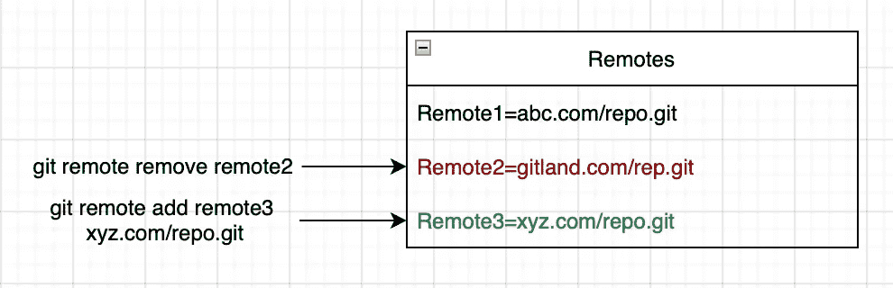
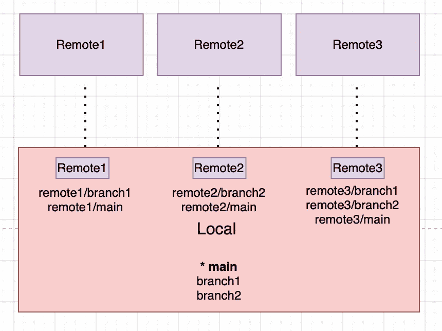
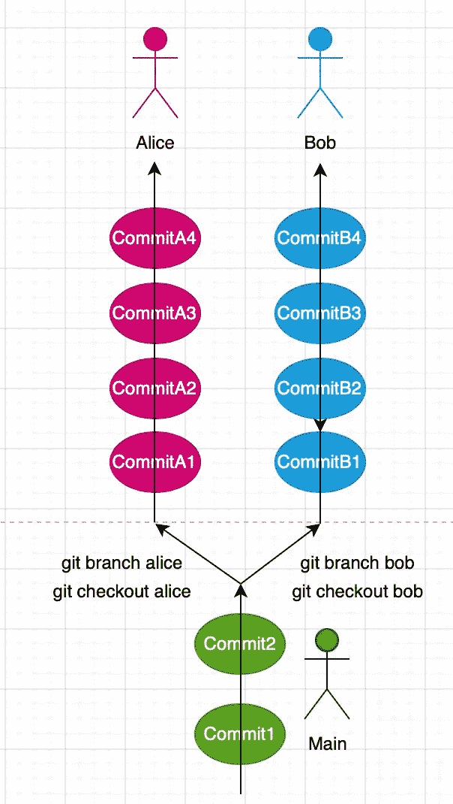
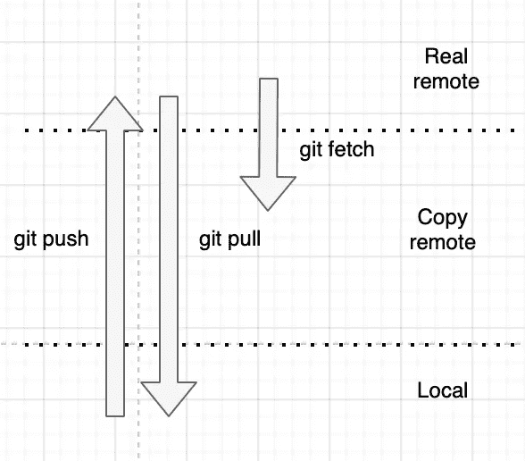
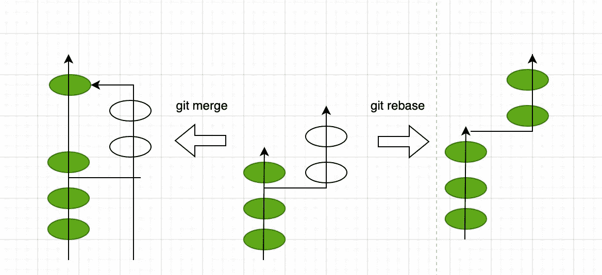
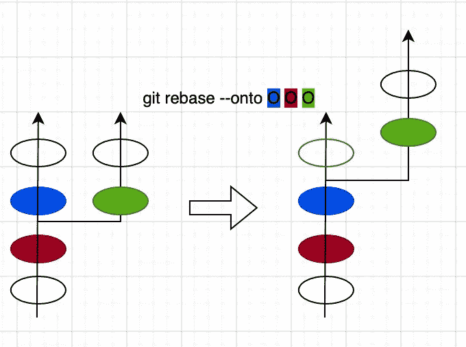
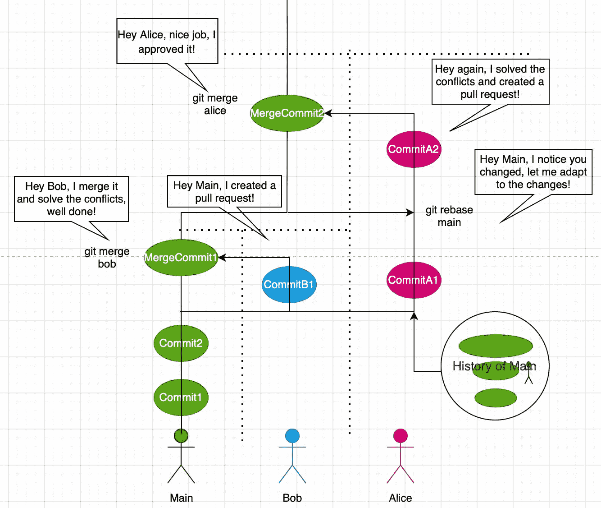
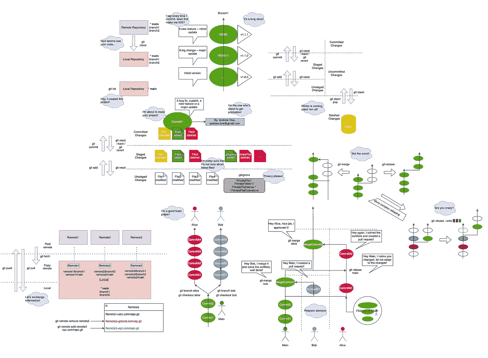

# 如何变得更好— 2

> 原文：<https://blog.devgenius.io/how-to-git-better-2-16182a6c0d2e?source=collection_archive---------3----------------------->

…所以在接下来的项目中，你可以成为一个更体面的人:-)

上一章:

[](https://yamaceay.medium.com/how-to-git-better-1-ef996cb86a23) [## 如何变得更好— 1

### …这样你就能在接下来的项目中成为一个更体面的人:-)

yamaceay.medium.com](https://yamaceay.medium.com/how-to-git-better-1-ef996cb86a23) 

*远程*是一个在线存储库，可以作为本地存储库下载，并在此后进行更新。

## 管理远程和远程分支机构



Git 使用远程别名，而不是 URL 地址。

这是您将远程存储库的 URL 地址存储在别名中的方式:

`git remote add <remote> <URL>`:将远程存储库的 URL 保存为变量。

`git remote remove <remote>`:从本地存储库中删除遥控器。

本地存储库中有两种类型的分支:

`<branch>`是您在当地工作的当地分支机构，并且

`<remote>/<branch>`分支的副本是否存在于远程存储库中



这里有一些有趣的地方值得一提:

*   任何本地分支都可以有多个远程分支。
*   Remote1 不必包含 remote2 包含的每个分支。
*   Remote2 不必包含 local 包含的每个分支。

## 分裂过程

分支可以被想象成开发人员的工作流程，他们以一种孤立的方式开发一个特性。

只有一个`main`分公司，可以看做是整个团队在单独做的主要产品。



这是您创建和切换工作流程的方式:

`git branch -v`:显示分支及其最新提交的列表

`git branch <branch>`:新建一个分支

`git checkout <branch>`:切换到分支

## 发布和接收更新

这些更改可以与本地存储库知道其 URL 的远程存储库相互交换。



`git push <remote> <branch>`:共享远程仓库的目标分支中的提交，类似于上传 app。

`git fetch <remote>`:从远程库获取远程分支的最新版本，类似于下载 app。

`git pull <remote>`:将从远程仓库获取的变更合并到本地分支，类似于下载&安装 app。

## 连接过程

既然我们知道了如何创建分支，现在是时候探索如何将分支连接在一起了。



有两种方法可以接受引入的变更:

`git merge <branch>`:接受目标分支对当前分支的更改。

`git rebase <branch>`:接受目标分支的新变更，并将当前分支的变更添加到目标分支之上。



*注意*:您可以使用`git rebase --onto <new-base-commit> <old-base-commit> <moved-commit>`在提交级别上进行重置。

一个例子:



## 处理冲突

在下文中，我试图回答合并冲突的 WH 问题。

它看起来怎么样？

例如，让我们来看一个名为`constants.go`的文件中的冲突，它原本不包括`var pi`:

```
var e = 2.73<<<<<<< HEAD
var pi = 3.14
=======
var pi = 3.1415
>>>>>>> branch1
```

当前分支`HEAD`建议使用`3.14`，另一分支`branch1`反之亦然。

什么时候发生的？

*   合并
*   重定…的基准
*   拉(因为拉=提取+合并)

为什么会发生这种情况？

*   因为您的分支和其他分支试图修改同一个文件。

*有矛盾是不是运气不好？*

*   不，这不是一件坏事，它只是指出了冲突的领域，主分支必须决定要包含什么。
*   除非出现不必要的情况，否则应该没问题。

*如何检测？*

*   您可以使用命令`git status`来检查:

```
> # On branch branch1
> # You have unmerged paths.
> #   (fix conflicts and run "git commit")
> #
> # Unmerged paths:
> #   (use "git add ..." to mark resolution)
> #
> # both modified:      constants.go
> #
> no changes added to commit (use "git add" and/or "git commit -a")
```

*如何化解？*

*   接受传入变更:使用`branch1`对`pi` : `3.1415`的定义，删除冲突部分除`var pi = 3.1415`以外的所有内容
*   接受当前变更:使用`HEAD`对`pi` : `3.14`的定义，删除冲突部分除`var pi = 3.14`以外的所有内容

在 VSCode 中:如果你确定你只想使用`HEAD`的变更，你可以使用`Accept All Current Changes`，同样如果你只包含`branch1`的变更，那么就是`Accept All Incoming Changes`。

然后只需使用`git add`暂存您的更改，使用`git commit`应用您的更改。

如果我们为 Git 创建一个全新的[图](https://viewer.diagrams.net/?tags=%7B%7D&highlight=0000ff&edit=_blank&layers=1&nav=1#R7V1bl9pIkv4t%2FVCnp%2FscOErd9VgXu92zdrfX3t3umZc5AiUgWyBGqOyqfpjfvpm6ooxQkVC6IXCftkGIBCIiI7645o12v376JXK3qw%2BhR4MbVfGebrSHG1XVVNVk%2F%2FArz%2BkVojhKemUZ%2BV52rbzw2f%2BL5jdmVx99j%2B4qN8ZhGMT%2BtnpxHm42dB5XrrlRFH6v3rYIg%2Bqnbt0lBRc%2Bz90AXv3D9%2BJVetVWrfL6O%2BovV%2FknE9NJX1m7%2Bc3ZL9mtXC%2F8vndJe3Oj3UdhGKeP1k%2F3NODUy%2BmSvu9tzavFF4voJpZ5w1%2B3f%2F6dPP42%2BeXp9svf7X%2BG93fvPkyIbqfrfHODx%2Bwnvw%2FZz2eXPtFtuPPjMHrOfkD8nFMlCh83HuULKzfa3feVH9PPW3fOX%2F3OBIFdW8XrgD0j7OHCD4L7MAij5L3awp7T%2BZxd38VR%2BJXuvTKzDd3gC8Kflv3abzSK6dPepeyn%2FkLDNY35F1WyVyeakdE9lzzHSJ9%2FL9lIct6s9lhoZtfcTHKWxdolcdmDjL5H0doBtP5E12FM2yM2JZ5BLYzYjmlprtkSsXMa9kfr%2FAvt0fpGNQP2uXcz9mDJH%2FycbFN%2Fk7%2FAPql4DXCBkSKukrpK0k24oQL9s0tu4C837OmcEZiy63ecsD7bY7fZC2vf8%2FjHoLytcr8JZqlWlVma2j%2B3yGu5ld0c5VdmkbuZr0jdC%2BqY%2BWuqQ9uMKsJegf7MPG75w0VAn2654WbUoBsve%2FgwD9zdzp%2B%2FbFkM%2Fh%2Bm7Mzkz0v0pV4FB0Dq7lHPQIiXX4to4Mb%2Btyp6wCiafcLH0GffZI95DqmaLdWorrELH6M5zd62b%2B4PruQI%2FI3daEljsBKjuPu8d9uW37ADQlCQ5jVyoQG5WPr8N8wDvrVGvEUFFUx0awrhiY7ImdreJtUBM8aJBIdg74yrvWvN3g0A6RtmjWLzN348YlboirDVdLjVOtZqFuDEdDoFLGBL%2BdtdHaHqVZipuA5B%2FSv1wTIVTtdFuIn3lV7ypxl6a1VqSyM9uz1yw3DCuze3D%2F8h46Q4sfqnOAwqcIqPk9527%2BTOt9geue9y0ztWtS6AVQQ%2BdavTTRgt%2BEamylSBLIh8d7OspdQeaxogEzEOq2OzW2GFfjcjFBkaoTAt2jGhoCOaEArZ1H0SClF%2FHdMJ%2Boi37OnMX3KnfcUow2PZ%2F0k8ly9Mo6nK49ZzY%2BjK59EeptOC8DE%2BTM0tjXz2I7g2zN%2F0sbzUCHglyuCMuwn9RE7vDf3O%2Fl5QN36MCoL7m3Mn%2BACsO%2FTbfmUem59EQdgv2%2Fnh5ixJOwDXwISeGCDloYBvLWkGEr51qlTXxAiDbPBWWMcQlqmJ3DYVl1Vz4RHV%2FCNX8wv%2F6Ua9598mYUU8X5VPBcVkumsu%2BpvZjv%2BTqCf3TG0DMaqcdfreT6qC5cxqSHnhSRVdre4nixTh9qPTKuJapqGKa%2FWeWFEVRLUyXnzOnoZRvAqX4cYN3pRXBb%2BxvOd9GG4z2fhC4%2Fg5K9JxH%2BOwKjmM%2FdHzn9n7kyf%2F4E%2BmRv704Wn%2FxYfnmwMuakrIl36oqktK2qtFqLr%2FdTGZViM%2FzXEUeij34Xrtx2OJrJVgNyex0b%2BKhe7OWz%2BgSJYl9X28WgW84VU%2BBxkyc%2Bdfl8k2%2FP0xDnweC0que2709Xf2Lj9OtsxUSfRxug2JATlJtbmd8Atw8k5xjNY5qQrg0ySQky%2Bp%2BxYYCf0ozkgVMtL1vMGwUVFsF2ejohhW%2BxtSLazkcBgJHTTOSA0y0qMBw39DYSU1iF6zI9luaZ2VxuD4CJ3BGs26Dj1%2F4ffHyDYUoqXADHXH9Id5OogjSkchy0t47m6VAERyXm75RBNBuyR8Aytp9oGFWnfNYbrvkhhnNMU4sFDbjMtV7h7j%2Fnezi90ENSr3CX7cAVaOJoc4UQUGWH2nEVUCAyifL5cfptpzASJz7lBMgID0MWACiK77RwUEBhlq0PUYOGAMjvx4uEEfJfnJAMUfRgnSGFt8oTbB0Hq30bi%2Ff43AHTAudnVvGaT3vYU7%2FNcI3HEYYQCMhJGDawTuMCuFGsoB8BEGEtIWBbb%2FRmzidNHtsfp2e1QYGKjdMtc8fpV5pKksviFZYtNhDl%2BF4YmsOTLBpBe0Rw2kMLDjPQpDE9c9WhOxFWrXTOPUPSquZIn8HcAerWtgjuiOjnmLatZhM4pJWYtbFAZP7tiX43WLtxsvSgoTH0Ka1SomV6Yee64ry7XrB1OmVY%2FmFy%2BN0XTd8OBWZrDV9rThcU6oY9QRvhXdEPuM09pjHNYLfdWtMhoRoJaTdStAUgPQrXU91JluVSaTlRsxX0Xhn60q%2BYt8L4ilxxekiTGw1LEmhqGej5H%2FzY1pTegufzUMPBqRhJt1t7AFfnPXdDf9Gd7z83TvrjdPMd3wdg0Yry15QA6HHwQtcpf81wzrhPksFhJsJZYOOdfa2AJVhbGdKdtWTK7DaMTjWIqu9RcyER37GzA4s8%2BIa8i0dk%2BZgytZzLe1tDq8xk3rt%2BYA2AnDMthAkUtklkqcwe2%2B6%2Bg5We%2BiaFbMW9y0k5ukxKVUa4A9UsjwuUsqyNPFKaB9j2pSkQF0l1OPJ7JD1fvGoMiMuouqhimCK%2Fk4CKQfrWOO1EVERp2y1cRRBkjrdcd8kJhkcMUUKBDQGkIUxWyWAeEJGDy5jHwt2KBK7xtUoknmukET3jkiUj91g4qjT%2FTBbVBkdN9FJGt1ctiAdpshQAb4Xfen1LYCdu%2FU%2FQks8QD2JwzVXBN%2Bh3czYm073s1YIGV%2Bya6i2ntRKTKo8XPszr%2FWqtn5c%2BAzokQSseqUeu9nh4LXg2qJMAT9p%2Fc9nFVFZjtejSBqu0xhCrR2atmLuJA%2BvKoXZAIl27hJ9%2F4lKFL98C7tWJEeN7XyzOctGEJZvCaqP9mdJi5EJN3B5vZRXTRmx3fTeHeQqYu6su%2FCXFMiGDOeHQRGwJ66g0wxHSsu1PYOyj3NKz45iE8UEVaAdLc018EBOiAJ3z9Gseo6kzLdqmzD7Xg1rIhRsFHA3WpYCwZOxqxhhe4wjTSEUcBCrWtYGDi5IL4Rxz5RRx5aqDm%2BWd7vq%2F%2F5L%2B%2F%2FND%2F657vlvz6%2FC8J%2FTbDgdVrDua3wzvz3Iz%2Fb%2B45rvkmmxG5TLRnFCcPyO274iZfMVFbetozcxQ0%2FFt1dTCbbys0bd139CGuh0f070kLSd%2FQ5bXf6lX9ARN00HBev%2FB2XlCj8QufxD3vnC25rTz8uZwoXAaMgfPQOR4sEa%2B%2B51F6gRz6ac5vOmuq21zUiVCJqJtLopCCNTmKA%2FRQ1jYoNpqQHKTa%2FhbxXLqDrNT9bZEf5389sb%2FKPCz2aVLtegsgUw6Z7ExnMPgxSZH6Nf%2BQqhR%2FuEISbZfLRYfQ8Rt1CTLHFoHcxgbH%2BoYrJj2v%2B%2B2f8VA9mh0L215rudqV%2BGbNNUg1NEBy9d8mpP4Z4kJKzjfj5E%2Fxz03Ov4pXLBSl9cRPG5SuFjK3ojj9nLKe7UYqV0HCh9Q1zYP5ioCKVNGHNOSm3AXV3dIzSoQqJadPuWzywdMogxeMPP4k2sZ%2BzS4Dv2ue45v6mjHL9SBNrFgRjlBxxQJKGHareqeRgE%2BsHKTmpOWKWh%2F3NQzaMZqswxcf7yGeZ1DQxxLMOYz%2FcjFGIiFCrpCO1St0KETKFfahSxOXE5a4UL3DjRI39xCH%2F9aYsKefqyAt5RUCOhdbuV5rAan7n759vtLcjlKsJyXvFenDBKHlvTiZPjvvfb%2F3V4vutM7l7QmKCnyjb15QASlfzEcdRlxLPoOgJXY5paW6ZKwOkRAheT11TMadWFVc6sodxNTGcAqVwffiMV42he5e%2FMEm7pfnWJeb2Sdi56W54H875Aa9iBWmxbdIPqNk5r%2BHnwp7TObpbZrbBzz9rip%2FVJnqiIDNiijTWPjdJa%2ByEoa10w6jnuGH0sr95MPsFBoVSAmvnSGBNswdG3no3txzkEeUm4O0scjfzFTLro7xl7frwaOkhJc1fq4PELUIUx5FjYhPTIVAm1jujIoe0w0wsb3lxlZHzWdNP53Nrm7XedZwVw8MS7MxZU5j9WWnzRXbWikIhAKNlMLR1hCBwolsGwxLDM4bfhgUykQpWY1Tc1XSVEe7hwFzBOSM2zZ6qAyQyhBXnjNoUTfQjh0BkFXMlxXiIdNkVv%2F7RjZlu3iRX%2BEndOWH%2FyH6jWqOJhcosKeJ2NGrWQOz4qaXM6GKSw7xPKNrCmd5ord1Ima5adnNMxxbrmulYZcSV6cJRGESsS3gF07HFumZ6fVGD6I%2Bph102dfwuG4Lo%2B3fNkVHE6fSxWx1u4SJ5cWSywlYUSwOcY6%2FcGoqiH%2B5IfmVIRK0Q3bEgMsI6ksVOuuZCsjA3lpEcos9xkLzUTb3RHMKSjOaIpRoJzXuXc4gKMprDcMFIaE4I1Ofd0lxi2MGhxsGq5ePk%2B5xNQi4d1gHjLA3GzSynuor88R0g36QJS7UMsrT6%2FEeejk15U2ZbSbVkopD88qKmaYpCXJigzZfebd3NDZbpnTMux5NsTZ7rjZazvxkkLZBQ0n9U86f0o8W0sFqTFmZwbE734sHpp1e%2F0aHscF5N8bgObudxuI%2F23rszGnwMdz6v%2FmG3zMI4DtcIHIxDQdeE6ZiV%2B3CzofO4Zj8MSyHpVkVcbSR%2FpyF7r730M0z9pDbgrjl4SWYuoSpGckUx39y%2BbZfkupAx7d3q1gH6u%2BbQ5aAo3j%2B4RCacQ1Izg%2Fk5expG8Spchhs3eFNeFcxuec%2F7kOulhA1feFl%2BpnzcxzgUmCRqpioLFCU7mUDWgrPvn9jJl4Qts4apFXzhxpT2kKXSxv51ewLmrbI90Rz6H9ie6FsN6XVO7l1z4H9YJO8d%2B%2BsS0z7Hjf0tkSWnxleFhZz2pirhnFQRTh5ZhAnRNu4LZGYBoPK7cHZ24LtfhZDP5xwK9tbrsHdzRs9UXIegCW71wTIlZk2%2BsoIDdJIjh6t0q4Pr0HdzVm9oNNeQZpNuaX7c4LMT7N5rkXRf9lCsvAG1HkcEwg5Y1pYtogHh5JXHzfL4IHhqm8Wtw9exsFgTIYMsiw%2FKStssHgCu%2FVAtPh4qsK2x4McfAtuAzTctgLP6xrbIGXYNSFIqBumMxbRehT8oHaGyaCU7cWhF51%2FTVuOZvLsEK1rkK1Uiyn6AO0uW4tzNpk%2BydY27G%2BOBr%2FUYh%2FnJpUAw6otljtOVzQZOkFLVoqO5kyIY5Ai%2BtqTJ3U92vSBPrpAUu0rUS04JIbqETHVaWIWcvZOWmMOx8rvv%2FjpwS6Jlr3DizFd%2B4L13n7lQaA87frRE%2FuxuFUb%2BX%2Bx%2BtyyMc6Oc5JpSuSM9lCJdM%2BE4%2FZhTlwiXPrhPlRvfu7vcSjFDG7jbnZ9KC3%2FjmgEGf3OXGT9gytSW%2BV4cLFAYJmSQPQrNiAh9mmM8BDl5k4z24M7m0zkjlfo2ottwuqw%2Fr%2B7YKseALuKX9vmOH2%2B9Wb5PbnvQyyufMqLwSyF7%2ByJI8PWKvZFugEK441l%2BheEBphrUe%2FaclM8TbbENI8buDfv6rp9wkTL5%2BU53SalnGLvxnq5pVFRe2IVQgPJpK5LSorUmLPX92doDkw6mFrxSYK7y8qK8OE7b8iKrXdqTl%2Fp2c%2B3h6fmvq3KRVy6Ooz%2B0KSwIBOlWWCwT8L%2BDMgRGs%2Bj5z%2Bz9yZN%2F8CdTI3%2F68LT%2F4sPzSZu7kfKFfFbxwfKFVE33Vb6AnmBVcU%2BOioCcVuWnVIr8lJ9ecHbSjo7swTdaXFGh3%2FPKsr9hNIc0qmkOVhwboNdTw8YyGSrW7NmersEC9I3JmXKKMB4hbefmT78a%2FBxK8hkOSPMhIT%2FMoW5PwoZXZdeRmcrPHTlspvQ%2BzRR6PEq%2FKkCwR67nFU%2B1ukFk0saprx%2BFwfyrXpO0njrQazoycBWD6a3VL1jH1S%2B00j3dtFbrrfvHFg%2FyPvkkb%2BbeHVqq5XSpjWGqq2A0JBjKqafbTkhecVS7VNuCgZVKDNIh%2FET5xM%2FCAo%2Ff2WvWXNnAXCmS1XatwXC7HuUNTPbuw%2B3zVfZOlz0YaMCGSnUrfNAHzIYKnyO%2FGk2FYvzCBgZ2yy%2BJwUBdnm07YHxiifhEPfW8TbiUIjK4y7NtccGAvQmpr759HPip4a%2FbpUVTSLFFEXve1qm2OCeg95lyYkHj%2BZhZYdY6BH2xIv9CV215WFsqQsEXmH4mry0VCLLzQ3gGoy8dDHVfRQPlp3nI%2BsmLhrgUsMn9CwZExLkhDYYKi5vQ3tbgDKkDR%2FWMbMSYIR4IriD1c522%2Fjl1La6jGTEGaE4smK%2FolubYlH%2BR1q%2Fq0yoqiIpyIrkKIlnTJJFJJXpNxU83RkwTtRtw0WVtmJjEcMSWnKMtmNznFN9Y9osRhVTewB6k36FZc4nl2q7z1MAGHsxIh4FpXw2pAO608Y0oMKQ2tsE6OjiXQzaQ2ZrRI8rhQYzXkSyDG8miiw7cAPbv2KeyaCrYvipSY9Px9h37XBaE6prSN9UJFrW69vtjWnNI%2Ff6aZgJZ6l1vEiyV2FCP9ouln9fO65cAslUdekZUROl0WiZOkLO9oI5vZY7MEOIW6Y89%2F7iFDoovJWvsjg1c6HnZumzgArwhLwttNXDBPuUose6jGPRsBirpqihcIgaSFlNxJa3jqVnMNb7KRVNyYeSDouvmvsqKhbgQ0TouHS%2FGW%2ByJxTvKKZkEEXhc8Vf2%2F5qyb8HXSkbObDwuNmGQtGzGK5pA7c0i8OdcgfL3fE8%2F2mNC9AOQshw9M6wTpBNKDjhQWxr57IdylJS%2F6WN5SVqqMoSkphiqQOip3c0vqMkVW20G9hATIGQFPZzXxJowRVloDvvkvwRkg3NGJ2OqDmLYkddKFh5viS3kPOX2QKuOHIfRbS%2BjDmlumjyxcZMNFhIsiKwul%2BhvrE22vdbMm1UtbL8aQjavpmGE5APfqiMLThEF1iYj1XY2ekBxe%2FGp0w6r7Wze6Dn4e4IvpJlC5ZwsYgIrgbNRW0dMxx1ie2Tc4JxhsW6J9vLUYkvYUtnxBFqCnFqbN4nP3B2HSAM%2BhbZDjGQCF1mRO96kPYykykRAztI%2BmpYx1YSpqAytTCEqNUpD2klRI0HOBx4N0a2paTvlH8GSEYz%2BujklWqf0lxkOcJ70B8XVBkZxHBOqRlsE1yTG0F%2FzhMmrliYmf1CdZaMMLJouWmChBbdIB3Pvnvy4GHvHHu%2FlftizMvXDn0jOvGvjyD6i1XgMrwSJtQWg7VeaZpX37eZf8hNQjux7z2Io%2B%2BULh%2FPUek2e%2Bp2%2FY9qGEytcsL%2BOKW2QthHubpuqn4X%2FxLeDtIwi2LcJKyHG6rCZvehk7%2FYmPBPkjNU0uJ5yJI%2Bub8I4qcRVnsNHLh8rd7NkJE1eD2galuXfz3O3%2FAlTKEXYPbl1N5wYO8LcamRd1RpEZXXjVfZZjlWfiCGDBjle1yWbB9azef2X7jZqAqhz7N4j6zDGtxdhHQuY1kuUlVMemdXRdXxVh8GWPpCZbJoDhnqbxF35bz%2B99%2BjVwVpYV3%2FqDCwxteK8ujFWMiycW3XZLya%2BoSV0iJy12epUJNnKxhSWZB1BHHdsUkTyZb8KwN1uo%2FAbRyaKH%2F%2FQUOdQGwjlpc17EKHYTjOqlqGMqXCQmoMUPRbFz90AFOTg0ZT37rKCSZPyDu8Gqe%2FI6j%2FmEXXj5A73Ju8iZ5rn3490F58RHiVGQ3hUEwBN%2F1gUOQsT8z5Gwkg7wVTZoUb7FT3Jqzq%2FkiRusgIgz4%2BY%2B5q%2BTJOTi1qqiFfysa191vsceWbmtfjvmNrlk4tCDVBf1PH58cS4Fgs3l%2F1WBAugn1jiYOkHFmpdKhrN5b3M3rrMhISb3ITVFkhtqUgqr8vhMMRoNI93VrRHAhHd0h45irE12rccDrcEZWT2T1yZsqlxCjbSE9kx7WXiaxdZsmYa1TCQfXLFmhDQtiQDXY0ZbbPVdsaXePyaqu%2Fe%2BC6y69QApyXUv5mSDTzHBjjFz8m%2FcLvhSrNDJNixRewf6jkXYxF1Q1SOvdNexiKOk%2FZI%2F1nHtJexVOehVAyhxsg0exfsi%2FHddZCmLIB3f9S%2FGO8dqBUk39Ep7dXcvo9QrRTYpT%2Fi9tb0hHkXQxigkiravvwXQyipPtlvNTRVbLk0WyrIFb%2Bz2YULU9B2%2FCrZ1oxp3h9eKI6e8YiaU%2FsyyW%2F1rbelOpfHQX4HkN%2Fsn%2FwX4%2BJj0t83HFeRJt6OUIss0ugLP9iGLrLLVk6EELYBd54jByEas%2FLHdOMdc%2B7NOLlvWaJ%2FcWKpQgE76xZqne8S8OLK97JZXxPYpZ%2FGd3GcJ1iodb7XHWeUj2cQZODiGmzEI6nMvkdXqc2OZRg0FkKgqNa3I6ZBKFrpTLv0DWNYQ9swSPco3DDXjH7N8KGTI2LiQqa4UGMDhQXs1MV4YFWXicecNsrsnJERYEZTNd1gobaREdLH2gWDz1Fl2CJGEo9zlWW6IxYBtaQywOdkX7hllXEdeCfN944FqDked1iTUT%2BMyFDoAgPnikIe7u4bAucWAOcOclRmt%2BAcbQtuivztEI0ovYd3kV7W1oS25Yy%2FA8PnTv%2F0HUA1i6sqioqfNP62OecPlW%2FSN%2F2RBt6r4U355YD0BVHEymvpIDYM1zhd298jG3Qv3NdHOEaUU9NXDkxfybL%2FaPwOP6r43u1i%2BHw8yviDr5gl7R3fSfVZn0z%2BVhAJhpN7RyQyncnXdF9x%2BgzzqAAPxcy8rJokCqInu07zD6E7uhs3lSj2APWYKYNIe%2FRTMaoNwFEdUWM5ITqgsN13c7lqDgDedOOp4hLeu6tqHpd1uCQjzPRPc74qW61%2FZ1VqlMPVWX2JZafz34TqVzxMuyFvFfssp5MktdS8ilF4q5g5dfruTFelZkm0Sf9sa7dLegxh9w8VYaRAOHdqMmEE5CPgDw5%2Fnbnzr8tE0U6yqbJ8Bmy0nP1NScc%2FEkVNH6iK%2FtMNNhf29wNTXk%2F47CRtk3wozy8kDwwF%2F3T2r7vm4rSZ7bZ7n9rclyGGln6HjCI1X6QNMvD6svTXlw%2F6IoNSiMGJZBCUw8VVD2JRR6Rpt2hS7kiZSIRLruGyupLp0xtixIUkAVpj%2BClHl8iU8XY11YcwSqdFr7dMnHKr5W%2BWsoqjHC8ceYehRcAP0borvnhF6O7vlWOEE1FFURi72YRgramqfGEIkY3gDWJa6Nl97RUaW5g%2Fl%2FJri8oKV%2B%2BTTFPfJncwt0wQCCXRHJW3LSOXH0fE%2F5lMtpWbN%2B66%2BhHWQqNQvt7T%2BEc%2Bgpw%2BpSff8J%2B2WYTROmHU%2Fkj6rcQJR4WwBeGjhLQJDoLnUnsxR%2BM9c5vOGjqwY2IJgzaIig2RV5DDBlsbJ8005bkIzK8%2FrjkF%2BCJh6LF%2FYuryK9vAfabRKAWGCL1ZqI7pWF7qT70YmLx8orstTbyrnU%2FX24iOUUTgIUBERbpduhYSLLc7SCH5LeRgLz0Y43sY7eIxCol4sLOBJHm6lhDMnRmkhNxGe8f5Re5fjIZvRygjDqwRKdquWhAT9jQKOZ1LZ4nRYfUh9Ci%2F4%2F8B)，它看起来会像这样:



现在你对如何使用 Git 与其他开发者互动有了更好的理解。

但是还有更多吗？

是的，我们还没有谈到**交互式 Rebase** :这是一个非常强大的工具，它允许我们轻松地重写一个分支的历史。

在下面的文章中，我将展示如何清理您的提交历史，敬请关注！

[](https://yamaceay.medium.com/how-to-git-better-3-3ae705d1355e) [## 如何变得更好— 3

### …这样你就能在下一个项目中成为一个更体面的人:-)

yamaceay.medium.com](https://yamaceay.medium.com/how-to-git-better-3-3ae705d1355e) 

## 来源

[Draw.io —流程图制作软件&可视化在线绘图软件](https://app.diagrams.net/)

*[Git 备忘单](https://education.github.com/git-cheat-sheet-education.pdf) *获取灵感**

*所有的影像都是我捕捉的。*